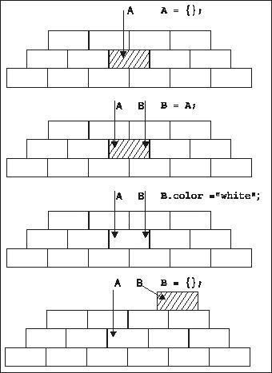
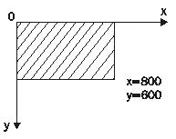

# 六、继承

如果你回到[第 1 章](01.html "Chapter 1. Introduction")并回顾列出面向对象编程不同方面的部分，你会发现你已经知道它们中的大多数是如何应用于 JavaScript 的。你知道什么是对象、方法和属性。您知道 JavaScript 中没有类，尽管您可以用构造函数来伪造它们。封装？是的，对象封装了数据和处理数据的方法。聚合？当然，一个对象可以包含其他对象。实际上，几乎总是这样，因为方法是函数，函数也是对象。现在让我们把重点放在继承部分。这是最有趣的特性之一，因为它允许您重用现有的代码，从而促进懒惰，这可能是最初将我们带到计算机编程的原因。

JavaScript 是一种动态语言，通常有不止一种方法来完成任何给定的任务。继承也不例外，在本章中，您将看到一些实现继承的常见模式，从 ECMAScript 标准中指定的方式开始。对这些模式有很好的理解将帮助你根据你的项目和你的风格选择正确的模式，或者正确的组合。

你会在这一章看到道格拉斯·克洛克福特的名字被提到过几次；如果不引用他的作品，很难谈论 JavaScript 和继承。除了[第一章](01.html "Chapter 1. Introduction")([http://developer.yahoo.com/yui/theater/](http://developer.yahoo.com/yui/theater/))提到的视频外，你还可以在[http://crockford.com/javascript](http://crockford.com/javascript)看他网站上的文章。

# 原型链接

让我们从实现继承的默认方式开始——通过原型进行继承链接。

正如你已经知道的，每个函数都有一个`prototype`属性，它包含一个对象。当使用 `new`运算符调用该函数时，会创建一个对象，并且该对象具有到原型对象的秘密链接。秘密链接(在某些环境中称为 `__proto__`)允许使用原型对象的方法和属性，就像它们属于新创建的对象一样。

原型对象只是一个常规对象，因此它还包含一个指向其原型的链接。于是产生了一条链，叫做原型链。


在此图中，对象 **A** 包含许多属性。其中一个属性是隐藏的 `__proto__`属性，指向另一个对象 **B. B** 的 `__proto__`属性指向 **C** 。这个链以 `Object`对象结束，它是最高级别的父对象，每个对象都继承自它。

知道这些都很好，但是这对我们有什么帮助呢？实际的一面是，当对象 **A** 缺少一个属性但 **B** 拥有它时， **A** 仍然可以作为自己的属性访问该属性。如果 **B** 也没有所需的属性，但是 **C** 有，同样适用。继承是这样发生的:一个对象可以访问在继承链的某个地方找到的任何属性。

在本章的其余部分，您将看到使用以下层次结构的不同示例:通用的*形状*父形状由 *2D* 形状继承，该形状又由任意数量的特定二维形状继承，如*三角形、矩形*等。

## 原型链接示例

原型链接是实现继承的默认方式，在 ECMAScript 标准中有描述。为了实现我们的层次结构，让我们定义三个构造函数。

```js
function Shape(){
this.name = 'shape';
this.toString = function() {return this.name;};
}
function TwoDShape(){
this.name = '2D shape';
}
function Triangle(side, height) {
this.name = 'Triangle';
this.side = side;
this.height = height;
this.getArea = function(){return this.side * this.height / 2;};
}

```

执行继承魔法的代码如下:

```js
TwoDShape.prototype = new Shape();
Triangle.prototype = new TwoDShape();

```

这里发生了什么？您获取包含在 `TwoDShape`的 `prototype`属性中的对象，而不是用单独的属性来扩充它，而是用另一个对象完全覆盖它，该对象是通过调用带有 `new`的 `Shape()`构造函数创建的。 `Triangle:`也是如此，它的原型被 `new TwoDShape()`创造的对象所取代。需要注意的重要一点是，尤其是如果你已经熟悉了一门语言，比如 Java、C++或者 PHP，那么 JavaScript 使用的是对象，而不是类。您需要使用 `new Shape()`构造函数创建一个实例，然后您可以继承它的属性；你不直接从 `Shape()`继承。另外，继承后可以修改 `Shape()`，覆盖甚至删除，这对 `TwoDShape`没有影响，因为你需要的只是一个实例来继承。

正如你从上一章中所知道的，当你完全覆盖原型时(而不是仅仅扩充它)，这会对 `constructor`属性产生一些负面影响。所以继承后重置 `constructor`是个好主意:

```js
TwoDShape.prototype.constructor = TwoDShape;
Triangle.prototype.constructor = Triangle;

```

现在让我们来测试一下我们目前所拥有的。创建一个 `Triangle`对象并调用它自己的 `getArea()`方法工作正常:

```js
>>> var my = new Triangle(5, 10);
>>> my.getArea();
25

```

虽然 `my`对象没有自己的 `toString()`方法，但是继承了一个，可以调用。注意继承的方法 `toString()`如何将 `this`对象绑定到 `my`。

```js
>>> my.toString()
"Triangle"

```

有趣的是，当你调用 `my.toString():`时，JavaScript 引擎会做什么

*   它循环遍历 `my`的所有属性，没有找到名为 `toString()`的方法。

*   它看着 `my.__proto__`指向的对象；这个对象就是继承过程中创建的实例 `new TwoDShape()`。

*   现在 JavaScript 引擎循环遍历 `TwoDShape`的实例，没有找到 `toString()`方法。然后它检查那个对象的 `__proto__`。这次 `__proto__`指向 `new Shape()`创建的实例。

*   检查 `new Shape()`的实例，最终找到 `toString()`！

*   这个方法在 `my`的上下文中被调用，意思是 `this`指向 `my`。

如果你问 `my`“谁是你的建造师？”它将正确地报告它，因为我们在继承后进行了 `constructor`属性重置:

```js
>>> my.constructor
Triangle(side, height)

```

使用 `instanceof`运算符，您可以验证 `my`是所有三个构造函数的实例。

```js
>>> my instanceof Shape
true
>>> my instanceof TwoDShape
true
>>> my instanceof Triangle
true
>>> my instanceof Array
false

```

当调用传递 `my:`的构造函数的 `isPropertyOf()`方法时，也会发生同样的情况

```js
>>> Shape.prototype.isPrototypeOf(my)
true
>>> TwoDShape.prototype.isPrototypeOf(my)
true
>>> Triangle.prototype.isPrototypeOf(my)
true
>>> String.prototype.isPrototypeOf(my)
false

```

您也可以使用另外两个构造函数创建对象。用 `new TwoDShape()`创建的对象也获得方法 `toString()`，继承自 `Shape()`

```js
>>> var td = new TwoDShape();
>>> td.constructor
TwoDShape()
>>> td.toString()
"2D shape"
>>> var s = new Shape();
>>> s.constructor
Shape()

```

## 将共享属性移动到原型

使用构造函数创建对象时，使用 `this`添加自己的属性。在属性不会跨实例改变的情况下，这可能是低效的。在上面的例子中， `Shape()`是这样定义的:

```js
function Shape(){
this.name = 'shape';
}

```

这意味着每次使用 `new Shape()`创建新对象时，都会创建一个新的 `name`属性，并将其存储在内存中的某个位置。另一种选择是将 `name`属性添加到原型中，并在所有实例之间共享:

```js
function Shape(){}
Shape.prototype.name = 'shape';

```

现在每次使用 `new Shape()`创建一个对象，这个对象都不会有自己的属性 `name`，而是使用添加到原型中的那个。这更有效，但是您应该只将它用于不会从一个实例更改到另一个实例的属性。方法非常适合这种类型的共享。

让我们通过将所有方法和合适的属性添加到 `prototype`来改进上面的例子。对于 `Shape()`和 `TwoDShape()`来说，一切都意味着共享:

```js
function Shape(){}
// augment prototype
Shape.prototype.name = 'shape';
Shape.prototype.toString = function() {return this.name;};
function TwoDShape(){}
// take care of inheritance
TwoDShape.prototype = new Shape();
TwoDShape.prototype.constructor = TwoDShape;
// augment prototype
TwoDShape.prototype.name = '2D shape';

```

如你所见，在扩充原型之前，你必须首先处理继承，否则你添加到 `TwoDShape.prototype`的任何东西都会在你继承时被清除。

`Triangle`构造器有点不一样，因为它创建的每个对象都是一个新的三角形，可能维度不同。所以保留 `side`和 `height`作为自己的属性，其余的共享就好了。例如 `getArea()`的方法，不管每个三角形的实际尺寸如何，都是一样的。同样，您先做继承部分，然后扩充原型。

```js
function Triangle(side, height) {
this.side = side;
this.height = height;
}
// take care of inheritance
Triangle.prototype = new TwoDShape();
Triangle.prototype.constructor = Triangle;
// augment prototype
Triangle.prototype.name = 'Triangle';
Triangle.prototype.getArea = function(){return this.side * this.height / 2;};

```

上面的所有测试代码将以完全相同的方式工作，例如:

```js
>>> var my = new Triangle(5, 10);
>>> my.getArea()
25
>>> my.toString()
"Triangle"

```

调用 `my.toString()`时只有轻微的幕后差别。不同的是，在 `Shape.prototype`中找到方法之前，还有一个查找要做，这与前面例子中的 `new Shape()`实例不同。

你也可以玩 `hasOwnProperty()`看看自己的属性和原型链上的属性之间的区别。

```js
>>> my.hasOwnProperty('side')
true
>>> my.hasOwnProperty('name')
false

```

上例中对 `isPrototypeOf()`和 `instanceof`运算符的调用将以完全相同的方式工作，如:

```js
>>> TwoDShape.prototype.isPrototypeOf(my)
true
>>> my instanceof Shape
true

```

# 仅继承原型

如上所述，出于效率的原因，您应该考虑向原型添加可重用的属性和方法。如果您这样做了，那么最好只继承原型，因为所有可重用的代码都在那里。这意味着继承包含在 `Shape.prototype`中的对象比继承用 `new Shape()`创建的对象要好。毕竟， `new Shape()`只会给你自己的形状属性，这些属性不打算被重用(否则它们会在原型中)。通过:你可以获得更多的效率

*   不仅仅为了继承而创建新的对象，并且

*   例如，在运行时搜索 `toString()`时，查找次数较少。

下面是更新后的代码；这些更改会突出显示:

```js
function Shape(){}
// augment prototype
Shape.prototype.name = 'shape';
Shape.prototype.toString = function() {return this.name;};
function TwoDShape(){}
// take care of inheritance
TwoDShape.prototype = Shape.prototype; 
TwoDShape.prototype.constructor = TwoDShape;
// augment prototype
TwoDShape.prototype.name = '2D shape';
function Triangle(side, height) {
this.side = side;
this.height = height;
}
// take care of inheritance
Triangle.prototype = TwoDShape.prototype; 
Triangle.prototype.constructor = Triangle;
// augment prototype
Triangle.prototype.name = 'Triangle';
Triangle.prototype.getArea = function(){return this.side * this.height / 2;}

```

测试代码将给出相同的结果:

```js
>>> var my = new Triangle(5, 10);
>>> my.getArea()
25
>>> my.toString()
"Triangle"

```

调用 `my.toString()?`时查找有什么不同首先，像往常一样，JavaScript 引擎寻找 `my`对象本身的方法 `toString()`。发动机没有找到这样的方法，所以它检查原型。原型指向的是 `TwoDShape's`原型指向的同一个对象，也是 `Shape.prototype`指向的同一个对象。请记住，对象不是通过值复制的，而是通过引用复制的。所以查找只是两步过程，而不是四步(在前面的例子中)或三步(在第一个例子中)。

简单地复制原型更有效率，但它有副作用:因为所有的孩子和父母都指向同一个对象，当孩子修改原型时，父母得到改变，兄弟姐妹也得到改变。

看这一行:

```js
Triangle.prototype.name = 'Triangle';

```

它改变了 `name`属性，所以它也有效地改变了 `Shape.prototype.name`。如果使用 `new Shape()`创建实例，其 `name`属性将显示**“三角形”:**

```js
>>> var s = new Shape()
>>> s.name
"Triangle"

```

## 一个临时构造器——新的 F()

上述问题的一个解决方案是使用一个中介来打破这个链条，其中所有原型都指向同一个对象，并且父母获得孩子的属性。中介是临时构造函数的形式。创建一个空函数 `F()`并将其 `prototype`设置为父构造函数的原型，允许您调用 `new F()`并创建没有自己属性的对象，但从父构造函数的 `prototype`继承所有内容。

让我们看看修改后的代码:

```js
function Shape(){}
// augment prototype
Shape.prototype.name = 'shape';
Shape.prototype.toString = function() {return this.name;};
function TwoDShape(){}
// take care of inheritance
var F = function(){};
F.prototype = Shape.prototype;
TwoDShape.prototype = new F();
TwoDShape.prototype.constructor = TwoDShape; 
// augment prototype
TwoDShape.prototype.name = '2D shape';
function Triangle(side, height) {
this.side = side;
this.height = height;
}
// take care of inheritance
var F = function(){};
F.prototype = TwoDShape.prototype;
Triangle.prototype = new F();
Triangle.prototype.constructor = Triangle;
// augment prototype
Triangle.prototype.name = 'Triangle';
Triangle.prototype.getArea = function(){return this.side * this.height / 2;};

```

创建 `my`三角形并测试方法:

```js
>>> var my = new Triangle(5, 10);
>>> my.getArea()
25
>>> my.toString()
"Triangle"

```

使用这种方法，我们将原型链保持在适当的位置，并且父类的属性不会被子类覆盖:

```js
>> my.__proto__.__proto__.__proto__.constructor
Shape()
>>> var s = new Shape();
>>> s.name
"shape"

```

同时，这种方法支持只有添加到原型中的属性和方法应该被继承，而自己的属性不应该被继承。这背后的基本原理是，自己的属性可能过于具体，无法重用。

# 优步-从子对象访问父对象

经典的面向对象语言通常有一种特殊的语法，让您可以访问父类，也称为超类。当一个孩子想要一个方法来做父母的方法做的所有事情以及一些额外的事情时，这可能会很方便。在这种情况下，子调用同名的父方法并处理结果。

在 JavaScript 中，没有这样特殊的语法，但是很容易实现相同的功能。让我们重写最后一个例子，在处理继承的同时，也创建一个指向父对象原型的 `uber`属性。

```js
function Shape(){}
// augment prototype
Shape.prototype.name = 'shape';
Shape.prototype.toString = function(){
var result = [];
if (this.constructor.uber) {
result[result.length] = this.constructor.uber.toString();
}
result[result.length] = this.name;
return result.join(', ');
}; 
function TwoDShape(){}
// take care of inheritance
var F = function(){};
F.prototype = Shape.prototype;
TwoDShape.prototype = new F();
TwoDShape.prototype.constructor = TwoDShape;
TwoDShape.uber = Shape.prototype; 
// augment prototype
TwoDShape.prototype.name = '2D shape';
function Triangle(side, height) {
this.side = side;
this.height = height;
}
// take care of inheritance
var F = function(){};
F.prototype = TwoDShape.prototype;
Triangle.prototype = new F();
Triangle.prototype.constructor = Triangle;
Triangle.uber = TwoDShape.prototype; 
// augment prototype
Triangle.prototype.name = 'Triangle';
Triangle.prototype.getArea = function(){return this.side * this.height / 2;}

```

这里的新东西是:

*   `uber`属性设置为指向父级原型的方式

*   更新了 `toString()`

之前 `toString()`只返回 `this.name`。现在，除此之外，还要检查 `this.constructor.uber`是否存在，如果存在，首先调用它的 `toString()`。 `this.constructor`是功能本身， `this.constructor.uber`指向家长的 `prototype`。结果是，当您为一个 `Triangle`实例调用 `toString()`时，原型链上的所有 `toString()`方法都被调用:

```js
>>> var my = new Triangle(5, 10);
>>> my.toString()
"shape, 2D shape, Triangle"

```

属性 `uber`的名称可能是“超类”，但这表明 JavaScript 有类。理想情况下，它可以是“super”(就像在 Java 中一样)，但是“super”在 JavaScript 中是一个保留字。道格拉斯·克罗克福德(Douglass Crockford)提出的德语单词“über”的意思或多或少与“超级”相同，你不得不承认，它听起来*超级酷*。

# 将继承部分分离成一个函数

让我们将处理所有继承细节的代码转移到一个可重用的 `extend()`函数中:

```js
function extend(Child, Parent) {
var F = function(){};
F.prototype = Parent.prototype;
Child.prototype = new F();
Child.prototype.constructor = Child;
Child.uber = Parent.prototype;
}

```

使用这个函数(或者您自己的自定义版本)将帮助您保持代码的整洁，避免重复的继承相关任务。通过这种方式，您可以简单地使用:

```js
extend(TwoDShape, Shape);

```

和

```js
extend(Triangle, TwoDShape);

```

这种方法就是 YUI(雅虎！用户界面)库通过其 `extend()`方法实现继承。例如，如果您使用 YUI 并且希望您的 `Triangle`从 `Shape`继承，您可以使用:

```js
YAHOO.lang.extend(Triangle, Shape)

```

# 复制属性

现在让我们尝试一种稍微不同的方法。因为继承是关于重用代码的，所以您可以简单地将属性从父级复制到子级。保持与上面的 `extend()`函数相同的接口，可以创建一个函数 `extend2()`，该函数采用两个构造函数，并将父原型的所有属性复制到子原型。这将包括方法，因为方法只是碰巧是函数的属性。

```js
function extend2(Child, Parent) {
var p = Parent.prototype;
var c = Child.prototype;
for (var i in p) {
c[i] = p[i];
}
c.uber = p;
}

```

正如您所看到的，只需要一个简单的属性循环。与前面的例子一样，如果您想从子对象轻松访问父对象的方法，您可以设置 `uber`属性。与前面的例子不同，没有必要重置 `Child.prototype.constructor`，因为这里的子原型是增强的，而不是完全覆盖的，所以 `constructor`属性将指向正确的值。

与以前的方法相比，这个方法可能有点低效，因为子原型的属性是被复制的，而不是在执行过程中通过原型链简单地被查找。请记住，这仅适用于包含基元类型的属性。所有对象(包括函数和数组)都是*而不是*重复的，因为这些只是通过引用传递的。

让我们看一个使用两个构造函数的例子， `Shape()`和 `TwoDShape(). Shape()'s`原型对象包含一个原始属性 `name`，和一个非原始属性—方法 `toString():`

```js
var Shape = function(){};
var TwoDShape = function(){};
Shape.prototype.name = 'shape';
Shape.prototype.toString = function(){return this.name;};

```

如果你用 `extend()`继承，那么 `TwoDShape()`的实例和它的原型都不会得到 `name`的财产，但是他们可以访问他们继承的财产。

```js
>>> extend(TwoDShape, Shape);
>>> var td = new TwoDShape();
>>> td.name
"shape"
>>> TwoDShape.prototype.name
"shape"
>>> td.__proto__.name
"shape"
>>> td.hasOwnProperty('name')
false
>>> td.__proto__.hasOwnProperty('name')
false

```

如果用 `extend2()`继承， `TwoDShape()`的原型将获得自己的 `name`属性副本。它还会获得自己的 `toString()`副本，但这是一个引用副本，因此该功能不会被第二次重新创建。

```js
>>> extend2(TwoDShape, Shape);
>>> var td = new TwoDShape();
>>> td.__proto__.hasOwnProperty('name')
true
>>> td.__proto__.hasOwnProperty('toString')
true
>>> td.__proto__.toString === Shape.prototype.toString
true

```

可以看到，这两个 `toString()`方法其实是同一个函数对象。这很好，因为这意味着不会创建不必要的方法副本。

所以我们可以说 `extend2()`不如 `extend()`高效，因为它重现了原型的属性。然而，这并不坏，因为只有原始数据类型是重复的。此外，在原型链查找过程中，这实际上是一个好处，因为在找到属性之前需要遵循的链链接会更少。

# 参照复印时的抬头

对象(包括函数和数组)被引用复制的事实有时会导致你意想不到的结果。

让我们创建两个构造函数，并在第一个构造函数的原型中添加一些属性:

```js
>>> var A = function(){}, B = function(){};
>>> A.prototype.stuff = [1,2,3];
[1, 2, 3]
>>> A.prototype.name = 'a';
"a"

```

现在让 `B`继承 `A`(要么 `extend()`要么 `extend2()`就行):

```js
>>> extend2(B, A);

```

使用 `extend2(), B's`原型继承 `A.prototype's`属性作为自己的属性。

```js
>>> B.prototype.hasOwnProperty('name')
true

>>> B.prototype.hasOwnProperty('stuff')
true

```

`name`属性是原始属性，因此会创建它的新副本。属性 `stuff`是一个数组对象，所以是通过引用复制的:

```js
>>> B.prototype.stuff
[1, 2, 3]
>>> B.prototype.stuff === A.prototype.stuff
true

```

更改 `name`的 `B's`副本不影响 `A:`

```js
>>> B.prototype.name += 'b'
"ab"
>>> A.prototype.name
"a"

```

然而，更改 `B's stuff`属性会影响 `A`，因为两个原型都指向同一个数组。

```js
>>> B.prototype.stuff.push(4,5,6);
6
>>> A.prototype.stuff
[1, 2, 3, 4, 5, 6]

```

当你用另一个对象完全覆盖 `stuff`的 `B's`副本时(与修改现有对象相反)，情况就不同了。在这种情况下 `A's stuff`继续指向旧对象，而 `B's`指向新对象。

```js
>>> B.prototype.stuff = ['a', 'b', 'c'];
["a", "b", "c"]
>>> A.prototype.stuff
[1, 2, 3, 4, 5, 6]

```

把一个对象看作是被创建并存储在内存中某个物理位置的东西。变量和属性只是指向这个位置，所以当你给 `B.prototype.stuff`分配一个全新的对象时，你基本上是说“嘿，忘记这个旧对象，把你的指针移到这个新对象上”。



# 对象从对象继承

到目前为止，本章中的所有示例都假设您使用构造函数创建对象，并且希望使用一个构造函数创建的对象继承来自另一个构造函数的属性。但是，您也可以在没有构造函数帮助的情况下创建对象，只需使用对象文字即可，事实上，这样可以减少输入。继承那些怎么样？

在 Java 或 PHP 中，定义类并让它们从其他类继承。因此得名*经典*，因为面向对象的功能来自于类的使用。在 JavaScript 中，没有类，所以来自经典背景的程序员会求助于构造函数，因为它最接近他们习惯的东西。另外，JavaScript 提供了 `new`操作符，可以进一步暗示 JavaScript 很像 Java。事实是，最终，一切都回到了对象上。本章的第一个示例使用了以下语法:

```js
Child.prototype = new Parent();

```

这里 `Child`构造函数(或者类，如果你愿意的话)继承自 `Parent`。但是这是通过使用 `new Parent()`创建一个对象并继承它来完成的。这就是为什么这也被称为伪经典继承模式，因为它看起来像经典继承，尽管它不是(因为不涉及类)。

那么，为什么不去掉中间人(构造函数/类)，让对象继承对象呢？在 `extend2()`中，父原型对象的属性被复制为子原型对象的属性。这两个原型本质上只是对象。忘记原型和构造函数，你可以简单地把一个对象和它的所有属性复制到另一个对象中。

对象可以使用 `var o = {}`作为空白画布开始；稍后获取属性。相反，您可以从复制现有对象的所有属性开始。这里有一个函数就是这么做的:它接受一个对象并返回它的一个新副本。

```js
function extendCopy(p) {
var c = {};
for (var i in p) {
c[i] = p[i];
}
c.uber = p;
return c;
}

```

简单地复制所有属性是一种非常简单的模式，但它被广泛使用。Firebug 背后的代码有一个 `extend()`函数就是这样工作的。此外，一些流行的 JavaScript 库，如 jQuery 和 Prototype，在早期版本中遵循了这种基本模式。

让我们看看这个函数是如何运行的。首先要有一个基本对象:

```js
var shape = {
name: 'shape',
toString: function() {return this.name;}
}

```

为了在旧对象的基础上创建新对象，可以调用返回新对象的函数 `extendCopy()`。然后，您可以用附加功能来扩充新对象。

```js
var twoDee = extendCopy(shape);
twoDee.name = '2D shape';
twoDee.toString = function(){return this.uber.toString() + ', ' + this.name;};

```

继承 2D 形状对象的三角形对象:

```js
var triangle = extendCopy(twoDee);
triangle.name = 'Triangle';
triangle.getArea = function(){return this.side * this.height / 2;}

```

使用三角形:

```js
>>> triangle.side = 5; triangle.height = 10; triangle.getArea();
25
>>> triangle.toString();
"shape, 2D shape, Triangle"

```

这种方法的一个可能的缺点是初始化新三角形对象的方式有些冗长，您需要手动设置 `side`和 `height`的值，而不是将它们作为值传递给构造函数。但是这很容易通过一个函数来解决，例如叫做 `init()`(或者 `__construct()`，如果你来自 PHP5)的函数，它充当构造函数并接受初始化参数。

# 深度复制

上面讨论的函数 `extendCopy()`创建了一个对象的所谓*浅拷贝*。浅拷贝的反面自然是*深拷贝*。如上所述(在“通过引用复制时的平视”一节中)，当您复制对象时，您只复制指向存储对象的内存位置的指针。这就是浅拷贝中发生的情况。如果修改副本中的对象，也会修改原始对象。深度复制避免了这个问题。

深度拷贝的实现方式与浅拷贝相同:您循环遍历属性并逐个拷贝它们。只有当遇到指向对象的属性时，才会再次调用深度复制函数:

```js
function deepCopy(p, c) {
var c = c || {};
for (var i in p) {
if (typeof p[i] === 'object') {
c[i] = (p[i].constructor === Array) ? [] : {};
deepCopy(p[i], c[i]);
} else {
c[i] = p[i];
}
}
return c;
}

```

让我们创建一个以数组和子对象作为属性的对象。

```js
var parent = {
numbers: [1, 2, 3],
letters: ['a', 'b', 'c'],
obj: {
prop: 1
},
bool: true
};

```

让我们通过创建一个深层副本和一个浅层副本来测试这一点。与浅拷贝不同，当你更新深拷贝的 `numbers`属性时，原件不受影响。

```js
>>> var mydeep = deepCopy(parent);
>>> var myshallow = extendCopy(parent);
>>> mydeep.numbers.push(4,5,6);
6
>>> mydeep.numbers
[1, 2, 3, 4, 5, 6]
>>> parent.numbers
[1, 2, 3]
>>> myshallow.numbers.push(10)
4
>>> myshallow.numbers
[1, 2, 3, 10]
>>> parent.numbers[1, 2, 3, 10]
>>> mydeep.numbers
[1, 2, 3, 4, 5, 6]

```

深度复制继承的思想在 jQuery 的较新版本中实现。

# 对象()

基于对象从对象继承的思想，道格拉斯·克洛克福特建议使用 `object()`函数，该函数接受一个对象并返回一个以父对象为原型的新对象。

```js
function object(o) {
function F() {}
F.prototype = o;
return new F();
}

```

如果您需要访问 `uber`属性，您可以修改 `object()`功能，如下所示:

```js
function object(o) {
var n;
function F() {}
F.prototype = o;
n = new F();
n.uber = o;
return n;
}

```

使用此功能将与 `extendCopy():`相同，您基本上取一个对象，如 `twoDee`，从中创建一个新对象，然后继续扩充新对象。

```js
var triangle = object(twoDee);
triangle.name = 'Triangle';
triangle.getArea = function(){return this.side * this.height / 2;};

```

新三角形的行为仍然相同:

```js
>>> triangle.toString()
"shape, 2D shape, Triangle"

```

这种模式也被称为*原型继承*，因为你使用一个父对象作为一个子对象的原型。

# 混合使用原型继承和复制属性

当您使用继承时，您很可能希望利用一些现有的功能，然后在此基础上进行构建。这意味着通过从现有对象继承来创建一个新对象，然后添加一些附加的方法和属性。您可以通过一次函数调用来实现这一点，使用刚才讨论的最后两种方法的组合。

您可以:

*   使用原型继承来克隆现有对象

*   复制另一个对象的所有属性

```js
function objectPlus(o, stuff) {
var n;
function F() {}
F.prototype = o;
n = new F();
n.uber = o;
for (var i in stuff) {
n[i] = stuff[i];
}
return n;
}

```

该函数接受一个要继承的对象 `o`和另一个具有要复制的附加方法和属性的对象 `stuff`。让我们看看这是怎么回事。

从基础 `shape`对象开始:

```js
var shape = {
name: 'shape',
toString: function() {return this.name;}
};

```

通过继承 `shape`并添加更多属性来创建 2D 对象。附加属性只是在匿名对象文字中创建的。

```js
var twoDee = objectPlus(shape, {
name: '2D shape',
toString: function(){return this.uber.toString() + ', ' + this.name}
});

```

现在让我们创建一个继承自 2D 的 `triangle`对象，并添加更多的属性。

```js
var triangle = objectPlus(twoDee, {
name: 'Triangle',
getArea: function(){return this.side * this.height / 2;},
side: 0,
height: 0
});

```

通过创建一个具体的三角形 `my`并定义 `side`和 `height:`来测试这一切是如何工作的

```js
>>> var my = objectPlus(triangle, {side: 4, height: 4});
>>> my.getArea()
8
>>> my.toString()
"shape, 2D shape, Triangle, Triangle"

```

这里的区别是，执行 `toString()`时，**三角**名称重复了两次。这是因为我们的具体实例是通过继承 `triangle`创建的，所以多了一层继承。您可以为新实例命名:

```js
>>> var my = objectPlus(triangle, {side: 4, height: 4, name: 'My 4x4'});
inheritanceprototypal inheritance and copying properties>>> my.toString()
"shape, 2D shape, Triangle, My 4x4"

```

# 多重遗传

多重继承是指子代从多个父代继承。有些 OO 语言支持多重继承，有些不支持。你可以有两种说法:多重继承方便，或者没有必要，使应用设计变得复杂，最好使用继承链。无论如何，在动态语言(如 JavaScript)中实现多重继承很容易，尽管该语言没有特定的语法。将多重继承利弊的讨论留给漫长寒冷的冬夜，让我们看看你如何在实践中做到这一点。

实现可能非常简单。只需通过复制属性来继承的想法，并扩展它，这样就可以从无限数量的输入对象继承。

让我们创建一个 `multi()`函数，接受任意数量的输入对象。您可以将复制属性的循环包装在另一个循环中，该循环遍历作为 `arguments`传递给函数的所有对象。

```js
function multi() {
var n = {}, stuff, j = 0, len = arguments.length;
for (j = 0; j < len; j++) {
stuff = arguments[j];
for (var i in stuff) {
n[i] = stuff[i];
}
}
return n;
}

```

让我们通过创建三个对象来测试这一点: `shape, twoDee`和第三个未命名的对象。创建一个 `triangle`对象意味着调用 `multi()`并传递所有三个对象。

```js
var shape = {
name: 'shape',
toString: function() {return this.name;}
};
var twoDee = {
name: '2D shape',
dimensions: 2
};
var triangle = multi(shape, twoDee, {
name: 'Triangle',
getArea: function(){return this.side * this.height / 2;},
side: 5,
height: 10
});

```

有用吗？让我们看看:

```js
>>> triangle.getArea()
25
>>> triangle.dimensions
2
>>> triangle.toString()
"Triangle"

```

请记住 `multi()`按照输入对象出现的顺序循环遍历输入对象，如果其中两个对象具有相同的属性，后面传递的对象将优先。

## 混合

您可能会遇到 mixin 这个术语，它在一些语言中非常流行，比如 Ruby。您可以将 mixin 看作是一个提供一些有用功能的对象，但它并不意味着由子对象继承和扩展。上面概述的多重继承方法可以被认为是 mixins 思想的一种实现。创建新对象时，您可以拾取和选择任何其他对象来混合到新对象中。通过将它们全部传递给 `multi()`，您可以获得它们的所有功能，而无需将它们作为继承树的一部分。

# 寄生遗传

如果你喜欢在 JavaScript 中可以有各种不同的方式来实现继承，并且你渴望更多，这里有另一个。这种模式，承蒙道格拉斯·克洛克福特，被称为*寄生传承*。它基本上意味着你可以有一个函数，通过获取另一个对象的所有功能，扩充它并返回它，来创建对象，“假装它已经完成了所有的工作”。

这里有一个普通的对象，用一个对象文字来定义，并且没有意识到它很快就会成为寄生的受害者:

```js
var twoD = {
name: '2D shape',
dimensions: 2
};

```

创建三角形对象的函数可以:

*   将 `twoD`对象克隆成一个名为 `that`的对象。这可以通过您在上面看到的任何方式来完成，例如使用 `object()`功能或复制所有属性。

*   用更多属性扩充 `that`。

*   返回 `that`。

```js
function triangle(s, h) {
var that = object(twoD);
that.name ='Triangle';
that.getArea = function(){return this.side * this.height / 2;};
that.side = s;
that.height = h;
return that;
}

```

因为 `triangle()`是普通函数，不是构造函数，所以不需要 `new`运算符。但是因为它返回一个对象，错误地用 `new`调用它会以完全相同的方式工作。

```js
>>> var t = triangle(5, 10);
>>> t.dimensions
2
>>> var t2 = new triangle(5,5);
>>> t2.getArea();
12.5

```

注意 `that`只是一个名字；它没有特殊的含义，就像 `this`一样。

# 借用建造师

实现继承的另一种方式(我保证，这是本章的最后一种方式)再次与构造函数有关，而不是直接与对象有关。在这种模式下，子对象的构造函数使用 `call()`或 `apply()`方法调用父对象的构造函数。这可以叫做*偷建造师*，或者*借建造师*如果你想更微妙的话。

`call()`和 `apply()`在[第 4 章](04.html "Chapter 4. Objects")中讨论过，但这里有一个复习:它们允许你调用一个函数并传递一个对象，该函数应该绑定到它的 `this`值。因此出于继承的目的，子构造函数调用父构造函数，并将子新创建的 `this`对象绑定为父对象的 `this`。

让我们有这个父构造函数 `Shape():`

```js
function Shape(id) {
this.id = id;
}
Shape.prototype.name = 'shape';
Shape.prototype.toString = function(){return this.name;};

```

现在让我们定义 `Triangle()`，它使用 `apply()`调用 `Shape()`构造函数，传递 `this`(一个用 `new Triangle()`创建的实例)和任何附加参数。

```js
function Triangle() {
Shape.apply(this, arguments);
}
Triangle.prototype.name = 'Triangle';

```

注意 `Triangle()`和 `Shape()`都给原型增加了一些额外的属性。

现在让我们通过创建一个新的三角形对象来测试这一点:

```js
>>> var t = new Triangle(101);
>>> t.name
"Triangle"

```

新的三角形对象从父对象继承 `id`属性，但它不继承添加到父对象原型的任何内容:

```js
>>> t.id
101
>>> t.toString();
"[object Object]"

```

三角形未能获得 `Shape's`原型属性，因为我们从未创建过 `new Shape()`实例，所以从未使用过原型。这很容易做到，正如你在本章开头看到的。你可以这样重新定义 `Triangle`:

```js
function Triangle() {
Shape.apply(this, arguments);
}
Triangle.prototype = new Shape();
Triangle.prototype.name = 'Triangle';

```

在这种继承模式中，父级自己的属性被重新创建为子级自己的属性(与原型链接模式中的子级*原型*属性相反)。这也是借用构造函数的主要好处:如果一个子对象继承了一个数组或其他对象，那么它就是一个全新的值(不是引用)，修改它不会影响父对象。

缺点是父类的构造函数被调用两次:一次用 `apply()`继承自己的属性，一次用 `new`继承原型。事实上，父级的自身属性将被继承两次。让我们看一下这个简化的场景:

```js
function Shape(id) {
this.id = id;
}
function Triangle() {
Shape.apply(this, arguments);
}
Triangle.prototype = new Shape(101);

```

创建新实例:

```js
>>> var t = new Triangle(202);
>>> t.id
202

```

有一个自己的财产 `id`，但也有一个原型链下来，准备发光通过:

```js
>>> t.__proto__.id
101
>>> delete t.id
true
>>> t.id
101

```

## 借用一个构造函数并复制它的原型

通过调用构造函数两次来完成双重工作的问题可以很容易地得到纠正。您可以在父构造函数上调用 `apply()`来获取所有自己的属性，然后使用简单的迭代(或前面讨论的 `extend2()`)复制原型的属性。

```js
function Shape(id) {
this.id = id;
}
Shape.prototype.name = 'shape';
Shape.prototype.toString = function(){return this.name;};
function Triangle() {
Shape.apply(this, arguments);
}
extend2(Triangle, Shape);
Triangle.prototype.name = 'Triangle';

```

测试:

```js
>>> var t = new Triangle(101);
>>> t.toString();
"Triangle"
>>> t.id
101

```

无双重继承:

```js
>>> typeof t.__proto__.id
"undefined"

```

`extend2()`如果需要，还允许访问 `uber`:

```js
>>> t.uber.name
"shape"

```

# 总结

在本章中，您学习了很多实现继承的方法(模式)。不同的类型大致可以分为:

*   使用构造函数的模式

*   处理对象的模式

您还可以根据模式是否:

*   使用原型

*   复制属性

*   两者都做(复制原型的属性)

<colgroup><col width="0.551506944444442" style="text-align: left"> <col width="0.789055555555552" style="text-align: left"> <col width="1.41695833333333" style="text-align: left"> <col width="0.888993055555553" style="text-align: left"> <col width="1.86686715663806" style="text-align: left"></colgroup> 
| 

方法

 | 

名字

 | 

例子

 | 

分类

 | 

笔记

 |
| --- | --- | --- | --- | --- |
| one | 原型链接(伪经典) | child . prototype = new Parent()； | 与构造函数一起工作使用原型链 | ECMA 标准中描述的默认机制。提示:将所有打算重用的属性/方法移动到原型中，并将不可重用的添加为自己的属性 |
| Two | 仅继承原型 | 子原型=父原型； | 与构造函数一起工作复制原型(没有原型链，都共享同一个原型对象) | 效率更高，因为不会仅仅为了继承而创建新的实例。运行时原型链查找很快，因为没有链。缺点:孩子可以修改父母的功能 |
| three | 临时构造函数 | 函数扩展(子级，父级){ 0var F = function(){ }；原型=父原型；child . prototype = new F()；Child . prototype . constructor = Child；child . Uber = parent . prototype；} | 与构造函数一起工作使用原型链 | 与#1 不同，它只继承原型的属性。自己的属性(在构造函数中用这个创建)不会被继承。在 YUI 和 Ext.js 库中使用(通过优步)提供与家长的便捷联系 |
| four | 复制原型属性 | 函数扩展 2(子，父){ 0风险值 p =母公司原型；var c = Child .原型；for(p 中的 var I){ 0c[I]= p[I]；}c . Uber = p；} | 与构造函数一起工作复制属性使用原型链 | 父原型的所有属性都成为子原型的属性不需要为了继承而创建新的对象较短的原型链 |
| five | 复制所有属性(浅拷贝) | 函数 extend copy(p){ 0哪里是 c { }。for(p 中的 var I){ 0c[I]= p[I]；}c . Uber = p；返回 c；} | 处理对象复制属性 | 非常简单在 Firebug、早期的 jQuery 和 Prototype.js 版本中使用也称为浅拷贝不使用原型 |
| six | 深度复制 | 同上，但递归到对象中 | 处理对象复制属性 | 与#5 相同，但按值复制对象在较新版本的 jQuery 中使用 |
| seven | 原型遗传 | 功能对象(o){ 0函数 F() {}f .原型= o；返回新的 F()；} | 处理对象使用原型链 | 没有伪类；对象从对象继承利用原型的优势 |
| 方法 | 名字 | 例子 | 分类 | 笔记 |
| eight | 扩展和扩充 | 函数 objectPlus(o，stuff){ 0每一个 n；函数 F() {}f .原型= o；n =新 F()；n . Uber = o；for(var I in things){ 0n[i] =填充[I]；}返回 n；} | 处理对象使用原型链复制属性 | 原型继承(#7)和复制属性(#5)的混合一个函数调用同时继承和扩展 |
| nine | 多重继承 | 多功能(){ 0var n = {}，stuff，j = 0，len =自变量. length；for(j = 0；j < lenj++){ 0stuff = arguments[j]；for(var I in things){ 0n[i] =填充[I]；}}返回 n；} | 处理对象复制属性 | 混合风格的实现按照外观顺序复制所有父对象的所有属性 |
| Ten | 寄生遗传 | 功能寄生虫(受害者){ 0变量=对象(受害者)；that . more = 1；归还那个；} | 处理对象使用原型链 | 类似构造函数的函数，创建对象复制对象；扩充并返回副本 |
| Eleven | 借用构造函数 | 函数 Child(){ 0Parent.apply(这个，参数)；} | 与构造函数一起工作 | 仅继承自己的属性也可以和#1 结合继承原型当一个子对象继承了一个对象属性(因此是通过引用传递的)时，处理问题的简单方法 |
| Twelve | 借用一个构造函数并复制原型 | 函数 Child(){ 0Parent.apply(这个，参数)；}扩展 2(子，父)； | 与构造函数一起工作使用原型链复制属性 | #11 和#4 的组合允许您继承自己的属性和原型属性，而无需调用父构造函数两次 |

有这么多选择，你可能会想哪一个是正确的？这取决于你的风格和偏好，你的项目，任务和团队。你觉得上课更舒服吗？然后选择一个可以使用构造函数的方法。你只需要你的“类”的一个或几个实例吗？然后选择基于对象的模式。

这些是实现继承的唯一方法吗？不。你可以从上面的表格中选择一种模式，或者你可以混合它们，或者你可以自己想办法。重要的是理解和适应对象、原型和构造器；剩下的很容易。

# 案例研究:绘制形状

让我们用一个更实际的使用继承的例子来结束这一章。任务是能够计算不同形状的面积和周长，并绘制它们，同时尽可能地重用代码。

## 分析

让我们有一个包含所有公共部分的 `Shape`构造器。从那里，我们可以有 `Triangle, Rectangle`和 `Square`的构造器，都继承自 `Shape`。正方形其实就是一个边长相同的长方形，所以我们在建造 `Square`的时候再用一下 `Rectangle`。

为了定义形状，我们将使用具有 x 和 y 坐标的点。通用形状可以有任意数量的点。三角形由三个点定义，一个矩形(为了简单起见)——一个点和边的长度。任何形状的周长都是其边长的总和。该区域是特定于形状的，将由每个形状实现。

`Shape`中的常见功能是:

*   一种 `draw()`方法，可以在给定点绘制任何形状

*   一 `getParameter()`法

*   包含一组 `points`的属性

*   所需的其他方法和属性

对于绘图部分，我们将使用`<canvas>`标签。IE 中不支持，但是嘿，这只是一个练习。

让我们有另外两个助手构造器——`Point`和 `Line. Point`在定义形状时会有帮助； `Line`将简化一些计算，因为它可以给出连接任意两个给定点的直线的长度。

这里可以玩一个工作示例:[http://www.phpied.com/files/canvas/](http://www.phpied.com/files/canvas/)。只需打开 Firebug 控制台，开始创建新的形状，您马上就会看到。

## 实施

让我们从向空白的 HTML 页面添加画布标签开始:

```js
<canvas height="600" width="800" id="canvas" />

```

然后，在`<script>`标签中，我们将放入 JavaScript 代码:

```js
<script type="text/javascript">
// ... code goes here
</script>

```

现在让我们看看 JavaScript 部分有什么。

首先，助手 `Point`构造器。没有比这更琐碎的了:

```js
function Point(x, y) {
this.x = x;
this.y = y;
}

```

请记住，画布上的点的坐标从 x=0，y=0 开始，这是左上角。右下方将是 x = 800，y = 600。



接下来， `Line`构造函数。它取两个点，利用毕达哥拉斯定理 a2 + b2 = c2 计算它们之间直线的长度(想象一个直角三角形，其中斜边连接两个给定点)。

```js
function Line(p1, p2) {
this.p1 = p1;
this.p2 = p2;
this.length = Math.sqrt(Math.pow(p1.x - p2.x, 2) + Math.pow(p1.y - p2.y, 2));
}

```

接下来是 `Shape`构造器。这些形状将它们的点(以及连接它们的线)作为自己的属性。构造函数还调用初始化方法 `init()`，该方法将在原型中定义。

```js
function Shape() {
this.points = [];
this.lines = [];
this.init();
}

```

现在大部分:方法 `Shape.prototype`。让我们使用对象文字符号来定义所有这些方法。关于每种方法的作用，请参考注释中的指南。

```js
Shape.prototype = {
inheritanceexample// reset pointer to constructor
constructor: Shape,
// initialization, sets this.context to point
// to the context of the canvas object
init: function() {
if (typeof this.context === 'undefined') {
var canvas = document.getElementById('canvas');
Shape.prototype.context = canvas.getContext('2d');
}
},
// method that draws a shape by looping through this.points
draw: function() {
var ctx = this.context;
ctx.strokeStyle = this.getColor();
ctx.beginPath();
ctx.moveTo(this.points[0].x, this.points[0].y);
for(var i = 1; i < this.points.length; i++) {
ctx.lineTo(this.points[i].x, this.points[i].y);
}
ctx.closePath();
ctx.stroke();
},
// method that generates a random color
getColor: function() {
var rgb = [];
for (var i = 0; i < 3; i++) {
rgb[i] = Math.round(255 * Math.random());
}
return 'rgb(' + rgb.join(',') + ')';
},
// method that loops through the points array,
// creates Line instances and adds them to this.lines
getLines: function() {
if (this.lines.length > 0) {
return this.lines;
}
var lines = [];
for(var i = 0; i < this.points.length; i++) {
lines[i] = new Line(this.points[i], (this.points[i+1]) ? this.points[i+1] : this.points[0]);
}
this.lines = lines;
return lines;
},
// shell method, to be implemented by children
getArea: function(){},
// sums the lengths of all lines
getPerimeter: function(){
var lines = this.getLines();
var perim = 0;
for (var i = 0; i < lines.length; i++) {
perim += lines[i].length;
}
return perim;
}
}

```

现在子构造函数。三角形优先:

```js
function Triangle(a, b, c){
this.points = [a, b, c];
this.getArea = function(){
var p = this.getPerimeter();
var s = p / 2;
return Math.sqrt(
s
* (s - this.lines[0].length)
* (s - this.lines[1].length)
* (s - this.lines[2].length)
);
};
}

```

`Triangle`构造器获取三个点对象，并将其分配给 `this.points`(它自己的点集合)。然后它使用 Heron 的公式实现了 `getArea()`方法:

```js
Area = s(s-a)(s-b)(s-c)

```

`s`为半周长(周长除以二)。

接下来是 `Rectangle`构造器。它接收一个点(左上角的点)和两边的长度。然后从这一点开始填充它的 `points`数组。

```js
function Rectangle(p, side_a, side_b){
this.points = [
p,
new Point(p.x + side_a, p.y), // top right
new Point(p.x + side_a, p.y + side_b), // bottom right
new Point(p.x, p.y + side_b) // bottom left
];
this.getArea = function() {return side_a * side_b;};
}

```

最后一个子构造函数是 `Square`。正方形是矩形的特例，所以重用 `Rectangle`是有意义的。这里最简单的方法就是借用构造函数。

```js
function Square(p, side){
Rectangle.call(this, p, side, side);
}

```

现在我们已经有了所有的构造函数，让我们来处理继承问题。任何伪经典模式(使用构造函数而不是对象)都可以。让我们尝试使用原型链接模式的修改和简化版本(本章中描述的第一种方法)。这种模式需要创建一个新的父实例，并将其设置为子原型。在这种情况下，没有必要为每个孩子都有一个新的实例——他们都可以共享它。

```js
(function () {
var s = new Shape();
Triangle.prototype = s;
Rectangle.prototype = s;
Square.prototype = s;
})()

```

## 测试

让我们通过画一些形状来测试一下。首先，让我们为三角形定义三个点:

```js
>>> var p1 = new Point(100, 100);
>>> var p2 = new Point(300, 100);
>>> var p3 = new Point(200, 0);

```

现在，您可以通过将三个点传递给 `Triangle`构造器来创建一个三角形:

```js
>>> var t = new Triangle(p1, p2, p3);

```

您可以调用方法在画布上绘制三角形，并获取其面积和周长:

```js
>>> t.draw();
>>> t.getPerimeter()
482.842712474619
>>> t.getArea()
10000.000000000002

```

现在让我们来玩一个矩形实例:

```js
>>> var r = new Rectangle(new Point(200, 200), 50, 100);
>>> r.draw();
>>> r.getArea()
5000
>>> r.getPerimeter()
300

```

最后，一个正方形:

```js
>>> var s = new Square(new Point(130, 130), 50);
>>> s.draw();
>>> s.getArea()
2500
>>> s.getPerimeter()
200

```

画这些形状很有趣。您也可以像下面的示例一样懒惰，该示例绘制另一个正方形，重用三角形的点:

```js
>>> new Square(p1, 200).draw()

```

测试的结果会是这样的:


# 练习

用画布的例子来练习。尝试不同的事情，例如:

1.  1.画一些三角形、正方形和长方形。

2.  2.为更多形状添加构造函数，如梯形、菱形、风筝、菱形和五边形。如果你想了解更多关于画布标签，创建一个圆形构造函数。需要覆盖父级的 `draw()`方法。

3.  3.你能想出另一种方法来解决这个问题并使用其他类型的继承吗？

4.  4.选择使用 `uber`作为子级访问其父级的方法之一。添加家长可以跟踪其孩子的功能。也许通过使用包含 `children`数组的属性？