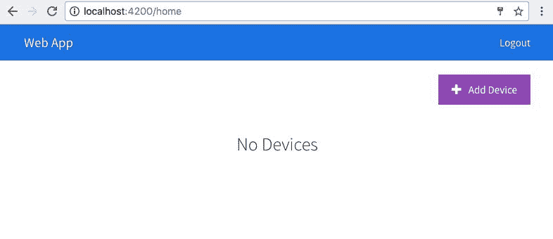
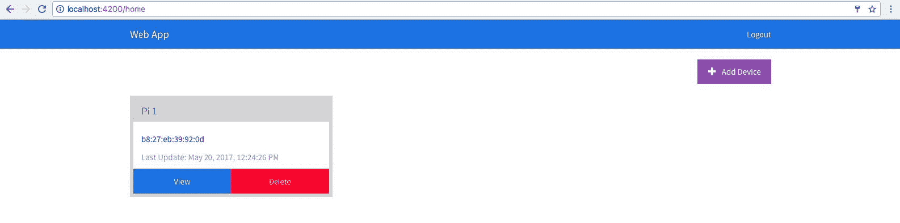
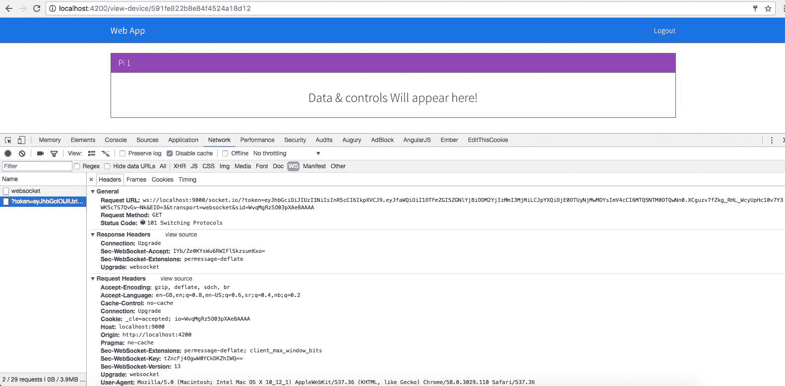
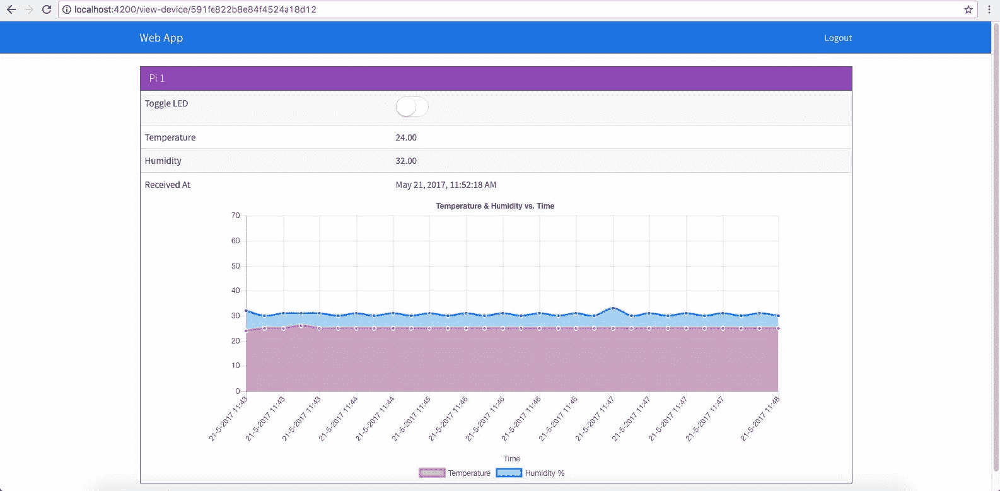
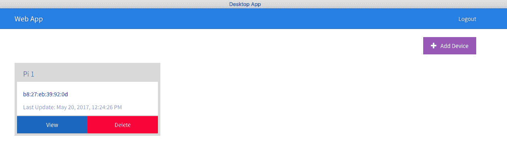
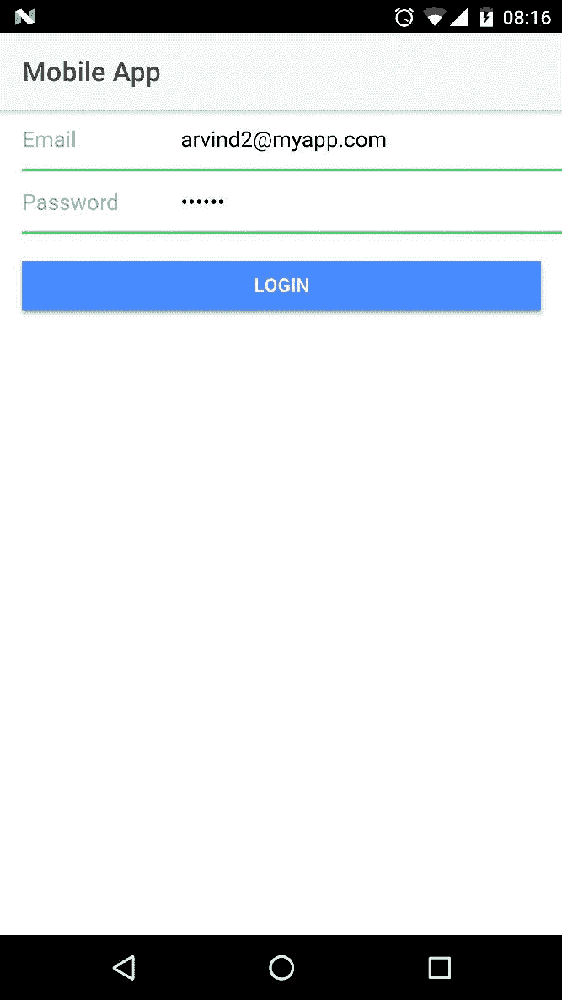
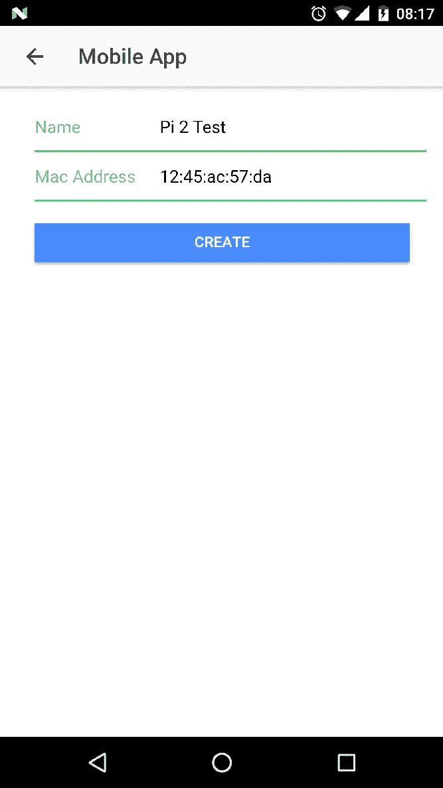
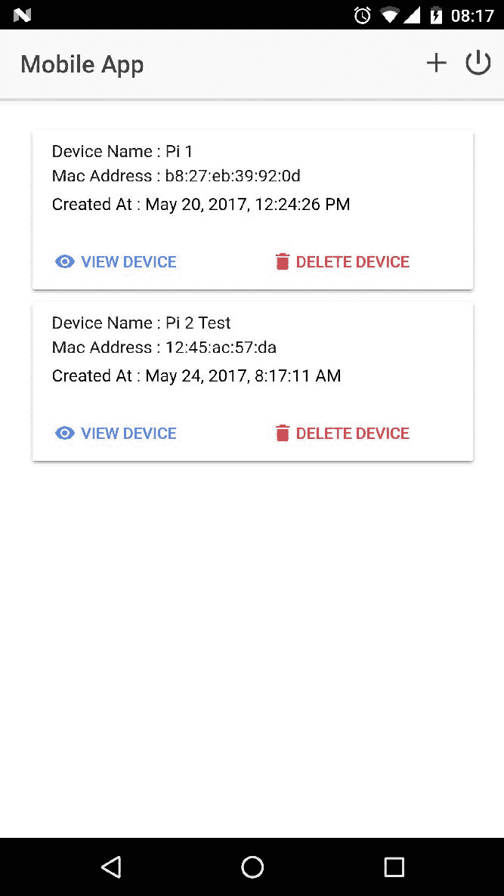

# 三、IoTFW.js 2

在前一章中，我们已经看到了树莓派、代理、应用编程接口引擎和网络应用之间的基本设置。在本章中，我们将研究框架的剩余部分。我们还将建立一个简单的例子，涉及到传感和驱动。我们将使用温度和湿度传感器读取温度和湿度，并使用网络、桌面或移动应用打开/关闭连接到树莓派的发光二极管。

我们将在本章中讨论以下主题:

*   更新应用编程接口引擎
*   将应用编程接口引擎与网络应用集成
*   使用 DHT11 和 LED 构建端到端示例
*   构建桌面应用
*   构建移动应用

# 更新应用编程接口引擎

现在我们已经完成了 web 应用的开发，我们将更新 API 引擎来添加设备的 API 和数据服务，以及 web 套接字。

打开`api-engine/server/routes.js`；我们将在这里添加两条路线。更新`api-engine/server/routes.js`，如下:

```js
'use strict'; 

var path = require('path'); 

module.exports = function(app) { 
  // Insert routes below 
  app.use('/api/v1/users', require('./api/user')); 
  app.use('/api/v1/devices', require('./api/device')); 
  app.use('/api/v1/data', require('./api/data')); 

  app.use('/auth', require('./auth')); 
}; 
```

现在，我们将添加这些路线的定义。在`api-engine/server/api`文件夹内，创建一个名为`device`的新文件夹。在`device`文件夹中，创建一个名为`index.js`的新文件。更新`api-engine/server/api/device/index.js`，如下:

```js
'use strict'; 

var express = require('express'); 
var controller = require('./device.controller'); 
var config = require('../../config/environment'); 
var auth = require('../../auth/auth.service'); 

var router = express.Router(); 

router.get('/', auth.isAuthenticated(), controller.index); 
router.delete('/:id', auth.isAuthenticated(), controller.destroy); 
router.put('/:id', auth.isAuthenticated(), controller.update); 
router.get('/:id', auth.isAuthenticated(), controller.show); 
router.post('/', auth.isAuthenticated(), controller.create); 

module.exports = router; 
```

在这里，我们添加了五条路线，如下所示:

*   获取所有设备
*   删除设备
*   更新设备
*   获得一个设备
*   创建设备

接下来，在名为`device.model.js`的`api-engine/server/api/device/`文件夹中创建另一个文件。该文件将包含设备集合的猫鼬模式。更新`api-engine/server/api/device/device.model.js`，如下:

```js
'use strict'; 

var mongoose = require('mongoose'); 
var Schema = mongoose.Schema; 

var DeviceSchema = new Schema({ 
    name: String, 
    macAddress: String, 
    createdBy: { 
        type: String, 
        default: 'user' 
    }, 
    createdAt: { 
        type: Date 
    }, 
    updatedAt: { 
        type: Date 
    } 
}); 

DeviceSchema.pre('save', function(next) { 
    var now = new Date(); 
    this.updatedAt = now; 
    if (!this.createdAt) { 
        this.createdAt = now; 
    } 
    next(); 
}); 

module.exports = mongoose.model('Device', DeviceSchema); 
```

最后是控制器逻辑。在`api-engine/server/api/device`文件夹中创建一个名为`device.controller.js`的文件，并更新`api-engine/server/api/device/device.controller.js`，如下所示:

```js
'use strict'; 

var Device = require('./device.model'); 

/** 
 * Get list of all devices for a user 
 */ 
exports.index = function(req, res) { 
    var currentUser = req.user._id; 
    // get only devices related to the current user 
    Device.find({ 
        createdBy: currentUser 
    }, function(err, devices) { 
        if (err) return res.status(500).send(err); 
        res.status(200).json(devices); 
    }); 
}; 

/** 
 * Add a new device 
 */ 
exports.create = function(req, res, next) { 
    var device = req.body; 
    // this device is created by the current user 
    device.createdBy = req.user._id; 
    Device.create(device, function(err, device) { 
        if (err) return res.status(500).send(err); 
        res.json(device); 
    }); 
}; 

/** 
 * Get a single device 
 */ 
exports.show = function(req, res, next) { 
    var deviceId = req.params.id; 
    // the current user should have created this device 
    Device.findOne({ 
        _id: deviceId, 
        createdBy: req.user._id 
    }, function(err, device) { 
        if (err) return res.status(500).send(err); 
        if (!device) return res.status(404).end(); 
        res.json(device); 
    }); 
}; 

/** 
 * Update a device 
 */ 
exports.update = function(req, res, next) { 
    var device = req.body; 
    device.createdBy = req.user._id; 

    Device.findOne({ 
        _id: deviceId, 
        createdBy: req.user._id 
    }, function(err, device) { 
        if (err) return res.status(500).send(err); 
        if (!device) return res.status(404).end(); 

        device.save(function(err, updatedDevice) { 
            if (err) return res.status(500).send(err); 
            return res.status(200).json(updatedDevice); 
        }); 
    }); 
}; 

/** 
 * Delete a device 
 */ 
exports.destroy = function(req, res) { 
    Device.findOne({ 
        _id: req.params.id, 
        createdBy: req.user._id 
    }, function(err, device) { 
        if (err) return res.status(500).send(err); 

        device.remove(function(err) { 
            if (err) return res.status(500).send(err); 
            return res.status(204).end(); 
        }); 
    }); 
}; 
```

这里，我们已经定义了路由的逻辑。

设备 API 为我们管理设备。为了管理每个设备的数据，我们将使用这个集合。

现在，我们将定义数据 API。在`api-engine/server/api`文件夹内新建一个名为`data`的文件夹。在`api-engine/server/api/data`文件夹中，创建一个名为`index.js`的新文件并更新`api-engine/server/api/data/index.js`，如下所示:

```js
'use strict'; 

var express = require('express'); 
var controller = require('./data.controller'); 
var auth = require('../../auth/auth.service'); 

var router = express.Router(); 

router.get('/:deviceId/:limit', auth.isAuthenticated(), controller.index); 
router.post('/', auth.isAuthenticated(), controller.create); 

module.exports = router; 
```

我们在这里定义了两条路线:一条是根据设备标识查看数据，另一条是创建数据。视图数据路由从设备返回的数据仅限于作为请求的一部分传入的数量。如果你记得的话，在`web-app/src/app/services/data.service.ts`中，我们已经将`dataLimit`类变量定义为`30`。这是我们在给定时间从应用编程接口获得的记录数。

接下来，对于猫鼬模式，在`api-engine/server/api/data`文件夹中创建一个名为`data.model.js`的新文件，并更新`api-engine/server/api/data/data.model.js`，如下所示:

```js
'use strict'; 

var mongoose = require('mongoose'); 
var Schema = mongoose.Schema; 

var DataSchema = new Schema({ 
    macAddress: { 
        type: String 
    }, 
    data: { 
        type: Schema.Types.Mixed 
    }, 
    createdBy: { 
        type: String, 
        default: 'raspberrypi3' 
    }, 
    createdAt: { 
        type: Date 
    }, 
    updatedAt: { 
        type: Date 
    } 
}); 

DataSchema.pre('save', function(next) { 
    var now = new Date(); 
    this.updatedAt = now; 
    if (!this.createdAt) { 
        this.createdAt = now; 
    } 
    next(); 
});
```

```js
DataSchema.post('save', function(doc) { 
    //console.log('Post Save Called', doc); 
    require('./data.socket.js').onSave(doc) 
}); 

module.exports = mongoose.model('Data', DataSchema); 
```

现在，数据应用编程接口的控制器逻辑。在`api-engine/server/api/data`中创建一个名为`data.controller.js`的文件，并更新`api-engine/server/api/data/data.controller.js`，如下所示:

```js
'use strict'; 

var Data = require('./data.model'); 

/** 
 * Get Data for a device 
 */ 
exports.index = function(req, res) { 
    var macAddress = req.params.deviceId; 
    var limit = parseInt(req.params.limit) || 30; 
    Data.find({ 
        macAddress: macAddress 
    }).limit(limit).exec(function(err, devices) { 
        if (err) return res.status(500).send(err); 
        res.status(200).json(devices); 
    }); 
}; 

/** 
 * Create a new data record 
 */ 
exports.create = function(req, res, next) { 
    var data = req.body; 
    data.createdBy = req.user._id; 
    Data.create(data, function(err, _data) { 
        if (err) return res.status(500).send(err); 
        res.json(_data); 
        if(data.topic === 'led'){ 
            require('../../mqtt/index.js').sendLEDData(data.data.l);// send led value 
        } 
    }); 
}; 
```

这里，我们定义了两种方法:一种是为设备获取数据，另一种是为设备创建新的数据记录。

对于数据 API，我们也会实现套接字，所以当树莓 PI 有新记录时，我们会立即通知网络应用、桌面应用或移动应用，以便实时显示数据。

正如我们从前面的代码中看到的，如果传入的主题是`LED`，我们将调用`sendLEDData()`，它反过来将数据发布到设备。

在`api-engine/server/api/data`文件夹中创建一个名为`data.socket.js`的文件，并更新`api-engine/server/api/data/data.socket.js`，如下所示:

```js
/** 
 * Broadcast updates to client when the model changes 
 */ 

'use strict'; 

var data = require('./data.model'); 
var socket = undefined; 

exports.register = function(_socket) { 
   socket = _socket; 
} 

function onSave(doc) { 
    // send data to only the intended device 
    socket.emit('data:save:' + doc.macAddress, doc); 
} 

module.exports.onSave = onSave; 
```

这将负责在新数据记录成功保存到数据库时发送新数据记录。

接下来，我们需要向套接字配置中添加套接字。打开`api-engine/server/config/socketio.js`并更新，如下图:

```js
'use strict'; 

var config = require('./environment'); 

// When the user disconnects.. perform this 
function onDisconnect(socket) {} 

// When the user connects.. perform this 
function onConnect(socket) { 
    // Insert sockets below 
    require('../api/data/data.socket').register(socket); 
} 
module.exports = function(socketio) { 
    socketio.use(require('socketio-jwt').authorize({ 
        secret: config.secrets.session, 
        handshake: true 
    })); 

    socketio.on('connection', function(socket) { 
        var socketId = socket.id; 
        var clientIp = socket.request.connection.remoteAddress; 

        socket.address = socket.handshake.address !== null ? 
            socket.handshake.address.address + ':' + socket.handshake.address.port : 
            process.env.DOMAIN; 

        socket.connectedAt = new Date(); 

        // Call onDisconnect. 
        socket.on('disconnect', function() { 
            onDisconnect(socket); 
            // console.info('[%s] DISCONNECTED', socket.address); 
        }); 

        // Call onConnect. 
        onConnect(socket); 
        console.info('[%s] Connected on %s', socketId, clientIp); 
    }); 
}; 
```

请注意，我们使用`socketio-jwt`来验证套接字连接，看看它是否有 JWT。如果没有提供有效的 JWT，我们不允许客户端连接。

这样，我们就完成了对 API 引擎的必要更改。通过运行以下命令保存所有文件并启动应用编程接口引擎:

```js
npm start  
```

这将启动应用编程接口引擎。在下一节中，我们将测试 web 应用和 API 引擎之间的集成，并继续我们上一节的学习。

# 集成网络应用和应用编程接口引擎

启动代理、应用编程接口引擎和网络应用。一旦全部成功启动，导航至`http://localhost:4200/`。使用我们创建的凭据登录。成功登录后，我们将看到以下屏幕:



这是真的，因为我们的帐户中没有任何设备。点击添加设备，我们会看到如下内容:


通过给设备命名来添加新设备。我给我的设备命名为`Pi 1`，并添加了 mac 地址。我们将使用设备的 mac 地址作为识别设备的唯一方式。

点击创建，我们应该会看到一个新的设备被创建，它会将我们重定向到主页并显示新创建的设备，这可以在下面的截图中看到:



现在，当我们单击“查看”按钮时，我们应该会看到以下页面:


在本书的示例中，我们将不断更新这个模板，并根据需要不断修改它。目前，这是一个由`web-app/src/app/device/device.component.html`表示的虚拟模板。

如果我们打开开发人员工具并查看网络选项卡 WS 部分，如下面的截图所示，我们应该能够看到一个 web 套接字请求用 JWT 令牌发送到我们的服务器:



这样，我们就完成了将树莓 Pi 与代理、代理与应用编程接口引擎以及应用编程接口引擎与网络应用的拼接。为了完成数据从设备到 web 应用的整个往返过程，我们将在下一节实现一个简单的用例。

# 使用分布式哈希表 11 和发光二极管测试端到端流程

在我们开始在桌面和移动应用上工作之前，我们将为树莓派实现端到端的数据流。

我们将要研究的例子实现了一个执行器和一个传感器用例。我们将在树莓 Pi 上连接一个 LED，并从网络应用打开/关闭 LED，我们还将在树莓 Pi 上连接一个 DHT11 温度传感器，并在网络应用上实时查看其值。

我们将从树莓 Pi 开始，在那里实现所需的逻辑；接下来，使用 API 引擎，进行所需的更改，最后使用 web app 来表示数据。

# 设置和更新树莓派

首先，我们将设置电路，如下所示:


现在，我们将建立以下连接:

| **源引脚** | **组件销** |
| 树莓 Pi 引脚 1 - 3.3V | 面包板+栏杆 |
| 覆盆子 Pi 引脚 6 -接地 | 面包板栏杆 |
| 树莓 Pi 引脚 3 - GPIO 2 | 温度传感器信号引脚 |
| 树莓 Pi 引脚 12 - GPIO 18 | 发光二极管阳极引脚 |
| 发光二极管阴极引脚 | 面包板栏杆 |
| 温度传感器+引脚 | 面包板+栏杆 |
| 温度传感器-引脚 | 面包板栏杆 |

We have used a current limiting resistor of 220 ohms between pin 12/GPIO 18 and the anode of a LED pin.

一旦建立了这个连接，我们将编写所需的逻辑。在树莓 Pi 上，打开`pi-client/index.js`文件并更新，如下图:

```js
var config = require('./config.js'); 
var mqtt = require('mqtt'); 
var GetMac = require('getmac'); 
var rpiDhtSensor = require('rpi-dht-sensor'); 
var rpio = require('rpio'); 
var dht11 = new rpiDhtSensor.DHT11(2); 
var temp = 0, 
    prevTemp = 0; 
var humd = 0, 
    prevHumd = 0; 
var macAddress; 
var state = 0; 

// Set pin 12 as output pin and to low 
rpio.open(12, rpio.OUTPUT, rpio.LOW); 

var client = mqtt.connect({ 
    port: config.mqtt.port, 
    protocol: 'mqtts', 
    host: config.mqtt.host, 
    clientId: config.mqtt.clientId, 
    reconnectPeriod: 1000, 
    username: config.mqtt.clientId, 
    password: config.mqtt.clientId, 
    keepalive: 300, 
    rejectUnauthorized: false 
}); 

client.on('connect', function() { 
    client.subscribe('rpi'); 
    client.subscribe('led'); 
    GetMac.getMac(function(err, mac) { 
        if (err) throw err; 
        macAddress = mac; 
        client.publish('api-engine', mac); 
    }); 
}); 

client.on('message', function(topic, message) { 
    message = message.toString(); 
    if (topic === 'rpi') { 
        console.log('API Engine Response >> ', message); 
    } else if (topic === 'led') { 
        state = parseInt(message) 
        console.log('Turning LED', state ? 'On' : 'Off'); 
        // If we get a 1 we turn on the led, else off 
        rpio.write(12, state ? rpio.HIGH : rpio.LOW); 
    } else { 
        console.log('Unknown topic', topic); 
    } 
}); 

// infinite loop, with 3 seconds delay 
setInterval(function() { 
    getDHT11Values(); 
    console.log('Temperature: ' + temp + 'C, ' + 'humidity: ' + humd + '%'); 
    // if the temperature and humidity values change 
    // then only publish the values 
    if (temp !== prevTemp || humd !== prevHumd) { 
        var data2Send = { 
            data: { 
                t: temp, 
                h: humd, 
                l: state 
            }, 
            macAddress: macAddress 
        }; 
        console.log('Data Published'); 
        client.publish('dht11', JSON.stringify(data2Send)); 
        // reset prev values to current 
        // for next loop 
        prevTemp = temp; 
        prevHumd = humd; 
    } // else chill! 

}, 3000); // every three second 

function getDHT11Values() { 
    var readout = dht11.read(); 
    // update global variable 
    temp = readout.temperature.toFixed(2); 
    humd = readout.humidity.toFixed(2); 
} 
```

在前面的代码中，我们添加了几个节点模块，如下所示:

*   `rpi-dht-sensor`:[https://www.npmjs.com/package/rpi-dht-sensor](https://www.npmjs.com/package/rpi-dht-sensor)；本模块将帮助我们读取 DHT11 传感器的值
*   `rpio`:[https://www.npmjs.com/package/rpio](https://www.npmjs.com/package/rpio)；本模块将帮助我们管理板上的 GPIOs，我们将使用它来管理 LED

我们写了一个`setInterval()`永远运行，每 3 秒。在`callback`内部，我们称之为`getDHT11Values()`，它从传感器中读取温度和湿度。如果温度和湿度值有任何变化，我们会将此数据发布给代理。

还有，注意`client.on('message')`；这里，我们添加了另一个`if`条件，正在收听`LED`话题。如果当前消息来自`LED`主题，我们知道我们将收到一个`1`或`0`指示打开或关闭发光二极管。

现在，最后我们将安装两个模块，运行:

```js
npm install rpi-dht-sensor -save
npm install rpio -save  
```

保存所有文件并运行`npm start`；这应该会将树莓 Pi 连接到经纪人并订阅`LED`主题，如下所示:


此外，如果我们看到控制台从树莓派，我们应该看到如下内容:


每当数据发生变化时，数据都会发布到代理。我们还没有在应用编程接口引擎上实现对这些数据做出反应的逻辑，这将在下一节中进行。

# 更新应用编程接口引擎

现在，我们将向运行在应用编程接口引擎上的 MQTT 客户端添加所需的代码，以处理来自设备的数据。更新`api-engine/server/mqtt/index.js`，如下:

```js
var Data = require('../api/data/data.model'); 
var mqtt = require('mqtt'); 
var config = require('../config/environment'); 

var client = mqtt.connect({ 
    port: config.mqtt.port, 
    protocol: 'mqtts', 
    host: config.mqtt.host, 
    clientId: config.mqtt.clientId, 
    reconnectPeriod: 1000, 
    username: config.mqtt.clientId, 
    password: config.mqtt.clientId, 
    keepalive: 300, 
    rejectUnauthorized: false 
}); 

client.on('connect', function() { 
    console.log('Connected to Mosca at ' + config.mqtt.host + ' on port ' + config.mqtt.port); 
    client.subscribe('api-engine'); 
    client.subscribe('dht11'); 
}); 

client.on('message', function(topic, message) { 
    // message is Buffer 
    // console.log('Topic >> ', topic); 
    // console.log('Message >> ', message.toString()); 
    if (topic === 'api-engine') { 
        var macAddress = message.toString(); 
        console.log('Mac Address >> ', macAddress); 
        client.publish('rpi', 'Got Mac Address: ' + macAddress); 
    } else if (topic === 'dht11') { 
        var data = JSON.parse(message.toString()); 
        // create a new data record for the device 
        Data.create(data, function(err, data) { 
            if (err) return console.error(err); 
            // if the record has been saved successfully,  
            // websockets will trigger a message to the web-app 
            console.log('Data Saved :', data.data); 
        }); 
    } else { 
        console.log('Unknown topic', topic); 
    } 
}); 

exports.sendLEDData = function(data) { 
    console.log('Sending Data', data); 
    client.publish('led', data); 
} 
```

在这里，我们订阅了一个名为`dht11`的话题，收听树莓派发布的关于温度和湿度值的消息。我们还公开了另一个名为`sendLEDData`的方法，它将接受需要发送到设备的数据。

如果我们保存所有文件并重新启动 API 引擎，我们应该会看到如下内容:


从前面的截图中，我们可以看到数据来自树莓 Pi，并被保存到 MongoDB 中。为了验证数据是否被保存，我们可以前往`mlab`数据库并寻找名为`datas`的集合，它应该如下所示:


每当数据保存成功时，相同的副本也会发送到 web 应用。在下一节中，我们将在 web 仪表板上实时显示这些数据。

# 更新网络应用

在本节中，我们将开发在 web 应用中实时显示数据所需的代码，并提供一个界面，使用该界面我们可以打开/关闭 LED。

我们将从添加拨动开关组件开始。我们将同样使用`ngx-ui-switch`([https://github.com/webcat12345/ngx-ui-switch](https://github.com/webcat12345/ngx-ui-switch))。

从`web-app-base`文件夹中，运行以下命令:

```js
npm install ngx-ui-switch -save  
```

我们将使用`ng2-charts`[【https://valor-software.com/ng2-charts/】](https://valor-software.com/ng2-charts/)绘制温度和湿度值的图表。我们也将通过运行以下命令来安装该模块:

```js
npm install ng2-charts --save
npm install chart.js --save  
```

这将安装拨动开关和`ng2-charts`模块。接下来，我们需要将此添加到`@NgModule`。打开`web-app/src/app/app.module.ts`并将以下命令添加到导入中:

```js
import { UiSwitchModule } from 'ngx-ui-switch'; 
import { ChartsModule } from 'ng2-charts'; 
```

然后，将`UiSwitchModule`和`ChartsModule`添加到导入数组中:

```js
// snipp snipp 
imports: [ 
    RouterModule.forRoot(appRoutes), 
    BrowserModule, 
    BrowserAnimationsModule, 
    FormsModule, 
    HttpModule, 
    LocalStorageModule.withConfig({ 
      prefix: 'web-app', 
      storageType: 'localStorage' 
    }), 
    SimpleNotificationsModule.forRoot(), 
    UiSwitchModule, 
    ChartsModule 
  ], 
// snipp snipp 
```

完成后，我们需要将`chart.js`导入到我们的应用中。打开`web-app/.angular-cli.json`并更新`scripts`部分，如下所示:

```js
// snipp snipp  
"scripts": [ 
        "../node_modules/chart.js/dist/Chart.js" 
      ], 
// snipp snipp  
```

保存所有文件并重新启动 web 应用(如果它已经在运行)。

现在，我们可以在设备组件中使用这个指令。

在我们当前的使用案例中，我们必须显示温度和湿度值，并提供一个拨动开关来打开/关闭发光二极管。为此，我们在`web-app/src/app/device/device.component.html`中的模板如下:

```js
<div class="container"> 
    <br> 
    <div *ngIf="!device"> 
        <h3 class="text-center">Loading!</h3> 
    </div> 
    <div class="row" *ngIf="lastRecord"> 
        <div class="col-md-12"> 
            <div class="panel panel-info"> 
                <div class="panel-heading"> 
                    <h3 class="panel-title"> 
                        {{device.name}} 
                    </h3> 
                    <span class="pull-right btn-click"> 
                        <i class="fa fa-chevron-circle-up"></i> 
                    </span> 
                </div> 
                <div class="clearfix"></div> 
                <div class="table-responsive"> 
                    <table class="table table-striped"> 
                        <tr> 
                            <td>Toggle LED</td> 
                            <td> 
                                <ui-switch [(ngModel)]="toggleState" (change)="toggleChange($event)"></ui-switch> 
                            </td> 
                        </tr> 
                        <tr *ngIf="lastRecord"> 
                            <td>Temperature</td> 
                            <td>{{lastRecord.data.t}}</td> 
                        </tr> 
                        <tr *ngIf="lastRecord"> 
                            <td>Humidity</td> 
                            <td>{{lastRecord.data.h}}</td> 
                        </tr> 
                        <tr *ngIf="lastRecord"> 
                            <td>Received At</td> 
                            <td>{{lastRecord.createdAt | date: 'medium'}}</td> 
                        </tr> 
                    </table> 
                    <div class="col-md-10 col-md-offset-1" *ngIf="lineChartData.length > 0"> 
                        <canvas baseChart [datasets]="lineChartData" [labels]="lineChartLabels" [options]="lineChartOptions" [legend]="lineChartLegend" [chartType]="lineChartType"></canvas> 
                    </div> 
                </div> 
            </div> 
        </div> 
    </div> 
</div> 
```

`DeviceComponent`类所需的代码:`web-app/src/app/device/device.component.ts`如下:

```js
import { Component, OnInit, OnDestroy } from '@angular/core'; 
import { DevicesService } from '../services/devices.service'; 
import { Params, ActivatedRoute } from '@angular/router'; 
import { SocketService } from '../services/socket.service'; 
import { DataService } from '../services/data.service'; 
import { NotificationsService } from 'angular2-notifications'; 

@Component({ 
   selector: 'app-device', 
   templateUrl: './device.component.html', 
   styleUrls: ['./device.component.css'] 
}) 
export class DeviceComponent implements OnInit, OnDestroy { 
   device: any; 
   data: Array<any>; 
   toggleState: boolean = false; 
   private subDevice: any; 
   private subData: any; 
   lastRecord: any; 

   // line chart config 
   public lineChartOptions: any = { 
         responsive: true, 
         legend: { 
               position: 'bottom', 
         }, hover: { 
               mode: 'label' 
         }, scales: { 
               xAxes: [{ 
                     display: true, 
                     scaleLabel: { 
                           display: true, 
                           labelString: 'Time' 
                     } 
               }], 
               yAxes: [{ 
                     display: true, 
                     ticks: { 
                           beginAtZero: true, 
                           steps: 10, 
                           stepValue: 5, 
                           max: 70 
                     } 
               }] 
         }, 
         title: { 
               display: true, 
               text: 'Temperature & Humidity vs. Time' 
         } 
   }; 
   public lineChartLegend: boolean = true; 
   public lineChartType: string = 'line'; 
   public lineChartData: Array<any> = []; 
   public lineChartLabels: Array<any> = []; 

   constructor(private deviceService: DevicesService, 
         private socketService: SocketService, 
         private dataService: DataService, 
         private route: ActivatedRoute, 
         private notificationsService: NotificationsService) { } 

   ngOnInit() { 
         this.subDevice = this.route.params.subscribe((params) => { 
               this.deviceService.getOne(params['id']).subscribe((response) => { 
                     this.device = response.json(); 
                     this.getData(); 
                     this.socketInit(); 
               }); 
         }); 
   } 

   getData() { 
         this.dataService.get(this.device.macAddress).subscribe((response) => { 
               this.data = response.json(); 
               this.genChart(); 
               this.lastRecord = this.data[0]; // descending order data 
               if (this.lastRecord) { 
                     this.toggleState = this.lastRecord.data.l; 
               } 
         }); 
   } 

   toggleChange(state) { 
         let data = { 
               macAddress: this.device.macAddress, 
               data: { 
                     t: this.lastRecord.data.t, 
                     h: this.lastRecord.data.h, 
                     l: state ? 1 : 0 
               }, 
               topic: 'led' 
         } 

         this.dataService.create(data).subscribe((resp) => { 
               if (resp.json()._id) { 
                     this.notificationsService.success('Device Notified!'); 
               } 
         }, (err) => { 
               console.log(err); 
               this.notificationsService.error('Device Notification Failed. Check console for the error!'); 
         }) 
   } 

   socketInit() { 
         this.subData = this.socketService.getData(this.device.macAddress).subscribe((data) => { 
               if(this.data.length <= 0) return; 
               this.data.splice(this.data.length - 1, 1); // remove the last record 
               this.data.push(data); // add the new one 
               this.lastRecord = data; 
               this.genChart(); 
         }); 
   } 

   ngOnDestroy() { 
         this.subDevice.unsubscribe(); 
         this.subData ? this.subData.unsubscribe() : ''; 
   } 

   genChart() { 

         let data = this.data; 
         let _dtArr: Array<any> = []; 
         let _lblArr: Array<any> = []; 

         let tmpArr: Array<any> = []; 
         let humArr: Array<any> = []; 

         for (var i = 0; i < data.length; i++) { 
               let _d = data[i]; 
               tmpArr.push(_d.data.t); 
               humArr.push(_d.data.h); 
               _lblArr.push(this.formatDate(_d.createdAt)); 
         } 

         // reverse data to show the latest on the right side 
         tmpArr.reverse(); 
         humArr.reverse(); 
         _lblArr.reverse(); 

         _dtArr = [ 
               { 
                     data: tmpArr, 
                     label: 'Temperature' 
               }, 
               { 
                     data: humArr, 
                     label: 'Humidity %' 
               }, 
         ] 

         this.lineChartData = _dtArr; 
         this.lineChartLabels = _lblArr; 
   } 

   private formatDate(originalTime) { 
         var d = new Date(originalTime); 
         var datestring = d.getDate() + "-" + (d.getMonth() + 1) + "-" + d.getFullYear() + " " + 
               d.getHours() + ":" + d.getMinutes(); 
         return datestring;
```

```js
   } 
} 
```

需要注意的主要方法如下:

*   `getData()`:此方法用于获取页面加载的最后 30 条记录。我们从 API 引擎以降序发送数据；因此，我们提取最后一条记录并将其保存为最后一条记录。如果需要，我们可以使用剩余的记录绘制图表
*   `toggleChange()`:点击拨动开关会触发此方法。这个方法会将数据发送到 API 引擎进行保存
*   `socketInit()`:此方法持续监听设备上的数据保存事件。利用这个，我们用来自设备的最新数据更新`lastRecord`变量
*   `genChart()`:该方法采取数据采集，然后绘制图形。当新数据通过套接字到达时，我们移除数据数组中的最后一条记录并推送新记录，始终保持 30 条记录的总大小

这样，我们就完成了处理该设置所需的模板的开发。

保存所有文件，启动代理、应用编程接口引擎和网络应用，然后登录应用，然后导航到设备页面。

如果一切设置正确，我们将看到以下屏幕:



现在，每当数据通过套接字到达时，图表就会自动更新！

现在要测试发光二极管，将发光二极管按钮切换到打开，您应该会看到我们在树莓派上设置的发光二极管会亮起，同样，如果我们将其关闭，它也会关闭发光二极管。

# 构建桌面应用并实施端到端流程

现在，我们已经完成了网络应用的端到端流程，我们将同样扩展到桌面和移动应用。我们将从为同一个应用编程接口引擎构建桌面客户端开始。因此，如果用户更愿意通过网络或移动应用使用桌面应用，他/她可以使用这个。

这个桌面应用，我们将拥有与网络应用相同的所有功能。

为了构建桌面应用，我们将使用电子([https://electron.atom.io/](https://electron.atom.io/))框架。使用名为`generator-electron`([https://github.com/sindresorhus/generator-electron](https://github.com/sindresorhus/generator-electron))的约曼([http://yeoman.io/](http://yeoman.io/))发电机，我们将为基础应用搭建脚手架。然后，我们将构建我们的网络应用，并使用该构建中的`dist`文件夹作为桌面应用的输入。一旦我们开始工作，这一切就会变得更加清楚。

要开始，请运行以下命令:

```js
npm install yo generator-electron -g  
```

这将安装约曼发电机和电子发电机。接下来，在`chapter2`文件夹内，创建一个名为`desktop-app`的文件夹，然后打开一个新的命令提示符/终端，运行以下命令:

```js
yo electron
```

该向导将询问一些问题，您可以相应地回答这些问题:


这将继续并安装所需的依赖项。安装完成后，我们应该会看到一个文件夹结构，如下所示:

```js
.

├── index.css

├── index.html

├── index.js

├── license

├── package.json

└── readme.md
```

`node_modules`文件夹位于根目录。

一切从`desktop-app/package.json`开始脚本开始，启动`desktop-app/index.js`。`desktop-app/index.js`创建一个新的浏览器窗口并启动`desktop-app/index.html`页面。

要从`desktop-app`文件夹中快速试驾，请运行以下命令:

```js
npm start   
```

因此，我们应该会看到以下屏幕:


现在，我们将添加所需的代码。在`desktop-app`文件夹的根目录下，创建一个名为`freeport.js`的文件并更新`desktop-app/freeport.js`，如下所示:

```js
var net = require('net') 
module.exports = function(cb) { 
    var server = net.createServer(), 
        port = 0; 
    server.on('listening', function() { 
        port = server.address().port 
        server.close() 
    }); 
    server.on('close', function() { 
        cb(null, port) 
    }) 
    server.on('error', function(err) { 
        cb(err, null) 
    }) 
    server.listen(0, '127.0.0.1') 
} 
```

使用前面的代码，我们将在最终用户的机器上找到一个自由端口，并在电子外壳内启动我们的 web 应用。

接下来，在`desktop-app`文件夹的根目录下创建一个名为`app`的文件夹。我们一会儿会把文件转储到这里。接下来，在`desktop-app`文件夹的根目录下，创建一个名为`server.js`的文件。更新`server.js`，如下:

```js
var FreePort = require('./freeport.js'); 
var http = require('http'), 
    fs = require('fs'), 
    html = ''; 

module.exports = function(cb) { 
    FreePort(function(err, port) { 
        console.log(port); 
        http.createServer(function(request, response) { 
            if (request.url === '/') { 
                html = fs.readFileSync('./app/index.html'); 
            } else { 
                html = fs.readFileSync('./app' + request.url); 
            } 
            response.writeHeader(200, { "Content-Type": "text/html" }); 
            response.write(html); 
            response.end(); 
        }).listen(port); 
        cb(port); 
    }); 
} 
```

在这里，我们收听一个自由港并启动`index.html`。现在，我们需要做的就是更新`desktop-app/index.js`中的`createMainWindow()`，如下所示:

```js
// snipp snipp 
function createMainWindow() { 
    const { width, height } = electron.screen.getPrimaryDisplay().workAreaSize; 
    const win = new electron.BrowserWindow({ width, height }) 
    const server = require("./server")(function(port) { 
        win.loadURL('http://localhost:' + port); 
        win.on('closed', onClosed); 
        console.log('Desktop app started on port :', port); 
    }); 

    return win; 
} 
// snipp snipp 
```

这就是我们需要的全部设置。

现在，返回`web-app`文件夹的终端/提示符(是`web-app`，不是`desktop-app`，运行以下命令:

```js
ng build --env=prod
```

这将在名为`dist`的`web app`文件夹内创建一个新文件夹。`dist`文件夹的内容应如下行:

```js
.

├── favicon.ico

├── index.html

├── inline.bundle.js

├── inline.bundle.js.map

├── main.bundle.js

├── main.bundle.js.map

├── polyfills.bundle.js

├── polyfills.bundle.js.map

├── scripts.bundle.js

├── scripts.bundle.js.map

├── styles.bundle.js

├── styles.bundle.js.map

├── vendor.bundle.js

└── vendor.bundle.js.map
```

我们在 web 应用中编写的所有代码最终都被捆绑到前面的文件中。我们将抓取`dist`文件夹中的所有文件(不是`dist`文件夹)，然后将其粘贴到`desktop-app/app`文件夹中。经过上述更改后，桌面应用的最终结构如下:

```js
.

├── app

│ ├── favicon.ico

│ ├── index.html

│ ├── inline.bundle.js

│ ├── inline.bundle.js.map

│ ├── main.bundle.js

│ ├── main.bundle.js.map

│ ├── polyfills.bundle.js

│ ├── polyfills.bundle.js.map

│ ├── scripts.bundle.js

│ ├── scripts.bundle.js.map

│ ├── styles.bundle.js

│ ├── styles.bundle.js.map

│ ├── vendor.bundle.js

│ └── vendor.bundle.js.map

├── freeport.js

├── index.css

├── index.html

├── index.js

├── license

├── package.json

├── readme.md

└── server.js
```

从现在开始，我们将把`web-app/dist`文件夹的内容粘贴到`desktop-app`的`app`文件夹中。

要测试驱动器，请运行以下命令:

```js
npm start 
```

这将显示登录屏幕，如下所示:


如果您看到如前所示的弹出窗口，请允许它。成功登录后，您应该能够看到帐户中的所有设备，如下所示:



最后，设备信息屏幕:


现在我们可以打开/关闭发光二极管，它应该会做出相应的反应。

这样，我们就完成了桌面应用。

在下一节中，我们将使用 ion 框架构建一个移动应用。

# 构建移动应用并实现端到端流程

在这一部分，我们将使用离子框架([http://ionicframework.com/](http://ionicframework.com/))构建我们的移动伴侣应用。输出或示例将与我们为网络和桌面应用所做的相同。

首先，我们将通过运行以下命令来安装最新版本的`ionic`和`cordova`:

```js
npm install -g ionic cordova  
```

现在，我们需要移动应用基础。如果您尚未克隆图书的代码存储库，您可以使用以下命令(在您的计算机上的任何位置)进行克隆:

```js
git clone git@github.com:PacktPublishing/Practical-Internet-of-Things-with-JavaScript.git
```

或者也可以从[https://github . com/PacktPublishing/实用-带 JavaScript 的物联网](https://github.com/PacktPublishing/Practical-Internet-of-Things-with-JavaScript)下载 zip 文件。

储存库下载完成后，`cd`进入`base`文件夹，将`mobile-app-base`文件夹复制到`chapter2`文件夹。

复制完成后，`cd`进入`mobile-app`文件夹，运行以下命令:

```js
npm install
```

然后

```js
ionic cordova platform add android 
```

或者

```js
 ionic cordova platform add ios 
```

这将负责安装所需的依赖项，并添加安卓或 iOS 平台。

如果我们查看`mobile-app`文件夹，应该会看到以下内容:

```js
.

├── README.md

├── config.xml

├── hooks

│ └── README.md

├── ionic.config.json

├── package.json

├── platforms

│ ├── android

│ └── platforms.json

├── plugins

│ ├── android.json

│ ├── cordova-plugin-console

│ ├── cordova-plugin-device

│ ├── cordova-plugin-splashscreen

│ ├── cordova-plugin-statusbar

│ ├── cordova-plugin-whitelist

│ ├── fetch.json

│ └── ionic-plugin-keyboard

├── resources

│ ├── android

│ ├── icon.png

│ ├── ios

│ └── splash.png

├── src

│ ├── app

│ ├── assets

│ ├── declarations.d.ts

│ ├── index.html

│ ├── manifest.json

│ ├── pages

│ ├── service-worker.js

│ ├── services

│ └── theme

├── tsconfig.json

├── tslint.json

└── www

├── assets

├── build

├── index.html

├── manifest.json

└── service-worker.js
```

在我们的`mobile-app`文件夹中，最重要的文件是`mobile-app/config.xml`。该文件由 cordova 将 HTML/CSS/JS 应用转换为混合移动应用所需的定义组成。

接下来，我们有`mobile-app/resources`、`mobile-app/plugins`和`mobile-app/platforms`文件夹，它们将包含我们正在开发的应用的 cordova 包装代码。

最后是`mobile-app/src`文件夹，这个文件夹是我们所有源代码的地方。手机的设置类似于我们对网络应用和桌面应用的设置。我们有一个服务文件夹，其中的`mobile-app/src/services/auth.service.ts`用于身份验证，`mobile-app/src/services/device.service.ts`用于与设备应用编程接口连接，`mobile-app/src/services/data.service.ts`用于从设备获取最新数据，`mobile-app/src/services/socket.service.ts`用于在我们的移动应用中设置 web 套接字，最后，`mobile-app/src/services/toast.service.ts`用于显示针对移动设备定制的通知。`mobile-app/src/services/toast.service.ts`类似于我们在网络和桌面应用中使用的通知服务。

接下来，我们有需要的页面。移动应用只实现登录页面。我们强制用户使用网络或桌面应用创建一个新帐户。`mobile-app/src/pages/login/login.ts`由认证逻辑组成。`mobile-app/src/pages/home/home.ts`包含用户注册的所有设备的列表。`mobile-app/src/pages/add-device/add-device.ts`拥有添加新设备所需的逻辑和`mobile-app/src/pages/view-device/view-device.ts`查看设备信息。

现在，从`mobile-app`文件夹中，运行以下命令:

```js
ionic serve  
```

这将在浏览器中启动应用。如果您想在实际应用上测试它，可以运行以下命令:

```js
ionic cordova run android   
```

或者，您可以运行以下命令:

```js
ionic cordova run ios  
```

这将在设备上启动应用。无论是哪种情况，应用的行为都是一样的。

应用启动后，我们将看到登录页面:



一旦我们成功登录，我们应该会看到如下的主页。我们可以使用标题中的+图标添加新设备:



新创建的设备应该反映在我们的主屏幕上，如下所示:



如果我们单击查看设备，我们应该会看到设备信息，如下所示:


当我们打开/关闭按钮时，树莓派上的发光二极管应该打开/关闭:


相同设置的另一个视图如下所示:


前面是树莓 Pi 3 的设置，带有 DHT11 传感器和发光二极管。

有了这个，我们成功地建立了一个端到端的架构来执行物联网的例子。从现在开始，我们将为下一个例子使用网络应用、移动应用、桌面应用、树莓派和一些应用编程接口引擎。我们要做的改变很小。我们将关注用例，而不是一次又一次地构建设置。

# 解决纷争

如果您没有看到预期的输出，请检查以下内容:

*   检查代理、应用编程接口引擎、网络应用和树莓派应用是否正在运行
*   检查提供给树莓 Pi 的代理的 IP 地址
*   检查提供给移动应用的应用编程接口引擎的 IP 地址

# 摘要

在[第 2 章](2.html#UGI00-ce91715363d04669bca1c1545beb57ee)、 *IoTFW.js - I* 中，以及在这一章中，我们经历了设置一个完整框架来使用物联网解决方案的整个过程。我们只用 JavaScript 作为编程语言构建了整个框架。

我们从了解从树莓派到最终用户设备(如网络应用、桌面应用或移动应用)的架构和数据流开始。然后，在建立了 MongoDB 之后，我们开始使用 Mosca 开发代理。接下来，我们设计和开发了应用编程接口引擎，并完成了基本的树莓接口设置。

我们在网络应用和桌面应用上工作，并将一个简单的发光二极管和一个 DHT11 温湿度传感器与树莓派集成在一起，看到了一个简单的流程从一端到另一端。我们将温度和湿度实时传输到网络应用和桌面应用，并使用切换按钮打开发光二极管。

最后，我们构建了一个移动应用，并实现/验证了 LED 和 DHT11 设置。

在[第 4 章](4.html#2F4UM0-ce91715363d04669bca1c1545beb57ee)、*智能农业*中，以当前设置为基础，我们将构建智能农业解决方案。