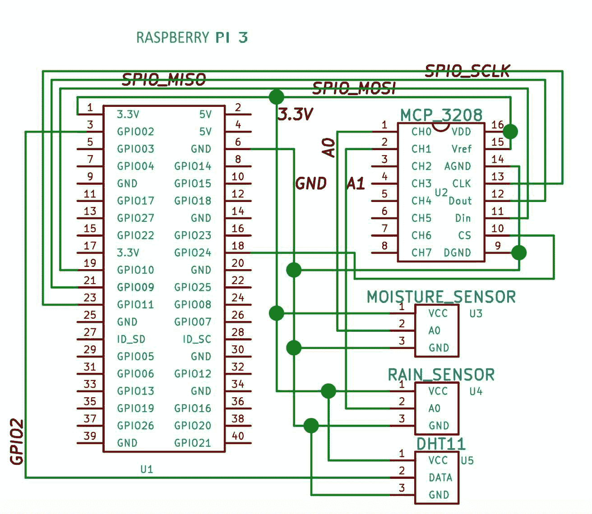
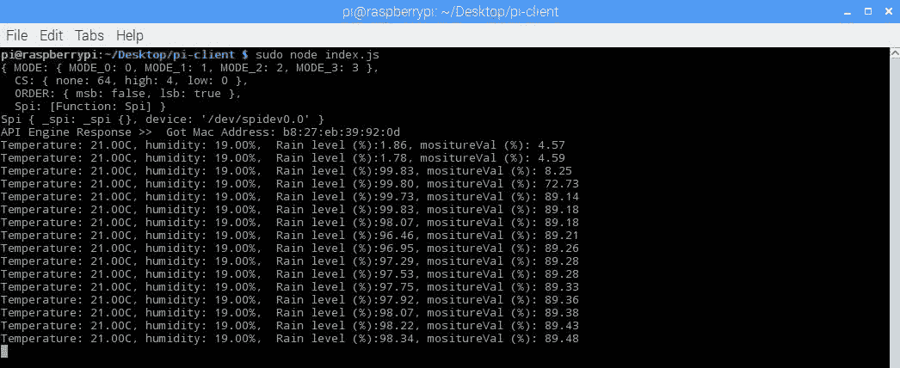
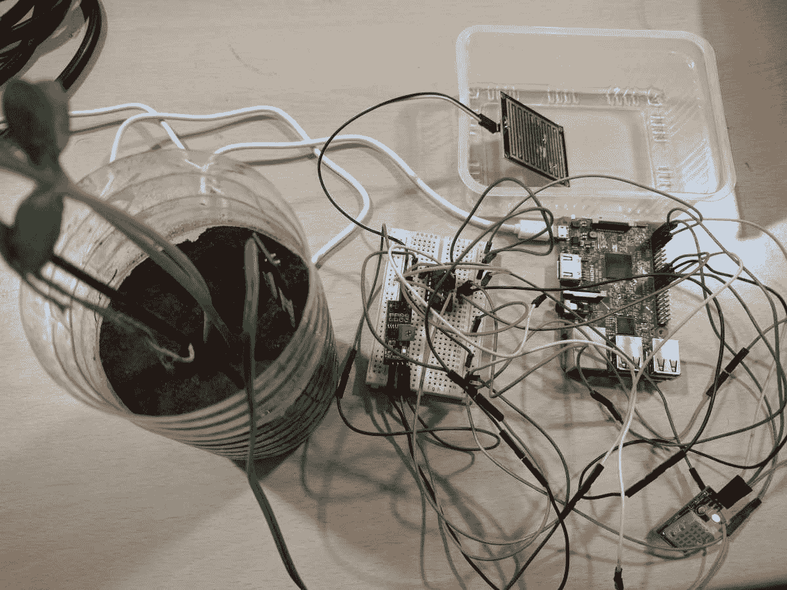
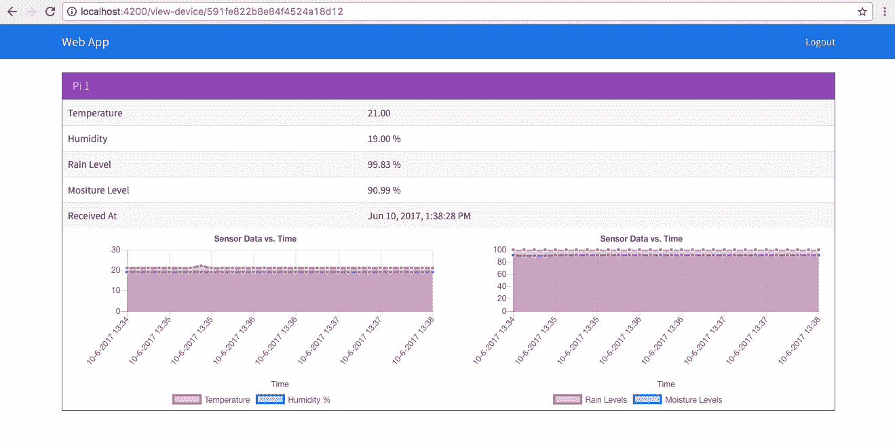

# 智慧农业

在本章中，我们将采用我们在[第 2 章](2.html#UGI00-ce91715363d04669bca1c1545beb57ee)、 *IoTFW.js - I* 和[第 3 章](3.html#24L8G0-ce91715363d04669bca1c1545beb57ee)、 *IoTFW.js - II、*中构建的框架，并开始处理各种用例。在本章中，我们将从农业部门开始，构建一个智能气象站。

对任何农民来说，一个简单的要求就是要有能力了解农场附近和周围的环境因素。所以，我们要建立一个便携式气象站的原型。我们将在本章中讨论以下主题:

*   农业和物联网
*   设计智能气象站
*   开发覆盆子 Pi 3 的代码
*   在应用编程接口引擎中更新 MQTT 代码
*   修改网络应用程序、桌面应用程序和移动应用程序的模板

# 农业和物联网

比彻姆研究公司(Beecham Research)的一份报告预测，到 2025 年，世界人口将达到 80 亿，到 2050 年将达到 96 亿，为了跟上这一速度，到 2050 年，粮食产量必须增加 70%。这是报告

这意味着我们需要找到更快、更高效的耕作方式。随着我们不断向 2050 年迈进，土地和资源将变得越来越稀缺。这是什么时候，给定的资源，我们将需要养活比以往任何时候都多的嘴，除非僵尸启示录来了，我们所有人都被其他僵尸吃掉！

这是技术提供解决方案来实现这一目标的一个非常好的机会。物联网几乎总是关于智能家居、智能办公室和便利性，但它可以做得更多。这就是我们在这一章要讲的内容。我们将建立一个智能气象站，农民可以在他们的农场部署，以获得实时指标，如温度、湿度、土壤湿度和雨水检测。

根据可用性和需要，可以添加其他传感器。

# 设计智能气象站

既然我们已经知道了我们在建造什么以及为什么建造，让我们开始设计吧。我们要做的第一件事是确定所需的传感器。在这个智能气象站中，我们将使用以下内容:

*   温度传感器
*   湿度传感器
*   土壤湿度传感器
*   雨水探测器传感器

我挑选了现成的传感器来展示概念验证。它们中的大多数将很好地用于测试、验证一个想法，或者作为一种爱好，但是不适合生产。

我们将把这些传感器连接到我们的树莓 Pi 3 上。我们将使用以下型号的传感器:

*   温湿度:[https://www . Amazon . com/Gowoops-温湿度-数字-树莓/dp/B01H3J3H82/ref=sr_1_5](https://www.amazon.com/Gowoops-Temperature-Humidity-Digital-Raspberry/dp/B01H3J3H82/ref=sr_1_5)
*   土壤湿度传感器:[https://www . Amazon . com/湿度计-湿度-检测-湿度-Arduino/DP/b01 fdguhbm/ref = Sr _ 1 _ 4](https://www.amazon.com/Hygrometer-Humidity-Detection-Moisture-Arduino/dp/B01FDGUHBM/ref=sr_1_4)
*   雨水探测器传感器:[https://www . Amazon . com/Uxcell-a 13082300 UX 1431-雨水-探测-3-3V-5V/dp/B00GN7O7JE](https://www.amazon.com/Uxcell-a13082300ux1431-Rainwater-Detection-3-3V-5V/dp/B00GN7O7JE)

你也可以在其他地方买到这些传感器。

正如我们在[第三章](https://cdp.packtpub.com/b07286advancediotwithjavascripteas/wp-admin/post.php?post=266&action=edit#post_235)、 *IoTFW.js - II* 中看到的，温湿度传感器是一个数字传感器，我们要用`node-dht-sensor`模块读取温湿度值。土壤湿度传感器是模拟传感器，树莓 Pi 3 没有任何模拟引脚。为此，我们将使用名为 MCP3208 的微芯片的 12 位模数集成电路来转换传感器的模拟输出，并通过 SPI 协议将其馈送给树莓 Pi。

维基百科对 SPI 协议的定义如下:

The **Serial Peripheral Interface** (**SPI**) bus is a synchronous serial communication interface specification used for short distance communication, primarily in embedded systems. The interface was developed by Motorola in the late 1980s and has become a de facto standard. For more information on SPI, refer to: [https://en.wikipedia.org/wiki/Serial_Peripheral_Interface_Bus](https://en.wikipedia.org/wiki/Serial_Peripheral_Interface_Bus).

雨量探测器传感器可以读取为模拟和数字。我们将使用模拟输出来检测降雨量，而不仅仅是是否下雨。

回到 MCP3208，它是一个 16 引脚封装，可以一次读取 8 个模拟输入，并可以转换它们，通过 SPI 协议馈入树莓 Pi。您可以在这里阅读更多关于 MCP3208 IC 的信息: [`http://ww1.microchip.com/downloads/en/DeviceDoc/21298c.pdf`](http://ww1.microchip.com/downloads/en/DeviceDoc/21298c.pdf) 。可以从这里购买:[https://www . Amazon . com/Adafruit-MCP 3008-8-Channel-Interface-树莓/dp/B00NAY3RB2/ref=sr_1_1](https://www.amazon.com/Adafruit-MCP3008-8-Channel-Interface-Raspberry/dp/B00NAY3RB2/ref=sr_1_1) 。

我们将温湿度传感器直接连接到树莓 Pi 3，湿度传感器和雨量传感器连接到 MCP3208，MCP3208 将通过 SPI 连接到树莓 Pi 3。

关于经纪人，我们不会改变任何事情。在 API 引擎中，我们将向名为`weather-status`的 MQTT 客户端添加一个新的主题，然后将树莓 Pi 3 的数据发送到这个主题。

在 web 应用程序上，我们将更新用于查看天气指标的模板。桌面应用和移动应用也是如此。

# 设置树莓 Pi 3

让我们从示意图开始。

设置树莓 Pi 3 和传感器，如下所示:



下表显示了这些连接:

# 树莓皮和 MCP3208

请参考下表:

| **树莓皮针号-针名** | **MCP3208 引脚编号-引脚名称** |
| 1 - 3.3V | 16 - VDD |
| 1 - 3.3V | 15 - AREF |
| 6 - GND | 2014 年夏季奥林匹克运动会 |
| 23 - GPIO11，SPI0_SCLK | 13 - CLK |
| S7-1200 可编程控制器 | 12 位 DOUT |
| 19 -GPIO10，SPI0_MOSI | 11 - DIN |
| 24 - GPIO08，首席执行官 | 10 - CS |
| 6 - GND | 9 - DGND |

# 湿度传感器和 MCP3208

请参考下表:

| **MCP3208 引脚编号-引脚名称** | **传感器名称** - **针号** |
| 1 - A0 | 雨量传感器- A0 |
| 2 - A1 | 湿度传感器- A0 |

# 树莓皮和 DHT11

请参考下表:

| **树莓皮号-销名** | **传感器名称** - **针号** |
| 3 - GPIO2 | DHT11 -数据 |

所有接地和所有 3.3V 都连接到一个公共点。

如前所示，一旦我们连接了传感器，我们将编写与传感器接口所需的代码。

在我们继续之前，我们将把整个[第 2 章](2.html#UGI00-ce91715363d04669bca1c1545beb57ee)、 *IoTFW.js - I* 和[第 3 章](3.html#24L8G0-ce91715363d04669bca1c1545beb57ee)、 *IoTFW.js - II* 代码复制到另一个名为`chapter4`的文件夹中。

`chapter4`文件夹应该如下图所示:

```js
.

├── api-engine

│ ├── package.json

│ └── server

├── broker

│ ├── certs

│ └── index.js

├── desktop-app

│ ├── app

│ ├── freeport.js

│ ├── index.css

│ ├── index.html

│ ├── index.js

│ ├── license

│ ├── package.json

│ ├── readme.md

│ └── server.js

├── mobile-app

│ ├── config.xml

│ ├── hooks

│ ├── ionic.config.json

│ ├── package.json

│ ├── platforms

│ ├── plugins

│ ├── resources

│ ├── src

│ ├── tsconfig.json

│ ├── tslint.json

│ └── www

└── web-app

├── README.md

├── e2e

├── karma.conf.js

├── package.json

├── protractor.conf.js

├── src

├── tsconfig.json

└── tslint.json
```

我们将返回树莓皮和`pi-client`文件夹内，我们将更新`index.js`文件。更新`pi-client/index.js`，如下图:

```js
var config = require('./config.js');

var mqtt = require('mqtt');

var GetMac = require('getmac');

var async = require('async');

var rpiDhtSensor = require('rpi-dht-sensor');

var McpAdc = require('mcp-adc');

var adc = new McpAdc.Mcp3208();

var dht11 = new rpiDhtSensor.DHT11(2);

var temp = 0,

prevTemp = 0;

var humd = 0,

prevHumd = 0;

var macAddress;

var state = 0;

var moistureVal = 0,

prevMoistureVal = 0;

var rainVal = 0,

prevRainVal = 0;

var client = mqtt.connect({

port: config.mqtt.port,

protocol: 'mqtts',

host: config.mqtt.host,

clientId: config.mqtt.clientId,

reconnectPeriod: 1000,

username: config.mqtt.clientId,

password: config.mqtt.clientId,

keepalive: 300,

rejectUnauthorized: false

});

client.on('connect', function() {

client.subscribe('rpi');

GetMac.getMac(function(err, mac) {

if (err) throw err;

macAddress = mac;

client.publish('api-engine', mac);

});

});

client.on('message', function(topic, message) {

message = message.toString();

if (topic === 'rpi') {

console.log('API Engine Response >> ', message);

} else {

console.log('Unknown topic', topic);

}

});

// infinite loop, with 3 seconds delay

setInterval(function() {

readSensorValues(function(results) {

console.log('Temperature: ' + temp + 'C, ' + 'humidity: ' + humd + '%, ' + ' Rain level (%):' + rainVal + ', ' + 'moistureVal (%): ' + moistureVal);

// if the temperature and humidity values change

// then only publish the values

if (temp !== prevTemp || humd !== prevHumd || moistureVal !== prevMoistureVal || rainVal != prevRainVal) {

var data2Send = {

data: {

t: temp,

h: humd,

r: rainVal,

m: moistureVal

},

macAddress: macAddress

};

// console.log('Data Published');

client.publish('weather-status', JSON.stringify(data2Send));

// reset prev values to current

// for next loop

prevTemp = temp;

prevHumd = humd;

prevMoistureVal = moistureVal;

prevRainVal = rainVal;

}

});

}, 3000); // every three second

// `CB` expects {

// dht11Values: val,

// rainLevel: val,

// moistureLevel: val

// }

function readSensorValues(CB) {

async.parallel({

dht11Values: function(callback) {

var readout = dht11.read();

// update global variable

temp = readout.temperature.toFixed(2);

humd = readout.humidity.toFixed(2);

callback(null, { temp: temp, humidity: humd });

},

rainLevel: function(callback) {

// we are going to connect rain sensor

// on channel 0, hence 0 is the first arg below

adc.readRawValue(0, function(value) {

// update global variable

rainVal = value;

rainVal = (100 - parseFloat((rainVal / 4096) * 100)).toFixed(2);

callback(null, { rain: rainVal });

});

},

moistureLevel: function(callback) {

// we are going to connect moisture sensor

// on channel 1, hence 1 is the first arg below

adc.readRawValue(1, function(value) {

// update global variable

moistureVal = value;

moistureVal = (100 - parseFloat((moistureVal / 4096) * 100)).toFixed(2);

callback(null, { moisture: moistureVal });

});

}

}, function done(err, results) {

if (err) {

throw err;

}

// console.log(results);

if (CB) CB(results);

});

}
```

在前面的代码中，我们保持了 MQTT 设置不变。我们增加了`mcp-adc`([https://github.com/anha1/mcp-adc](https://github.com/anha1/mcp-adc))和`async`([https://github.com/caolan/async](https://github.com/caolan/async))模块。`mcp-adc`管理 MCP3208 暴露的 SPI 协议接口，我们正在使用`async`模块并行读取所有传感器的数据。

我们从通过 MQTTS 与代理建立连接开始。然后，我们使用`setInterval()`建立了一个无限循环，两次执行之间有 3 秒的时间延迟。在`setInterval()`的`callback`中，我们调用了`readSensorValues()`来获取最新的传感器值。

`readSensorValues()`使用`async.parallel()`并行读取三个传感器，更新我们定义的全局变量中的数据。一旦收集了所有的传感器数据，我们就将结果传递给`callback`函数作为参数。

一旦我们收到传感器数据，我们将检查温度、湿度、雨水和湿度值之间是否有变化。如果什么都没变，我们就会变得冷漠；否则，我们将把这个数据发布给天气状态主题的代理。

保存所有文件。现在，我们将从桌面计算机启动 Mosca 代理:

```js
mosca -c index.js -v | pino
```

Once you have started the Mosca server, check the IP address of the server on which Mosca is running. Update the same IP in your Raspberry Pi `config.js` file. Otherwise, Raspberry Pi cannot post data to the broker.

一旦 Mosca 成功启动，并且我们已经验证了该 IP，请在树莓 Pi 上运行该程序:

```js
sudo node index.js
```

这将启动服务器，我们将看到以下内容:



当我启动树莓 Pi 时，雨水传感器是干的，湿度传感器被放置在干土壤中。最初，雨量传感器的值为`1.86%`，湿度传感器的值为`4.57%`。

当我给植物/水分传感器加水时，百分比增加到`98.83%`；同样，当我在雨量传感器上模拟降雨时，数值上升到`89.48%`。

这是我的智能气象站原型设置:





The blue chip is DHT11, the moisture sensor is plotted inside my desk-side plant, and the rain sensor is placed inside a plastic tray for collecting rainwater. The breadboard has the MCP3208 IC and the required connections.

很多电线！

至此，我们完成了树莓 Pi 3 所需的代码。在下一节中，我们将设置 API 引擎所需的代码。

# 设置应用编程接口引擎

在最后一节中，我们已经看到了如何使用树莓 Pi 3 设置智能气象站所需的组件和代码。现在，我们将致力于管理我们在 API 引擎上从树莓 Pi 3 接收的数据。

打开`api-engine/server/mqtt/index.js`并更新，如下图:

```js
var Data = require('../api/data/data.model'); 
var mqtt = require('mqtt'); 
var config = require('../config/environment'); 

var client = mqtt.connect({ 
port: config.mqtt.port, 
protocol: 'mqtts', 
host: config.mqtt.host, 
clientId: config.mqtt.clientId, 
reconnectPeriod: 1000, 
username: config.mqtt.clientId, 
password: config.mqtt.clientId, 
keepalive: 300, 
rejectUnauthorized: false 
}); 

client.on('connect', function() { 
console.log('Connected to Mosca at ' + config.mqtt.host + ' on port ' + config.mqtt.port); 
client.subscribe('api-engine'); 
client.subscribe('weather-status'); 
}); 

client.on('message', function(topic, message) { 
    // message is Buffer 
    // console.log('Topic >> ', topic); 
    // console.log('Message >> ', message.toString()); 
if (topic === 'api-engine') { 
varmacAddress = message.toString(); 
console.log('Mac Address >> ', macAddress); 
client.publish('rpi', 'Got Mac Address: ' + macAddress); 
    } else if (topic === 'weather-status') { 
var data = JSON.parse(message.toString()); 
        // create a new data record for the device 
Data.create(data, function(err, data) { 
if (err) return console.error(err); 
            // if the record has been saved successfully,  
            // websockets will trigger a message to the web-app 
console.log('Data Saved :', data.data); 
        }); 
    } else { 
console.log('Unknown topic', topic); 
    } 
}); 
```

在这里，我们正在等待`weather-status`主题的消息，当我们从树莓 Pi 接收到数据时，我们将其保存到我们的数据库中，然后将数据推送到网络应用程序、移动应用程序和桌面应用程序中。

这些都是我们需要做的改变，以吸收树莓 Pi 3 的数据，并将其传递给网络、桌面和移动应用程序。

保存所有文件并运行以下代码:

```js
npm start  
```

这将启动 API 引擎并连接到 Mosca，以及树莓 PI:


如果让 API 引擎运行一段时间，我们应该会看到以下内容:


来自设备的数据记录在这里。

在下一节中，我们将更新 web 应用程序，以便它能够表示来自 API 引擎的数据。

# 设置网络应用程序

现在我们已经完成了应用编程接口引擎，我们将开发显示树莓 Pi 3 天气输出所需的界面。

打开`web-app/src/app/device/device.component.html`并更新，如下图:

```js
<div class="container">
    <br>
    <div *ngIf="!device">
        <h3 class="text-center">Loading!</h3>
    </div>
    <div class="row" *ngIf="lastRecord">
        <div class="col-md-12">
            <div class="panel panel-info">
                <div class="panel-heading">
                    <h3 class="panel-title">
                        {{device.name}}
                    </h3>
                    <span class="pull-right btn-click">
                        <i class="fa fa-chevron-circle-up"></i>
                    </span>
                </div>
                <div class="clearfix"></div>
                <div class="table-responsive">
                    <table class="table table-striped">
                        <tr *ngIf="lastRecord">
                            <td>Temperature</td>
                            <td>{{lastRecord.data.t}}</td>
                        </tr>
                        <tr *ngIf="lastRecord">
                            <td>Humidity</td>
                            <td>{{lastRecord.data.h}} %</td>
                        </tr>
                        <tr *ngIf="lastRecord">
                            <td>Rain Level</td>
                            <td>{{lastRecord.data.r}} %</td>
                        </tr>
                        <tr *ngIf="lastRecord">
                            <td>Mositure Level</td>
                            <td>{{lastRecord.data.m}} %</td>
                        </tr>
                        <tr *ngIf="lastRecord">
                            <td>Received At</td>
                            <td>{{lastRecord.createdAt | date: 'medium'}}</td>
                        </tr>
                    </table>
                    <div class="col-md-6" *ngIf="tempHumdData.length > 0">
                        <canvas baseChart [datasets]="tempHumdData" [labels]="lineChartLabels" [options]="lineChartOptions" [legend]="lineChartLegend" [chartType]="lineChartType"></canvas>
                    </div>

                    <div class="col-md-6" *ngIf="rainMoisData.length > 0">
                        <canvas baseChart [datasets]="rainMoisData" [labels]="lineChartLabels" [options]="lineChartOptions" [legend]="lineChartLegend" [chartType]="lineChartType"></canvas>
                    </div>
                </div>
            </div>
        </div>
    </div>
</div>
```

在前面的代码中，我们在显示温度、湿度、降雨量和湿度的表格中添加了四行。我们还设置了画布来显示图表中的值。

接下来是`DeviceComponent`的类定义，出现在`web-app/src/app/device/device.component.ts`中。更新`web-app/src/app/device/device.component.ts`，如下图:

```js
import { Component, OnInit, OnDestroy } from '@angular/core'; 
import { DevicesService } from '../services/devices.service'; 
import { Params, ActivatedRoute } from '@angular/router'; 
import { SocketService } from '../services/socket.service'; 
import { DataService } from '../services/data.service'; 
import { NotificationsService } from 'angular2-notifications'; 

@Component({ 
   selector: 'app-device', 
   templateUrl: './device.component.html', 
   styleUrls: ['./device.component.css'] 
}) 
export class DeviceComponent implements OnInit, OnDestroy { 
   device: any; 
   data: Array<any>; 
   toggleState: boolean = false; 
   privatesubDevice: any; 
   privatesubData: any; 
   lastRecord: any; 

   // line chart config 
   publiclineChartOptions: any = { 
         responsive: true, 
         legend: { 
               position: 'bottom', 
         }, hover: { 
               mode: 'label' 
         }, scales: { 
               xAxes: [{ 
                     display: true, 
                     scaleLabel: { 
                           display: true, 
                           labelString: 'Time' 
                     } 
               }], 
               yAxes: [{ 
                     display: true, 
                     ticks: { 
                           beginAtZero: true, 
                           // steps: 10, 
                           // stepValue: 5, 
                           // max: 70 
                     } 
               }] 
         }, 
         title: { 
               display: true, 
               text: 'Sensor Data vs. Time' 
         } 
   }; 
   publiclineChartLegend: boolean = true; 
   publiclineChartType: string = 'line'; 
   publictempHumdData: Array<any> = []; 
   publicrainMoisData: Array<any> = []; 
   publiclineChartLabels: Array<any> = []; 

   constructor(private deviceService: DevicesService, 
         privatesocketService: SocketService, 
         privatedataService: DataService, 
         private route: ActivatedRoute, 
         privatenotificationsService: NotificationsService) { } 

   ngOnInit() { 
         this.subDevice = this.route.params.subscribe((params) => { 
               this.deviceService.getOne(params['id']).subscribe((response) => { 
                     this.device = response.json(); 
                     this.getData(); 
                     this.socketInit(); 
               }); 
         }); 
   } 

   getData() { 
         this.dataService.get(this.device.macAddress).subscribe((response) => { 
               this.data = response.json(); 
               this.lastRecord = this.data[0]; // descending order data 
               this.genChart(); 
         }); 
   } 

   socketInit() { 
         this.subData = this.socketService.getData(this.device.macAddress).subscribe((data) => { 
               if (this.data.length<= 0) return; 
               this.data.splice(this.data.length - 1, 1); // remove the last record 
               this.data.push(data); // add the new one 
               this.lastRecord = data; 
               this.genChart(); 
         }); 
   } 

   ngOnDestroy() { 
         this.subDevice.unsubscribe(); 
         this.subData ? this.subData.unsubscribe() : ''; 
   } 

   genChart() { 
         let data = this.data; 
         let _thArr: Array<any> = []; 
         let _rmArr: Array<any> = []; 
         let _lblArr: Array<any> = []; 

         lettmpArr: Array<any> = []; 
         lethumArr: Array<any> = []; 
         letraiArr: Array<any> = []; 
         letmoiArr: Array<any> = []; 

         for (vari = 0; i<data.length; i++) { 
               let _d = data[i]; 
               tmpArr.push(_d.data.t); 
               humArr.push(_d.data.h); 
               raiArr.push(_d.data.r); 
               moiArr.push(_d.data.m); 
               _lblArr.push(this.formatDate(_d.createdAt)); 
         } 

         // reverse data to show the latest on the right side 
         tmpArr.reverse(); 
         humArr.reverse(); 
         raiArr.reverse(); 
         moiArr.reverse(); 
         _lblArr.reverse(); 

         _thArr = [ 
               { 
                     data: tmpArr, 
                     label: 'Temperature' 
               }, 
               { 
                     data: humArr, 
                     label: 'Humidity %' 
               } 
         ] 

         _rmArr = [ 
               { 
                     data: raiArr, 
                     label: 'Rain Levels' 
               }, 
               { 
                     data: moiArr, 
                     label: 'Moisture Levels' 
               } 
         ] 

         this.tempHumdData = _thArr; 
         this.rainMoisData = _rmArr; 

         this.lineChartLabels = _lblArr; 
   } 

   privateformatDate(originalTime) { 
         var d = new Date(originalTime); 
         vardatestring = d.getDate() + "-" + (d.getMonth() + 1) + "-" + d.getFullYear() + " " + 
               d.getHours() + ":" + d.getMinutes(); 
         returndatestring; 
   } 

} 
```

在前面的代码中，我们使用了`ngOnInit`钩子并请求获取设备数据。使用`socketInit()`，连同数据，我们将为当前设备注册套接字数据事件。

在`getData()`中，我们从服务器获取数据，提取最新的记录，并将其设置为`lastRecord`属性。最后，我们调用`genChart()`来绘制图表。

现在，我们已经完成了所需的更改。保存所有文件并运行以下命令:

```js
ng server
```

如果我们导航到`http://localhost:4200`，登录，点击查看**设备**，我们应该会看到以下内容:



每当数据发生变化时，我们应该会看到 UI 自动更新。

在下一节中，我们将构建相同的应用程序，并在电子外壳中显示它。

# 设置桌面应用程序

在最后一部分，我们开发了 web 应用程序的模板和界面。在本节中，我们将构建相同的东西，并将其转储到桌面应用程序中。

要开始，返回`web-app`文件夹的终端/提示符，运行以下命令:

```js
ng build --env=prod
```

这将在名为`dist`的`web-app`文件夹内创建一个新文件夹。`dist`文件夹的内容应包括:

```js
.

├── favicon.ico

├── index.html

├── inline.bundle.js

├── inline.bundle.js.map

├── main.bundle.js

├── main.bundle.js.map

├── polyfills.bundle.js

├── polyfills.bundle.js.map

├── scripts.bundle.js

├── scripts.bundle.js.map

├── styles.bundle.js

├── styles.bundle.js.map

├── vendor.bundle.js

└── vendor.bundle.js.map
```

我们编写的所有代码最终都被打包到前面的文件中。我们将抓取`dist`文件夹中的所有文件(不是`dist`文件夹)，然后将其粘贴到`desktop-app/app`文件夹中。经过上述更改后，桌面应用的最终结构如下:

```js
.

├── app

│ ├── favicon.ico

│ ├── index.html

│ ├── inline.bundle.js

│ ├── inline.bundle.js.map

│ ├── main.bundle.js

│ ├── main.bundle.js.map

│ ├── polyfills.bundle.js

│ ├── polyfills.bundle.js.map

│ ├── scripts.bundle.js

│ ├── scripts.bundle.js.map

│ ├── styles.bundle.js

│ ├── styles.bundle.js.map

│ ├── vendor.bundle.js

│ └── vendor.bundle.js.map

├── freeport.js

├── index.css

├── index.html

├── index.js

├── license

├── package.json

├── readme.md

└── server.js
```

要测试驱动流程，请运行以下命令:

```js
npm start
```

导航至查看**设备**页面，我们将看到以下内容:


每当数据发生变化时，我们应该会看到 UI 自动更新。

至此，我们完成了桌面应用的开发。在下一部分，我们将更新手机应用。

# 设置移动应用程序

在最后一节中，我们看到了如何为智能气象站构建和运行桌面应用程序。在这一部分，我们将更新移动应用的模板，以显示气象站数据。

打开`mobile-app/src/pages/view-device/view-device.html`并更新，如下图:

```js
<ion-header>
    <ion-navbar>
        <ion-title>Mobile App</ion-title>
    </ion-navbar>
</ion-header>
<ion-content padding>
    <div *ngIf="!lastRecord">
        <h3 class="text-center">Loading!</h3>
    </div>
    <div *ngIf="lastRecord">
        <ion-list>
            <ion-item>
                <ion-label>Name</ion-label>
                <ion-label>{{device.name}}</ion-label>
            </ion-item>
            <ion-item>
                <ion-label>Temperature</ion-label>
                <ion-label>{{lastRecord.data.t}}</ion-label>
            </ion-item>
            <ion-item>
                <ion-label>Humidity</ion-label>
                <ion-label>{{lastRecord.data.h}} %</ion-label>
            </ion-item>
            <ion-item>
                <ion-label>Rain Level</ion-label>
                <ion-label>{{lastRecord.data.r}} %</ion-label>
            </ion-item>
            <ion-item>
                <ion-label>Moisture Level</ion-label>
                <ion-label>{{lastRecord.data.m}} %</ion-label>
            </ion-item>
            <ion-item>
                <ion-label>Received At</ion-label>
                <ion-label>{{lastRecord.createdAt | date: 'medium'}}</ion-label>
            </ion-item>
        </ion-list>
    </div>
</ion-content>
```

在前面的代码中，我们在列表视图中创建了四个项目来显示温度、湿度、降雨量和湿度。`ViewDevicePage`类所需的逻辑将出现在`mobile-app/src/pages/view-device/view-device.ts`中。更新`mobile-app/src/pages/view-device/view-device.ts`，如下图:

```js
import { Component } from '@angular/core'; 
import { IonicPage, NavController, NavParams } from 'ionic-angular'; 

import { DevicesService } from '../../services/device.service'; 
import { DataService } from '../../services/data.service'; 
import { ToastService } from '../../services/toast.service'; 
import { SocketService } from '../../services/socket.service'; 

@IonicPage() 
@Component({ 
   selector: 'page-view-device', 
   templateUrl: 'view-device.html', 
}) 
export class ViewDevicePage { 
   device: any; 
   data: Array<any>; 
   toggleState: boolean = false; 
   privatesubData: any; 
   lastRecord: any; 

   constructor(private navCtrl: NavController, 
         privatenavParams: NavParams, 
         privatesocketService: SocketService, 
         privatedeviceService: DevicesService, 
         privatedataService: DataService, 
         privatetoastService: ToastService) { 
         this.device = navParams.get("device"); 
         console.log(this.device); 
   } 

   ionViewDidLoad() { 
         this.deviceService.getOne(this.device._id).subscribe((response) => { 
               this.device = response.json(); 
               this.getData(); 
               this.socketInit(); 
         }); 
   } 

   getData() { 
         this.dataService.get(this.device.macAddress).subscribe((response) => { 
               this.data = response.json(); 
               this.lastRecord = this.data[0]; // descending order data 
         }); 
   } 

   socketInit() { 
         this.subData = this.socketService.getData(this.device.macAddress).subscribe((data) => { 
               if(this.data.length<= 0) return; 
               this.data.splice(this.data.length - 1, 1); // remove the last record 
               this.data.push(data); // add the new one 
               this.lastRecord = data; 
         }); 
   } 

   ionViewDidUnload() { 
         this.subData&&this.subData.unsubscribe&&this.subData.unsubscribe(); //unsubscribe if subData is defined 
   } 
} 
```

在前面的代码中，我们使用`getData()`从 API 引擎获取最新数据。然后，使用`socketInit()`，我们正在订阅数据的最新更改。

Check the IP address of the server on which the API engine is running. Update the same IP in your mobile app's `mobile-app/src/app/app.globals.ts` file. Otherwise, the mobile app cannot communicate with the API engine.

现在，保存所有文件并运行以下命令:

```js
ionic serve
```

或者，您也可以通过运行以下命令将相同内容部署到您的设备上:

```js
ionic run android 
```

或者

```js
 ionic run ios
```

一旦应用程序启动，当我们导航到查看**设备**页面时，我们应该会在屏幕上看到以下内容:


从图像中我们可以看到，我们能够实时查看数据更新。

# 摘要

在这一章中，我们利用在第二章和第三章中获得的知识，构建了一个智能气象站的原型。我们从识别建造气象站所需的传感器开始。接下来，我们将它们设置在树莓 Pi 3 上。我们编写了与传感器接口所需的代码。完成后，我们更新了应用编程接口引擎，从树莓 Pi 3 中读取关于新主题的数据。一旦应用编程接口引擎接收到数据，我们就将其保存在数据库中，然后通过网络套接字将其发送到网络、桌面和移动应用程序。最后，我们更新了网络、桌面和移动应用程序上的演示模板；然后，我们在网络、桌面和移动应用程序上显示了树莓皮的数据。

在[第 5 章](5.html#2QJ5E0-ce91715363d04669bca1c1545beb57ee)*智慧农业和语音 AI* 中，我们将与语音人工智能合作，使用亚马逊的 Alexa 和我们构建的智能气象站。