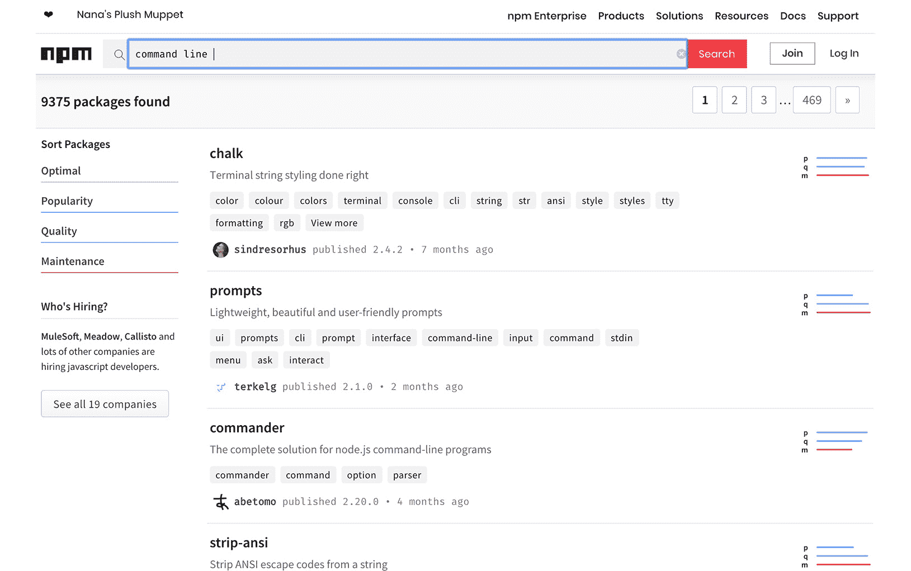

# 二、Node.js 和 NPM

## 学习目标

在本章结束时，你将能够:

*   安装并使用 Node.js 构建应用
*   使用 Node.js 执行环境运行 JavaScript 代码
*   使用 nvm 安装和管理多个 Node.js 版本
*   识别和使用其他开发人员使用 npm 开发的模块
*   创建并配置你自己的 npm 包

在本章中，我们将通过学习 Node.js 及其相关的基本概念来切换到后端世界。 我们将学习如何使用 nvm 安装和管理多个版本的 Node.js，然后我们将学习 npm 以及如何找到和使用外部模块。

## 简介

在前一章中，我们学习了 HTML 如何变成 DOM，以及如何使用 JavaScript 查询和操作页面的内容。

在 JavaScript 出现之前，所有的页面都是静态的。 在 Netscape 将脚本环境引入其浏览器后，开发人员开始使用它来创建动态和响应式应用。 应用开始变得越来越复杂，但 JavaScript 只能在浏览器中运行。 然后，在 2009 年，Node.js 的最初开发人员 Ryan Dahl 决定创建一种在服务器端运行 JavaScript 的方法，通过允许 web 开发人员无需依赖其他语言来构建应用，从而简化了他们的生活。

在本章中，你将学习 Node.js 如何工作，以及如何使用它来使用 JavaScript 创建脚本。 您将了解 Node.js 核心 api 的基础知识，在哪里找到它们的文档，以及如何使用它们的**read-eval-print loop**(**REPL**)命令行。

有了构建 JavaScript 代码的技能，您将学习如何管理多个版本的 Node.js，并了解 Node.js 的重要性。 您还将学习什么是 npm，以及如何从其他开发人员导入和使用包，并构建 Node.js 应用。

## 什么是 Node.js?

Node.js 是一个运行在 V8 JavaScript 引擎之上的执行环境。 它的基本前提是异步和事件驱动。 这意味着所有的阻塞操作，比如从文件中读取数据，都可以在后台处理，而应用的其他部分继续执行它们的工作。 当数据加载完成时，将触发一个事件，等待数据的人现在可以执行并执行该工作。

从一开始，Node.js 就被设计为 web 应用的高效后端。 正因为如此，它被各种规模和行业类型的公司广泛采用。 Trello、LinkedIn、PayPal 和 NASA 等公司都在其技术栈的多个部分使用 Node.js。

但是什么是执行环境呢? 执行环境为程序员编写应用提供了基本的功能，比如 api。 以浏览器为例，它有 DOM，有文档和窗口之类的对象，有`setTimeout`和`fetch`之类的函数，还有许多其他你可以在前端世界做的事情。 所有这些都是浏览器执行环境的一部分。 由于该执行环境主要关注于浏览器，因此它提供了与 DOM 交互和与服务器通信的方法，服务器是其中存在的全部内容。

Node.js 专注于为开发人员创建一个环境，以高效的方式构建 web 应用的后端部分。 它提供了用于创建 HTTP(S)服务器、读取/写入文件、操作进程等的 api。

正如我们前面提到的，Node.js 在底层使用 V8 JavaScript 引擎。 这意味着，为了将 JavaScript 文本转换为供计算机处理的可执行代码，它使用了 V8，谷歌构建的开源 JavaScript 引擎，以支持 Chromium 和 Chrome 浏览器。 下面是这个过程的说明:


###### 图 2.1:Node.js 使用 V8 引擎将 JavaScript 源代码转换为在处理器中运行的可执行代码

Node.js 提供的执行环境是单线程的。 这意味着在每个给定时刻只能执行一段 JavaScript 代码。 但是 Node.js 有一个叫做事件循环的东西，它是一种获取等待某些事情的代码的方法，比如从文件中读取数据，并将其放入一个队列，而另一段代码可以执行。

从文件中读取或写入数据以及通过网络发送或接收数据都是由系统内核处理的任务，在大多数现代系统中，系统内核是多线程的。 因此，一些工作最终被分发到多个线程中。 但是对于在 Node.js 执行环境中工作的开发人员来说，这些都是以一种称为异步编程的编程范式的形式隐藏起来的。

异步编程意味着您将要求执行一些任务，当结果可用时，您的代码将被执行。 让我们回到一个文件示例中的读取数据。 在大多数编程语言和范例中，你只需要编写一些伪代码，就像这样:

```js
var file = // open file here
var data = file.read(); // do something with data here
```

对于异步编程模型，这是以一种不同的方式工作的。 打开该文件并告诉 Node.js 您想要读取它。 您还可以给它一个回调函数，当数据可用时将调用该函数。 这是伪代码的样子:

```js
var file = // open file here
file.read((data) => {
  // do something with data here
});
```

在本例中，将加载脚本，并开始执行。 脚本将逐行执行并打开文件。 当它进入读操作时，它开始读取文件并安排稍后执行回调。 在那之后，它到达脚本的结尾。

当 Node.js 到达脚本的末尾时，它开始处理事件循环。 事件循环分为几个阶段。 每个阶段都有一个队列，存储计划在其中运行的代码。 例如，在轮询阶段安排 I/O 操作。 共有六个阶段，按下列顺序执行:

1.  **定时器**:使用`setTimeout`或`setInterval`调度的代码
2.  **Pending****callback**:上一个周期的 I/O 延迟回调
3.  **Idle**，**Prepare**:内服
4.  **Poll**:计划用于 I/O 处理的代码
5.  **检查**:此处执行`setImmediate`回调
6.  :例如，计划关闭套接字的代码

代码将为每个阶段执行，直到发生以下两种情况之一:阶段队列耗尽，或执行了最大数量的回调:


###### 图 2.2:事件循环阶段

为了理解它是如何工作的，让我们看一些代码，并将阶段映射到事件循环，并了解到底发生了什么:

```js
console.log('First');
setTimeout(() => {
  console.log('Last');
}, 100);
console.log('Second');
```

在这段简短的代码中，我们将一些内容打印到控制台(在 Node.js 中，默认会进入 Standard Output)，然后我们设置一个函数在`100`ms 之后被调用，并将一些其他文本打印到控制台。

当 Node.js 启动应用时，它会解析 JavaScript 并执行脚本，直到最后。 当它完成时，它开始事件循环。 这意味着，当直接打印到控制台时，它会立即执行。 被调度的函数被推入计时器队列并等待脚本完成(并等待**100**ms 通过)执行。 当事件循环耗尽要执行的任务时，应用就结束了。 下图说明了这个过程:


###### 图 2.3:Node.js 应用的执行流程

由于这个执行顺序，应用的输出如下:

```js
First
Second
Last
```

这里发生了两件重要的事情。 首先，在脚本执行完成后执行传递给`setTimeout`函数的代码。 第二，在脚本执行到最后时，应用不会立即退出; 相反，它等待事件循环执行完所有任务。

Node.js 有两种执行方法。 最常用的方法是传递文件的路径，JavaScript 代码将从这里加载和执行。 第二种方法在 REPL 中。 如果执行 Node.js 命令时不给它任何参数，它将以 REPL 模式启动，这类似于我们在上一章中看到的 Dev Tools 中的控制台。 让我们在下一个练习中详细探讨这个问题。

### 练习 8:运行第一个 Node.js 命令

在本练习中，您将下载并在计算机上安装 Node.js，创建第一个脚本，并运行它。 然后，我们将使用 Node.js 附带的 REPL 工具并在其中运行一些命令。

#### 请注意

为了能够运行 Node.js 应用，您需要将其安装到您的机器上。 你可以去`nodejs.org`下载 Node.js 包。 建议下载最新的**Long-Term****Support**(**LTS**)版本，为您提供最稳定、最长的安全及 bug 补丁支持时间。 在写这篇文章的时候，那个版本是`10.16.0`。

执行以下步骤来完成这个练习:

1.  下载并安装 Node.js 后，进入命令行查看已安装的版本:

    ```js
    $ node –version
    ```

    ```js
    v10.16.0
    ```

2.  现在，创建一个名为`event_loop.js`的新文本文件，并添加一个扩展版本的代码(事件循环示例)，如前面所示。

    ```js
    console.log('First');
    ```

    ```js
    const start = Date.now();
    ```

    ```js
    setTimeout(() => {
    ```

    ```js
      console.log(`Last, after: ${Date.now() - start}ms`);
    ```

    ```js
    }, 100);
    ```

    ```js
    console.log('Second');
    ```

3.  To run JavaScript using Node.js, call `node` and pass the path to the file you want to execute. To run the file you just created, execute the following code in the command line from the directory where you created the file:

    ```js
    $ node event_loop.js
    ```

    您将看到以下输出:

    ```js
    $ node event_loop.js
    ```

    ```js
    First
    ```

    ```js
    Second
    ```

    ```js
    Last, after: 106ms
    ```

    你最后看到的时间会随着每次运行而变化。 这是因为`setTimeout`只确保代码将在指定的时间之后运行，但它不能保证它将准确地在您要求的时间执行。

4.  Run the `node` command without any argument; you will go into REPL mode:

    ```js
    $ node
    ```

    ```js
    >
    ```

    `>`表示你现在在 Node.js 执行环境中。

5.  In the REPL command line, type in a command and press *Enter* to execute it. Let's try the first one:

    ```js
    > console.log('First');
    ```

    ```js
    First
    ```

    ```js
    Undefined
    ```

    你可以看到它打印了你传递到`console.log`调用的字符串。 它也打印`Undefined`。 这是最后一个执行语句的返回值。 因为`console.log`没有返回任何东西，所以输出为 undefined。

6.  创建存储当前时间的常量:

    ```js
    > const start = Date.now()
    ```

    ```js
    undefined
    ```

7.  Declaring a variable also doesn't return anything, so it prints `undefined` again:

    ```js
    > start
    ```

    ```js
    1564326469948
    ```

    如果你想知道一个变量的值是什么，你可以只输入变量的名称，并按*输入*。 变量名的返回语句是变量的值，所以它打印变量的值。

8.  现在，键入`setTimeout`呼叫，就像它在您的文件。 如果您按*回车*，而您的语句不完整，因为您正在启动一个函数或打开括号，Node.js 将打印一个省略号，表明它正在等待命令的其余部分:
9.  You can continue typing until all of the commands have been typed out. The `setTimeout` function returns a `Timeout` object, and you can see it in the console. You can also see the text that's printed when the callback is executed:

    ```js
    > setTimeout(() => {
    ```

    ```js
    ...   console.log('Last, after: ${Date.now() - start}ms');
    ```

    ```js
    ... }, 100);
    ```

    下面是上述代码的输出:

    ```js
    Timeout {
    ```

    ```js
      _called: false,
    ```

    ```js
      _idleTimeout: 100,
    ```

    ```js
      _idlePrev: [TimersList],
    ```

    ```js
      _idleNext: [TimersList],
    ```

    ```js
      _idleStart: 490704,
    ```

    ```js
      _onTimeout: [Function],
    ```

    ```js
      _timerArgs: undefined,
    ```

    ```js
      _repeat: null,
    ```

    ```js
      _destroyed: false,
    ```

    ```js
      domain: [Domain],
    ```

    ```js
      [Symbol(unrefed)]: false,
    ```

    ```js
      [Symbol(asyncId)]: 492,
    ```

    ```js
      [Symbol(triggerId)]: 5 }
    ```

    ```js
    > Last, after: 13252ms
    ```

    你可以看到，打印的时间比`100`ms 长得多。这是因为`start`变量是在一段时间以前声明的，它是从初始值中减去当前时间。 因此，该时间表示`100`ms，加上输入和执行命令所花费的时间。

10.  Try changing the value of `start`. You will observe that Node.js won't let you do it since we declared it as a constant:

    ```js
    > start = Date.now();
    ```

    ```js
    Thrown:
    ```

    ```js
    TypeError: Assignment to constant variable.
    ```

    我们可以尝试将它重新声明为一个变量，但 Node.js 不允许，因为它已经在当前环境中声明了:

    ```js
    > let start = Date.now()
    ```

    ```js
    Thrown:
    ```

    ```js
    SyntaxError: Identifier 'start' has already been declared
    ```

11.  Declare the whole scheduling of the timeout inside another function to get a new scope every time the function is executed:

    ```js
    > const scheduleTimeout = () => {
    ```

    ```js
    ... const start = Date.now();
    ```

    ```js
    ... setTimeout(() => {
    ```

    ```js
    ..... console.log('Later, after: ${Date.now() - start}');
    ```

    ```js
    ..... }, 100);
    ```

    ```js
    ... };
    ```

    每次你调用函数，它将调度它，并在`100`ms 后执行它，就像在你的脚本。 这将输出以下内容:

    ```js
    Undefined
    ```

    ```js
    > scheduleTimeout
    ```

    ```js
    [Function: scheduleTimeout]
    ```

    ```js
    > scheduleTimeout()
    ```

    ```js
    Undefined
    ```

    ```js
    > Later, after: 104
    ```

12.  退出 REPL 工具:按*键+ C*两次或输入`.exit`再按*Enter*:

    ```js
    >
    ```

    ```js
    (To exit, press ^C again or type .exit)
    ```

    ```js
    >
    ```

安装 Node.js 并开始使用它很容易。 它的 REPL 工具允许您快速原型化和测试事物。 知道如何使用这两种方法可以提高您的工作效率，并在 JavaScript 应用的日常开发中有很大帮助。

在这个练习中，您安装了 Node.js，编写了一个简单的程序，并学习了如何使用 Node.js 运行它。 您还使用了 REPL 工具来探索 Node.js 执行环境并运行一些代码。

## Node Version Manager (nvm)

Node.js 和 JavaScript 有一个庞大的社区和非常快节奏的开发周期。 由于这种快速的开发和发布周期，它很容易过时(查看 Node.js 以前的发布页面获取更多信息:[https://nodejs.org/en/download/releases/](https://nodejs.org/en/download/releases/))。

你能想象在一个只有几年历史的项目中使用 Node.js 吗? 当您回来修复 bug 时，您将注意到您安装的版本由于一些兼容性问题而无法运行代码。 或者，您会发现不能使用当前版本更改代码，因为在生产环境中运行的代码已经有几年的历史了，并且没有 async/await 或其他一些在最新版本中经常使用的救生功能。

这个问题在所有编程语言和开发环境中都会发生，但在 Node.js 中，这个问题非常突出，因为它的发布周期非常快。

为了解决这个问题，通常可以使用版本管理工具，以便在 Node.js 的不同版本之间快速切换。 **Node Version Manager**(**nvm**)是一个被广泛使用的管理 Node.js 版本的工具。 您可以在[https://github.com/nvm-sh/nvm](https://github.com/nvm-sh/nvm)上找到如何下载和安装的说明。

#### 请注意

如果你正在使用 Windows，你可以尝试 nvm- Windows([https://github.com/coreybutler/nvm-windows](https://github.com/coreybutler/nvm-windows))，它为 Linux 和 Mac 中的 nvm 提供了类似的功能。此外，在本章中，许多命令是特定于 Mac 和 Linux 的。 对于 Windows，请参考`nvm-windows`的帮助部分。

安装程序脚本在你的系统中做两件事:

1.  在你的主目录中创建一个`.nvm`目录，在那里它放置了所有的脚本，这些脚本是使用和保存 Node.js 的所有托管版本所必需的
2.  添加一些配置使 nvm 在所有终端会话中可用

NVM 使用起来非常简单，并且有很好的文档。 它背后的想法是，你将有多个版本的 Node.js 运行在你的机器上，你可以快速安装新版本，并在它们之间切换。

在我的电脑中，我最初只有一些时间前下载的 Node.js 版本(10.16.0)。 在安装 nvm 之后，我运行命令来列出所有的版本。 输出如下:

```js
$ nvm ls

->system
iojs -> N/A (default)
node -> stable (-> N/A) (default)
unstable -> N/A (default)
```

您可以看到，我没有其他版本可用。 我还有一个系统版本，就是你在系统中安装的任何版本。 我可以通过运行`node --version`来检查当前的 Node.js 版本:

```js
$ node --version
v10.16.0
```

作为如何使用 nvm 的示例，假设您想在最新版本上测试一些实验性特性。 你需要做的第一件事就是找出那个版本。 因此，你运行`nvm ls-remote`命令(或 Windows 系统的`nvm list`命令)，这是列表远程版本命令:

```js
$ nvm ls-remote
        v0.1.14
        v0.1.15
        v0.1.16
       ...
       v10.15.3   (LTS: Dubnium)
       v10.16.0   (Latest LTS: Dubnium)
       ...
        v12.6.0
        v12.7.0
```

打印出一个长长的列表，上面有所有可用的版本。 在撰写本文时，最后一个版本 12.7.0 是最新的，所以让我们安装它。 如果需要安装任意版本，请运行`nvm install`<`version`>命令。 这将下载指定版本的 Node.js 二进制文件，检查包是否损坏，并在终端中将其设置为当前版本:

```js
$ nvm install 12.7.0
Downloading and installing node v12.7.0...
Downloading https://nodejs.org/dist/v12.7.0/node-v12.7.0-darwin-x64.tar.xz...
######################################################################## 100.0%
Computing checksum with shasum -a 256
Checksums matched!
Now using node v12.7.0 (npm v6.10.0)
```

现在，您可以验证您已经安装了最新版本，并准备在您的终端中使用:

```js
$ node --version
v12.7.0
```

或者，您可以使用别名`node`，这是最新版本的别名。 但是对于 Windows，你需要提到需要安装的特定版本:

```js
$ nvm install node
v12.7.0 is already installed.
Now using node v12.7.0 (npm v6.10.0)
```

对于广泛使用的框架和语言(如 Node.js)来说，为特定版本提供 LTS 是很常见的。 这些 LTS 版本被认为更稳定，并保证对 bug 和安全修复有更长的支持，这对于无法像正常的发布周期那样快速迁移到新版本的公司或团队来说很重要。 如果您想使用最新的 LTS 版本，您可以使用`--lts`选项:

```js
$ nvm install --lts
Installing the latest LTS version.
Downloading and installing node v10.16.0...
Downloading https://nodejs.org/dist/v10.16.0/node-v10.16.0-darwin-x64.tar.xz...
######################################################################## 100.0%
Computing checksum with shasum -a 256
Checksums matched!
Now using node v10.16.0 (npm v6.9.0)
```

在使用 nvm 安装多个版本的 Node.js 后，你可以使用`use`命令在它们之间切换:

```js
$ nvm use system --version
Now using system version of node: v10.16.0 (npm v6.9.0)
$ nvm use node
Now using node v12.7.0 (npm v6.10.0)
$ nvm use 7
Now using node v7.10.1 (npm v4.2.0)
```

当你有多个项目并且频繁地在它们之间切换时，很难记住每个项目使用的 Node.js 版本。 为了简化我们的工作，nvm 支持在项目目录下的一个配置文件。 你可以在项目的根目录中添加一个`.nvmrc`文件，它将使用该文件中的版本。 你也可以在项目的任何父目录中有一个`.nvmrc`文件。 因此，如果您想在父目录中按 Node.js 版本对项目进行分组，您可以在该父目录中添加配置文件。

例如，如果你在一个`12.7.0`版本的文件夹中有一个`.nvmrc`文件，当你切换到该文件夹并运行`nvm use`时，它会自动选择该版本:

```js
$ cat .nvmrc 
12.7.0
$ nvm use
Found '.../Lesson02/Exercise09/.nvmrc' with version <12.7.0>
Now using node v12.7.0 (npm v6.10.0)
```

### 练习 9:使用 nvm 管理版本

正如我们前面提到的，Node.js 的发行周期非常短。 如果您查找 URL 类，例如([https://nodejs.org/dist/latest-v12.x/docs/api/url.html#url_class_url](https://nodejs.org/dist/latest-v12.x/docs/api/url.html#url_class_url))，您将看到它最近才在全局作用域中可用。 这是在 10.0.0 版本中发生的，在编写本文时，该版本只有大约 1 年的历史。

在这个练习中，我们将编写一个`.nvmrc`文件，使用 nvm 安装多个版本的 Node.js，并对不同版本进行试验，看看当你使用错误的 Node.js 版本时，你会得到什么类型的错误。

执行以下步骤来完成这个练习:

1.  添加一个`.nvmrc`文件到您的项目。 在一个空文件夹中，创建一个名为`.nvmrc`的文件，并将数字 12.7.0 添加到其中。 您可以通过使用`echo`命令并将输出重定向到文件中来实现这一点:

    ```js
    $ echo '12.7.0' > .nvmrc
    ```

2.  您可以使用`cat`:

    ```js
    $ cat .nvmrc
    ```

    ```js
    12.7.0
    ```

    检查文件是否包含您想要的内容。
3.  Let's use `nvm use` command, which will try to use the version from inside the `.nvmrc` file:

    ```js
    $ nvm use
    ```

    ```js
    Found '.../Lesson02/Exercise09/.nvmrc' with version <12.7.0>
    ```

    ```js
    N/A: version "12.7.0 -> N/A" is not yet installed.
    ```

    你需要在使用之前运行`nvm install 12.7.0`来安装它。 如果你没有安装指定的版本，nvm 会给你一个明确的信息。

4.  Call `nvm install` to install the version the project needs:

    ```js
    $ nvm install
    ```

    ```js
    Found '.../Lesson02/Exercise09/.nvmrc' with version <12.7.0>
    ```

    ```js
    Downloading and installing node v12.7.0...
    ```

    ```js
    Downloading https://nodejs.org/dist/v12.7.0/node-v12.7.0-darwin-x64.tar.xz...
    ```

    ```js
    #################################################################### 100.0%
    ```

    ```js
    Computing checksum with shasum -a 256
    ```

    ```js
    Checksums matched!
    ```

    ```js
    Now using node v12.7.0 (npm v6.10.0)
    ```

    注意，你不需要传递你想要的版本，因为 nvm 会从`.nvmrc`文件中获取这个。

5.  现在，创建一个名为`url_explorer.js`的文件。 在其中，通过传递一个完整的 URL 来创建 URL 的实例。

    ```js
    const url = new URL('https://www.someserver.com/not/a/path?param1=value1&param2=value2`);
    ```

    ```js
    console.log(`URL is: ${url.href}`);
    ```

    ```js
    console.log(`Hostname: ${url.hostname}`);
    ```

    ```js
    console.log(`Path: ${url.pathname}`);
    ```

    ```js
    console.log(`Query string is: ${url.search}`);
    ```

    ```js
    console.log(`Query parameters:`)
    ```

    ```js
    Array.from(url.searchParams.entries())
    ```

    ```js
      .forEach((entry) => console.log(`\t- ${entry[0]} = ${entry[1]}`));
    ```

6.  运行脚本。 您将看到 URL 被正确地解析，关于它的所有细节都被正确地打印到控制台:
7.  现在，让我们用错误版本的 Node.js 进行实验。 使用`nvm`:

    ```js
    $ nvm install 9.11.2
    ```

    ```js
    Downloading and installing node v9.11.2...
    ```

    ```js
    Downloading https://nodejs.org/dist/v9.11.2/node-v9.11.2-darwin-x64.tar.xz...
    ```

    ```js
    ################################################################## 100.0%
    ```

    ```js
    Computing checksum with shasum -a 256
    ```

    ```js
    Checksums matched!
    ```

    ```js
    Now using node v9.11.2 (npm v5.6.0)
    ```

8.  Now, you can run `url_explorer.js` again and see what happens:

    ```js
    $ node url_explorer.js
    ```

    ```js
    .../Exercise09/url_explorer.js:1 ... { const url = new URL('...);^
    ```

    ```js
    ReferenceError: URL is not defined
    ```

    ```js
        at Object.<anonymous> (.../Exercise09/url_explorer.js:1:75)
    ```

    ```js
        at Module._compile (internal/modules/cjs/loader.js:654:30)
    ```

    ```js
        at Object.Module._extensions..js (internal/modules/cjs/loader.js:665:10)
    ```

    ```js
        at Module.load (internal/modules/cjs/loader.js:566:32)
    ```

    ```js
        at tryModuleLoad (internal/modules/cjs/loader.js:506:12)
    ```

    ```js
        at Function.Module._load (internal/modules/cjs/loader.js:498:3)
    ```

    ```js
        at Function.Module.runMain (internal/modules/cjs/loader.js:695:10)
    ```

    ```js
        at startup (internal/bootstrap/node.js:201:19)
    ```

    ```js
        at bootstrapNodeJSCore (internal/bootstrap/node.js:516:3)
    ```

    您应该会看到一个类似于前面代码中的错误。 它告诉您 URL 没有定义。 这是因为，正如我们前面提到的，URL 类只有在 10.0.0 版本中才具有全局可用性。

9.  ```js
    $ nvm use
    ```

    ```js
    Found '.../Lesson02/Exercise09/.nvmrc' with version <12.7.0>
    ```

    ```js
    Now using node v12.7.0 (npm v6.10.0)
    ```

    ```js
    $ node url_explorer.js 
    ```

    ```js
    URL is: https://www.someserver.com/not/a/path?param1=value1&param2=value2
    ```

    ```js
    Hostname: www.someserver.com
    ```

    ```js
    Path: /not/a/path
    ```

    ```js
    Query parameters:
    ```

    ```js
        - param1 = value1
    ```

    ```js
        - param2 = value2
    ```

第 7 步中的错误消息没有提到 Node.js 版本。 它只是一些关于丢失类的神秘错误。 像这样的错误很难识别，需要花费大量的精力来寻找历史。 这就是为什么把`.nvmrc`放在项目的根目录中是很重要的。 它使得其他开发人员可以很容易地快速识别和使用正确的版本。

在这个练习中，你学习了如何安装和使用多个版本的 Node.js，也学习了如何为一个项目创建一个`.nvmrc`文件。 最后，您查看了使用错误版本时可能看到的错误类型，以及`.nvmrc`文件的重要性。

## 节点包管理器(npm)

当某人谈论**Node Package Manager**或简称 npm 时，他们可以指以下三种事物中的一种或多种:

*   一个命令行应用，用于管理 Node.js 应用的包
*   开发人员和公司发布他们的包供其他人使用的存储库
*   人们管理个人资料和搜索包裹的网站

大多数编程语言至少为开发人员提供了一种共享包的方式:Java 有 Maven, c#有 NuGet, Python 有 PIP，等等。 在最初发布的几个月后，Node.js 开始发布自己的包管理器。

包可以包括开发人员认为对其他人有用的任何类型的代码。 有时，它们还包括在当地开发方面帮助开发者的工具。

由于打包的代码需要共享，因此需要一个存储所有包的存储库。 要发布他们的包，作者需要注册并注册他们自己和他们的包。 这就解释了存储库和网站部分。

第三部分，即命令行工具，是应用的实际包管理器。 它随 Node.js 一起提供，可用于设置新项目、管理依赖项和管理应用的脚本，如构建和测试脚本。

#### 请注意

一个 Node.js 项目或应用也被认为是一个包，因为它包含一个代表包中内容的`package.json`文件。 因此，以下术语可以互换使用:应用、包和项目。

每个 Node.js 包都有一个描述项目及其依赖项的`package.json`文件。 要为您的项目创建一个，可以使用`npm init`命令。 只需在你想要的项目所在文件夹中运行它:

```js
$ cd sample_npm
$ npm init
This utility will walk you through creating a package.json file.
It only covers the most common items and tries to guess sensible defaults.
See 'npm help json' for definitive documentation on these fields and exactly what they do.
Use 'npm install <pkg>' afterwards to install a package and save it as a dependency in the package.json file.
Press ^C at any time to quit.
package name: (sample_npm) 
version: (1.0.0) 
description: Sample project for the Professional JavaScript.
entry point: (index.js) 
test command: 
git repository: https://github.com/TrainingByPackt/Professional-JavaScript/
keywords: 
author: 
license: (ISC) MIT
About to write to .../Lesson02/sample_npm/package.json:
{
  "name": "sample_npm",
  "version": "1.0.0",
  "description": "Sample project for the Professional JavaScript.",
  "main": "index.js",
  "scripts": {
    "test": "echo \"Error: no test specified\" && exit 1"
  },
  "repository": {
    "type": "git",
    "url": "git+https://github.com/TrainingByPackt/Professional-JavaScript.git"
  },
  "author": "",
  "license": "MIT",
  "bugs": {
    "url": "https://github.com/TrainingByPackt/Professional-JavaScript/issues"
  },
  "homepage": "https://github.com/TrainingByPackt/Professional-JavaScript#readme"
}
Is this OK? (yes) yes
```

该命令将问您一些问题，指导您如何创建`package.json`文件。 最后，它将打印生成的文件并要求您确认。 它包含关于项目的所有信息，包括在哪里找到代码、使用什么许可证以及作者是谁。

现在我们有了一个 npm 包，我们可以开始寻找可以使用的外部模块了。 让我们转到[https://npmjs.com](https://npmjs.com)并寻找一个包来帮助我们解析命令行参数。 在搜索框中输入**命令行**，然后按*Enter*，我们就会看到一个可供选择的软件包列表:



###### 图 2.4:搜索一个包来帮助我们构建命令行应用

因为我们正在寻找一个工具来帮助我们解析命令行参数，**commander**听起来像是一个不错的解决方案。 它的简短描述是**node.js 命令行程序的完整解决方案**。 让我们将其安装到应用中，并使用它来理解这个流程是如何工作的。

要将一个包作为依赖项添加到你的包中，你需要 npm 从命令行中按名称安装它:

```js
$ npm install commander
npm notice created a lockfile as package-lock.json. You should commit this file.
+ commander@2.20.0
added 1 package from 1 contributor and audited 1 package in 1.964s
found 0 vulnerabilities
```

你可以看到 npm 找到了这个包并下载了最新的版本，即在本文撰写时的`2.20.0`。 它还提到了一些关于`package-lock.json`文件的东西。 我们稍后会详细讨论这个问题，所以现在不要担心。

npm 最近添加的另一个很酷的特性是漏洞检查。 在`install`命令输出的末尾，您可以看到发现漏洞的说明，或者更好的是没有发现漏洞。 npm 团队在增加其库中所有包的漏洞检查和安全扫描方面做得很好。

#### 请注意

使用来自 npm 的包是如此容易，以至于很多人都在使用恶意代码来抓住那些漫不经心的开发人员。 强烈建议您在使用 npm 安装包时多加注意。 检查拼写、下载计数和漏洞报告，确保要安装的软件包确实是您想要的。 您还需要确保它来自可信的一方。

在运行`npm install`之后，您将注意到一个新的 section 已经添加到您的`package.json`文件中。 它是`dependencies`部分，包含您刚才要求的包:

```js
"dependencies": {
  "commander": "^2.20.0"
}
```

这就是`install`命令输出中`commander`前面的+符号的含义:该包作为依赖项添加到您的项目中。

`dependencies`部分用于自动检测和安装项目需要的所有包。 当你在一个有`package.json`文件的 Node.js 应用上工作时，你不需要手动安装每个依赖项。 您只需要运行`npm install`，它就会根据`package.json`文件的`dependencies`部分计算出所有内容。 下面是一个例子:

```js
$ npm install
added 1 package from 1 contributor and audited 1 package in 0.707s
found 0 vulnerabilities
```

即使没有指定包，npm 也会假设你想要安装当前包的所有依赖项，它从`package.json`读取。

除了将`dependencies`部分添加到您的`package.json`文件之外，它还创建了一个`node_modules`文件夹。 它将在这里下载并保存项目的所有包。 可以使用 list 命令(`ls`)查看`node_modules`里面有什么:

```js
$ ls node_modules/
commander
$ ls node_modules/commander/
CHANGELOG.md  LICENSE   Readme.md   index.js    package.json  typings
```

如果你再次运行`npm install`来安装指挥官，你会发现 npm 不会再安装这个包了。 它只显示更新和审计的包:

```js
$ npm install commander
+ commander@2.20.0
updated 1 package and audited 1 package in 0.485s
found 0 vulnerabilities
```

在下一个练习中，我们将构建一个使用 commander 作为依赖项的 npm 包，然后创建一个命令行 HTML 生成器。

### 练习 10:创建命令行 HTML 生成器

现在你已经学习了使用 npm 创建包以及如何安装一些依赖项的基础知识，让我们把这些都放在一起，构建一个命令行工具，为你的下一个网站项目生成 HTML 模板。

在本练习中，您将创建一个 npm 包，使用 commander 作为处理命令行参数的依赖项。 然后，您将探索已经创建的工具并生成一些 HTML 文件。

这个练习的代码可以在 GitHub 上的[https://github.com/TrainingByPackt/Professional-JavaScript/tree/master/Lesson02/Exercise10](https://github.com/TrainingByPackt/Professional-JavaScript/tree/master/Lesson02/Exercise10)找到。

执行以下步骤来完成这个练习:

1.  创建一个新文件夹，将本练习中的所有文件放在该文件夹中。
2.  在命令行中切换到新文件夹，运行`npm init`初始化`package.json`文件。 选择所有默认选项就够了:

    ```js
    $ npm init
    ```

    ```js
    This utility will walk you through creating a package.json file.
    ```

    【4】【5】

    ```js
    package name: (Exercise10) 
    ```

    ```js
    version: (1.0.0) 
    ```

    【显示】

    ```js
    About to write to .../Lesson02/Exercise10/package.json:
    ```

    ```js
    {
    ```

    ```js
      "name": "Exercise10",
    ```

    【病人】

    ```js
      "description": "",
    ```

    ```js
      "main": "index.js",
    ```

    ```js
      "scripts": {
    ```

    【t16.1】

    ```js
      },
    ```

    ```js
      "author": "",
    ```

    ```js
      "license": "ISC"
    ```

    ```js
    }
    ```

    ```js
    Is this OK? (yes)
    ```

3.  Install the `commander` package as a dependency:

    ```js
    $ npm install commander
    ```

    ```js
    npm notice created a lockfile as package-lock.json. You should commit this file.
    ```

    ```js
    + commander@2.20.0
    ```

    ```js
    added 1 package from 1 contributor and audited 1 package in 0.842s
    ```

    ```js
    found 0 vulnerabilities
    ```

    在你的`package.json`中添加以下内容:

    ```js
    "main": "index.js"
    ```

    这意味着应用的入口点是`index.js`文件。

4.  运行一个有入口点的 npm 包，使用`node`命令，传递包含`package.json`文件的目录。 以运行`Lesson02/sample_npm`为例，[https://github.com/TrainingByPackt/Professional-JavaScript/tree/master/Lesson02/sample_npm](https://github.com/TrainingByPackt/Professional-JavaScript/tree/master/Lesson02/sample_npm):

    ```js
    $ node sample_npm/
    ```

    ```js
    I'm an npm package running from sample_npm
    ```

5.  Create a file called `index.js` and in it, load the `commander` package using the `require` function:

    ```js
    const program = require('commander');
    ```

    这就是开始使用外部包所需要的全部内容。

    Commander 解析传入 Node.js 应用的参数。 您可以对它进行配置，以告诉它您期望的参数类型。 对于这个应用，我们有三个选项:`-b`或`--add-bootstrap`，它将 bootstrap 4 添加到生成的输出中; `-c`或`--add-container`，在主体中添加一个带有 ID 容器的`<div>`标签; 和`-t`或`--title`，它在页面上添加一个`<title>`，接受要添加到标题中的文本。

6.  要配置 commander，我们需要多次调用版本方法和选项方法，以添加应用将支持的每个选项。 最后，我们调用`parse`，它将验证传入的参数(`process.argv`将在下一章详细讨论)是否匹配预期的选项:

    ```js
    program.version('0.1.0')
    ```

    ```js
      .option('-b, --add-bootstrap', 'Add Bootstrap 4 to the page.')
    ```

    ```js
      .option('-c, --add-container', 'Adds a div with container id in the body.')
    ```

    ```js
      .option('-t, --title [title]', 'Add a title to the page.')
    ```

    ```js
      .parse(process.argv);
    ```

7.  Now, you can run your application and check out the results so far:

    ```js
    $ node . –help
    ```

    我们将收到以下输出:

    ```js
    Usage: Exercise10 [options]
    ```

    ```js
    Options:
    ```

    ```js
      -V, --version        output the version number
    ```

    ```js
      -b, --add-bootstrap  Add Bootstrap 4 to the page.
    ```

    ```js
      -c, --add-container  Adds a div with container id in the body.
    ```

    ```js
      -t, --title [title]  Add a title to the page.
    ```

    ```js
      -h, --help           output usage information
    ```

    你可以看到指挥官给了你一个很好的帮助信息，解释你的工具应该如何使用。

8.  Now, let's use these options to generate the HTML. The first thing we need to do is declare a variable that will hold all the HTML:

    ```js
    let html = '<html><head>';
    ```

    我们可以用`<html>`和`<head>`开始标签来初始化它。

9.  然后检查程序是否收到`title`选项。 如果是，添加一个`<title>`标签，在标签中传递内容:

    ```js
    if (program.title) {
    ```

    ```js
      html += `<title>${program.title}</title>`;
    ```

    ```js
    }
    ```

10.  对`Bootstrap`选项做同样的事情。 在这种情况下，选项只是一个布尔值，所以您只需检查并添加一个`<link>`标签指向`Bootstrap.css`文件:

    ```js
    if (program.addBootstrap) {
    ```

    ```js
      html += '<link';
    ```

    ```js
      html += ' rel="stylesheet"';
    ```

    ```js
      html += ' href="https://stackpath.bootstrapcdn.com';
    ```

    ```js
      html += '/bootstrap/4.3.1/css/bootstrap.min.css"';
    ```

    ```js
      html += '/>';
    ```

    ```js
    }
    ```

11.  关闭`<head>`标签，打开`<body>`标签:

    ```js
    html += '</head><body>';
    ```

12.  检查容器`<div>`选项，如果启用，添加它:
13.  最后，关闭`<body>`和`<html>`标签，打印 HTML 到控制台:

    ```js
    html += '</body></html>';
    ```

    ```js
    console.log(html);
    ```

14.  在没有选项的情况下运行应用会给我们一个非常简单的 HTML:
15.  运行应用，启用所有选项:

    ```js
    $ node . -b -t Title -c
    ```

    ```js
    This will return a more elaborate HTML:
    ```

    ```js
    <html><head><title>Title</title><link rel="stylesheet" href="https://stackpath.bootstrapcdn.com/bootstrap/4.3.1/css/bootstrap.min.css"/></head><body><div id="container"></div></body></html>
    ```

NPM 使得在应用中使用包变得非常容易。 像 commander 这样的包以及 npm 存储库中的其他数十万个包使得 Node.js 成为用很少的代码构建强大而复杂的应用的一个很好的替代方案。 探索和学习如何使用包可以为您节省大量的时间和精力，从而在一个从未见过天日的项目和一个被数百万用户使用的成功应用之间做出区别。

在本练习中，您创建了一个 npm 包，它使用一个外部包来解析命令行参数，这通常是一项费力的任务。 您已经配置了指挥官来将参数解析为一种良好的可用格式，并学习了如何使用解析后的参数来构建基于用户输入做出决策的应用。

### 依赖性

在上一节中，我们看到了 npm 如何使用你的`package.json`文件的`dependencies`部分来跟踪你的包的依赖项。 依赖关系是一个复杂的主题，但你必须记住的是，npm 支持版本号的语义版本或 semver 格式，它可以使用 interval 和其他复杂的操作符来确定你可以接受的其他包的版本。

正如我们在前面的练习中看到的，默认情况下，npm 用一个插入符号标记所有的包版本，比如 2.20.0。 这个插入符号意味着您的包可以使用与 2.20.0 兼容的任何版本。 在 semver 的意义上，兼容性意味着新的小版本或补丁版本被认为是有效的，因为它们是向后兼容的:


###### 图 2.5:考虑次要版本和补丁版本有效的语义格式

与 2.20.0 兼容的版本有 2.21.0 或 2.21.5，甚至是 2.150.47!

时不时地，您会希望更新包的版本以提高安全性，或者转移到一个修复了某个依赖项中遇到的问题的版本。 这就是为什么 npm 在你安装的包版本中添加了插入符号的原因。 通过一个命令，您可以将所有依赖项更新为新的兼容版本。

例如，假设一个命令行应用在很久以前启动，它使用的是 commander 的 2.0.0 版本。 当开发人员运行`install`命令时，他们得到的是`package.json`文件中的 2.0.0 版本。 几年后，他们回过头来，发现指挥官身上存在一些安全漏洞。 他们可以运行`npm update`命令来处理:

```js
$ npm update
+ commander@2.20.0
added 1 package from 1 contributor and audited 1 package in 0.32s
found 0 vulnerabilities
```

大多数情况下，开发人员遵循 semver 约定，不会因微小的或补丁版本的更改而做出破坏性的更改。 但是，当项目增长时，依赖项的数量很快就会达到数千甚至数万，而破坏更改或兼容性问题的概率则呈指数级增长。

为了帮助你处理复杂的依赖树，npm 还会生成一个`package-lock.json`文件。 该文件包含您的`node_modules`目录中的包的表示，就像您上次更改您所依赖的包时一样。 当您使用`install`命令安装新的依赖项或使用`update`命令更新版本时，可能会发生这种情况。

`package-lock.json`文件应该与其余代码一起检入，因为它可以跟踪依赖关系树，对调试复杂的兼容性问题很有用。 另一方面，`node_modules`应该始终添加到`.gitignore`文件中，因为 npm 可以随时使用`package.json`和`package-lock.json`文件中的信息并从 npm 存储库下载包重新创建该文件夹。

除了`dependencies`部分，您的`package.json`文件还可以包含`devDependencies`部分。 这一部分是开发人员在构建或测试包期间保持依赖关系的一种方法，但其他人不需要它。 这可以包括`babel`到`transpile`代码之类的工具或`jest`之类的测试框架。

当你的包被其他包拉去使用时，`devDependencies`中的依赖项不会被拉去。 一些框架，如 Webpack 或`Parcel.js`，也有一个生产模型，在创建最终包时将忽略这些依赖。

### npm 脚本

运行`npm init`命令时，创建的`package.json`文件中有一个`scripts`节。 默认情况下，将向其中添加一个测试脚本。 它看起来是这样的:

```js
"scripts": {
  "test": "echo \"Error: no test specified\" && exit 1"
},
```

脚本可用于运行开发人员在处理包时可能需要的任何类型的命令。 脚本的常见示例是测试、检测和其他代码分析工具。 也可以使用脚本来启动应用或从命令行执行其他任何操作。

要定义一个脚本，你需要在`scripts`部分添加一个属性，其中的值就是将要执行的脚本，如下所示:

```js
"scripts": {
  "myscript": "echo 'Hello world!'"
},
```

上述代码创建了一个名为`myscript`的脚本。 当调用时，它将打印文本“Hello World!”

要调用脚本，可以使用`npm run`或 run-script 命令，传入脚本名称:

```js
$ npm run myscript
> sample_scripts@1.0.0 myscript .../Lesson02/sample_scripts
> echo 'Hello World!'
Hello World!
```

NPM 将输出正在执行的所有细节，让您知道它正在做什么。 你可以使用`--silent`(或`-s`)选项让它静音:

```js
$ npm run myscript --silent
Hello World!
$ npm run myscript -s
Hello World!
$ npm run-script myscript -s
Hello World!
```

关于脚本的一个有趣的事情是，您可以使用前缀“pre”和“post”来在执行设置和/或清理任务之前和之后调用其他脚本。 下面是这种用法的一个例子:

```js
"scripts": {
  "preexec": "echo 'John Doe' > name.txt",
  "exec": "node index.js",
  "postexec": "rm -v name.txt"
}
```

`index.js`是一个 Node.js 脚本，它从`name.txt`文件中读取名称并打印 hello 消息。 `exec`脚本将执行`index.js`文件。 在执行之前和之后，会自动调用预、后`exec`脚本，创建和删除`name.txt`文件(在 Windows 中，可以使用`del`命令代替`rm`命令)。 运行 exec 脚本将会得到如下输出:

```js
$ ls
index.js package.json
$ npm run exec
> sample_scripts@1.0.0 preexec ../Lesson02/sample_scripts
> echo 'John Doe' > name.txt
> sample_scripts@1.0.0 exec ../Lesson02/sample_scripts
> node index.js
Hello John Doe!
> sample_scripts@1.0.0 postexec ../Lesson02/sample_scripts
> rm -v name.txt
name.txt
$ ls
index.js        package.json
```

您可以看到，在调用 exec 脚本之前，`name.txt`文件不存在。 调用了`preexec`脚本，它创建了包含该名称的文件。 然后，调用 JavaScript 并打印 hello 消息。 最后，调用`postexec`脚本，删除文件。 你可以看到，在 npm 的执行结束后，`name.txt`文件不存在。

NPM 还提供了一些预定义的脚本名称。 其中一些被发布、安装、打包、测试、停止和启动。 这些预定义名称的优点是，您不需要使用`run`或`run-script`命令; 您可以直接按名称调用脚本。 例如，要调用由`npm init`创建的默认测试脚本，只需调用`npm test`:

```js
$ npm test
> sample_scripts@1.0.0 test .../Lesson02/sample_scripts
> echo "Error: no test specified" && exit 1
Error: no test specified
npm ERR! Test failed.  See above for more details.
```

在这里，您可以看到它失败了，因为它有一个`exit 1`命令，这使得 npm 脚本的执行失败，因为任何以非零状态退出的命令都会使调用立即停止。

`start`是一个被广泛使用的脚本，用于启动本地前端开发的 web 服务器。 可以将前面代码中的 exec 示例重写为如下所示:

```js
"scripts": {
  "prestart": "echo 'John Doe' > name.txt",
  "start": "node index.js",
  "poststart": "rm -v name.txt"
}
```

然后，它可以通过调用`npm start`来运行:

```js
$ npm start
> sample_scripts@1.0.0 prestart .../Lesson02/sample_scripts
> echo 'John Doe' > name.txt
> sample_scripts@1.0.0 start .../Lesson02/sample_scripts
> node index.js
Hello John Doe!
> sample_scripts@1.0.0 poststart .../Lesson02/sample_scripts
> rm -v name.txt
name.txt
```

#### 请注意

在编写 npm 脚本时需要记住的一件重要的事情是，是否需要使它们独立于平台。 例如，如果你正在与一大群开发人员合作，其中一些人使用 Windows 机器，另一些人使用 Mac 和/或 Linux，为 Windows 编写的脚本在 Unix 世界中可能会失败，反之亦然。 JavaScript 是一个完美的用例，因为 Node.js 为你抽象了平台依赖性。

正如我们在前一章看到的，有时我们想从网页中提取数据。 在那一章中，我们使用了一些从 Developer Tools Console 选项卡注入到页面中的 JavaScript，这样就不需要为它编写应用。 现在，您将编写一个 Node.js 应用来做类似的事情。

### 活动 3:创建一个 npm 包来解析 HTML

在这个活动中，你将使用 npm 来创建一个新包。 然后，您将编写一些 Node.js 代码，使用一个名为`cheerio`的库来加载和解析 HTML 代码。 使用加载的 HTML，您将查询和操作它。 最后，您将打印经过处理的 HTML 以查看结果。

操作步骤如下:

1.  使用 npm 在新文件夹中创建一个新包。
2.  使用`npm install`([https://www.npmjs.com/package/cheerio](https://www.npmjs.com/package/cheerio))安装名为`cheerio`的库。
3.  创建一个名为`index.js`的新入口文件，并在其中加载`cheerio`库。
4.  创建一个变量,存储 HTML 从第一个样本*第 1 章、JavaScript、HTML 和 DOM*(文件可以在 GitHub:[https://github.com/TrainingByPackt/Professional-JavaScript/blob/master/Lesson01/Example/sample_001/sample-page.html](https://github.com/TrainingByPackt/Professional-JavaScript/blob/master/Lesson01/Example/sample_001/sample-page.html))。
5.  使用 cheerio 加载和解析 HTML。
6.  在加载的 HTML 的`div`中添加一个带有一些文本的段落元素。
7.  使用 cheerio，迭代当前页面中的所有段落，并将它们的内容打印到控制台。
8.  打印控制台的操作版本。
9.  运行您的应用。

输出应该如下所示:


###### 图 2.6:从 Node.js 调用应用后的预期输出

#### 请注意

这个活动的解决方案可以在 588 页找到。

在这个活动中，您使用 npm init 命令创建了一个 Node.js 应用。 然后，导入 HTML 解析器库。 您使用它来操作和查询已解析的 HTML。 在下一章，我们将继续探索帮助我们更快地抓取网页的技术，我们将实际用于一个网站。

## 小结

在第一章中，我们学习了什么是 Node.js，以及如何使用它的单线程、异步、事件驱动的编程模型来构建简单高效的应用。 我们还学习了 nvm 以及如何管理多个版本的 Node.js。 然后，我们学习了 npm，并在我们的 Node.js 应用中使用外部库。 最后，我们学习了什么是 npm 脚本以及与之相关的一些基本概念。

为了帮助你理解你在本章学到的知识，你可以去 npm 仓库，找到一些项目，并探索它们的代码库。 了解 npm、Node.js 以及现有的包和库的最好方法是探索其他人的代码，看看他们是如何构建的，以及他们使用了哪些库。

在下一章，我们将探索 Node.js api，并学习如何使用它们来构建一个真正的 web 抓取应用。 在以后的章节中，您将学习如何使用 npm 脚本和包来通过检测和自动化测试来提高代码的质量。