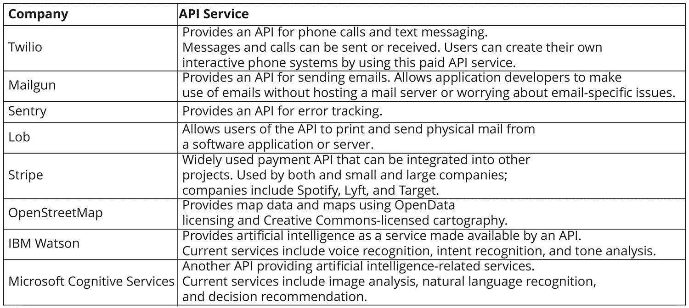
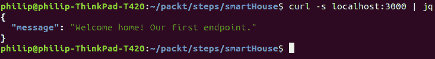
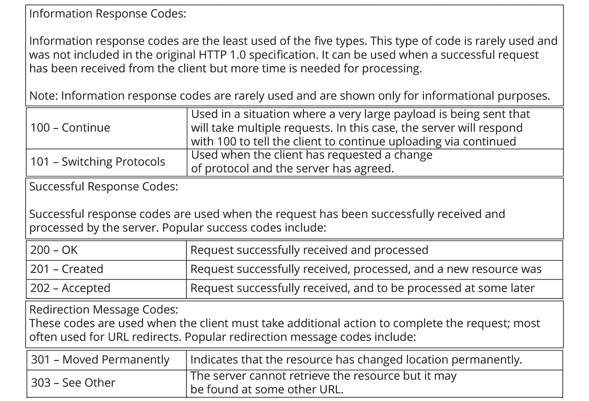
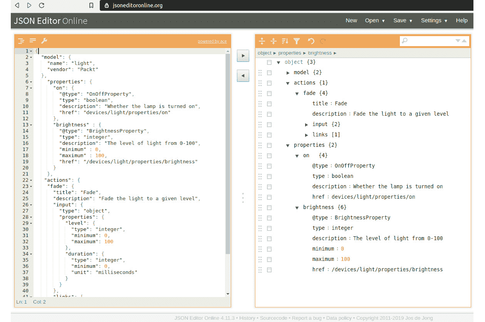
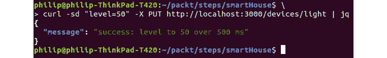
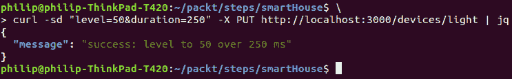
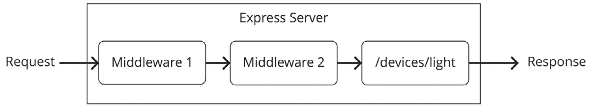
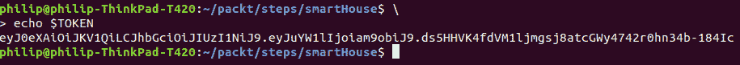
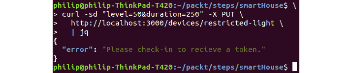
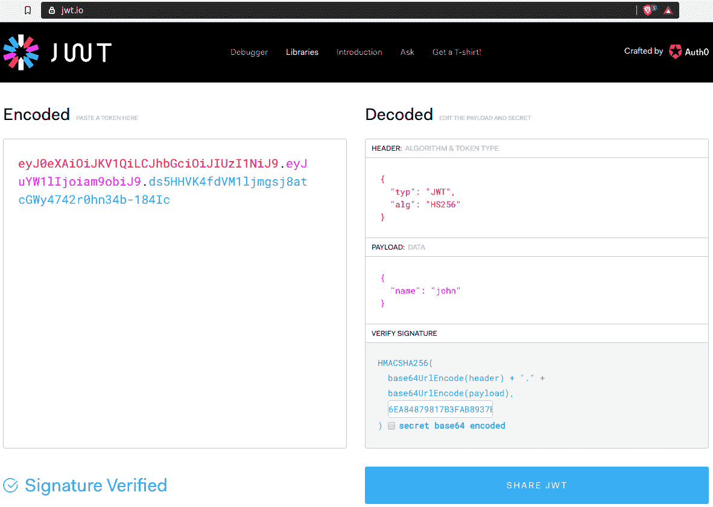

# 四、使用 Node.js 的 RESTful api

## 学习目标

在本章结束时，你将能够:

*   为 Express.js API 设置项目结构
*   设计一个使用不同 HTTP 方法的端点的 API
*   在本地主机上运行API，并通过 cURL 或基于 gui 的工具与之交互
*   分析端点的用户输入，并考虑处理错误的不同方法
*   设置需要用户身份验证的端点

在本章中，我们将使用 Express.js 和 Node.js 来建立一个前端应用可以使用的 API。

## 简介

**应用接口**(**api**)变得比以往任何时候都重要。 API 的使用允许多个脚本和应用使用单个服务器端程序。 由于其实用性，API 管理已经成为使用 Node.js 的后端开发人员最常见的任务之一。

让我们以一家同时拥有网站和手机应用的公司为例。这两种前端界面都需要服务器提供相同的功能。 通过将此功能包装在 API 中，我们可以清晰地分离和重用服务器端代码。 笨拙的 PHP 应用直接将后端功能嵌入网站的界面代码的日子已经一去不复返了。

我们将使用 Node.js 来设置一个**Representational State Transfer**(**REST**)API。 我们的 API 将运行在 Express.js 上，这是一个具有路由功能的流行 web 应用框架。 有了这些工具，我们可以很快地在本地主机上运行一个端点。 我们将研究设置 API 的最佳实践，以及 Express.js 库中使用的特定语法。 除此之外，我们还将考虑 API 设计的基础知识，为开发人员和使用它的服务简化它的使用。

## 什么是 API?

API 是一种与软件应用交互的标准化方式。 api 允许不同的软件应用相互交互，而不必了解底层函数的内部工作原理。

api 在现代软件工程中变得很流行，因为它们允许组织通过重用代码而变得更有效。 以地图的使用为例:在 api 普及之前，需要地图功能的组织必须在内部维护地图小部件。 通常，这些地图小部件的性能很差，因为它们只是业务和工程团队的次要关注点。

现在很少有网站或应用使用地图进行内部维护。 许多用于网络和移动电话的应用正在利用谷歌或 OpenStreetMap 等替代品的地图 api。 这使得每个公司都可以专注于自己的核心竞争力，而不必创建和维护自己的地图部件。

有几家成功的初创企业的业务模式都是围绕着通过 API 提供服务的。 一些例子包括 Twilio、Mailgun 和 Sentry 等知名公司。 除此之外，还有一些较小的公司通过 API 提供独特的服务，比如 Lob，它可以根据请求通过它们的 API 发送信件和明信片。 在这里，开发人员只需将信的内容和目标地址发送到 Lob 的 API，它将自动打印出来，并代表开发人员通过邮件发送出去。 下面是一些知名公司提供的 API 服务示例。



###### 图 4.1:基于 api 的公司示例

这些公司通过提供可用于提供特定服务的构建块，使开发人员能够更好、更快地开发应用。 这些服务的广泛采用证明了其有效性。 使用 Twilio 提供文本或电话集成的公司包括可口可乐、Airbnb、优步、Twitch 和许多其他公司。 这些公司中有许多反过来为其他公司和开发人员提供了自己的 api。 这种趋势被称为 API 经济。

这些服务的另一个共同点是它们通过 HTTP 使用 REST。 新开发人员通常认为所有的 api 都是通过 HTTP 使用的; 然而，当我们谈论 API 时，对使用的协议或媒介没有限制。 从理论上讲，API 的界面可以是任何东西，从按钮到无线电波。 虽然有许多接口选项可供选择，但 HTTP 仍然是使用最广泛的媒介。 在下一节中，我们将更详细地讨论 REST。

## 什么是 REST?

REST 是一种用于创建基于 web 的服务的软件体系结构模式。 这意味着资源是由一个特定的 URL 端点表示的，例如，`website.com/post/12459`，在这个 URL 端点，网站的帖子可以通过使用其特定的 ID 来访问。 REST 是将资源映射到 URL 端点的方法。

数据库管理领域的一个相关概念是:**CRUD**(**创建、读取、更新和删除**)。 这是与数据库资源交互的四种方式。 类似地，我们通常也有四种方式与 API 端点定义的资源对象进行交互。 HTTP 协议内置了`POST`、`GET`、`PUT`、`DELETE`等方法。

上述各项任务的功能如下:

*   `POST`:创建对象资源
*   `GET`:获取对象资源信息
*   `PUT`:更新指定对象的信息
*   `DELETE`:移除特定对象

附加方法:除了这四个主要方法外，还有一些不太常用的方法。 我们不会在这里使用它们，你不应该担心它们，因为它们很少被客户端和服务器使用:

*   `HEAD`:与`GET`相同，但只检索标题而不是正文。
*   `OPTIONS`:返回服务器或 API 允许的选项列表。
*   `CONNECT`:用于创建 HTTP 隧道。
*   `TRACE`:这是一个用于调试的消息环回。
*   `PATCH`:类似于`PUT`，但用于更新单个值。 注意:`PUT`可用来代替`PATCH`。

### Express.js 用于 Node.js 上的 RESTful api

好消息是，如果您了解基本的 JavaScript，那么您已经完成了创建第一个 API 的一半工作。 使用 Express.js，我们可以很容易地构造 HTTP 端点。 Express 是一个流行的、最小的 web 框架，用于在节点上创建和托管 web 应用。 它包括几个内置路由方法，允许我们映射传入请求。 有许多中间件包可以简化常见任务。 我们将在本章的后面使用一个验证包。

在本章中，我们将创建一个假想的智能住宅 API 的各个方面。 这将需要为各种设备添加端点，这些设备具有更改设备状态的逻辑。 其中一些端点将对网络中的任何人开放，例如智能灯，而其他端点(如加热器)将需要身份验证。

#### 请注意

什么是智能房子? 智能住宅是指包含可连接互联网的设备的房子，你可以通过基于云的控制系统与这些设备进行交互。 **物联网**(**IoT**)是指能够接入互联网并与用户和其他设备进行通信的设备趋势。

在本章中，我们将为一个包含智能设备(包括智能灯泡和加热器)的房子编写一个 API。 本练习的代码文件可在[https://github.com/TrainingByPackt/Professional-JavaScript/tree/master/Lesson04/Exercise16](https://github.com/TrainingByPackt/Professional-JavaScript/tree/master/Lesson04/Exercise16)中获得。

### Exercise 16: Creating an Express Project with an Index Route .Exercise 16: Creating an Express Project with an Index Route .【T0

在本练习中，我们的目标是创建一个新的节点项目，安装 Express，然后创建一个索引路由，该路由返回一个 JSON 对象，该对象具有消息的单个属性。 运行后，我们可以通过向本地主机发出 cURL 请求来测试它。 要做到这一点，执行以下步骤:

1.  创建一个名为`smartHouse`的文件夹，启动一个`npm`项目:

    ```js
    mkdir smartHouse
    ```

    ```js
    cd smartHouse
    ```

    ```js
    npm init
    ```

2.  安装`express`库，使用`-s`标志将其保存到`package.json`文件:

    ```js
    npm install -s express
    ```

3.  创建一个名为`server.js`的文件，该文件导入`express`，并创建一个`app`对象:

    ```js
    const express = require('express');
    ```

    ```js
    const app = express();
    ```

4.  Add an `app.get` method that specifies `'/'` for our index route in `server.js`:

    ```js
    app.get('/', (req, res) => {
    ```

    ```js
      let info = {};
    ```

    ```js
      info.message = "Welcome home! Our first endpoint.";
    ```

    ```js
      res.json(info);
    ```

    ```js
    });
    ```

    上面的代码创建了一个`HTTP GET`函数，该函数返回一个名为`info`的对象，该对象只有一个属性`message`。

5.  Add an `app.listen` function that tells our application to listen on `port 3000`:

    ```js
    // Start our application on port 3000
    ```

    ```js
    app.listen(3000, () => console.log('API running on port 3000'));
    ```

    前面的步骤是 Node.js Express API 的一个简单示例所需要的所有步骤。 通过运行上述代码，我们将在本地主机上创建一个返回简单 JSON 对象的应用。

6.  在另一个“终端”窗口中，返回“`smartHouse`”文件夹的根目录，执行以下命令:

    ```js
    npm start
    ```

7.  点击`localhost:3000`确认应用正在正常运行:


###### 图 4.2:在 web 浏览器中显示 localhost:3000

如果你正确地复制了代码，你应该看到一个 JSON 对象服务于**localhost:3000**，如上截图所示。

#### 请注意

如果在任何步骤中遇到麻烦或不确定项目文件应该是什么样子，您可以使用项目文件夹将代码移回与项目一致的位置。 文件夹将根据它们关联的步骤来命名，例如，`Exercise01, Exercise02`，等等。 当你第一次进入一个文件夹时，确保运行`npm install`来安装项目使用的任何模块。

### 通过 HTTP 与 API 交互

在本节中，我们将与在*练习 16、**创建带有索引路由*的 Express 项目中创建的服务器进行交互。 因此，请确保在服务器运行时保持终端窗口打开。 如果您已经关闭了该窗口或将其关闭，只需返回到`smartHouse`文件夹并运行`npm start`即可。

我们通过使用 web 浏览器验证了 API 正在运行。 网络浏览器是查看路线最简单的方法，但它是有限的，只对`GET`请求有效。 在本节中，我们将看看另外两种与 API 进行更高级交互的方法，这两种方法都允许更高级的请求，包括以下内容:

*   请求超出`GET`，包括`PUT`、`POST`、`DELETE`
*   在请求中添加标题信息
*   包括受保护端点的授权信息

我喜欢的方法是使用命令行工具 cURL。 cURL 代表 Client，代表 url。 它安装在 macOS、Linux 和 Windows 10 的大多数版本上(适用于 2018 年及以后的版本)。 它是一个用于发出 HTTP 请求的命令行工具。 对于一个非常简单的命令，运行以下命令:

```js
curl localhost:3000
```

下面是上述代码的输出:


###### 图 4.3:显示 cURL localhost:3000

#### 请注意

本章将使用命令行程序`jq`来格式化 cURL 请求。 `jq`是一个轻量级、灵活的命令行 JSON 处理器。 该程序可用于 macOS、Linux 和 Windows。 如果你不能在你的系统上安装它，你仍然可以使用`curl`而不是`jq`。 要做到这一点，只需在本章任何 curl 命令的末尾删除`| jq`命令。

`jq`的安装说明可在[https://github.com/stedolan/jq](https://github.com/stedolan/jq)上找到。

通过使用`curl`和`jq`，我们可以更容易地读取输出，这在 JSON 变得更复杂时尤其有用。 在下文中，我们将重复前面示例中相同的 curl 命令，但这次使用一个 Unix 管道(`|`)将输出提供给`jq`:

```js
curl -s localhost:3000 | jq
```

在前面的命令中，当将`curl`管道连接到`jq`时，我们将使用`-s`标志，它代表“silent”。 如果`curl`管道没有此标志，您还将看到有关请求速度的不必要信息。

假设您已经正确地完成了所有操作，您应该看到一些清晰显示的 JSON 作为输出:



###### 图 4.4:将 cURL 管道化到 jq

如果你更喜欢使用基于 gui 的应用，你可以使用 Postman，这是一个 Chrome 扩展，可以很容易地以简单的方式发送 HTTP 请求。 通常，我更喜欢 cURL 和 jq，以便在命令行上快速使用。 然而，对于更复杂的用例，我可能会打开 Postman，因为 GUI 使处理头文件和授权更容易一些。 关于安装 Postman 的说明，请登录[https://www.getpostman.com](https://www.getpostman.com):


###### 图 4.5:Postman 中的 cURL 请求的屏幕截图

### 练习 17:创建和导入路由文件

目前，我们的应用运行时根 URL 只有一个端点。 通常，一个 API 将有许多路由，并且将它们都保存在主`server.js`文件中将很快导致项目变得无组织。 为了防止这种情况的发生，我们将把每个路由分离到模块中，并将每个路由导入到我们的`server.js`文件中。

#### 请注意

这个例子的完整代码可以在[https://github.com/TrainingByPackt/Professional-JavaScript/tree/master/Lesson04/Exercise17](https://github.com/TrainingByPackt/Professional-JavaScript/tree/master/Lesson04/Exercise17)找到。

执行以下步骤来完成练习:

1.  首先，在`smartHouse`文件夹中创建一个新文件夹:

    ```js
    mkdir routes
    ```

2.  Create the `routes/index.js` file and move the `import` statements and `main` function from `server.js` into that file. Then, below that, we'll add a line that exports the `router` object as a module:

    ```js
    const express = require('express');
    ```

    ```js
    const router = express.Router();
    ```

    ```js
    router.get('/', function(req, res, next) {
    ```

    ```js
      let info = {};
    ```

    ```js
      info.message = "Welcome home! Our first endpoint.";
    ```

    ```js
      res.json(info);
    ```

    ```js
    });
    ```

    ```js
    // Export route so it is available to import
    ```

    ```js
    module.exports = router;
    ```

    前面的代码实际上是我们在第一个练习中编写的代码，被移动到另一个文件中。 关键的区别是它说`module.exports = router;`的底线。 这一行接受我们创建的`router`对象，并将其导入到另一个文件中。 每次我们创建一个新的路由文件，它都会包含相同的导出底线。

3.  打开`server.js`并删除第 3 到第 8 行，因为`app.get`方法已经移动到`/routes/index.js`文件。 然后，导入`path`和`fs`(文件系统)库。 我们还将导入一个名为`http-errors`的库，稍后将用于管理 HTTP 错误。 `server.js`的前九行内容如下:

    ```js
    const express = require('express');
    ```

    ```js
    const app = express();
    ```

    ```js
    // Import path and file system libraries for importing our route files
    ```

    ```js
    const path = require('path');
    ```

    ```js
    const fs = require('fs');
    ```

    ```js
    // Import library for handling HTTP errors
    ```

    ```js
    const createError = require('http-errors');
    ```

4.  下面，同样在`server.js`中，我们将打开 URL 编码，并告诉`express`使用 JSON:

    ```js
    // Tell express to enable url encoding
    ```

    ```js
    app.use(express.urlencoded({extended: true}));
    ```

    ```js
    app.use(express.json());
    ```

5.  接下来，我们将导入索引路由并将其与路径关联。 以上步骤完成后，`server.js`应包含以下内容:

    ```js
    // Import our index route
    ```

    ```js
    let index = require('./routes/index');
    ```

    ```js
    // Tell Express to use our index module for root URL
    ```

    ```js
    app.use('/', index);
    ```

6.  我们可以为任何没有相应函数的访问 URL 创建一个 all - catch`404`错误。 `app.use`内的方法,我们会将 HTTP 状态代码设置为`404`,然后使用我们进口的`http-errors`图书馆*第 2 步创建一个全方位`404`错误(重要的是下面的代码在所有其他路线声明):

    ```js
    // catch 404 and forward to error handler
    ```

    ```js
    app.use(function(req, res, next) {
    ```

    ```js
      res.status(404);
    ```

    【显示】

    ```js
    });
    ```* 
**   The final line in the file should exist from our previous exercise:

    ```js
    // Start our application on port 3000
    ```

    ```js
    app.listen(3000, () => console.log('API running on port 3000'));
    ```

    完成这个操作后，运行我们的代码应该会产生如下输出，这与*练习 16，创建一个带有索引路由*的 Express 项目的结果相同:* 

 *

###### 图e 4.6:输出消息

有一个`routes`文件夹的好处是，随着它的增长，组织我们的 API 变得更容易。 每次我们想要创建一个新的路由，我们只需要在`routes`文件夹中创建一个新文件，使用`server.js`中的`require`导入它，然后使用 Express`app.use`函数将文件与端点关联。

**template Engines**:在前面两行我们使用`app.use`的地方，我们修改了`express`的设置，使用扩展 URL 编码和 JSON。 它还可以用于设置模板引擎; 例如:**嵌入式 JavaScript**(**EJS**)模板引擎:

```js
app.set('view engine', 'ejs');
```

模板引擎允许 Express 为网站生成和提供动态 HTML 代码。 流行的模板引擎包括 EJS、Pug (Jade)和 Handlebars。 例如，通过使用 EJS，我们可以使用从路由传递到视图的用户对象动态生成 HTML:

```js
<p><%= user.name %></p>
```

在我们的例子中，我们不需要使用`view`或模板引擎。 我们的 API 将返回并独家接受标准 JSON。 如果您有兴趣在基于 html 的网站上使用 Express，我们鼓励您研究与 Express 兼容的模板引擎。

### HTTP 状态码

在*练习 17*、*创建并导入路由文件*中，我们将响应的 HTTP 状态码设置为`404`。 大多数人都听说过 404 错误，因为当一个页面无法在网站上找到时，通常会出现 404 错误。 然而，大多数人不知道什么是状态代码，或者任何超出`404`的代码。 因此，我们将从解释状态代码的概念和一些最常用的代码开始。

状态码是一个三位数的数字，通过 HTTP 响应客户机请求时从服务器返回。 每个三位数代码对应一个标准化状态，例如:`not found`、`success`、`server error`。 这些标准化的代码使处理服务器变得更加容易和标准化。 通常，状态代码将伴随着一些额外的消息文本。 这些消息对人类来说可能很有用，但是在编写处理 HTTP 响应的脚本时，简单地考虑状态代码要容易得多。 例如，根据返回的状态码创建 case 语句。

响应码的类别由三位数中的第一个数字决定:


###### 图 4.7:HTTP 响应代码分类表

HTTP 代码的每一类都包含几个特定的代码，这些代码将在某些情况下使用。 这些标准化的代码将帮助客户处理响应，即使它们涉及一个不熟悉的 API。 例如，任何 400 系列客户端错误代码都向客户端表明问题出在请求上，而 500 系列错误代码则表明问题可能出在服务器本身上。

下面让我们看看每个类别中存在的一些特定 HTTP 状态代码:



###### 图 4.8:HTTP 响应代码表

在下图中，我们可以看到一些更具体的 HTTP 状态码:


###### 图 4.9:HTTP 响应代码表

这里列出的代码只是可用的几十个 HTTP 状态代码中的一小部分。 在编写 API 时，在适当的地方使用状态代码是很有用的。 状态代码使响应对用户和机器来说都更容易理解。 在测试应用时，我们可能希望编写一个脚本，使请求列表与预期的响应状态代码相匹配。

当使用 Express 时，默认的状态代码总是`200`，所以如果您没有在结果中指定代码，它将是`200`，这表明响应成功。 HTTP 状态代码的完整列表可以在[https://developer.mozilla.org/en-US/docs/Web/HTTP/Status](https://developer.mozilla.org/en-US/docs/Web/HTTP/Status)中找到。

要设置状态码错误，请使用前面的代码部分，并用 Express 的子依赖项`http-errors`库支持的任何错误码替换`404`。 所有支持的错误代码列表可以在项目的 GitHub 上找到[https://github.com/jshttp/http-errors](https://github.com/jshttp/http-errors)。

你也可以传递一个额外的字符串到`createError()`来设置自定义消息:

```js
res.status(404);
res.json(createError(401, 'Please login to view this page.'));
```

如果你使用的是成功代码，只需使用`res.status`并返回 JSON 对象，就像默认`200`状态一样:

```js
res.status(201); // Set 201 instead of 200 to indicate resource created
res.json(messageObject); // An object containing your response
```

#### 请注意

有许多状态码很少被使用; 其中有一些是互联网历史上创造的笑话代码:

418 -我是一只茶壶:这是 1998 年愚人节的玩笑。 这表明服务员拒绝煮咖啡，因为这是一个茶壶。

420 -增强你的冷静:用于 Twitter 的原始版本，当一个应用是价格限制。 这是电影《毁灭者》的台词。

### 设计你的 API

在软件设计过程的早期考虑 API 的设计是很重要的。 在发布后更改 API 的端点将需要更新任何依赖于这些端点的服务。 如果一个 API 是发布给公众使用的，那么它通常需要保持向后兼容性。 从长远来看，花在规划端点、接受的 HTTP 方法、所需的输入类型和返回的 JSON 结构上的时间将得到节省。

通常，可以找到与您的特定用例或行业相关的指导方针，所以一定要事先对此进行研究。 在我们的智能家居 API 示例中，我们将从万维网联盟的(**war3 的**)与物联网设备相关的建议中获得灵感。 war3 是最具影响力的网络标准开发组织之一，他们的物联网倡议被称为**web of Things**(**WoT**)。 你可以在[https://www.w3.org/WoT/](https://www.w3.org/WoT/)上了解更多。

根据 WoT 的指导方针，每个设备都应该包含关于模型的信息，以及设备可能使用的操作列表。 以下是 WoT 标准推荐的一些端点:


###### 图 4.10:WoT 的标准路线表

这个设计之所以有用有两个原因——首先，因为它符合一个标准，这给了用户一组期望。 其次，助手端点(如`/properties/`和`/actions/`)的使用使用户能够通过在这些端点请求附加信息来发现如何使用 API。

添加到室内的每个设备都应该有`/model/`、`/properties/`和`/actions/`端点。 我们将把上表中显示的端点映射到 API 中的每个设备上。 下面的树形图显示了来自根端点的 API 的映射。

下图中的第三层是`/devices/light/`端点，从这个端点开始，我们有上表中列出的端点:


###### 图 4.11:智能住宅 API 设计的树形图

作为端点返回的 JSON 类型的一个例子，我们将更仔细地研究在前面的图中定义的`/devices/light/actions`路由。 下面的例子显示了一个动作的对象，该动作包含一个名为`Fade`的动作:

```js
"actions": {
  "fade": {
    "title": "Fade Light",
    "description": "Dim light brightness to a specified level",
    "input": {
      "type": "object",
      "properties": {
        "level": {
          "type": "integer",
          "minimum": 0,
          "maximum": 100
        },
        "duration": {
          "type": "integer",
          "minimum": 0,
          "unit": "milliseconds"
        }
      }
    },
    "links": [{"href": "/light/actions/fade"}]
  }
}
```

我们的`fade`行动是基于 Mozilla 在[https://iot.mozilla.org/wot](https://iot.mozilla.org/wot)的 WoT 文档中提出的建议。 他们创建此文档的目的是补充 W3C 提出的标准，并包含了许多 JSON 示例，这些 JSON 代表物联网设备及其相关操作。

注意，对象包含操作的名称、操作的描述和使用操作的可接受值。 在适用的地方包含度量单位也是一个好主意。 至于持续时间，我们知道是以毫秒为单位的; 如果没有这些信息，我们就不知道“1”的真正含义。

通过读取前面的 JSON，我们可以看到我们需要发送一个请求，其中包含一个数字，表示所需的照明级别(0 到 100)，以及另一个数字，用于指定调光的时间长度。 使用`curl`，我们可以使灯光退色如下:

```js
curl -sd "level=80&duration=500" -X PUT localhost:3000/lightBulb/actions/fade
```

根据 API 操作描述，前面的请求应该导致灯泡在 500 毫秒的时间内亮度下降到 80%。

#### 请注意

**文档与 Swagger**:虽然它不会在这本书中涵盖，另一个项目你应该看看是 Swagger。 这个项目帮助自动化创建、更新和显示 API 文档的过程，并且可以很好地与 Node.js 和 Express 工作。

可以在[https://petstore.swagger.io/](https://petstore.swagger.io/)上看到 Swagger 生成的交互式文档的示例。

### 练习 18:创建行动路线

在这个练习中，我们的目标是创建一个新的路由文件，它返回关于`fade`操作的信息，这是我们在前一节中看到的。 本练习的起点将是我们在练习 17*的结束，创建和导入路由文件*。

#### 请注意

这个例子的完整代码可以在[https://github.com/TrainingByPackt/Professional-JavaScript/tree/master/Lesson04/Exercise18](https://github.com/TrainingByPackt/Professional-JavaScript/tree/master/Lesson04/Exercise18)找到。

执行以下步骤来完成练习:

1.  在`routes`文件夹中创建一个名为`devices`:

    ```js
    mkdir routes/devices
    ```

    的子文件夹
2.  复制`routes/index.js`到`routes/devices/light.js`:

    ```js
    cp routes/index.js routes/devices/light.js
    ```

3.  Next, we'll open up `/routes/devices/light.js` from the previous exercise and modify it. Find line 6, which should contain the following:

    ```js
    info.message = "Welcome home! Our first endpoint.";
    ```

    我们将前面的一行替换为一个大的 JSON 块，它表示所有设备动作的列表:

    ```js
      let info =    {
    ```

    ```js
        "actions": {
    ```

    ```js
          "fade": {
    ```

    ```js
            "title": "Fade Light",
    ```

    ```js
            "description": "Dim light brightness to a specified level",
    ```

    ```js
            "input": {
    ```

    ```js
              "type": "object",
    ```

    ```js
              "properties": {
    ```

    ```js
                "level": {
    ```

    ```js
                  "type": "integer",
    ```

    ```js
                  "minimum": 0,
    ```

    ```js
                  "maximum": 100
    ```

    ```js
                },
    ```

    在我们的例子中，唯一的操作是`fade`。 这个动作将在一段确定的时间内(以毫秒为单位)改变灯泡的亮度。 这个端点不包含实现函数的逻辑，但是它将返回与它交互所需的详细信息。

4.  在`server.js`文件中，导入新创建的设备路由:

    ```js
    let light = require('./routes/devices/light');
    ```

5.  现在我们将使用前面的路线，告诉 Express 使用我们的`light`对象为`/devices/light`路线:

    ```js
    app.use('/devices/light', light);
    ```

6.  使用`npm start`:

    ```js
    npm start
    ```

    运行程序
7.  Test the route by using `curl` and `jq`:

    ```js
    curl -s localhost:3000/devices/light | jq
    ```

    如果你正确地复制了前面的代码，你应该得到一个格式化的 JSON 对象，表示`fade`动作如下:


###### 图 4.12:localhost:3000/devices/light 的 cURL 响应

### 进一步模块化

在项目文件中，我们将通过制作一个`lightStructure.js`文件进一步分离光路，该文件只包含一个 JSON 对象代表光。 我们不会包含包含`model`、`properties`和`action`描述的长字符串 JSON。

#### 请注意

本节中没有关于更改的练习，但是您可以在[https://github.com/TrainingByPackt/Professional-JavaScript/tree/master/Lesson04/Example/Example18b](https://github.com/TrainingByPackt/Professional-JavaScript/tree/master/Lesson04/Example/Example18b)中找到代码。

*练习 19*将从`Example18b`文件夹中找到的代码开始。

将静态数据(如端点对象和单独文件的函数)分开是很有用的。 `lightStructure.js`将包含表示模型、属性和操作的数据。 这允许我们关注`light.js`中端点的逻辑。 这样，我们就有了四个端点，每个端点都返回 JSON light 对象的相关部分:

```js
// Light structure is imported at the top of the file
const lightStructure = require('./lightStructure.js');
// Create four routes each displaying a different aspect of the JSON object
router.get('/', function(req, res, next) {
  let info = lightStructure;
  res.json(info);
});
router.get('/properties', function(req, res, next) {
  let info = lightStructure.properties;
  res.json(info);
});
router.get('/model', function(req, res, next) {
  let info = lightStructure.model;
  res.json(info);
});
router.get('/actions', function(req, res, next) {
  let info = lightStructure.actions;
  res.json(info);
});
```

当处理一个像`lightStructure.js`中发现的 JSON 大块时，使用 GUI 可视化工具会很有用。 一个例子是[https://jsoneditoronline.org/](https://jsoneditoronline.org/)，它提供了一个工具，允许你将一个 JSON 块粘贴到页面的左侧部分，并在右侧将其可视化为一个树状对象:



###### 图 4.13:在线 JSON 浏览器/编辑器

可以在可视化的任意一侧进行更改，并将更改复制到另一侧。 这很有用，因为 JSON 对象越复杂，就越难以查看属性中存在多少层。

## 类型检查和验证发送到端点的输入

虽然类型检查和验证在创建 API 时并不是严格要求的，但是使用它们可以减少调试时间并帮助避免错误。 为端点提供一个有保证的输入意味着可以在编写代码时专注于返回期望的结果，而不考虑输入在预期之外可能产生的许多边缘情况。

由于这个任务在创建 api 时非常常见，因此创建了一个库来轻松验证 Express 端点的输入。 使用**express-validator**中间件，我们可以简单地将输入需求作为参数传递给端点。 例如，在*Exercise 18*中返回的 JSON 对象描述的灯泡的`fade`动作的需求可以用以下数组表示:

```js
  check('level').isNumeric().isLength({ min: 0, max: 100 }),
  check('duration').isNumeric().isLength({ min: 0 })
]
```

如您所见，它包含每个预期输入的条目。 对于每个输入，我们执行两个检查。 第一个是`.isNumeric()`，它检查输入是否是一个数字。 第二个是`.isLength()`，它检查长度是否在指定的最小到最大范围内。

### 练习 19:创建带有类型检查和验证的路由

#### 请注意

这个例子的完整代码可以在[https://github.com/TrainingByPackt/Professional-JavaScript/tree/master/Lesson04/Exercise19](https://github.com/TrainingByPackt/Professional-JavaScript/tree/master/Lesson04/Exercise19)找到。

在这个练习中，我们将扩展我们的`routes/devices/light.js`文件，添加一个在`/actions/fade`中接受`PUT`请求的路由。

该路由将检查请求是否符合`fade`动作对象指定的标准，我们在*练习 18，返回 JSON 代表动作路由*中添加了`fade`动作对象到`devices/light`端点。 这包括以下几个方面:

*   请求包含级别和持续时间值。
*   级别和持续时间均为整数。
*   级别值在 0 到 100 之间。
*   持续时间值大于 0。

执行以下步骤来完成练习:

1.  安装`express-validator`，这是一个中间件，封装了`validator.js`，方便使用`validation`和`sanitization`功能，配合`express`:

    ```js
    npm install -s express-validator
    ```

2.  将`routes/devices/light`放在第 2 行，就在`express`:

    ```js
    const { check, validationResult } = require('express-validator/check');
    ```

    的`require`语句下面，从`express-validator`库中导入`check`和`validationResult`函数。
3.  `route.get`以下函数我们写在过去的运动,创建以下函数将处理`PUT`请求:

    ```js
    // Function to run if the user sends a PUT request
    ```

    ```js
    router.put('/actions/fade', [
    ```

    【4】【5】

    ```js
      ],
    ```

    ```js
      (req, res) => {
    ```

    【显示】

    ```js
        if (!errors.isEmpty()) {
    ```

    ```js
          return res.status(422).json({ errors: errors.array() });
    ```

    ```js
        }
    ```

    【病人】

    ```js
    });
    ```

4.  使用`npm start`:

    ```js
    npm start
    ```

    运行 API
5.  Make a `PUT` request to `/devices/light/actions/fade` with the incorrect value (`na`) to test the validation:

    ```js
    curl -sd "level=na&duration=na" -X PUT \
    ```

    ```js
    http://localhost:3000/devices/light/actions/fade | jq
    ```

    `-d`标志表示要传递给端点的“数据”值。 `-X`标志表示 HTTP 请求的类型。

    如果前面的步骤是正确的，那么当我们向`/devices/light/actions/fade`发送带有非数值值的关卡和持续时间请求时，我们应该会得到一个错误:

    

    ###### 图 4.14:带有不正确数据的/device/light/actions/fade 路由的 cURL 错误响应

6.  Next, we'll make a `PUT` request like before, but with the correct values of `50` and `60`:

    ```js
    curl -sd "level=50&duration=60" -X PUT \
    ```

    ```js
    http://localhost:3000/devices/light/actions/fade | jq
    ```

    发送一个值在正确范围内的`PUT`请求应该返回以下内容:


###### 图 4.15:带有正确数据的/device/light/actions/fade 路由的 cURL 响应

以上截图表示`PUT`请求成功。

## 有用的默认值和简单的输入

因此，我们已经看到了对端点的输入施加限制是有帮助的。 然而，过多的限制和需求会阻碍 API 的用户体验。 让我们仔细看看灯泡的褪色动作。 为了允许在一段时间内衰落的特性，我们要求用户传递持续时间的值。 许多人已经有过在物理灯泡上使用渐隐动作的经验。

使用物理l 灯泡，我们知道我们通过调整物理开关或其他输入来输入我们想要的亮度水平。 持续时间不一定是这个过程的一部分，也不一定是用户有意识地考虑到的。 这就产生了这样一种期望，即你应该能够仅按所需的水平来减弱光线。

因此，n，我们应该考虑将`duration`值设为可选值。 在没有接收到`duration`值的情况下，脚本将退回到默认值。 这允许我们在满足用户期望的同时，仍然允许对希望指定持续时间的用户进行细粒度控制。

### Making the Duration Input 可选

#### 请注意

这个例子的完整代码可以在[https://github.com/TrainingByPackt/Professional-JavaScript/tree/master/Lesson04/Exercise20](https://github.com/TrainingByPackt/Professional-JavaScript/tree/master/Lesson04/Exercise20)找到。

在这个练习se 中，我们将修改渐隐动作，使持续时间成为可选输入。 如果没有提供持续时间值，我们将修改淡出动作端点的默认值为 500 毫秒:

1.  在`routes/devices/light.js`中，修改验证`duration`的行，将`.optional()`添加到函数链中。 它应该是这样的:
2.  In `routes/devices/light.js`, delete the `return` statement and add the following in the same location:

    ```js
    let level = req.body.level;
    ```

    ```js
    let duration;
    ```

    ```js
    if(req.body.duration) {
    ```

    ```js
      duration = req.body.duration;
    ```

    ```js
    } else {
    ```

    ```js
      duration = 500;
    ```

    ```js
    }
    ```

    前面的代码使用`level`输入创建了一个`level`变量，并在持续时间内初始化一个空变量。 接下来，我们检查用户是否提供了一个`duration`输入。 如果是，则将持续时间设置为该值。 如果没有，则将`duration`设置为`500`。

3.  现在，我们将使用我们的`level`和`duration`变量创建一个名为`message`的`message`对象。 然后，我们将返回该`message`对象给客户端:
4.  最后，我们将把第二个路由与函数关联起来，以便向`/devices/light`发送`PUT`请求执行与`/devices/light/actions/fade`相同的函数。 这是通过使用一个包含旧值和一个新的`/`值的数组来改变`router.put`的第一个参数来实现的。 `router.put`部分的开口应该是这样的:

    ```js
    // Function to run if user sends a PUT request
    ```

    ```js
    router.put(['/', '/actions/fade'], [
    ```

    ```js
        check('level').isNumeric().isLength({ min: 0, max: 100 }),
    ```

    ```js
        check('duration').isNumeric().optional().isLength({ min: 0 })
    ```

    ```js
      ],
    ```

    ```js
      (req, res) => {
    ```

5.  现在我们已经完成了编码部分，我们将打开服务器进行测试:
6.  With the server running in one Terminal, open another to perform a few tests using `curl`. In the first command, we'll check that our new default endpoint is working and that our default value for the duration is used when no duration is provided:

    ```js
    curl -sd "level=50" -X PUT http://localhost:3000/devices/light | jq
    ```

    如果你正确地复制了所有内容，你应该会看到这样的输出:

    

    ###### 图 4.16:没有指定持续时间的/device/light 路径的 cURL 响应

7.  We'll also want to make sure that providing a `duration` value overrides the default value. We can test this by making a cURL request that specifies a `duration` value:

    ```js
    curl -sd "level=50&duration=250" -X PUT http://localhost:3000/devices/light | jq
    ```

    当指定`250`为`duration`值时，我们应该看到一个确认，在响应中`level`将更改为超过 250 毫秒:



###### 图 4.17:指定持续时间的/device/light 路径的 cURL 响应

通过这些更改，我们现在已经使 fade 为`/devices/light`的默认动作，如果没有提供持续时间输入，则给它一个默认值。 值得注意的是，我们现在有两个与`/devices/light`端点相关的函数:

*   `HTTP GET /devices/light`:它返回与光相互作用的信息。
*   `HTTP PUT /devices/light`:执行灯的默认动作。

使用多个方法重用同一个端点是一个很好的实践。 另一个常见的例子是博客条目，其中 API 可能有一个端点，根据使用的方法有四个函数:

*   `HTTP POST /blog/post/42`:创建 ID 为 42 的博客文章。
*   `HTTP GET /blog/post/42`:返回 JSON 对象的 blog blog #42。
*   `HTTP PUT /blog/post/42`:通过发送新的内容编辑博客第 42 篇。
*   `HTTP DELETE /blog/post/42`:删除第 42 篇博文。

这在逻辑上使用 REST 模型是有意义的，其中每个端点表示可以以各种方式进行交互的资源。

在我们的例子中，我们向`/devices/light`路由发出了`PUT`请求，以触发`fade`函数。 可以说，开启和关闭灯的功能更符合大多数人对光线默认动作的预期。 除此之外，该开关是一种更好的默认设置，因为它不需要来自客户机的输入。 Fade 之所以被选为这个项目的唯一原因是因为这个转换被认为是过于简单的。

我们不会深入讨论`switch`函数，但它可能包含如下代码部分所示的内容，允许客户端指定所需的状态。 如果没有指定状态，它将变成与当前值相反的值:

```js
if(req.body.state) {
  state = req.body.state;
} else {
  state = !state;
}
```

## 中间件

Express 中的中间件函数是在与端点关联的函数之前运行的函数。 这方面的一些常见示例包括在运行端点的主函数之前记录请求或检查身份验证。 在这些情况下，日志记录和身份验证函数在使用它们的所有端点中都是通用的。 通过使用中间件，我们可以重用跨端点的通用代码。

使用 Express，我们可以使用`app.use()`为所有端点运行中间件功能。 例如，如果我们想要创建一个函数，在运行主路由之前将请求记录到控制台，我们可以编写一个`logger`中间件:

```js
var logger = function (req, res, next) {
  // Request is logged
  console.log(req);
  // Call the special next function which passes the request to next function
  next();
}
```

为了让记录器在所有端点上运行，我们告诉应用使用它:

```js
app.use(logger);
```

相反，如果我们希望我们的中间件函数只在一些路由上运行，我们可以直接附加它:

```js
app.use('/devices/light', logger, light);
```

可以用于部分或全部路由的中间件功能的数量没有限制。 当使用多个中间件函数时，它们会按照在代码中声明的顺序被调用。 当一个中间件函数完成时，它将`req`和`res`对象传递给链中的下一个函数:



###### 图 4.18 中间件链接图

上面的图显示了一个请求过程，在这个过程中，一旦服务器接收到一个请求，它就运行第一个中间件功能，将结果传递给第二个中间件功能，当这个过程完成时，我们的`/devices/light`目标路由最终运行。

在下一节中，我们将创建自己的中间件，用于检查来宾是否已经签入以获得身份验证令牌。

### 练习 21:设置需要身份验证的端点

#### 请注意

这个例子的完整代码可以在[https://github.com/TrainingByPackt/Professional-JavaScript/tree/master/Lesson04/Exercise21](https://github.com/TrainingByPackt/Professional-JavaScript/tree/master/Lesson04/Exercise21)找到。

在下面的练习中，我们将通过添加一个端点来构建我们的项目，该端点需要使用**JSON Web Token**(**JWT**)进行身份验证。 我们将创建两个新端点:第一个端点`restricted light`与`light`相同，但需要身份验证。 第二个端点`check-in`允许客户端通过向服务器发送其名称来获得令牌。

#### 请注意

**JWT 和安全**:本练习旨在强调 JWT 身份验证是如何工作的。 它在生产中是不安全的，因为没有方法验证客户端提供的名称是真实的。

在生产中，JWT 还应该包含一个有效期，在此期限内，客户端必须更新令牌以继续使用。 例如，给移动应用客户端的令牌可能有 7 天的有效期。 客户端可能在启动时检查令牌是否即将到期。 如果是这样，它将请求一个更新的令牌，应用的用户将不会注意到这个过程。

然而，如果手机应用的用户在许多天内没有打开它，应用就会要求用户再次登录。 这增加了安全性，因为任何可能找到 JWT 的第三方只能在非常短的时间内使用它。 例如，在手机失而复得的情况下，许多使用有有效期的 jwt 的应用将需要再次登录才能与所有者的帐户进行交互。

执行以下步骤来完成练习:

1.  Create a `config.js` file with a random secret value:

    ```js
    let config = {};
    ```

    ```js
    config.secret = "LfL0qpg91/ugndUKLWvS6ENutE5Q82ixpRe9MSkX58E=";
    ```

    ```js
    module.exports = config;
    ```

    上面的代码创建了一个`config`对象。 它将`config`的 secret 属性设置为一个随机字符串。 然后，它导出`config`对象。

    重要的是要记住，秘密是随机的，所以你的秘密应该是独一无二的。 没有设置方法生成随机字符串，但在命令行上一个简单的方法是使用`openssl`，应该在大多数 Linux 和 Mac 操作系统默认安装:

    ```js
    openssl rand -base64 32
    ```

2.  安装`jwt-simple`和`npm`:

    ```js
    npm install -s jwt-simple
    ```

3.  为`check-in`端点创建`routes/check-in.js`文件。 导入需要使用的模块:

    ```js
    const express = require('express');
    ```

    ```js
    const jwt = require('jwt-simple');
    ```

    ```js
    const { check, validationResult } = require('express-validator/check');
    ```

    ```js
    const router = express.Router();
    ```

    ```js
    // import our config file and get the secret value
    ```

    ```js
    const config = require('../config');
    ```

    ```js
    const secret = config.secret;
    ```

4.  在导入下面，在`routes/check-in.js`中，我们将创建一个`post`路由，它需要一个字符串值为`name`。 然后我们将所有发送到 JWT 中的信息进行编码。 这 JWT 然后返回到客户端用于身份验证:

    ```js
    router.post('/', [
    ```

    【4】【5】

    ```js
      (req, res) => {
    ```

    ```js
        // If errors return 422, client didn't provide required values
    ```

    【显示】

    ```js
        if (!errors.isEmpty()) {
    ```

    ```js
          return res.status(422).json({ errors: errors.array() });
    ```

    ```js
        }
    ```

    【病人】

    ```js
        let info = {};
    ```

    ```js
        info.token = jwt.encode(req.body, secret);
    ```

    ```js
        res.json(info);
    ```

    【t16.1】

    ```js
    // Export route so it is available to import
    ```

    ```js
    module.exports = router;
    ```

5.  在`server.js`中，同时导入`config.js`、`jwt-simple`，并设置秘密值:

    ```js
    // Import library for working with JWT tokens
    ```

    ```js
    const jwt = require('jwt-simple');
    ```

    ```js
    // import our config file and get the secret value
    ```

    ```js
    const config = require('../config');
    ```

    ```js
    const secret = config.secret;
    ```

6.  在`server.js`,添加一个中间件功能用户是否有一个有效的令牌:

    ```js
    // Check if the requesting client has checked in
    ```

    ```js
    function isCheckedIn(req, res, next) {
    ```

    ```js
      // Check that authorization header was sent
    ```

    【4】【5】

    ```js
        let token = req.headers.authorization.split(" ")[1];
    ```

    ```js
        // Try decoding the client's JWT using the server secret
    ```

    【显示】

    ```js
          req._guest = jwt.decode(token, secret);
    ```

    ```js
        } catch {
    ```

    ```js
          res.status(403).json({ error: 'Token is not valid.' });
    ```

    【病人】

    ```js
        // If the decoded object has a name protected route can be used
    ```

    ```js
        if (req._guest.name) return next();
    ```

    ```js
      }
    ```

    【t16.1】

    ```js
      res.status(403).json({ error: 'Please check-in to recieve a token.' });
    ```

    ```js
    }
    ```

7.  In `server.js`, add the `check-in` endpoint and a second light to the `restricted-light` endpoint:

    ```js
    // Import our index route
    ```

    ```js
    let index = require('./routes/index');
    ```

    ```js
    let checkIn = require('./routes/check-in');
    ```

    ```js
    let light = require('./routes/devices/light');
    ```

    ```js
    // Tell Express to use our index module for root URL
    ```

    ```js
    app.use('/', index);
    ```

    ```js
    app.use('/check-in', checkIn);
    ```

    ```js
    app.use('/devices/light', light);
    ```

    ```js
    app.use('/devices/restricted-light', isCheckedIn, light);
    ```

    在`server.js`中引入和设置路由的部分应该与前面的代码类似，添加了三行新代码。 您可以看到，有一行用于导入`check-in`路由，还有两行用于创建我们的新路由。 注意，我们不需要导入`restricted-light`，因为它重用了`light`对象。 与`restricted-light`的关键区别在于使用了`isCheckedIn`中间件功能。 这告诉`express`在服务光路线之前运行该功能。

8.  使用`npm start`:

    ```js
    npm start
    ```

    打开服务器
9.  Open another Terminal window and run the following command to get a signed JWT token:

    ```js
    TOKEN=$(curl -sd "name=john" -X POST http://localhost:3000/check-in \
    ```

    ```js
      | jq -r ".token")
    ```

    上面的 com命令使用`curl`向`check-in`终端发布一个名称。 它从服务器获取结果，并将其保存到名为`TOKEN`的 Bash 变量中。 `TOKEN`变量是运行命令的终端窗口的本地变量; 所以，如果你关闭终端，你需要重新运行它。 要检查它是否被正确保存，请告诉 Bash shell 打印这个值:

    ```js
    echo $TOKEN
    ```

    下面是上述代码的输出:

    

    ###### 图 4.19:在 Bash shell 中检查$TOKEN 的值

    您应该看到一个 JWT 令牌，如上图所示。

10.  Send a cURL request to `restricted-light`, with an authentication token, by running the following command in your Terminal:

    ```js
    curl -sd "level=50&duration=250" -X PUT \
    ```

    ```js
      -H "Authorization: Bearer ${TOKEN}" \
    ```

    ```js
      http://localhost:3000/devices/restricted-light \
    ```

    ```js
      | jq
    ```

    它应该返回一个成功的淡出，如下图所示:

    

    ###### 图 4.20:使用 JWT 对 restricted-light 的成功 cURL 请求

11.  Send a `curl` request to `restricted-light`, without an authentication token, in your Terminal:

    ```js
    curl -sd "level=50&duration=250" -X PUT \
    ```

    ```js
      http://localhost:3000/devices/restricted-light \
    ```

    ```js
      | jq
    ```

    相比之下，发送没有端点的相同请求将返回一个错误:

    

###### 图 4.21:尝试在没有 JWT 的情况下弯曲受限光

现在，我们已经设置了一个端点来分发身份验证令牌，以及一个需要它们的受保护端点。 我们现在可以通过对任何新端点重用我们的`isCheckedIn`函数来添加其他需要身份验证令牌的路由。 我们只需要将函数作为第二个参数传递给 Express，就像在`server.js`中做的那样。

## JWT 的内容

在前面的练习中，在*步骤 7*期间，我们从服务器请求一个令牌，并将该值保存到本地 Terminal 会话中。 为了使练习有效，JWT 应该将这三个部分用一个时间段分开。 如果我们把从我们的`echo $TOKEN`命令返回的 JWT 放到 JWT 网站上。 io，我们可以更仔细地看看 JWT 的内容。

另外，将您的秘密值粘贴到 GUI 的右下角，左下角将显示**Signature Verified**。 这告诉我们正在查看的 JWT 是使用私有签名创建的:



###### 图 4.22:显示 JWT。 io 与 JWT 数据

JWT 网站允许我们轻松地可视化 JWT 的三个部分所代表的内容。 红色的第一部分是标题，即描述所使用的编码标准的信息。 紫色部分是有效负载——它包含创建令牌时由服务器验证的数据，在我们的示例中，它只是一个名称。 最后，蓝色部分是签名，它是使用服务器的秘密对其他两个部分的内容进行哈希的结果。

在上面的例子中，**PAYLOAD**段是三个部分中最小的。 但情况并非总是如此，因为红色和蓝色部分的大小是固定的，而紫色部分取决于有效载荷的大小。 如果我们使用`check-in`端点从服务器请求另一个令牌，那么除了提供名称外，我们还提供电子邮件和电话号码。 这意味着我们将看到一个带有更大紫色部分的令牌:


###### 图 4.23:JWT。 具有较大负载的令牌的 IO

## MongoDB

许多 API 使用数据库来跟踪 API 读写的底层数据。 在其他情况下，如物联网，端点的功能可能会更新真实对象。 即使在跟踪或触发真实对象或事件时，跟踪数据库中预期的状态也是一个好主意。 可以快速地访问和操作数据库表示。

我们不会深入讨论数据库的使用和设计; 但是，我们将简要讨论如何使用它来扩展 API 的功能。 如果不使用某种类型的数据库，您很少会有超出`hello world`的 API。

Node.js 中最流行的数据库是 MongoDB。 MongoDB 是一个面向对象的库，有一个用于处理 JSON 对象的方便语法。 除了将数据存储为类似 json 的对象外，它不需要使用模式。 这意味着对象的属性可以随时间变化，而无需对数据库进行任何配置。

例如，我们可以开始跟踪数据库中只包含请求体和时间戳的事件:

```js
{
  "timestamp": 1556116316288,
  "body" : { "level" : "50", "duration" : "250" }
}
```

我们可以从一个非常简单的事件日志开始，然后决定应该在每个事件中保存额外的细节。 例如，如果我们包含授权数据和请求的确切路径，我们的日志对象将如下所示:

```js
{
  "timestamp": 1556116712777,
  "body" : { "level" : "20", "duration" : "500" },
  "path" : "/devices/light",
  "token" : null
}
```

如果使用 SQL 数据库，我们首先需要将`path`和`token`列添加到数据库模式中。 MongoDB 的灵活性是其伟大的特性之一，另外还可以简单地将其添加到已经使用 JSON 进行数据操作的项目中。

通常情况下，api 将完全基于数据库，就像大多数社交媒体风格的应用一样。 例如，对于 Twitter、Facebook 和 Instagram，每个用户、帖子和评论最终都是数据库中的一个条目，客户端软件可以通过 API 访问这些条目。

我们不会深入讨论数据库与 API 的使用，但是在项目文件中包含了一个额外的文件夹，解释了如何设置 MongoDB，以及如何使用这个 API 来记录事件(请参阅下面的注释)。

在 JWT 中使用事件日志将允许我们将任何恶意使用受限端点与特定的 JWT 关联起来。 通过使用日志系统并在所有端点上强制使用 jwt，我们可以将任何请求的操作与特定用户的`smartHouse`关联起来。 在恶意使用的情况下，JWT 可能被列入黑名单。 当然，这将要求发布 JWT 的要求更加严格; 例如，要求客人出示有照片的政府签发的身份证明。

#### 请注意

:您可以参考项目文件中名为`extra/mongo_logger_middleware`的文件夹，以创建一个捕获所有请求的中间件为例，该中间件记录每个请求的信息，包括方法、数据和用户信息。 类似这样的东西可以用来跟踪谁发出了哪些请求。

当运行此代码时，您需要首先运行`npm install`。 除此之外，确保 MongoDB 已经在本地安装并运行。 详细信息请参见[https://github.com/TrainingByPackt/Professional-JavaScript/tree/master/Lesson04/Example/extra/mongo_logger_middleware](https://github.com/TrainingByPackt/Professional-JavaScript/tree/master/Lesson04/Example/extra/mongo_logger_middleware)文件夹中的 README 文件。

### 活动 5:为键盘门锁创建 API 端点

在此活动中，您需要为键盘门锁创建一个 API 端点。 该设备需要一个新的端点来支持通过身份验证的用户能够创建一次性密码来开门的用例。

执行以下步骤来完成活动:

1.  创建一个新的项目文件夹，并更改到它的目录。
2.  初始化`npm`项目，并安装`express`、`express-validator`、`jwt-simple`。 然后，为`routes`创建一个目录。
3.  创建一个`config.js`文件，该文件应该包含一个随机生成的秘密值。
4.  制作`routes/check-in.js`文件，以便创建一个签入路由。
5.  创建第二个路由文件`routes/lock.js`。 通过导入所需的库和模块开始文件，并创建一个空数组来保存有效的密码。
6.  在`routes/lock.js`的代码下面，为`/code`创建一个需要`name`值的`GET`路由。
7.  在`routes/lock.js`中创建另一条路由。 这个将用于`/open`，并需要一个四位数的代码，将对`passCodes`数组进行检查，以确定它是否有效。 在这条路线下面，确保输出`router`，这样就可以在`server.js`中使用。
8.  创建主文件，我们的路由将在`server.js`中使用。 首先导入所需的库，并设置 JSON 的 URL 编码。
9.  接下来，在`server.js`中，引入两个路由，实现一个`404`全网捕获，并告诉 API 监听`3000`端口。
10.  测试 API 以确保它是正确的。 首先运行您的程序。
11.  程序运行后，打开第二个 Terminal 窗口，使用`/check-in`端点获取 JWT 并将值保存为`TOKEN`。 然后，回显该值以确保它是成功的。
12.  使用我们的 JWT 使用`/lock/code`端点获取新名称的一次性密码。
13.  Send the code to the `/lock/open` endpoint twice to get an error for the second instance.

    #### 请注意

    这个活动的解决方案可以在 594 页找到。

## 小结

在本章中，我们探讨了如何使用 Node.js 创建 RESTful api。 我们已经考虑了 api 的各种用途和一些设计它们的技术。 通过查看 HTTP 代码和输入验证等方面，我们考虑了在创建和维护 api 时需要处理的常见问题。 尽管如此，仍然有许多 API 设计和开发领域没有得到考虑。

继续提高 API 设计和创建知识的最好方法是开始制作自己的 API，无论是在工作中还是在个人项目中。 我们在本章练习中创建的代码可以作为出发点。 尝试扩展我们在这里所做的，以创建您自己的端点并最终创建您自己的 api。

在下一章中，我们将讨论代码质量。 这将包括编写可读代码的技术以及可用于测试代码的技术。 这些技术可以与您在这里学到的知识结合使用，以确保您创建的端点在项目增长时继续返回正确的值。*