# *第八章*

# 异步编程

## 学习目标

在本章结束时，你将能够:

*   描述异步操作的工作原理
*   使用回调来处理异步操作
*   演示回调和事件循环
*   实现处理异步操作的承诺
*   使用承诺用回调重写异步代码
*   使用 async 和 await 函数重构遗留代码

在本章中，我们将探索 JavaScript 的异步(稍后简称为异步)特性。 重点是传统语言如何处理需要时间才能完成的操作，以及 JavaScript 如何处理这些操作。 稍后，我们将讨论在 JavaScript 中处理这些情况可以采用的各种方法。

## 简介

在前一章中，我们学习了如何使用数组和对象以及它们的辅助函数。 在本章中，我们将学习更多关于 JavaScript 如何运行以及如何处理耗时的操作。

在使用 JavaScript 处理大型项目时，我们通常必须处理网络请求、磁盘 IO 和数据处理。 许多操作都需要时间才能完成，对于刚刚开始使用 JavaScript 的初学者来说，很难理解如何检索这些耗时操作的结果。 这是因为，与其他语言不同，JavaScript 有一种特殊的方式来处理这些操作。 在编写程序时，我们习惯于线性思维; 也就是说，程序逐行执行，只有当我们有循环或分支时才会中断流。 例如，如果你想在 Java 中做一个简单的网络请求，你必须做如下代码所示的事情:

```js
import java.net.*;
import java.io.*;
public class SynchronousFetch{
  public static void main(String[] args){
   StringBuilder content = new StringBuilder();
   try {
    URL url = new URL("https://www.packtpub.com");
    URLConnection urlConnection = url.openConnection();
    BufferedReader bufferedReader = new BufferedReader(new InputStreamReader(urlConnection.getInputStream()));
    String line;
    while ((line = bufferedReader.readLine()) != null){
      content.append(line + "\n");
    }
    bufferedReader.close();
   } catch(Exception e) {
    e.printStackTrace();
   }
   System.out.println(content.toString());
   System.exit(0);
  }//end main
}//end class SynchronousFetch 
```

这很容易理解:您创建一个 HTTP 客户机并在客户机中调用一个方法来请求该 URL 的内容。 一旦发出请求并接收到响应，它将继续运行返回响应体的下一行代码。 在此期间，整个函数将暂停并等待`fetch`，只有在请求完成后才会继续。 这是在其他语言中处理这些操作的正常方式。 这种处理耗时操作的方法被称为**同步处理**，因为它迫使程序暂停，只有在操作完成后才恢复。

由于这种线性思维，许多开发人员(包括我在内)在第一次开始用 JavaScript 编码时感到非常困惑。 大多数人会这样开始编写代码:

```js
const request = require('request');
let response;
request('SOMEURL', (err, res) => {
   response = res.body;
});
console.log(response);
```

从代码的外观来看，它的行为应该与前面的代码类似。 它将发出请求，完成后将响应变量设置为响应主体，然后输出响应。 大多数尝试过的开发者都知道这不是 JavaScript 的工作方式; 代码将运行，产生'undefined'输出，然后退出。

### JavaScript 如何处理耗时的操作

在 JavaScript 中，这些操作通常使用异步编程来处理。 在 JavaScript 中有很多方法可以做到这一点; 最广泛使用的方法，也是你在遗留程序中看到最多的方法，叫做**回调**。 回调只是一个花哨的术语，它将一个包含应用程序逻辑的函数传递给另一个函数; 它们其实很容易理解。 考虑这样一个事实:一旦逻辑完成，传统函数就返回它们的值。 在异步编程中，它们通常不返回值; 相反，它们将结果传递给调用者提供的回调函数。 考虑以下代码:

```js
const request = require('request');
let response;
request('SOMEURL', (err, res) => {
   response = res.body;
});
console.log(response);
```

让我们看看为什么这不能得到我们想要的结果。 我们使用的`request`库可以看作是一个执行某些操作逻辑的函数，这种操作逻辑比较耗时。 `request`函数希望你将一个参数作为回调函数传递给它，这个回调函数包含你接下来要做的所有事情。 在回调函数中，我们接受两个参数`err`和`res`; 在函数内部，我们将前面声明的响应变量赋给`res`函数体(响应函数体)。 在`request`功能之外，我们还有`console.log`注销响应。 因为回调函数将在将来某个时候被调用，所以我们将在设置任何值之前记录响应的值。 大多数开发人员在处理 JavaScript 时感到非常沮丧，因为前面的代码不是线性的。 执行的顺序如下:

```js
1const request = require('request');
2 let response;
3 request('SOMEURL', (err, res) => {
   5 response = res.body;
});
4 console.log(response);
```

正如您可以从前面代码的执行顺序中看到的，前三行正如我们所期望的那样工作。 我们导入`request`库并声明一个变量 response，然后使用带有回调的 URL 调用`request`库。 因为回调只在网络请求完成时调用，所以程序将继续执行输出响应的其余代码。

最后，当网络请求完成时，它将调用我们的回调函数并运行将主体赋给我们的响应的行。 为了使这段代码符合我们的预期，我们需要修改代码如下:

```js
const request = require('request');
let response;
request('SOMEURL', (err, res) => {
   response = res.body;
   console.log(response);
});
```

在前面的代码中，我们将`console.log`拉入回调函数中，以便它只能在赋值完成时执行。 现在，当我们运行这段代码时，它将输出实际的响应体。

### 使用回调处理异步操作

在简介中，我们讨论了 JavaScript 对待异步操作与其他语言的不同之处。 在本章中，我们将探索如何使用回调方法编写带有许多异步操作的复杂 JavaScript 应用程序。

### 练习 61:写你的第一次回叫

在这个练习中，我们将首先编写一个小函数来模拟一个需要一段时间才能完成的函数。 稍后，我们将编写另一个使用 async 函数的函数。

#### 请注意

这个练习的代码文件可以在[https://github.com/TrainingByPackt/Professional-JavaScript/tree/master/Lesson08/Exercise61](https://github.com/TrainingByPackt/Professional-JavaScript/tree/master/Lesson08/Exercise61)中找到。

执行以下步骤来完成练习:

1.  创建一个`slowAPI`对象来创建一个模拟 API 库; 它的目的是在合理的时间内返回结果。 我们写这篇文章首先是为了向你介绍我们如何在不需要执行异步操作的情况下模拟异步函数:
2.  在刚刚定义的`slowAPI`对象中创建一个`getUsers`函数，该函数不返回任何内容，并期望一个回调。 叫`setTimeout``getUsers`内部函数,用于添加一个秒的延迟我们的代码如果需要:

    ```js
    slowAPI.getUsers = (callback) => {
    ```

    【5】

    ```js
            callback(null, {
    ```

    ```js
               status: 'OK',
    ```

    【显示】

    ```js
                  users: [
    ```

    ```js
                    {
    ```

    ```js
                       name: 'Miku'
    ```

    【病人】

    ```js
                    {
    ```

    ```js
                       name: 'Len'
    ```

    ```js
                    }
    ```

    【t16.1】

    ```js
               }
    ```

    ```js
            });
    ```

    ```js
          }, 1000);
    ```

    ```js
    }
    ```

3.  创建一个`slowAPI``getCart`功能对象并创建一个`if-else`循环内部的函数来匹配用户名和返回一个错误如果没有:

    ```js
    slowAPI.getCart = (username, callback) => {
    ```

    【4】【5】

    ```js
               callback(null, {
    ```

    ```js
                  status: 'OK',
    ```

    【显示】

    ```js
                    cart: ['Leek', 'Cake']
    ```

    ```js
                  }
    ```

    ```js
               })
    ```

    【病人】

    ```js
               callback(new Error('User not found'));
    ```

    ```js
            }
    ```

    ```js
          }, 500);
    ```

    【t16.1】
4.  创建一个`runRequests`函数，调用`getUsers`来获取用户列表。

    ```js
    function runRequests() {
    ```

    ```js
       slowAPI.getUsers((error, response) => {
    ```

    ```js
          if (error) {
    ```

    ```js
            console.error('Error occurred when running getUsers');
    ```

    ```js
            throw new Error('Error occurred');
    ```

    ```js
          }
    ```

    ```js
          console.log(response);
    ```

    ```js
       });
    ```

    ```js
    }
    ```

5.  Call the `run Request` function:

    ```js
    runRequests();
    ```

    输出结果如下:

    

    ###### 图 8.1:runRequest 的输出

    我们可以看到，`runRequest`函数已经运行完毕，我们的响应已正确打印出来。

6.  Modify the `runRequest` function to call `getCart` as well:

    ```js
    function runRequests() {
    ```

    ```js
       slowAPI.getUsers((error, response) => {
    ```

    ```js
          if (error) {
    ```

    ```js
            console.error('Error occurred when running getUsers');
    ```

    ```js
            throw new Error('Error occurred');
    ```

    ```js
          }
    ```

    ```js
          console.log(response);
    ```

    ```js
       });
    ```

    ```js
       slowAPI.getCart('Miku', (error, result) => {
    ```

    ```js
            if (error) {
    ```

    ```js
               console.error(error);
    ```

    ```js
               throw new Error('Error occurred');
    ```

    ```js
            }
    ```

    ```js
            console.log(result);
    ```

    ```js
       });
    ```

    ```js
    }
    ```

    这里，我们在`runRequest`函数中调用了类似的`slowAPI`函数; 其他的都没有改变。 当我们运行它时，我们得到一个非常有趣的输出，如下所示:

    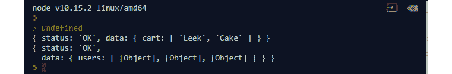

    ###### 图 8.2:修改 runRequest 函数后的输出

    它非常有趣，因为它首先输出`getCart`的结果，然后输出`getUsers`的结果。 由于 JavaScript 的异步和非阻塞特性，程序的行为是这样的。 在我们的操作中，因为`getCart`函数只需要 500 毫秒就可以完成，所以它将是第一个输出。

7.  Modify the preceding function to output the cart of the first user:

    ```js
    function runRequests() {
    ```

    ```js
       slowAPI.getUsers((error, response) => {
    ```

    ```js
          if (error) {
    ```

    ```js
            console.error('Error occurred when running getUsers');
    ```

    ```js
            throw new Error('Error occurred');
    ```

    ```js
          }
    ```

    ```js
          slowAPI.getCart(response.data.users[0].name,(error,result) => {
    ```

    ```js
            if (error) {
    ```

    ```js
               console.error(error);
    ```

    ```js
               throw new Error('Error occurred');
    ```

    ```js
            }
    ```

    ```js
            console.log(result);
    ```

    ```js
         });
    ```

    ```js
       });
    ```

    ```js
    }
    ```

    输出结果如下:

    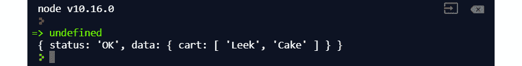

    ###### 图 8.3:第一个用户购物车的输出

    因为我们将使用来自第一个请求的数据，所以必须在第一个请求的回调中为下一个请求编写逻辑。

8.  Trigger an error when accessing the cart of an unknown user:

    ```js
    function runRequests() {
    ```

    ```js
       slowAPI.getUsers((error, response) => {
    ```

    ```js
        if (error) {
    ```

    ```js
            console.error('Error occurred when running getUsers');
    ```

    ```js
            throw new Error('Error occurred');
    ```

    ```js
          }
    ```

    ```js
          slowAPI.getCart(response.data.users[1].name,(error,result) => {
    ```

    ```js
            if (error) {
    ```

    ```js
               console.error(error);
    ```

    ```js
               throw new Error('Error occurred');
    ```

    ```js
            }
    ```

    ```js
            console.log(result);
    ```

    ```js
          });
    ```

    ```js
       });
    ```

    ```js
    }
    ```

    关于从`getCart`返回的数据，我们知道的是最后一个用户不匹配任何`if`语句。 因此，当调用它时，它将抛出一个错误。 当我们运行代码时，我们会看到以下错误:

    

###### 图 8.4:打印错误

我们看到的第一个白色错误输出是我们通过`console.error`输出的错误。 可以使用日志框架根据您喜欢的错误消息或特定格式的输出进行定制。 第二个是由于进程崩溃，因为我们在`console.log`之后抛出了一个新的错误。

在这个练习中，我们检查了如何使用`setTimeout`来模拟异步函数。 是一个非常有用的函数。 虽然不建议在实际代码中使用它，但如果需要模拟在测试中花费时间或在调试软件时产生竞争条件的网络请求，那么它非常有用。 稍后，我们讨论了使用回调来使用异步函数的方法，以及在异步函数中如何进行错误处理。

接下来，我们将简要讨论为什么回调正在慢慢过时，以及如果你不正确地使用回调会发生什么。

### 事件循环

您以前可能听说过这个术语，指的是 JavaScript 如何处理耗时的操作。 了解事件循环的内部工作方式也非常重要。

当你考虑 JavaScript 最常用的用途时，你会发现它主要用于制作动态网站，而且它主要用于浏览器。 让许多人感到惊讶的是，JavaScript 代码在一个线程中运行，这为开发人员简化了许多事情，但在处理同时发生的多个操作时却带来了挑战。 在 JavaScript 运行时中，有一个无限循环在后台运行，用于管理代码的消息和处理事件。 事件循环负责消费回调队列中的回调，运行堆栈中的函数，以及调用 web api。 JavaScript 中的大多数操作都可以分为两种类型:阻塞和非阻塞。 通过阻塞，我们的意思是阻塞事件循环(您可以将其视为其他语言的普通 UI 线程)。 当事件循环被阻塞时，它将无法处理来自应用程序其他部分的任何事件，并且应用程序将冻结，直到它被解除阻塞。 以下是示例操作及其分类列表:


###### 图 8.5:样本操作及其分类表

从上面的列表中可以看到，JavaScript 中的几乎所有 I/O 都是非阻塞的，这意味着即使完成它需要比预期更多的时间，它也不会阻塞事件循环。 在任何语言中，阻塞事件循环都是一件可怕的事情，因为它会使应用程序不稳定和无响应。 这就给我们带来了一个问题:我们如何知道一个非阻塞操作是否已经完成。

### JavaScript 如何执行代码

当 JavaScript 执行阻塞代码时，它将阻塞循环并在程序继续执行其余代码之前完成操作。 如果您运行一个迭代 100 万次的循环，那么您的代码的其余部分必须等待该循环完成后才能继续。 因此，不建议在代码中使用大量阻塞操作，因为它们会影响性能、稳定性和用户体验。 当 JavaScript 执行非阻塞代码时，它通过将其交给 web api 来进行抓取、超时和休息来启动进程。 一旦操作完成，回调将被推入回调队列，以便稍后由事件循环使用。

在现代的浏览器中，这是如下实现的，其中我们有存储大部分对象分配的堆，以及用于函数调用的堆栈。 在每个事件循环周期中，事件循环优先考虑堆栈，并通过调用适当的 web api 来执行这些事件。 一旦操作完成，该操作的回调将被推入回调队列，稍后将被事件循环消耗:

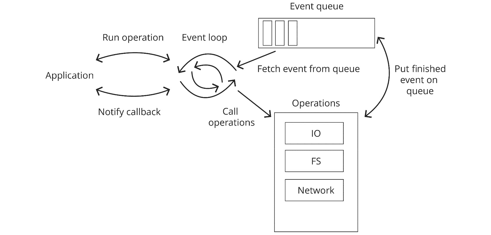

###### 图 8.6:事件循环循环

为了了解每件事情背后是如何工作的，让我们考虑以下代码:

```js
setTimeout(() => {console.log('hi')}, 2000)
while(true) {
   ;
}
```

从它的外观来看，代码做了两件事:它创建了一个超时，在 2 秒后打印出'`hi`'，以及一个什么都不做的无限循环。 当您运行前面的代码时，它的行为会有点奇怪——什么也不会打印出来，程序只是挂起。 它这样做的原因是，事件循环更喜欢堆栈上的项，而不是回调队列中的项。 因为我们有一个无限的`while`循环，它不断推入调用堆栈，事件循环被运行循环所占用，并忽略回调队列中已完成的`setTimeout`回调。 关于`setTimeout`工作方式的另一个有趣的事实是，我们可以使用它来延迟我们的函数到事件循环的下一个循环。 考虑以下代码:

```js
setTimeout(() => {console.log('hi again')}, 0)
console.log('hi');
```

这里，我们有`setTimeout`后面跟着`console.log`，但这里我们使用`0`作为超时，这意味着我们希望立即完成。 一旦超时完成，回调被推入回调队列，因为我们的事件循环更倾向于调用堆栈，你可以期待这样的输出:


###### 图 8.7:超时完成后的输出

我们看到`hi`在`hi again`之前打印出来，因为即使我们将超时设置为 0，它仍然会最后执行，因为事件循环会在回调队列中的项之前执行调用堆栈中的项。

### 活动 11:使用回调来接收结果

在这个活动中，我们将使用回调来接收结果。 假设你是当地一家天然气公司的软件工程师，他们希望你为他们编写一个新功能:

*   您将得到一个客户端 API 库，可以使用该库请求本地用户列表。
*   您需要实现一个特性，为这些用户计算账单，并按照如下格式返回结果:

    ```js
    {
    ```

    ```js
       id: 'XXXXX',
    ```

    ```js
       address: '2323 sxsssssss',
    ```

    ```js
       due: 236.6
    ```

    ```js
    }
    ```

*   您需要实现一个`calculateBill`函数，该函数使用`id`并为该用户计算煤气费。

为此，您需要请求用户列表，并获得这些用户及其使用情况的费率。 最后，计算最终到期金额并返回合并结果。

#### 请注意

这个活动的代码文件可以在[https://github.com/TrainingByPackt/Professional-JavaScript/tree/master/Lesson08/Activity11](https://github.com/TrainingByPackt/Professional-JavaScript/tree/master/Lesson08/Activity11)中找到。

执行以下步骤来完成活动:

1.  创建一个以`id`和一个回调函数为参数的`calculate`函数。
2.  呼叫`getUsers`以获得所有用户，这将给我们提供我们需要的地址。
3.  请致电`getUsage`以获得我们用户的使用。
4.  最后，调用`getRate`以得到我们正在计算的用户的比率。
5.  使用现有的 ID 调用`calculate`函数。
6.  Invoke the `calculate` function using an ID that does not exist to check the resulting error.

    你应该看到下面的输出和返回的错误:

    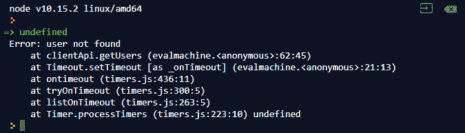

###### 图 8.8:使用不存在的 ID 调用函数

#### 请注意

这个活动的解决方案可以在 613 页找到。

在这个活动中，我们实现的特性与您在现实世界中可能看到的非常相似。 我们在一个函数中使用多个异步操作。 接下来，我们将讨论回调地狱，以及当我们处理多个异步操作时，它如何成为一个问题。

## 回叫地狱

回调地狱指的是 JavaScript 开发人员在处理大型项目时所面临的障碍。 回调地狱的原因并不完全是开发人员的错; 部分原因在于 JavaScript 处理异步操作的方式。 通过使用回调来处理多个异步操作，事情很容易失控。 下面的代码演示了一个回调地狱的例子:

```js
request('url', (error, response) => {
   // Do something here
   request('another url', (error, response) => {
      disk.write('filename', (result) => {
        if (result.this) {
           process(something, (result) => {
              request('another url', (error, response) => {
                if (response.this) {
                   request('this', (error, response) => {
                      // Do something for this
                   })
                } else {
                   request('that', (error, response) => {
                      if (error) {
                        request('error fallback', (error, response) => {
                           // Error fallback
                        })
                      }
                      if (response.this) {
                      }
                   })
                }
              });
           })
        } else {
           process(otherthing, (result) => {
              // Do something else
           })
        }
      })
   })
})
```

前面的代码示例是回调地狱的一个完美示例。 尽管这段代码比您在现实世界中发现的实际回调地狱代码要短，但它同样糟糕。 回调地狱是指代码块中嵌套了太多回调，以至于开发人员很难理解、维护甚至调试代码的情况。 如果前面的代码用于实现实际的业务逻辑，那么它将扩展到 200 行以上。 有了这么多行和这么多层次的嵌套，它会产生以下问题:

*   很难弄清楚你现在在哪个复试中。
*   它可能导致变量名称冲突和覆盖。
*   几乎不可能对代码进行调试和断点设置。
*   代码将很难重用。
*   代码是不可测试的。

这些问题只是回调地狱可能导致的一系列问题中的一部分。 这就是为什么很多公司甚至在面试问题中包含关于“回调地狱”的问题。 有许多建议的方法可以使代码比前面的代码更具可读性。 一种方法是将几乎每个回调都作为一个单独的函数提取出来。 使用这种技术，前面的代码可以修改如下:

```js
function doAnotherUrl(error, response) {
   if (response.this) {
      request('this', (error, response) => {
        // Do something for this
      })
   } else {
      request('that', (error, response) => {
        if (error) {
           request('error fallback', (error, response) => {
              // Error fallback
           })
        }
        if (response.this) {
        }
      })
   }
}
function process(result) {
   request('another url', doAnotherUrl);
}
function afterWrite(result) {
   if (result.this) {
      process(something, afterProcess)
   } else {
      process(otherthing, afterProcess)
   }
}
function doAnotherThing(error, response) {
   disk.write('filename', afterWrite)
}
function doFirstThing(error, response) {
   // Do something here
   request('another url', doAnotherThing)
}
request('url', doFirstThing)
```

当代码被这样重写时，我们可以看到所有的处理函数都被分离出来了。 稍后，我们可以将它们放在一个单独的文件中，并使用`require()`引用它们来导入它。 这确实解决了将所有代码放在一个地方的问题和可测试性问题。 它还使代码库不必要地庞大和分散。 在 ES6 中，这个承诺被引入。 它为处理异步操作开辟了一种全新的方式。 在下一节中，我们将讨论承诺是如何工作的，以及如何使用它们将我们从回调地狱中拯救出来。

### 承诺

在 JavaScript 中，promise 是一个表示未来某个值的对象。 通常，它是异步操作的包装器。 承诺也可以在函数中传递，并用作承诺的返回值。 因为 promise 表示异步操作，所以它可以有以下状态之一:

*   Pending，意思是承诺正在等待，这意味着可能有一个异步操作仍在运行，并且没有办法确定其结果。
*   已完成，表示异步操作已经完成，没有错误，值已经准备好接收。
*   被拒绝，表示异步操作已经错误结束。

一个承诺只能有上述三种状态中的一种。 当一个承诺被实现时，它将调用提供给`.then`承诺函数的处理程序，当它被拒绝时，它将调用提供给`.catch`承诺函数的处理程序。

要创建一个承诺，我们在`Promise`构造函数中使用`new`关键字。 构造函数接受一个函数，该函数将包含异步操作的代码。 它还传递两个函数作为参数，`resolve`和`reject`。 当异步操作完成并准备传递该值时，使用结果值调用`resolve`。 当异步操作失败时调用`reject`，你想返回失败原因，通常是一个错误对象:

```js
 const myPromise = new Promise((resolve, reject) => {

});
```

下面的代码使用 Promise。 决心返回承诺:

```js
const myPromiseValue = Promise.resolve(12);
```

`Promise.resolve`返回一个承诺，该承诺被解析为作为参数传递下去的值。 当您希望保持代码库的一致性，或者不确定某个值是否是承诺时，它是非常有用的。 一旦使用`Promise.resolve`包装了值，就可以使用`then`处理程序开始处理承诺的值。

在下一个练习中，我们将看看如何使用承诺来处理异步操作，以及如何将多个异步操作与承诺组合在一起而不会导致回调地狱。

### 练习 62:使用承诺作为回调的替代

在上一个活动中，我们讨论了如何将多个异步操作组合成一个结果。 它很容易理解，但也会使代码非常长，难以管理。 我们讨论了回叫地狱以及如何避免它。 我们可以做的一件事是利用 ES6 中引入的`Promise`对象。 在本练习中，我们将介绍在应用程序中使用承诺的方法。

#### 请注意

这个练习的代码文件可以在[https://github.com/TrainingByPackt/Professional-JavaScript/tree/master/Lesson08/Exercise62](https://github.com/TrainingByPackt/Professional-JavaScript/tree/master/Lesson08/Exercise62)中找到。

执行以下步骤来完成练习:

1.  Create a promise:

    ```js
    const myPromise = new Promise(() => {
    ```

    ```js
    });
    ```

    当创建承诺时，我们需要在`Promise`构造函数中使用`new`关键字。 构造函数要求你提供一个解析器函数来执行异步操作。 当一个承诺被创建时，它将自动调用解析器函数。

2.  Add an operation to the resolver function:

    ```js
    const myPromise = new Promise(() => {
    ```

    ```js
       console.log('hi');
    ```

    ```js
    });
    ```

    输出结果如下:

    

    ###### 图 8.9:向解析器函数添加操作

    即使`console.log`不是一个异步操作，当我们创建一个承诺时，它将自动执行解析器函数并打印出`hi`。

3.  Resolve the promise using `resolve`:

    ```js
    const myPromise = new Promise((resolve) => {
    ```

    ```js
       resolve(12);
    ```

    ```js
    });
    ```

    ```js
    myPromise
    ```

    当函数被调用时，一个`resolve`函数被传递给解析器函数。 当它被召唤的时候，应许就会得到解决:

    

    ###### 图 8.10:调用函数后解析的承诺

4.  Retrieve the value using the `then()` function. By attaching a `then` handler, you are expected to read the resolved promise value from the callback:

    ```js
    const myPromise = new Promise((resolve) => {
    ```

    ```js
       resolve(12);
    ```

    ```js
    }).then((value) => {
    ```

    ```js
       console.log(value);
    ```

    ```js
    });
    ```

    输出结果如下:

    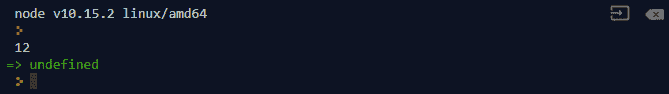

    ###### 图 8.11:使用 then 函数检索值

    每当您创建一个承诺时，您都希望异步函数完成并返回一个值。

5.  创建立即解决的承诺:

    ```js
    const myPromiseValue = Promise.resolve(12);
    ```

6.  Create an immediately rejected promise:

    ```js
    const myRejectedPromise = Promise.reject(new Error('rejected'));
    ```

    输出结果如下:

    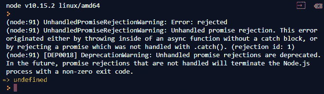

    ###### 图 8.12:立即被拒绝的承诺创建

    就像`Promise.resolve`一样，使用`Promise.reject`创建一个承诺，将返回一个与你提供的理由被拒绝的承诺。

7.  Handle `error` in the promise using `catch`:

    ```js
    myRejectedPromise.catch((error) => {
    ```

    ```js
       console.log(error);
    ```

    ```js
    });
    ```

    您可以使用`catch`提供错误处理程序。 这将向承诺添加一个拒绝回调。 当你提供一个 catch 处理程序时，promise 返回的错误将作为处理程序的参数传递:

    

    ###### 图 8.13:使用 catch 处理承诺中的错误

8.  ```js
    function wait(seconds) {
    ```

    ```js
       return new Promise((resolve) => {
    ```

    ```js
          setTimeout(() => {
    ```

    ```js
            resolve(seconds);
    ```

    ```js
          }, seconds * 1000);
    ```

    ```js
       })
    ```

    ```js
    }
    ```

9.  Use an `async` function to delay our console log:

    ```js
    wait(2).then((seconds) => {
    ```

    ```js
       console.log('i waited ' + seconds + ' seconds');
    ```

    ```js
    });
    ```

    输出结果如下:

    

    ###### 图 8.14:使用异步函数延迟控制台日志

    如您所见，使用它非常简单。 我们的`wait`函数每次调用都返回一个新的承诺。 要在操作完成后运行代码，请将其传递到`then`处理程序。

10.  Chain the promises using the `then` function:

    ```js
    wait(2)
    ```

    ```js
       .then(() => wait(2))
    ```

    ```js
       .then(() => {
    ```

    ```js
          console.log('i waited 4 seconds');
    ```

    ```js
       });
    ```

    输出结果如下:

    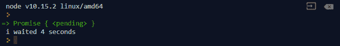

###### 图 8.15:使用 then 函数链接的 promise

例如，当我们想要将两个承诺链接在一起时，我们所需要做的就是将它们传递到`then`处理程序中，并确保结果也是一个承诺。 在这里，我们看到，在调用`wait`2 秒后，我们调用另一个`wait`2 秒，并确保在第一个`wait`结束后计时器开始。

在这个练习中，我们学习了几种创建承诺的方法，以及如何创建一个使用承诺而不是回调来处理操作的异步函数。 最后，我们使用`then`函数链接承诺。 这些都是使用承诺的简单方法。 在下一章中，我们将讨论如何有效地链接它们，以及如何处理来自承诺的错误。

### 连锁承诺

在上一个练习中，我们看了一种非常简单的链式承诺的方法。 承诺链接也可能很复杂，正确地执行它可以避免代码中的许多潜在问题。 当你在设计一个复杂的应用程序，需要你一次执行多个异步操作时，很容易陷入回调地狱当使用回调。 使用承诺可以解决一些与回调地狱相关的问题，但它不是一颗银弹。 通常，你会看到这样的代码:

```js
getUser('name').then((user) => {
   increaseLike(user.id).then((result) => {
      readUser(user.id).then((user) => {
        if (user.like !== result.like) {
           generateErrorLog(user, 'LIKE').then((result) => {
              response.send(403);
           })
        } else {
           updateAvatar(user).then((result) => {
              optimizeImage(result.image).then(() => {
                response.send(200);
              })
           })
        }
      });
   });
}).catch((error) => {
   response.send(403);
});
```

当您看到这样编写的代码时，很难判断切换到承诺是否解决了任何问题。 前面的代码与我们的回调代码有相同的问题; 所有的逻辑都是分段和嵌套的。 我们还存在其他问题，比如可能会意外覆盖上作用域中的值。

当我们在编写承诺代码时，我们应该考虑使代码尽可能模块化，并将操作集合视为一个管道。 对于我们前面的例子，管道是这样的:


###### 图 8.16:示例管道(操作的集合)

您将看到，我们希望将值从一个进程输送到下一个进程。 这有助于我们实现连锁承诺，并使我们的代码非常干净，非常易于维护。 我们可以将前面的代码重写如下:

```js
function increaseLike(user) {
   return new Promise((resolve) => {
      resolve({
        // Some result
      })
   });
};
function readUser(result) {
   return new Promise((resolve) => {
      resolve({
        // Return user
      })
   });
}
function updateAvatar(user) {
   return new Promise((resolve) => {
      resolve({
        // Return updated avatar
      })
   });
}
function optimizeImage(user) {
   return new Promise((resolve) => {
      resolve({
        // Return optimized images
      })
   });
}
function generateErrorLog(error) {
   // Handle some error
}
readUser('name')
   .then(increaseLike)
   .then(readUser)
   .then(updateAvatar)
   .then(optimizeImage)
   .catch(generateErrorLog)
```

正如您所看到的，重写的代码更具可读性，任何查看此代码的人都将确切地知道将要发生什么。 当我们以这种方式传递承诺时，我们基本上是将值从一个进程传递到另一个进程。 通过使用这种方法，我们不仅解决了回调地狱的问题，而且使代码更易于测试，因为每个帮助函数都是完全独立的，除了传递给它们的参数外，它们不需要任何东西。 更不用说，如果您的应用程序的任何部分想要执行类似的操作(例如，`optimizeImage`)，您可以轻松地重用该部分代码。 在下一个练习中，我们将介绍如何使用承诺链接编写带有多个异步操作的复杂功能。

### 高级 JavaScript 承诺

在这个练习中，我们将编写一个简单的程序来运行多个异步操作，并使用承诺链接将它们的结果链接在一起。 稍后，我们还将使用`Promise`类中有用的静态方法来帮助我们同时管理多个承诺。

#### 请注意

这个活动的代码文件可以在[https://github.com/TrainingByPackt/Professional-JavaScript/tree/master/Lesson08/Exercise63](https://github.com/TrainingByPackt/Professional-JavaScript/tree/master/Lesson08/Exercise63)中找到。

执行以下步骤来完成练习:

1.  创建返回 promise 的`getProfile`和`getCart`函数。 `getProfile`应该`id`字符串作为输入和解决不同的结果基于输入:

    ```js
    function getProfile(id) {
    ```

    【5】

    ```js
          switch(id) {
    ```

    ```js
            case 'P6HB0O':
    ```

    【显示】

    ```js
            break;
    ```

    ```js
            case '2ADN23':
    ```

    ```js
               resolve({ id: '2ADN23', name: 'Rin', age: 14, dob: '1227' });
    ```

    【病人】

    ```js
            case '6FFQTU':
    ```

    ```js
               resolve({ id:'6FFQTU', name: 'Luka', age: 20, dob: '0130' });
    ```

    ```js
            break;
    ```

    【t16.1】

    ```js
               reject(new Error('user not found'));
    ```

    ```js
          }
    ```

    ```js
       });
    ```

    ```js
    }
    ```

    ```js
    function getCart(user) {
    ```

    ```js
       return new Promise((resolve, reject) => {
    ```

    ```js
          switch(user.id) {
    ```

    ```js
            case 'P6HB0O':
    ```

    ```js
               resolve(['leek', 'cake', 'notebook']);
    ```

    ```js
            break;
    ```

    ```js
            case '2ADN23':
    ```

    ```js
               resolve(['ice cream', 'banana']);
    ```

    ```js
            break;
    ```

    ```js
            case '6FFQTU':
    ```

    ```js
               resolve(['tuna', 'tako']);
    ```

    ```js
            break;
    ```

    ```js
            default:
    ```

    ```js
               reject(new Error('user not found'));
    ```

    ```js
          }
    ```

    ```js
       });
    ```

    ```js
    }
    ```

2.  Create another async function, `getSubscription`, which takes an ID and resolves `true` and `false` values for that ID:

    ```js
    function getSubscription(id) {
    ```

    ```js
       return new Promise((resolve, reject) => {
    ```

    ```js
          switch(id) {
    ```

    ```js
            case 'P6HB0O':
    ```

    ```js
               resolve(true);
    ```

    ```js
            break;
    ```

    ```js
            case '2ADN23':
    ```

    ```js
               resolve(false);
    ```

    ```js
            break;
    ```

    ```js
            case '6FFQTU':
    ```

    ```js
               resolve(false);
    ```

    ```js
            break;
    ```

    ```js
            default:
    ```

    ```js
               reject(new Error('user not found'));
    ```

    ```js
          }
    ```

    ```js
       });
    ```

    ```js
    }
    ```

    这里，函数只接受一个字符串 ID 作为输入。 如果我们想将其链接到承诺链中，我们需要确保向该函数提供的承诺解析为单个字符串值。

3.  Create `getFullRecord`, which returns a combined record for `id`:

    ```js
    function getFullRecord(id) {
    ```

    ```js
       return {
    ```

    ```js
          id: '',
    ```

    ```js
          age: 0,
    ```

    ```js
          dob: '',
    ```

    ```js
          name: '',
    ```

    ```js
          cart: [],
    ```

    ```js
          subscription: true
    ```

    ```js
       };
    ```

    ```js
    }
    ```

    在`getFullRecord`函数中，我们希望调用前面所有的函数，并将记录合并到前面代码中所示的返回中。

4.  Call the function we declared before, in `getFullRecord`, and return the combined result from `getProfile`, `getCart`, and `getSubscription`:

    ```js
    function getFullRecord(id) {
    ```

    ```js
       return getProfile(id).then((user) => {
    ```

    ```js
          return getCart(user).then((cart) => {
    ```

    ```js
            return getSubscription(user.id).then((subscription) => {
    ```

    ```js
               return {
    ```

    ```js
                  ...user,
    ```

    ```js
                  cart: cart,
    ```

    ```js
                  subscription
    ```

    ```js
               };
    ```

    ```js
            });
    ```

    ```js
          });
    ```

    ```js
       });
    ```

    ```js
    }
    ```

    这个函数也返回一个承诺。 可以调用该函数并输出其值:

    ```js
    getFullRecord('P6HB0O').then(console.log);
    ```

    这将返回以下输出:

    

    ###### 图 8.17:调用`getFullRecord`中声明的函数

    但是我们的代码非常混乱，它并没有真正利用我们之前提到的承诺链接。 为了解决这个问题，我们需要对`getCart`和`getSubscription`进行修改。

5.  更新`getCart`函数,它返回一个新对象,包括`user`对象的每个属性和`cart`项而不是返回`cart`项目:

    ```js
    function getCart(user) {
    ```

    【5】

    ```js
          switch(user.id) {
    ```

    ```js
            case 'P6HB0O':
    ```

    【显示】

    ```js
            break;
    ```

    ```js
            case '2ADN23':
    ```

    ```js
               resolve({ ...user, cart: ['ice cream', 'banana'] });
    ```

    【病人】

    ```js
            case '6FFQTU':
    ```

    ```js
               resolve({ ...user, cart: ['tuna', 'tako'] });
    ```

    ```js
            break;
    ```

    【t16.1】

    ```js
               reject(new Error('user not found'));
    ```

    ```js
          }
    ```

    ```js
       });
    ```

    ```js
    }
    ```

6.  更新`getSubscription`函数,它接受`user`对象作为输入并返回一个对象,而不是一个单一的值:

    ```js
    function getSubscription(user) {
    ```

    ```js
       return new Promise((resolve, reject) => {
    ```

    【4】【5】

    ```js
               resolve({ ...user, subscription: true });
    ```

    ```js
               break;
    ```

    【显示】

    ```js
               resolve({ ...user, subscription: false });
    ```

    ```js
               break;
    ```

    ```js
            case '6FFQTU':
    ```

    【病人】

    ```js
               break;
    ```

    ```js
            default:
    ```

    ```js
               reject(new Error('user not found'));
    ```

    【t16.1】

    ```js
       });
    ```

    ```js
    }
    ```

7.  Update the `getFullRecord` function:

    ```js
    function getFullRecord(id) {
    ```

    ```js
       return getProfile(id)
    ```

    ```js
          .then(getCart)
    ```

    ```js
          .then(getSubscription);
    ```

    ```js
    }
    ```

    现在，这比我们以前所有的嵌套要可读性强得多。 我们只是将`getFullRecord`减少了很多，对之前的两个函数做了最小的修改。 当我们再次调用这个函数时，应该会产生完全相同的结果:

    

    ###### 图 8.18:更新了 getFullRecord 功能

8.  创建`getFullRecords`功能,我们将使用它来调用多个记录,组合成一个数组:

    ```js
    function getFullRecords() {
    ```

    ```js
       // Return an array of all the combined user record in our system
    ```

    ```js
       return [
    ```

    【4】【5】

    ```js
          },
    ```

    ```js
          {
    ```

    【显示】

    ```js
          }
    ```

    ```js
       ]
    ```

    ```js
    }
    ```

9.  Use `array.map` to generate a list of promises:

    ```js
    function getFullRecords() {
    ```

    ```js
       const ids = ['P6HB0O', '2ADN23', '6FFQTU'];
    ```

    ```js
       const promises = ids.map(getFullRecord);
    ```

    ```js
    }
    ```

    在这里，我们使用了`array.map`函数来遍历数组并返回一个新数组。 因为数组只包含 id，所以我们可以简单地传入`getFullRecord`函数。

10.  Use `Promise.all` to combine the results of a list of promises:

    ```js
    function getFullRecords() {
    ```

    ```js
       const ids = ['P6HB0O', '2ADN23', '6FFQTU'];
    ```

    ```js
       const promises = ids.map(getFullRecord);
    ```

    ```js
       return Promise.all(promises);
    ```

    ```js
    }
    ```

    `Promise.all`简单地接受一组承诺，并返回一个等待所有承诺解决的承诺。 一旦数组中的所有承诺都被解析，它将使用这些承诺的结果数组进行解析。 因为我们的目标是返回一个完整的记录列表，所以这正是我们想要的。

11.  Test out `getFullRecords`:

    ```js
    getFullRecords().then(console.log);
    ```

    输出结果如下:

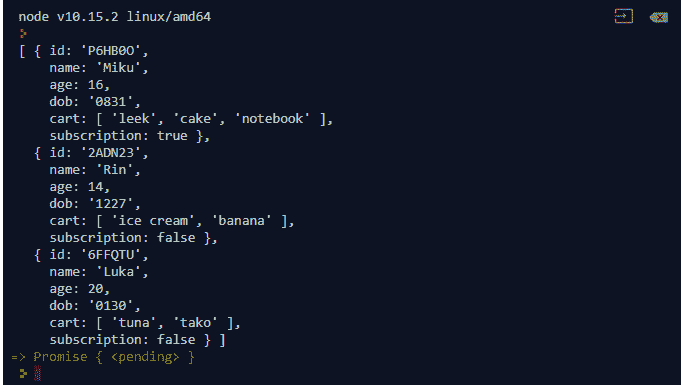

###### 图 8.19:测试 getFullRecords 函数

在这个练习中，我们使用多个异步函数及其承诺返回实现了复杂的逻辑。 我们还尝试将它们链接起来，并修改了一些函数以使链接变得更容易。 最后，我们使用了`array.map`和`Promise.all`来使用数组创建多个承诺，并等待所有承诺的解析。 这有助于我们管理多个承诺并跟踪它们的结果。 接下来，我们将讨论承诺中的错误处理。

### 承诺中的错误处理

当我们向 web 服务器发出请求或访问磁盘上的文件时，并不能保证我们想要执行的操作 100%成功。 当它没有按照我们想要的方式工作时，我们需要确保应用程序能够处理这些错误，这样它就不会意外退出或损坏我们的数据。 当我们之前为异步函数编写处理程序时，我们可以简单地从传递给回调的错误参数中获取进程返回的错误。 当我们使用 promise 时，我们也可以从`catch`处理程序中得到错误。

但是当我们处理错误时，我们不仅仅是在试图防止不好的事情发生在我们或我们的用户身上; 我们还需要确保我们的错误有足够的意义，以便我们使用这些信息，并防止错误再次发生。 一般来说，如果我们想处理承诺中的错误，我们可以只做以下操作:

```js
aFunctionReturnsPromise()
   .then(dosomething)
   .catch((error) => {
   // Handle some error here
});
```

当我们想处理某种类型的错误时，我们可以调用`catch`函数并将错误处理程序传递给它。 但如果我们同时要处理多个承诺呢? 如果我们使用承诺链接呢? 当处理多个承诺时，你可能会认为我们需要这样做:

```js
aFunctionReturnsPromise().then((result) => {
   anotherFunctionReturnsPromise().then((anotherResult) => {
   }).catch((error) => {
      // Handle error here
   });
}).catch((error) => {
   // handle error
})
```

这里，我们正在处理来自`aFunctionReturnsPromise`函数返回的承诺的任何类型的错误。 在这个承诺的`then`处理程序中，我们调用`anotherFunctionReturnsPromise`，在这个`then`处理程序中，我们处理来自这个承诺的错误。 这看起来并不太糟糕，因为我们只使用了两个嵌套的承诺，因此将它们链接起来并不是严格必要的，而且我们将分别处理每个错误。 但通常，当你看到人们写这样的代码时，你也会看到这样的代码:

```js
aFunctionReturnsPromise().then((result) => {
   return anotherFunctionReturnsPromise().then((anotherResult) => {
      // Do operation here
   }).catch((error) => {
      // Handle error here
      logError(error);
      throw new Error ('something else');
   });
}).catch((error) => {
   // handle error
   logError(error);
   throw new Error ('something else');
});
```

我甚至见过这样编写的产品级代码。 虽然对许多开发人员来说这看起来是个好主意，但这并不是处理承诺错误的理想方式。 有一些用例可以用这种方式处理错误。 一种是，如果你确定你将得到的错误类型你想为每一种不同类型做自定义处理。 当您有这样的代码时，很容易在日志文件中出现重复，因为正如您从前面的代码中看到的那样，错误被记录了两次:一次在嵌套 promise 的 catch 处理程序中，一次在父 promise 中。 为了减少错误处理的重复，你可以简单地删除嵌套 promise 中的任何处理程序，所以前面的代码看起来像这样:

```js
aFunctionReturnsPromise().then((result) => {
   return anotherFunctionReturnsPromise().then((anotherResult) => {
      // Do operation here
   });
}).catch((error) => {
   // handle error
   logError(error);
   throw new Error ('something else');
});
```

您不必担心嵌套 promise 中的错误没有被处理——因为我们在`then`处理程序中返回 promise，我们传递的是状态，而不是值。 因此，当嵌套的 promise 遇到错误时，它最终会被父错误处理程序中的`catch`处理程序捕获。

我们必须记住的一件事是，当我们使用 promise 时，当出现错误时不会调用`then`处理程序。 考虑下面的例子:

```js
processSomeFile().then(() => {
   // Cleanup temp files
   console.log('cleaning up');
}).catch((error) => {
   console.log('oh no');
});
```

假设您正在创建一个文件处理函数，在它完成处理之后，您在`then`处理程序中运行您的清理逻辑。 当我们有错误时，这会产生一个问题，因为当这个承诺被拒绝时，清理过程将永远不会被调用。 这可能会导致很多问题。 我们可能会耗尽磁盘空间，因为临时文件没有被删除。 如果没有正确地关闭连接，还可能存在内存泄漏的风险。 为了解决这个问题，一些开发人员采用了简单的方法，复制了清理逻辑:

```js
processSomeFile().then(() => {
   // Cleanup temp files
   console.log('cleaning up');
}).catch((error) => {
   // Cleanup temp files
   console.log('cleaning up');
   console.log('oh no');
})
```

虽然这解决了我们的问题，但它也创建了一个复制的块，所以最终，当我们想要在清理过程中更改一些逻辑时，我们需要记住在两个地方都做更改。 幸运的是，`Promise`类为我们提供了一个非常有用的处理程序，我们可以设置它，以确保不管状态如何，该处理程序总是被调用:

```js
   processSomeFile().then(() => {
}).catch((error) => {

   console.log('oh no');
}).finally(() => {
   // Cleanup temp files
   console.log('cleaning up');
})
```

这里，我们向 promise 添加了一个新的处理程序类型。 当 promise 为`settled`时，`.finally`处理程序总是被调用，无论它是被解析还是被拒绝。 这是一个非常有用的处理程序，我们可以设置我们的承诺，以确保我们正确地清理连接或删除文件。

在前面的练习中，我们设法使用`Promise.all`从承诺列表中获取结果列表。 在我们的例子中，所有的承诺最终都得到了解决，我们得到了一个非常干净的数组。 当我们不确定承诺的结果时，我们该如何处理? 考虑上一个练习中的`getFullRecords`函数; 当我们运行这个函数时，它会执行以下语句:


###### 图 8.20:执行 getFullRecords 函数

该函数同时执行所有这三个操作，并将在它们被解析时进行解析。 让我们修改`getFullRecords`函数，使其输出一个错误:

```js
function getFullRecords() {
   const ids = ['P6HB0O', '2ADN23', 'Not here'];
   const promises = ids.map(getFullRecord);
   return Promise.all(promises);
}
```

我们知道我们提供的第三个 ID 在我们的`getProfile`函数中不存在，所以它将被拒绝。 当我们运行这个函数时，我们会得到这样的输出:

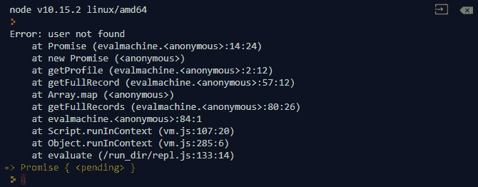

###### 图 8.21:运行 getProfile 函数时出错

`Promise.all`等待数组中所有的承诺都被解决，如果其中一个请求被拒绝，将返回一个被拒绝的承诺。 当你使用`Promise.all`处理多个承诺时，请记住这一点; 如果一个 promise 请求被拒绝，请确保在错误消息中包含尽可能多的信息，以便您能够知道哪个操作被拒绝了。

### 练习 64:使用承诺重构账单计算器

在上一个练习中，我们使用回调函数编写了账单计算器逻辑。 假设你工作的公司现在升级了他们的 Node.js 运行时，他们要求你用 promise 重写那部分逻辑。 打开`promises.js`文件，你会看到更新的`clientApi`使用 promise 重写:

#### 请注意

promise .js 可在[https://github.com/TrainingByPackt/Professional-JavaScript/tree/master/Lesson08/Exercise64](https://github.com/TrainingByPackt/Professional-JavaScript/tree/master/Lesson08/Exercise64)下载。

*   你被给予`clientApi`，它支持承诺。
*   您需要实现一个特性，为用户计算账单，并以如下格式返回结果:

    ```js
    {
    ```

    ```js
       id: 'XXXXX',
    ```

    ```js
       address: '2323 sxsssssss',
    ```

    ```js
       due: 236.6
    ```

    ```js
    }
    ```

*   您需要实现一个`calculateBill`函数，该函数接受一个 ID 并为该用户计算煤气账单。
*   您需要实现一个新的`calculateAll`函数来计算从`getUsers`到所有用户的账单。

我们将打开包含`clientApi`的文件，并在那里进行我们的工作。

执行以下步骤来实现练习:

1.  我们将首先创建`calculate`函数。 这次我们只通过`id`:

    ```js
    function calculate(id) {}
    ```

2.  In `calculate`, we will call `getUsers` first:

    ```js
    function calculate(id) {
    ```

    ```js
    return clientApi.getUsers().then((result) => {
    ```

    ```js
       const currentUser = result.users.find((user) => user.id === id);
    ```

    ```js
       if (!currentUser) { throw Error('user not found'); }
    ```

    ```js
    }
    ```

    ```js
    }
    ```

    因为我们要计算并返回一个承诺，而`getUsers`返回一个承诺，所以当调用`getUsers`时，我们只返回一个承诺。 在这里，我们将运行相同的`find`方法来查找当前正在计算的用户。 然后，如果用户不存在，我们可以在`then`处理程序中抛出一个错误。

3.  Call `getUsage` inside the `then` handler of `getUsers`:

    ```js
    function calculate(id) {
    ```

    ```js
    return clientApi.getUsers().then((result) => {
    ```

    ```js
       const currentUser = result.users.find((user) => user.id === id);
    ```

    ```js
       if (!currentUser) { throw Error('user not found'); }
    ```

    ```js
    return clientApi.getUsage(currentUser.id).then((usage) => {
    ```

    ```js
    });
    ```

    ```js
    }
    ```

    ```js
    }
    ```

    在这里，我们返回`clientApi`，因为我们想把我们的承诺链起来，想让最深处的承诺浮出水面，得到解决。

4.  Call `getRate` inside the `then` handler of `getUsage`:

    ```js
    function calculate(id) {
    ```

    ```js
       return clientApi.getUsers().then((result) => {
    ```

    ```js
          const currentUser = result.users.find((user) => user.id === id);
    ```

    ```js
          if (!currentUser) { throw Error('user not found'); }
    ```

    ```js
          return clientApi.getUsage(currentUser.id).then((usage) => {
    ```

    ```js
             return clientApi.getRate(currentUser.id).then((rate) => {
    ```

    ```js
       return {
    ```

    ```js
          id,
    ```

    ```js
          address: currentUser.address,
    ```

    ```js
          due: (rate * usage.reduce((prev, curr) => curr + prev)).toFixed(2)
    ```

    ```js
       };
    ```

    ```js
    });
    ```

    ```js
    });
    ```

    ```js
    }
    ```

    ```js
    }
    ```

    这是我们需要调用的最后一个函数。 我们在这里也将使用`return`。 在我们的`then`处理程序中，我们将有我们需要的所有信息。 在这里，我们可以运行计算并直接返回值。 这个值将是我们返回的承诺的解析值。

5.  创建`calculateAll`功能:

    ```js
    function calculateAll() {}
    ```

6.  ```js
    function calculateAll() {
    ```

    ```js
       return clientApi.getUsers().then((result) => {});
    ```

    ```js
    }
    ```

7.  Here, the result will be a list of the users in our system. Then, we will run `calculate` on each of them. Use `Promise.all` and a map array to call the `calculate` function on every user:

    ```js
    function calculateAll() {
    ```

    ```js
       return clientApi.getUsers().then((result) => {
    ```

    ```js
          return Promise.all(result.users.map((user) => calculate(user.id)));
    ```

    ```js
    });
    ```

    ```js
    }
    ```

    我们使用一个 map 数组来返回一个新的承诺数组。 promise 数组将是我们调用现有的`calculate`函数时返回的 promise。 当我们将该数组提供给`Promise.all`时，它将返回一个承诺，该承诺将解析为承诺列表中的结果列表。

8.  Call `calculate` on one of our users:

    ```js
    calculate('DDW2AU').then(console.log)
    ```

    输出结果如下:

    

    ###### 图 8.22:调用计算我们的一个用户

9.  Call the `calculateAll` function:

    ```js
    calculateAll().then(console.log)
    ```

    输出结果如下:

    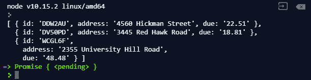

###### 图 8.23:调用 calculateAll 函数

在前面的练习和活动中，我们创建了使用回调函数计算多个异步函数结果的函数，然后使用 promise 重写了这些函数。 现在，您知道了如何使用承诺重构旧的回调风格的代码。 当您正在重构大项目时，这是非常有用的，这些项目需要您开始使用承诺，同时保持相同的功能。 在下一章中，我们将介绍一种处理异步函数的新方法。

## 异步和等待

在不需要编写包装器的情况下处理异步函数一直是 JavaScript 开发人员的梦想。 然后，一个新特性被引入，它改变了我们对 JavaScript 异步操作的所有了解。 考虑我们在上一个练习中使用的代码:

```js
function getFullRecord(id) {
   return getProfile(id)
      .then(getCart)
      .then(getSubscription);
}
```

它很简单，因为我们使用了承诺链接，但它实际上没有告诉我们更多的东西，看起来我们只是调用了一堆函数。 如果我们有这样的东西:

```js
function getFullRecord(id) {
   const profile = getProfile(id);
   const cart = getCart(id);
   const subscription = getSubscription(id);
   return {
      ...profile,
      cart,
      subscription
   };
}
```

现在，当您查看前面的代码时，它更有意义，它看起来就像我们只是调用一些非异步函数来获取数据，然后返回组合数据。 这就是 async 和 await 可以实现的。 通过使用 async 和 await，我们可以像这样编写代码，同时保持对异步操作的完全控制。 考虑一个简单的`async`函数，它返回一个承诺:

```js
function sayHello() {
   return Promise.resolve('hello world');
}
```

这只是一个简单的`async`函数，就像我们在前面的练习和活动中使用的一样。 通常，如果我们想调用这个函数并获取返回的 promise 的值，我们需要执行以下命令:

```js
sayHello().then(console.log)
```

输出结果如下:


###### 图 8.24:获取返回的承诺的值

这种方法没有什么新意; 我们仍然调用函数来返回一个承诺，然后通过`then`处理程序获取解析值。 如果我们想要使用新的 async 和 await 特性，我们首先创建一个函数来运行这个操作:

```js
async function printHello() {
   // Operation here
}
```

我们所做的只是在`function`关键字前加上`async`。 我们这样做是为了将这个函数标记为`async`函数，这样我们就可以在`printHello()`函数的`sayHello`函数上使用`await`，而不需要使用`then`处理器:

```js
async function printHello() {
   // Operation here
   const message = await sayHello();
   console.log(message);
}
```

在这个`async`函数中，我们调用了`sayHello`函数，它返回一个承诺。 因为我们之前使用了`await`关键字，所以它将尝试解析该承诺，并将解析值提供给我们声明为消息的常量。 通过使用这个，我们使我们的`async`函数看起来像一个同步函数。 稍后，我们可以像普通函数一样调用该函数:

```js
printHello();
```

输出结果如下:

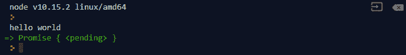

###### 图 8.25:调用 printHello 函数

### Async 和 Await 函数

在这个练习中，我们将学习如何创建异步函数并在其他异步函数中调用它们。 使用 async 和 await 可以真正帮助我们在单个函数中处理大量的异步操作。 我们将一起编写我们的第一个`async`函数，并探讨在应用程序中处理异步和 await 时需要记住的一些事情。

#### 请注意

这个活动的代码文件可以在[https://github.com/TrainingByPackt/Professional-JavaScript/tree/master/Lesson08/Exercise65](https://github.com/TrainingByPackt/Professional-JavaScript/tree/master/Lesson08/Exercise65)中找到。

执行以下步骤来完成练习:

1.  创建`getConcertList`功能:

    ```js
    function getConcertList() {
    ```

    ```js
       return Promise.resolve([
    ```

    ```js
          'Magical Mirai 2018',
    ```

    ```js
          'Magical Mirai 2019'
    ```

    ```js
       ]);
    ```

    ```js
    }
    ```

2.  Call the function and use `await`:

    ```js
    const concerts = await getConcertList();
    ```

    当我们运行前面的代码时，我们会得到这样的错误:

    

    ###### 图 8.26:使用 await 调用函数

    得到这个错误的原因是我们只能在`async`函数中使用`await`关键字。 如果要使用它，必须将语句包装在一个`async`函数中。

3.  Modify the statement and wrap it in an `async` function:

    ```js
    async function printList() {
    ```

    ```js
       const concerts = await getConcertList();
    ```

    ```js
       console.log(concerts);
    ```

    ```js
    }
    ```

    ```js
    printList();
    ```

    输出结果如下:

    

    ###### 图 8.27:修改语句并将其包装在异步函数中

    当我们运行这个函数时，我们将看到输出的列表，并且所有的事情都解决了。 我们还可以将`async`函数视为返回 promise 的函数，因此如果我们想在操作结束后运行代码，可以使用`then`处理程序。

4.  Call the `then()` function with a handler of the `async` function:

    ```js
    printList().then(() => {
    ```

    ```js
       console.log('I am going to both of them.')
    ```

    ```js
    });
    ```

    输出结果如下:

    

    ###### 图 8.28:使用 async 函数的处理程序调用 then 函数

    现在，我们知道`async`函数的行为就像一个正常的函数返回一个承诺。

5.  ```js
    function getPrice(i) {
    ```

    ```js
       const prices = [9900, 9000];
    ```

    ```js
       return Promise.resolve(prices[i]);
    ```

    ```js
    }
    ```

6.  Modify `printList` to include the price from `getPrice`:

    ```js
    async function printList() {
    ```

    ```js
       const concerts = await getConcertList();
    ```

    ```js
       const prices = await Promise.all(concerts.map((c, i) => getPrice(i)));
    ```

    ```js
       return {
    ```

    ```js
          concerts,
    ```

    ```js
          prices
    ```

    ```js
       };
    ```

    ```js
    }
    ```

    ```js
    printList().then(console.log);
    ```

    在这个函数中，我们只是试图使用`getPrice`函数得到所有的价格。 在上一节中，我们提到了如何使用`Promise.all`将承诺数组封装在一个承诺中，该承诺只解析数组中的每个承诺一次。 因为关键字`await`可以用于任何返回 promise 并解析其值的函数，所以我们可以使用它来获取价格数组。 当我们运行前面的代码时，我们将看到这个函数解析为以下内容:

    

    ###### 图 8.29:修改 printList 以包含来自 getPrice 的 price

    这意味着如果我们有一个承诺返回函数，我们就不需要再使用`then`处理程序了。 在`async`函数中，我们可以简单地使用`await`关键字来获取解析值。 然而，在`async`函数中处理错误的工作方式有点不同。

7.  创建一个返回被拒绝承诺的`buggyCode`函数:
8.  Call `buggyCode` in `printList`:

    ```js
    async function printList() {
    ```

    ```js
       const concerts = await getConcertList();
    ```

    ```js
       const prices = await Promise.all(concerts.map((c, i) => getPrice(i)));
    ```

    ```js
       await buggyCode();
    ```

    ```js
       return {
    ```

    ```js
          concerts,
    ```

    ```js
          prices
    ```

    ```js
       };
    ```

    ```js
    }
    ```

    ```js
    printList().then(console.log);
    ```

    输出结果如下:

    

    ###### 图 8.30:在 printList 中调用 buggyCode

    因为`buggyCode`抛出一个错误，这将停止函数的执行，并且在将来，它甚至可能终止我们的进程。 要处理这种类型的错误，我们需要捕获它。

9.  Use a `catch` handler on `buggyCode`:

    ```js
    async function printList() {
    ```

    ```js
       const concerts = await getConcertList();
    ```

    ```js
       const prices = await Promise.all(concerts.map((c, i) => getPrice(i)));
    ```

    ```js
       await buggyCode().catch((error) => {
    ```

    ```js
          console.log('computer produced error');
    ```

    ```js
          console.log(error);
    ```

    ```js
       });
    ```

    ```js
       return {
    ```

    ```js
          concerts,
    ```

    ```js
          prices
    ```

    ```js
       };
    ```

    ```js
    }
    ```

    ```js
    printList().then(console.log);
    ```

    我们可以像处理常规 promise 一样处理`buggyCode`的错误，并将其传递给`catch`处理程序。 这样，拒绝承诺将被标记为已处理，并且不会返回`UnhandledPromiseRejectionWarning`:

    

    ###### 图 8.31:在 buggyCode 上使用 catch 处理程序

    这是在`async`函数中处理拒绝承诺的一种方法。 还有一种更熟悉的方法。

10.  Modify error handling using `try`…`catch`:

    ```js
    async function printList() {
    ```

    ```js
       const concerts = await getConcertList();
    ```

    ```js
       const prices = await Promise.all(concerts.map((c, i) => getPrice(i)));
    ```

    ```js
       try {
    ```

    ```js
          await buggyCode();
    ```

    ```js
       } catch (error) {
    ```

    ```js
          console.log('computer produced error');
    ```

    ```js
          console.log(error);
    ```

    ```js
       }
    ```

    ```js
       return {
    ```

    ```js
          concerts,
    ```

    ```js
          prices
    ```

    ```js
       };
    ```

    ```js
    }
    ```

    ```js
    printList().then(console.log);
    ```

    输出结果如下:

    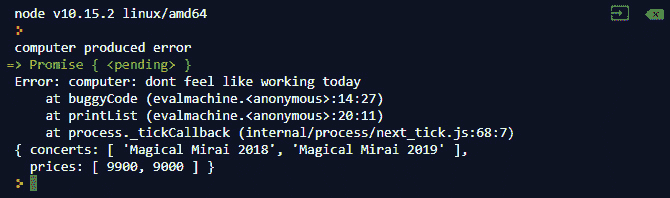

###### 图 8.32:使用 try…catch 修改错误处理

使用`try`…`catch`是许多开发人员在处理可能抛出错误的函数时所熟悉的。 为了处理`buggyCode`中的错误，使用`try`…`catch`块将使代码更具可读性，并实现异步的目标，即消除传递承诺处理程序。 接下来，我们将讨论如何正确处理多个承诺和并发性。

### 异步等待并发

在 JavaScript 中处理多个异步操作时，知道要运行的操作的顺序是至关重要的。 编写这段代码的方式可以极大地改变应用程序的行为。 让我们看一下这个例子:

```js
function wait(seconds) {
   return new Promise((resolve) => {
      setTimeout(() => {
        resolve();
      }, seconds * 1000);
   });
}
```

这是一个非常简单的函数，它返回一个只有在`n`秒过后才会解析的承诺。 为了可视化并发性，我们声明`runAsync` 函数:

```js
async function runAsync() {
   console.log('starting', new Date());
   await wait(1);
   console.log('i waited 1 second', new Date());
   await wait(2);
   console.log('i waited another 2 seconds', new Date());
}
```

当我们运行这个函数时，我们将看到我们的程序将等待 1 秒并输出第一条语句，另一条语句将在 2 秒后输出。 总等待时间为 3 秒:

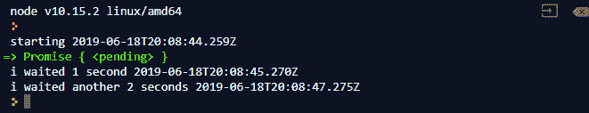

###### 图 8.33:函数返回 n 秒后解析的承诺

如果我们想同时运行两个`wait`函数呢? 在这里，我们可以使用`Promise.all`:

```js
async function runAsync() {
   console.log('starting', new Date());
   await Promise.all([wait(1), wait(2)]);
   console.log('i waited total 2 seconds', new Date());
}
```

输出结果如下:


###### 图 8.34:使用 Promise.all 运行两个等待函数

我们在这里所做的是，我们删除了`await`，并将`wait`函数返回的两个承诺放入数组中，然后将其输入`Promise.all`。 当我们删除`await`关键字并使用`Promise.all`时，我们可以确保代码没有失控，并将继续执行。 如果你在一个循环中处理承诺，如下面的代码:

```js
async function runAsync() {
   console.log('starting', new Date());
   for (let i = 0; i < 2; i++) {
      await wait(1);
   }
   console.log('i waited another 2 seconds', new Date());
}
```

这没有提供并发性。 想象一下，我们不是等待，而是从数据库中获取用户信息:

```js
async function runAsync() {
   const userProfiles = [];
   for (let i = 0; i < 2; i++) {
      const profile = await getProfile(i);
      userProfiles.push(profile);
   }
   return userProfiles;
}
```

这里，我们的用例是从数据库中获取多个用户配置文件。 虽然前面的代码可以工作，但它不是性能最好的实现。 正如我们前面提到的，这段代码将一直等到最后一个请求完成后才获取下一个请求。 为了优化这个代码，我们可以简单地使用`array.map`和`Promise.all`:

```js
async function runAsync() {
   return await Promise.all([0, 1].map(getProfile));
}
```

这样，我们就不用等待每个操作完成; 我们只等待包装承诺被解决。 在 map 数组中，我们只生成承诺，一旦它们被创建，它将执行我们的操作。 与`for`循环方法相比，我们不需要等待上一个承诺解决后再执行下一个承诺。 我们将在下一章讨论他们的不同。

### 何时使用

在前面的示例中，我们回顾了在`async`函数中使用`await`关键字。 但是我们什么时候应该使用`await`，什么时候应该避免使用? 在上一节中，我们讨论了在希望启用并发性并确保操作不会相互等待时避免使用`await`。 考虑以下代码示例:

```js
async function example() {
   const result1 = await operation1();
   const result2 = await operation2(result1.something);
   return result2;
}
```

在本例中，`operation2`函数只有在`operation1`完成后才会执行。 当您有依赖项，并且`result2`依赖于`result1`中的某些东西时，这是非常有用的，如示例所示。 如果它们彼此之间没有依赖关系，您可以利用`Promise.all`来确保并发性:

```js
async function example() {
   const result1 = operation1();
   const result2 = operation2();
   return await Promise.all([result1, result2]);
}
```

如果没有`await`关键字，代码只是在我们声明的常量中分配从两个操作返回的承诺。 这确保了`operations2`在`operation1`之后立即触发，而没有`wait`。 我们需要注意的另一点是错误处理。 考虑我们在上一个练习中使用的`buggyCode`:

```js
function buggyCode() {
   return Promise.reject(new Error('computer: dont feel like working today'));
}
```

这个函数只是返回一个被拒绝的承诺。 当使用它时，我们应该使用`catch`来处理来自承诺的错误:

```js
async function printList() {
   try {
      await buggyCode();
   } catch (error) {
      console.log('computer produced error');
      console.log(error);
   }
}
```

当我们运行这段代码时，我们将看到错误得到了很好的处理，并且错误消息被记录了下来。 这里，我们在运行`buggyCode`函数时使用了`await`，但当我们删除`await`关键字时，我们将看到:

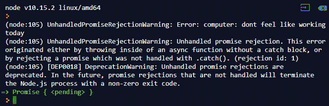

###### 图 8.35:删除 await 关键字后运行 buggyCode 函数

你会看到我们有一个未经处理的拒绝承诺; 它只是出现在我们的`try`…`catch`没有做任何事。 这样做的原因是，如果没有`await`关键字，JavaScript 将不会尝试等待承诺解析; 因此，它不知道将来会抛出错误。 这个`try`…`catch`块将捕获的是在执行函数时抛出的错误。 这是我们在使用`async`和`await`编写代码时需要记住的东西。 在下一个练习中，我们将编写一个复杂的函数，调用多个`async`函数，并能够从错误中恢复。

### 复杂异步实现

在本练习中，我们将构建一个非常复杂的`async`函数，并使用我们以前学到的所有内容，以确保该函数是高性能的，并且能够抵御错误。

#### 请注意

这个活动的代码文件可以在[https://github.com/TrainingByPackt/Professional-JavaScript/tree/master/Lesson08/Exercise66](https://github.com/TrainingByPackt/Professional-JavaScript/tree/master/Lesson08/Exercise66)中找到。

执行以下步骤来完成练习:

1.  Create a `getPlaylists` function that returns an array of IDs given a playlist name:

    ```js
    function getPlaylist(id) {
    ```

    ```js
       const playLists = {
    ```

    ```js
          'On the road': [0, 6, 5, 2],
    ```

    ```js
          'Favorites' : [1, 4, 2],
    ```

    ```js
          'Corrupted': [2, 4, 7, 1]
    ```

    ```js
       };
    ```

    ```js
       const playList = playLists[id];
    ```

    ```js
       if (!playList) {
    ```

    ```js
          throw new Error('Playlist does not exist');
    ```

    ```js
       }
    ```

    ```js
       return Promise.resolve(playLists[id]);
    ```

    ```js
    }
    ```

    这个函数将返回一个歌曲 id 数组作为播放列表。 如果没有找到，它将简单地返回`null`。

2.  `getSongUrl`创建一个函数,返回一个首歌 URL 给定一个`id`:

    ```js
    function getSongUrl(id) {
    ```

    ```js
       const songUrls = [
    ```

    【4】【5】

    ```js
          'http://example.com/3.mp3',
    ```

    ```js
          'http://example.com/4.mp3',
    ```

    【显示】

    ```js
          'http://example.com/6.mp3',
    ```

    ```js
          'http://example.com/7.mp3',
    ```

    ```js
       ];
    ```

    【病人】

    ```js
       if (!url) {
    ```

    ```js
          throw new Error('Song does not exist');
    ```

    ```js
       }
    ```

    【t16.1】

    ```js
    }
    ```

3.  `playSong`创建一个异步函数,需要一首歌的 ID 和生成两个输出——一个显示正在播放这首歌,这首歌,另一个通知用户,完成:

    ```js
    async function playSong(id) {
    ```

    ```js
       const url = await getSongUrl(id);
    ```

    ```js
       console.log(`playing song #${id} from ${url}`);
    ```

    【4】【5】

    ```js
            console.log(`song #${id} finished playing`);
    ```

    ```js
            resolve();
    ```

    【显示】

    ```js
       });
    ```

    ```js
    }
    ```

4.  Create a `playPlaylist` function that takes a playlist ID and calls `playSong` on each song in the playlist:

    ```js
    async function playPlaylist(id) {
    ```

    ```js
       const playList = await getPlayLlist(id);
    ```

    ```js
       await Promise.all(playList.map(playSong));
    ```

    ```js
    }
    ```

    这是一个不执行错误处理的简单实现。

5.  Run the `playPlaylist` function:

    ```js
    playPlaylist('On the road').then(() => {
    ```

    ```js
       console.log('finished playing playlist');
    ```

    ```js
    });
    ```

    输出结果如下:

    

    ###### 图 8.36:运行 playPlaylist 函数

    我们得到了一个非常有趣的输出; 它同时播放所有的歌曲。 而且，它不能优雅地处理错误。

6.  Call `playPlaylist` with no argument:

    ```js
    playPlaylist().then(() => {
    ```

    ```js
       console.log('finished playing playlist');
    ```

    ```js
    });
    ```

    输出结果如下:

    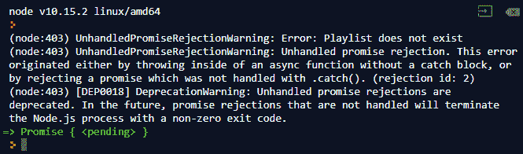

    ###### 图 8.37:不带参数调用 playPlaylist

    我们得到这个错误的原因是，当`getPlaylist`抛出错误时，我们没有处理错误。

7.  Modify `playPlaylist` to handle errors:

    ```js
    async function playPlaylist(id) {
    ```

    ```js
       try {
    ```

    ```js
          const playList = await getPlaylist(id);
    ```

    ```js
          return await Promise.all(playList.map(playSong));
    ```

    ```js
       } catch (error) {
    ```

    ```js
          console.log(error);
    ```

    ```js
       }
    ```

    ```js
    }
    ```

    我们没有做任何特别的事情; 我们只是在`getPlaylist`周围添加了一个`try…catch`块，这样当承诺被拒绝时，它将被正确处理。 更新后，当我们再次运行代码时，我们将收到以下输出:

    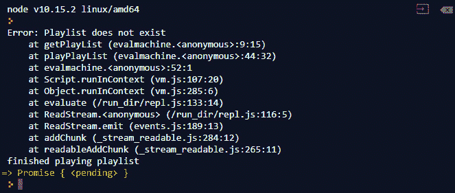

    ###### 图 8.38:修改`playPlaylist`进行错误处理

    我们看到错误得到了正确的处理，但是我们仍然在最后得到了`finished`消息。 这是我们不希望看到的，因为当错误发生时，我们不希望承诺链继续。

8.  Modify the `playPlaylist` function and the caller:

    ```js
    async function playPlaylist(id) {
    ```

    ```js
       const playList = await getPlaylist(id);
    ```

    ```js
       return await Promise.all(playList.map(playSong));
    ```

    ```js
    }
    ```

    ```js
    playPlaylist().then(() => {
    ```

    ```js
       console.log('finished playing playlist');
    ```

    ```js
    }).catch((error) => {
    ```

    ```js
       console.log(error);
    ```

    ```js
    });
    ```

    在编写`async`代码时，最好在父程序中保持承诺处理，并让错误冒泡。 这样，对于这个操作，我们只能有一个错误处理程序，并且能够一次处理多个错误。

9.  Try to call a corrupted playlist:

    ```js
    playPlaylist('Corrupted').then(() => {
    ```

    ```js
       console.log('finished playing playlist');
    ```

    ```js
    }).catch((error) => {
    ```

    ```js
       console.log(error);
    ```

    ```js
    });
    ```

    输出结果如下:

    

    ###### 图 8.39:调用损坏的播放列表

    这段代码运行得很好，错误也得到了处理，但它仍然在一起运行所有内容。 我们想显示`finished`消息，因为`song does not exist`错误是一个较小的错误，我们想抑制它。

10.  Modify `playPlaylist` to play songs sequentially:

    ```js
    async function playPlaylist(id) {
    ```

    ```js
       const playList = await getPlaylist(id);
    ```

    ```js
       for (const songId of playList) {
    ```

    ```js
          await playSong(songId);
    ```

    ```js
       }
    ```

    ```js
    }
    ```

    输出结果如下:

    

    ###### 图 8.40:修改`playPlaylist`按顺序播放歌曲

    在修改中，我们去掉了`Promise.all`，将每首歌替换为`for`循环`await`。 这可以确保我们等待每首歌完成，然后再继续下一首。

11.  Modify `playSong` to suppress the `not found` error:

    ```js
    async function playSong(id) {
    ```

    ```js
       try {
    ```

    ```js
          const url = await getSongUrl(id);
    ```

    ```js
          console.log('playing song #${id} from ${url}');
    ```

    ```js
          return new Promise((resolve) => {
    ```

    ```js
            setTimeout(() => {
    ```

    ```js
               console.log('song #${id} finished playing');
    ```

    ```js
               resolve();
    ```

    ```js
            }, Math.random() * 3 * 1000);
    ```

    ```js
          });
    ```

    ```js
       } catch (error) {
    ```

    ```js
          console.log('song not found');
    ```

    ```js
       }
    ```

    ```js
    }
    ```

    输出结果如下:

    

###### 图 8.41:修改`playSong`以抑制未发现错误

我们在这里所做的是用一个`try`…`catch`块包装我们的逻辑。 这允许我们抑制代码生成的任何错误。 当`getSongUrl`确实抛出错误时，它不会被冒泡到父节点; 它将被`catch`块捕获。

在这个练习中，我们使用`async`和`await`实现了一个播放列表播放器，并使用我们关于`Promise.all`和`async`并发性的知识来优化我们的播放列表播放器，使其一次只播放一首歌曲。 这使我们能够更深入地理解 async，并在将来实现我们自己的`async`函数。 在下一节中，我们将讨论如何将现有的基于承诺或回调的代码迁移到 async 和 await。

### Activity 12: Refactor the Bill Calculator Using Async and Await

你的公司再次更新了 Node.js 运行时。 在这个活动中，我们将使用 async 和 await 重构之前创建的账单计算器:

*   你被给予`clientApi`，使用承诺实现。
*   您需要将`calculate()`更新为`async`功能。
*   您需要将`calculateAll()`更新为`async`功能。
*   `calculateAll()`需要使用`Promise.all`一次性得到所有结果。

打开`async.js`文件，使用`async`、`await`实现`calculate`、`calculateAll`功能。

#### 请注意

这个活动的代码文件可以在[https://github.com/TrainingByPackt/Professional-JavaScript/blob/master/Lesson08/Activity12/Activity12.js](https://github.com/TrainingByPackt/Professional-JavaScript/blob/master/Lesson08/Activity12/Activity12.js)中找到。

执行以下步骤来完成活动:

1.  创建一个以 ID 作为输入的`calculate`函数。
2.  在`calculate`内部，使用`await`调用`clientApi.getUsers()`来检索所有用户。
3.  使用`array.find()`使用`id`参数查找`currentUser`。
4.  使用`await`呼叫`getUsage()`以获得该用户的使用权限。
5.  使用`await`呼叫`getRate`以获取 at 用户的费率。
6.  返回一个带有`id`，`address`和到期金额的新对象。
7.  将`calculateAll`函数写成`async`函数。
8.  使用`await`调用`getUsers`来检索所有用户。
9.  使用数组映射创建一个承诺列表，并使用`Promise.all`包装它们。 然后，对`Promise.all`返回的 promise 使用 await，返回其值。
10.  呼叫其中一个用户`calculate`。
11.  Call `calculateAll`.

    输出结果如下:

    

###### 图 8.42:调用 calculateAll 函数

#### 请注意

这个活动的解决方案可以在 615 页找到。

### 迁移回调和基于承诺的代码到异步和等待

在处理大型项目时，使用 async 和 await 重构现有代码是很常见的。 当我们进行这些重构时，我们需要记住，我们应该保持相同的功能和错误处理类型。 在本节中，我们将学习如何将现有的基于回调和承诺的代码迁移到 async 和 await。

### 将基于回调的代码迁移到异步和等待

当我们迁移基于回调的代码时，我们需要重写函数，并确保它返回一个承诺，而不是接受回调。 考虑以下代码:

```js
function makeRequest(param, callback) {
   request(param, (err, data) => {
      if (err) {
        return callback(err);
      }
      const users = data.users;
      callback(null, users.map((u) => u.id));
   });
}
```

前面的代码接受一个参数并调用一个我们无法修改的`request`模块，并返回一个用户 id 列表。 一旦完成，如果出现错误，它就通过回调函数返回。 当我们想要使用 async 和 await 重构这段代码时，我们可以首先确保它返回一个承诺。 当我们这样做时，我们也想要删除`callback`参数:

```js
function makeRequest(param) {
   return new Promise((resolve, reject) => {
      // Logic here
   });
}
```

然后，我们需要复制我们的逻辑:

```js
function makeRequest(param) {
   return new Promise((resolve, reject) => {
      request(param, (err, data) => {
        if (err) {
           return callback(err);
        }
        const users = data.users;
        callback(null, users.map((u) => u.id));
      });
   });
}
```

在这里，我们需要做一些修改。 我们需要删除所有对`callback`的引用，并将其更改为`reject`和`resolve`:

```js
function makeRequest(param) {
   return new Promise((resolve, reject) => {
      request(param, (err, data) => {
        if (err) {
           return reject(err);
        }
        const users = data.users;
        resolve(users.map((u) => u.id));
      });
   });
}
```

你可以在这里看到，当调用`request`时，我们仍然在使用回调样式。 这是因为我们无法控制外部库。 我们能做的是确保每次调用它时，都返回一个承诺。 现在，我们已经将遗留代码完全转换为现代标准。 现在你可以像这样在`async`函数中使用它:

```js
async function use() {
   const userIds = await makeRequest({});
}
```

通常，重构代码要困难得多。 建议从最基本的层次开始，并在重构过程中逐步向上。 当你处理嵌套回调时，确保你使用`await`来确保你保留依赖。

## 小结

在本章中，我们讨论了如何使用 promise 和 async 以及 await 来更好地管理代码中的异步操作。 我们还讨论了将现有的回调代码重构为 async 和 await 的各种方法。 在我们的应用程序中使用 async 和 await 不仅有助于使我们的代码更具可读性，而且还有助于我们对实现进行未来的测试。 在下一章中，我们将讨论如何在应用程序中使用基于事件的编程。