# *附录*

## 关于

这一部分是为了帮助学生完成书中的活动。 它包括学生为达到活动目标所要执行的详细步骤。

## 第 1 章:JavaScript、HTML 和 DOM

### 活动 1:从页面提取数据

**方案**:

1.  初始化一个变量来存储 CSV 的全部内容:
2.  查询 DOM 以找到表示每个产品的所有元素。 注意我们如何包装`Array.from`中返回的`HTMLCollection`实例，这样我们就可以像处理普通数组那样处理它:
3.  迭代找到的每个元素:
4.  在闭包内部，使用`product`元素，查询价格和单位。 使用斜杠分割字符串:

    ```js
    var priceAndUnitElement = el.getElementsByTagName('span')[0];
    ```

    ```js
    var priceAndUnit = priceAndUnitElement.textContent.split("/");
    ```

    ```js
    var price = priceAndUnit[0].trim();
    ```

    ```js
    var unit = priceAndUnit[1].trim();
    ```

5.  然后查询名称:

    ```js
    var name = el.getElementsByTagName('a')[0].textContent;
    ```

6.  将所有信息附加到第 1 步中初始化的变量，用逗号分隔值。 不要忘记在每一行添加换行符:

    ```js
    csv += `${name},${price},${unit}\n`;
    ```

7.  使用`console.log`函数打印包含累计数据的变量:
8.  将代码粘贴到 Chrome**Console**选项卡中; 它应该是这样的:


###### 图 1.62:准备在 Console 选项卡中运行的代码

按*输入*执行代码后，您应该看到在控制台中打印的 CSV，如下所示:


###### 图 1.63:具有 Console 选项卡中的代码和输出的店面

### 活动 2:用 Web 组件替换标签过滤器

**方案**:

1.  首先从`Exercise07`复制代码到一个新文件夹中。
2.  创建一个名为`tags_holder.js`的新文件，并在其中添加一个扩展`HTMLElement`的类`TagsHolder`，然后定义一个新的自定义组件`tags-holder`:

    ```js
    class TagsHolder extends HTMLElement {
    ```

    ```js
    }
    ```

    ```js
    customElements.define('tags-holder', TagsHolder);
    ```

3.  创建两个`render`方法:一个呈现基状态,另一个负责渲染标签或一些文本,指示标签选择过滤:

    ```js
    render() {
    ```

    ```js
      this.shadowRoot.innerHTML = `
    ```

    ```js
      <link rel="stylesheet" type="text/css" href="../css/semantic.min.css" />
    ```

    【4】【5】

    ```js
        <span class="tags"></span>
    ```

    ```js
      </div>`;
    ```

    【显示】

    ```js
    renderTagList() {
    ```

    ```js
      const tagsHolderElement = this.shadowRoot.querySelector('.tags');
    ```

    ```js
      tagsHolderElement.innerHTML = '';
    ```

    【病人】

    ```js
      if (tags.length == 0) {
    ```

    ```js
        tagsHolderElement.innerHTML = 'No filters';
    ```

    ```js
        return;
    ```

    【t16.1】

    ```js
      tags.forEach(tag => {
    ```

    ```js
        const tagEl = document.createElement('span');
    ```

    ```js
        tagEl.className = "ui label orange";
    ```

    ```js
        tagEl.addEventListener('click', () => this.triggerTagClicked(tag));
    ```

    ```js
        tagEl.innerHTML = tag;
    ```

    ```js
        tagsHolderElement.appendChild(tagEl);
    ```

    ```js
      });
    ```

    ```js
    }
    ```

4.  在构造函数中，调用`w`，将组件附加到影子根，初始化所选标签列表，并同时调用`render`方法:
5.  ```js
    get selectedTags() {
    ```

    ```js
      return this._selectedTags.slice(0);
    ```

    ```js
    }
    ```

6.  创建两个触发方法:一个触发改变事件,一个事件触发`tag-clicked`:

    ```js
    triggerChanged(tag) {
    ```

    ```js
      const event = new CustomEvent('changed', { bubbles: true });
    ```

    ```js
      this.dispatchEvent(event);
    ```

    【4】【5】

    ```js
      const event = new CustomEvent('tag-clicked', {
    ```

    ```js
        bubbles: true,
    ```

    【显示】

    ```js
      });
    ```

    ```js
      this.dispatchEvent(event);
    ```

    ```js
    }
    ```

7.  创建两个`mutator`方法:`addTag`和`removeTag`。 这些方法接收标记名，并在选定的标记列表中添加标记(如果不存在)，或删除标记(如果存在)。 如果列表修改,触发`changed`事件和调用该方法来重新呈现的列表标签:

    ```js
    addTag(tag) {
    ```

    【5】

    ```js
        this._selectedTags.push(tag);
    ```

    ```js
        this._selectedTags.sort();
    ```

    【显示】

    ```js
        this.triggerChanged();
    ```

    ```js
      }
    ```

    ```js
    }
    ```

    【病人】

    ```js
      const index = this._selectedTags.indexOf(tag);
    ```

    ```js
      if (index >= 0) {
    ```

    ```js
        this._selectedTags.splice(index, 1);
    ```

    【t16.1】

    ```js
        this.triggerChanged();
    ```

    ```js
      }
    ```

    ```js
    }
    ```

8.  In the HTML, replace the existing code with the new component. Remove the following lines:

    ```js
    <div class="item">
    ```

    ```js
      Filtered by tags: <span class="tags"></span>
    ```

    ```js
    </div>
    ```

    ```js
    And add:
    ```

    ```js
    <tags-holder class="item"></tags-holder>
    ```

    ```js
    Also add:
    ```

    ```js
    <script src="tags_holder.js"></script>
    ```

    #### 请注意

    你可以在 GitHub 上的[https://github.com/TrainingByPackt/Professional-JavaScript/blob/master/Lesson01/Activity02/dynamic_storefront.html](https://github.com/TrainingByPackt/Professional-JavaScript/blob/master/Lesson01/Activity02/dynamic_storefront.html)上看到最终的 HTML。

9.  In `filter_and_search.js`, do the following:

    在顶部，创建一个对`tags-holder`组件的引用:

    ```js
    const filterByTagElement = document.querySelector('tags-holder');
    ```

    添加事件监听器来处理`changed`和`tag-clicked`事件:

    ```js
    filterByTagElement.addEventListener('tag-clicked', (e) => filterByTagElement.removeTag(e.detail.tag));
    ```

    ```js
    filterByTagElement.addEventListener('changed', () => applyFilters());
    ```

    删除以下函数和对它们的所有引用:`createTagFilterLabel`和`updateTagFilterList`。

    在`filterByTags`功能上，用`filterByTagElement.selectedTags`代替`tagsToFilterBy`。

    在`addTagFilter`方法中，将`tagsToFilterBy`的引用替换为`filterByTagElement.addTag`。

## 第 2 章:Node.js 和 npm

### Activity 3: Creating a npm Package to Parse HTML

**方案**:

1.  在一个空文件夹中，使用 npm 创建一个新包。 您可以使用所有的默认值选项:

    ```js
    $ npm init
    ```

    ```js
    This utility will walk you through creating a package.json file.
    ```

    ```js
    It only covers the most common items, and tries to guess sensible defaults.
    ```

    ```js
    See 'npm help json' for definitive documentation on these fields and exactly what they do.
    ```

    【4】【5】

    ```js
    package name: (Activity03) 
    ```

    ```js
    version: (1.0.0) 
    ```

    【显示】

    ```js
    entry point: (index.js) 
    ```

    ```js
    test command: 
    ```

    ```js
    git repository: 
    ```

    【病人】

    ```js
    author: 
    ```

    ```js
    license: (ISC) 
    ```

    ```js
    About to write to .../Lesson02/Activity03/package.json:
    ```

    【t16.1】

    ```js
      "name": "Activity03",
    ```

    ```js
      "version": "1.0.0",
    ```

    ```js
      "description": "",
    ```

    ```js
      "main": "index.js",
    ```

    ```js
      "scripts": {
    ```

    ```js
        "test": "echo \"Error: no test specified\" && exit 1"
    ```

    ```js
      },
    ```

    ```js
      "author": "",
    ```

    ```js
      "license": "ISCs"
    ```

    ```js
    }
    ```

    ```js
    Is this OK? (yes)
    ```

2.  安装`cheerio`，运行`npm install`。

    ```js
    $ npm install cheerio
    ```

    ```js
    npm notice created a lockfile as package-lock.json. You should commit this file.
    ```

    ```js
    npm WARN Activity03@1.0.0 No description
    ```

    ```js
    npm WARN Activity03@1.0.0 No repository field.
    ```

    ```js
    + cheerio@1.0.0-rc.3added 19 packages from 45 contributors and audited 34 packages in 6.334s
    ```

    ```js
    found 0 vulnerabilities
    ```

3.  在这个文件夹中，创建一个名为`index.js`的文件，并添加以下内容:
4.  创建一个变量，从 GitHub 的示例代码存储 HTML([https://github.com/TrainingByPackt/Professional-JavaScript/blob/master/Lesson01/Example/sample_001/sample-page.html](https://github.com/TrainingByPackt/Professional-JavaScript/blob/master/Lesson01/Example/sample_001/sample-page.html))。 创建多行字符串时，可以使用反引号:

    ```js
    const html = `
    ```

    ```js
    <html>
    ```

    ```js
      <head>
    ```

    ```js
        <title>Sample Page</title>
    ```

    ```js
      </head>
    ```

    ```js
      <body>
    ```

    ```js
        <p>This is a paragraph.</p>
    ```

    ```js
        <div>
    ```

    ```js
          <p>This is a paragraph inside a div.</p>
    ```

    ```js
        </div>
    ```

    ```js
        <button>Click me!</button>
    ```

    ```js
      </body>
    ```

    ```js
    </html>
    ```

    ```js
    `;
    ```

5.  解析 HTML 并将其传递给 cheerio。 在 cheerio 的示例中，您将看到他们将解析的变量命名为“`$`”(美元符号)。 这是 jQuery 世界中使用的一个旧约定。 这是它的样子:

    ```js
    const $ = cheerio.load(html);
    ```

6.  Now, we can use that variable to manipulate the HTML. To start, we will add a paragraph to the page with some text in it:

    ```js
    $('div').append('<p>This is another paragraph.</p>');
    ```

    我们还可以使用 CSS 选择器查询 HTML，类似于我们在*第一章中所做的，JavaScript, HTML 和 DOM*。 让我们查询所有段落并将它们的内容打印到控制台。 请注意，cheerio 元素的行为与 DOM 元素并不完全相同，但它们非常相似。

7.  使用`firstChild`属性查找每个段落的第一个节点并打印其内容，假设它是 text 元素:
8.  Lastly, inside `index.js`, print the manipulated HTML to the console by calling the `html` function:

    ```js
    console.log($.html());
    ```

    现在，你可以通过从 Node.js 调用它来运行你的应用:


###### 图 2.7:从 Node.js 调用应用

## 第 3 章:Node.js api 和 Web 抓取

### 活动 4 从店面抓取产品和价格

**溶液**

1.  使用本章中

    ```js
    $ node Lesson03/Activity04/
    ```

    ```js
    Static resources from /path/to/repo/Lesson03/Activity04/static
    ```

    ```js
    Loaded 21 products...
    ```

    ```js
    Go to: http://localhost:3000
    ```

    的代码，启动动态服务器来服务前端应用。
2.  在一个新的终端上，创建一个新的`npm`包，安装`jsdom`，并创建`index.js`入口文件:

    ```js
    $ npm init
    ```

    ```js
    ...
    ```

    ```js
    $ npm install jsdom
    ```

    ```js
    + jsdom@15.1.1
    ```

    ```js
    added 97 packages from 126 contributors and audited 140 packages in 12.278s
    ```

    ```js
    found 0 vulnerabilities
    ```

3.  调用`require()`方法来加载项目中需要的所有模块:
4.  向`http://localhost:3000`发起 HTTP 请求:

    ```js
    const page = 'http://localhost:3000';
    ```

    ```js
    console.log(`Downloading ${page}...`);
    ```

    ```js
    const request = http.get(page, (response) => {
    ```

5.  ```js
    if (response.statusCode != 200) {
    ```

    ```js
      console.error(`Error while fetching page ${page}: ${response.statusCode}`);
    ```

    ```js
      console.error(`Status message: ${response.statusMessage}`);
    ```

    ```js
      return;
    ```

    ```js
    }
    ```

    ```js
    let content = '';
    ```

    ```js
    response.on('data', (chunk) => content += chunk.toString());
    ```

6.  In the `close` event, parse the HTML using `JSDOM`:

    ```js
    response.on('close', () => {
    ```

    ```js
      console.log('Download finished.');
    ```

    ```js
      const document = new JSDOM(content).window.document;
    ```

    ```js
      writeCSV(extractProducts(document));
    ```

    ```js
    });
    ```

    上述回调函数调用两个函数:`extractProducts`和`writeCSV`。 下面的步骤将描述这些函数。

7.  使用`extractProducts`函数查询 DOM 并从中获取产品信息。 它将所有的产品存储在一个数组,返回最后:

    ```js
    function extractProducts(document) {
    ```

    ```js
      const products = [];
    ```

    ```js
      console.log('Parsing product data...');
    ```

    【4】【5】

    ```js
          process.stdout.write('.');
    ```

    ```js
          const priceAndUnitElement = el.getElementsByTagName('span')[0];
    ```

    【显示】

    ```js
         const price = priceAndUnit[0].trim().substr(1);
    ```

    ```js
          const unit = priceAndUnit[1].trim();
    ```

    ```js
          const name = el.getElementsByTagName('a')[0].textContent;
    ```

    【病人】

    ```js
        });
    ```

    ```js
      console.log();
    ```

    ```js
      console.log(`Found ${products.length} products.`);
    ```

    【t16.1】

    ```js
    }
    ```

8.  使用`writeCSV`功能，打开 CSV 文件进行写操作，保证没有错误:

    ```js
    function writeCSV(products) {
    ```

    ```js
     const fileName = 'products.csv';
    ```

    ```js
      console.log(`Writing data to ${fileName}...`);
    ```

    ```js
      fs.open(fileName, 'w', (error, fileDescriptor) => {
    ```

    ```js
        if (error != null) {
    ```

    ```js
          console.error(`Can not write to file: ${fileName}`, error);
    ```

    ```js
          return;
    ```

    ```js
        }
    ```

9.  ```js
        // Write header
    ```

    ```js
        fs.writeSync(fileDescriptor, 'name,price,unit\n');
    ```

    ```js
        // Write content
    ```

    ```js
        products.forEach((product) => {
    ```

    ```js
          const line = `${product.name},${product.price},${product.unit}\n`;
    ```

    ```js
          fs.writeSync(fileDescriptor, line);
    ```

    ```js
        });
    ```

    ```js
        console.log('Done.');
    ```

    ```js
      });
    ```

    ```js
    }
    ```

10.  在新建的终端上运行应用:

    ```js
    $ node .
    ```

    ```js
    Downloading http://localhost:3000...
    ```

    ```js
    Download finished.
    ```

    ```js
    Parsing product data...
    ```

    ```js
    .....................
    ```

    ```js
    Found 21 products.
    ```

    ```js
    Writing data to products.csv...
    ```

## 第四章:使用 Node.js 的 RESTful api

### 活动 5:为键盘门锁创建 API 端点

**溶液**

1.  创建一个新的项目文件夹，并将其更改为以下目录:
2.  初始化`npm`项目，并安装`express`、`express-validator`、`jwt-simple`。 创建目录:`routes`:

    ```js
    npm init -y
    ```

    ```js
    npm install --save express express-validator jwt-simple
    ```

    ```js
    mkdir routes
    ```

3.  创建一个`config.js`文件，就像你在*练习 21，设置一个终端需要身份验证*中所做的那样。 其中应该包含一个随机生成的秘密值:

    ```js
    let config = {};
    ```

    ```js
    // random value below generated with command: openssl rand -base64 32
    ```

    ```js
    config.secret = "cSmdV7Nh4e3gIFTO0ljJlH1f/F0ROKZR/hZfRYTSO0A=";
    ```

    ```js
    module.exports = config;
    ```

4.  创建`routes/check-in.js`文件以创建签入路由。 :

    ```js
    const express = require('express');
    ```

    ```js
    const jwt = require('jwt-simple');
    ```

    ```js
    const { check, validationResult } = require('express-validator/check');
    ```

    ```js
    const router = express.Router();
    ```

    ```js
    // import our config file and get the secret value
    ```

    ```js
    const config = require('../config');
    ```

5.  创建第二个路由文件`routes/lock.js`。 开始所需的文件被导入库和模块,并创建一个空数组来保存我们的有效密码:

    ```js
    const express = require('express');
    ```

    ```js
    const app = express();
    ```

    ```js
    const { check, validationResult } = require('express-validator/check');
    ```

    【4】【5】

    ```js
    const path = require('path');
    ```

    ```js
    const fs = require('fs');
    ```

    【显示】

    ```js
    const createError = require('http-errors');
    ```

    ```js
    // Import library for working with JWT tokens
    ```

    ```js
    const jwt = require('jwt-simple');
    ```

    【病人】

    ```js
    const config = require('./../config');
    ```

    ```js
    const secret = config.secret;
    ```

    ```js
    // Create an array to keep track of valid passcodes
    ```

    【t16.1】
6.  创建一个`/code`的`GET`路线需要`name`的价值,这是代码之后继续在前面一步`routes/lock.js`文件:

    ```js
    router.get(['/code'], [
    ```

    【5】

    ```js
      ],
    ```

    ```js
      (req, res) => {
    ```

    【显示】

    ```js
        codeObj.guest = req.body.name;
    ```

    ```js
        // Check that authorization header was sent
    ```

    ```js
        if (req.headers.authorization) {
    ```

    【病人】

    ```js
          try {
    ```

    ```js
            req._guest = jwt.decode(token, secret);
    ```

    ```js
          } catch {
    ```

    【t16.1】

    ```js
          }
    ```

    ```js
          // If the decoded object guest name property
    ```

    ```js
          if (req._guest.name) {
    ```

    ```js
            codeObj.creator = req._guest.name;
    ```

7.  在`routes/lock.js`中创建另一条路由。 这个将用于`/open`，并需要一个四位数的代码，将对`passCodes`数组进行检查，以确定它是否有效。 下面这条路线,确保出口`router`,所以它可以用在`server.js`:

    ```js
    router.post(['/open'], [
    ```

    ```js
        check('code').isLength({ min: 4, max: 4 })
    ```

    ```js
      ],
    ```

    【显示】

    ```js
        let code = passCodes.findIndex(obj => {
    ```

    ```js
          return obj.code === req.body.code;
    ```

    ```js
        });
    ```

    【病人】

    ```js
          passCodes.splice(code, 1);
    ```

    ```js
          res.json({ message: 'Pass code is valid, door opened.' });
    ```

    ```js
        } else {
    ```

    【t16.1】

    ```js
        }
    ```

    ```js
    });
    ```

    ```js
    // Export route so it is available to import
    ```

    ```js
    module.exports = router;
    ```

8.  创建主文件，我们的路由将在`server.js`中使用。

    ```js
    const express = require('express');
    ```

    ```js
    const app = express();
    ```

    ```js
    // Import path and file system libraries for importing our route files
    ```

    ```js
    const path = require('path');
    ```

    ```js
    const fs = require('fs');
    ```

    ```js
    // Import library for handling HTTP errors
    ```

    ```js
    const createError = require('http-errors');
    ```

    ```js
    // Tell express to enable url encoding
    ```

    ```js
    app.use(express.urlencoded({extended: true}));
    ```

    ```js
    app.use(express.json());
    ```

9.  接下来,在`server.js`,在前面的代码中,导入两个路线,实现一个`404`笼统,并告诉 API 来监听端口`3000`:

    ```js
    // Import our index route
    ```

    【4】【5】

    ```js
    app.use('/check-in', checkIn);
    ```

    ```js
    app.use('/lock', lock);
    ```

    【显示】

    ```js
    app.use(function(req, res, next) {
    ```

10.  最后，我们将测试 API，以确保它是正确的。 从运行你的程序开始:

    ```js
    npm start
    ```

11.  With the program running, open a second Terminal window and use the `/check-in` endpoint to get a JWT and save the value as `TOKEN`. Then, echo that value to ensure it was successful:

    ```js
    TOKEN=$(curl -sd "name=john" -X POST http://localhost:3000/check-in \
    ```

    ```js
      | jq -r ".token")
    ```

    ```js
    echo $TOKEN
    ```

    你应该得到一长串字母和数字，像下面:

    

    ###### 图 4.24:从签入端点获取 TOKEN

12.  Next, we will use our JWT to use the `/lock/code` endpoint to get a one-time passcode for Sarah:

    ```js
    curl -sd "name=sarah" -X GET \
    ```

    ```js
      -H "Authorization: Bearer ${TOKEN}" \
    ```

    ```js
      http://localhost:3000/lock/code \
    ```

    ```js
      | jq
    ```

    你应该返回一个包含消息和四位数代码的对象，如下所示:

    

    ###### 图 4.25:一个四位数的一次性代码

13.  To ensure the code works, send it to the `/lock/open` endpoint. We will send the following command once, expecting it to be successful. We will then send the same command a second time, expecting it to fail since each code is used only once. Run the following twice:

    ```js
    # IMPORTANT: Make sure to replace 4594, with your specific passcode!
    ```

    ```js
    curl -sd "code=4594" -X POST \
    ```

    ```js
      http://localhost:3000/lock/open \
    ```

    ```js
      | jq
    ```

    运行两次以上的命令应该会返回如下内容:

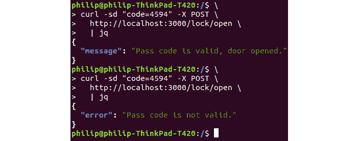

###### 图 4.26:两次执行命令导致错误

如果结果与上图所示相同，那么您已经成功地完成了该活动。

## 第五章:模块化 JavaScript

### 活动 6:创建闪光灯模式的灯泡

**方案**:

1.  安装预设的`babel-cli`和`babel`作为开发依赖:

    ```js
    npm install --save-dev webpack webpack-cli @babel/core @babel/cli @babel/preset-env
    ```

2.  添加一个名为`.babelrc`的文件到根目录。 在其中，我们将告诉巴别塔使用预置设置:

    ```js
    {
    ```

    ```js
      "presets": ["@babel/preset-env"]
    ```

    ```js
    }
    ```

3.  ```js
    const path = require("path");
    ```

    ```js
    module.exports = {
    ```

    ```js
      mode: 'development',
    ```

    ```js
      entry: "./build/js/viewer.js",
    ```

    ```js
      output: {
    ```

    ```js
        path: path.resolve(__dirname, "build"),
    ```

    ```js
        filename: "bundle.js"
    ```

    ```js
      }
    ```

    ```js
    };
    ```

4.  创建一个新文件`js/flashingLight.js`。 这应该作为一个扩展`Light`的空白 ES6 组件开始。 在构造函数中,我们将包括`state`、`brightness`,

    ```js
    import Light from './light.js';
    ```

    和`flashMode`:

    ```js
    let privateVars = new WeakMap();
    ```

    ```js
    class FlashingLight extends Light {
    ```

    【显示】

    ```js
        super(state, brightness);
    ```

    ```js
        let info = {"flashMode": flashMode};
    ```

    ```js
        privateVars.set(this, info);
    ```

    【病人】

    ```js
          this.startFlashing();
    ```

    ```js
        }
    ```

    ```js
      }
    ```

5.  为对象添加 setter 方法，该方法也将触发 stop 和 start flash 方法。

    ```js
      setFlashMode(flashMode) {
    ```

    ```js
        let info = privateVars.get(this);
    ```

    ```js
        info.flashMode = checkStateFormat(flashMode);
    ```

    【4】【5】

    ```js
          this.startFlashing();
    ```

    ```js
        } else {
    ```

    【显示】

    ```js
        }
    ```

    ```js
      }
    ```

6.  ```js
      getFlashMode() {
    ```

    ```js
        let info = privateVars.get(this);
    ```

    ```js
        return info.flashMode;
    ```

    ```js
      }
    ```

7.  创建一个引用父类的`lightSwitch()`函数的`startFlashing`函数。 这一步很棘手，因为我们必须将其绑定到`setInterval`:

    ```js
      startFlashing() {
    ```

    ```js
        let info = privateVars.get(this);
    ```

    ```js
        info.flashing = setInterval(this.toggle.bind(this),5000);
    ```

    ```js
      }
    ```

8.  ```js
      stopFlashing() {
    ```

    ```js
        let info = privateVars.get(this);
    ```

    ```js
        clearInterval(info.flashing);
    ```

    ```js
      }
    ```

9.  作为`flashingLight.js`的最后一部分，关闭类并导出:

    ```js
    }
    ```

    ```js
    export default FlashingLight;
    ```

10.  ```js
    button.onclick = function () {
    ```

    ```js
      new FlashingLight(true, slider.value, true);
    ```

    ```js
    }
    ```

    ```js
    button.onclick = function () {
    ```

    ```js
    }
    ```

    ```js
    button.onclick = function () {
    ```

    ```js
      new FlashingLight(true, slider.value, true);
    ```

    ```js
    }
    ```

11.  使用 npm 运行`build`函数编译代码:
12.  打开`build/index.html`，设置脚本位置为`bundle.js`:

    ```js
    <script src="bundle.js" type="module"></script>
    ```

13.  要测试一切是否正常工作，请运行`npm start`并在浏览器中打开`localhost:8000`。 点击`build`按钮创建一个完整的灯光页面。 如果一切都做对了，你应该会看到每盏灯以 5 秒的间隔闪烁:

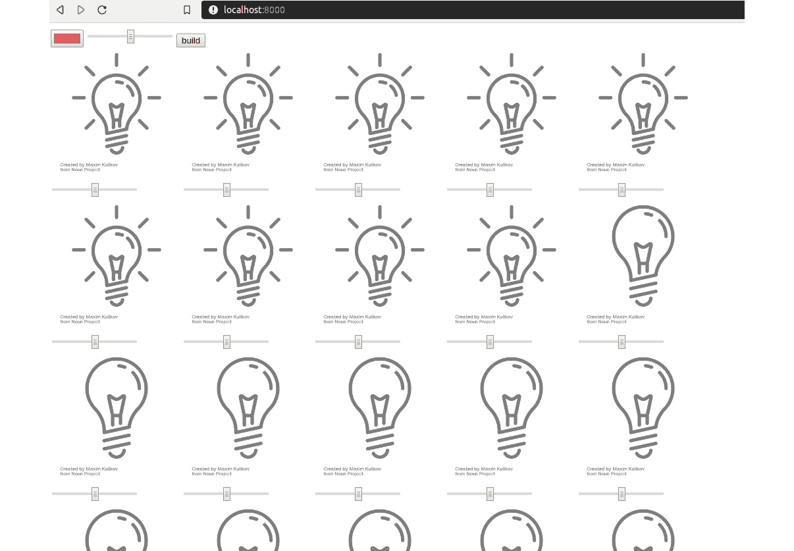

###### 图 5.20:有闪光模式的灯泡

## 第六章:代码质量

### 活动 7:put It All Together

**溶液**

1.  安装测试练习中列出的开发人员依赖项(`eslint`、`prettier`、`eslint-config-airbnb-base`、`eslint-config-prettier`、`eslint-plugin-jest`和`eslint-plugin-import`):

    ```js
    npm install --save-dev eslint prettier eslint-config-airbnb-base eslint-config-prettier eslint-plugin-jest eslint-plugin-import
    ```

2.  添加一个配置文件`eslint`,`.eslintrc`,它包含以下几点:

    ```js
    {
    ```

    ```js
     "extends": ["airbnb-base", "prettier"],
    ```

    【4】【5】

    ```js
        "sourceType": "module"
    ```

    ```js
      },
    ```

    【显示】

    ```js
        "browser": true,
    ```

    ```js
        "node": true,
    ```

    ```js
        "es6": true,
    ```

    【病人】

    ```js
        "jest": true
    ```

    ```js
      },
    ```

    ```js
      "plugins": [],
    ```

    【t16.1】

    ```js
        "no-unused-vars": [
    ```

    ```js
          "error",
    ```

    ```js
          {
    ```

    ```js
            "vars": "local",
    ```

    ```js
            "args": "none"
    ```

    ```js
          }
    ```

    ```js
        ],
    ```

    ```js
        "no-plusplus": "off",
    ```

    ```js
      }
    ```

    ```js
    }
    ```

3.  添加一个。 `prettierignore`文件:

    ```js
    node_modules
    ```

    ```js
    build
    ```

    ```js
    dist
    ```

4.  在您的`package.json`文件中添加`lint`命令:
5.  打开`assignment`文件夹，安装使用 Jest 使用 Puppeteer 的开发依赖项:
6.  修改您的`package.json`文件，添加一个选项告诉 Jest 使用`jest-puppeteer`预设:

    ```js
      "jest": {
    ```

    ```js
        "preset": "jest-puppeteer"
    ```

    ```js
      },
    ```

7.  向`package.json`添加`test`脚本，运行`jest`:

    ```js
      "scripts": {
    ```

    ```js
        "start": "http-server",
    ```

    ```js
        "lint": "prettier --write js/*.js && eslint js/*.js",
    ```

    ```js
        "test": "jest"
    ```

    ```js
      },
    ```

8.  创建一个`jest-puppeteer.config.js`文件，包含以下内容:

    ```js
    module.exports = {
    ```

    ```js
      server: {
    ```

    ```js
        command: 'npm start',
    ```

    ```js
        port: 8080,
    ```

    ```js
      },
    ```

    ```js
    }
    ```

9.  创建一个测试文件包含以下`__tests__/calculator.js`:

    ```js
    describe('Calculator', () => {
    ```

    ```js
      beforeAll(async () => {
    ```

    ```js
        await page.goto('http://localhost:8080');
    ```

    【4】【5】

    ```js
        const seven = await page.$("#seven");
    ```

    ```js
        const multiply = await page.$("#multiply");
    ```

    【显示】

    ```js
        const clear = await page.$("#clear");
    ```

    ```js
        await seven.click();
    ```

    ```js
        await seven.click();
    ```

    【病人】

    ```js
        await multiply.click();
    ```

    ```js
        await seven.click();
    ```

    ```js
        await seven.click();
    ```

    【t16.1】

    ```js
        await equals.click();
    ```

    ```js
        const result = await page.$eval('#screen', e => e.innerText);
    ```

    ```js
        expect(result).toMatch('603729');
    ```

    ```js
        await clear.click();
    ```

    ```js
      })
    ```

    ```js
      it('Check that 3.14 divided by 2 is 1.57', async () => {
    ```

    ```js
        const one = await page.$("#one");
    ```

    ```js
        const two = await page.$("#two");
    ```

    ```js
        const three = await page.$("#three");
    ```

    ```js
        const four = await page.$("#four");
    ```

    ```js
        const divide = await page.$("#divide");
    ```

    ```js
        const decimal = await page.$("#decimal");
    ```

    ```js
        const equals = await page.$("#equals");
    ```

    ```js
        await three.click();
    ```

    ```js
        await decimal.click();
    ```

    ```js
        await one.click();
    ```

    ```js
        await four.click();
    ```

    ```js
        await divide.click();
    ```

    ```js
        await two.click();
    ```

    ```js
        await equals.click();
    ```

    ```js
        const result = await page.$eval('#screen', e => e.innerText);
    ```

    ```js
        expect(result).toMatch('1.57');
    ```

    ```js
      })
    ```

    ```js
    })
    ```

10.  在`.huskyrc`上创建一个 Husky 文件，包含以下内容:

    ```js
    {
    ```

    ```js
      "hooks": {
    ```

    ```js
        "pre-commit": "npm run lint && npm test"
    ```

    ```js
      }
    ```

    ```js
    }
    ```

11.  Install `husky` as a developer dependency by running `npm install --save-dev husky`:

    

    ###### 图 6.19:安装 Husky

12.  Ensure that tests are working correctly using the `npm test` command:

    ```js
    npm test
    ```

    如下图所示，这将返回两次检测的阳性结果:

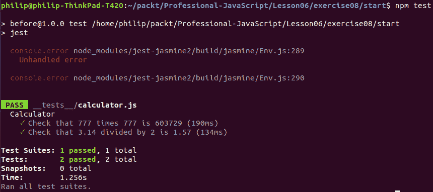

###### 图 6.20:显示两次测试的阳性结果

通过提交测试，确保 Git 挂钩和检测工作正常。

## 第七章:高级 JavaScript

### 活动 8:创建用户跟踪器

**溶液**

1.  Open the `Activity08.js` file and define `logUser`. It will add the user to the `userList` argument. Make sure no duplicates are added:

    ```js
    function logUser(userList, user) {
    ```

    ```js
    if(!userList.includes(user)) {
    ```

    ```js
    userList.push(user);
    ```

    ```js
    }
    ```

    ```js
    }
    ```

    这里，我们使用了一个`includes`方法来检查用户是否已经存在。 如果他们没有，他们将被加入我们的名单。

2.  Define `userLeft`. It will remove the user from the `userList` argument. If the user doesn't exist, it will do nothing:

    ```js
    function userLeft(userList, user) {
    ```

    ```js
    const userIndex = userList.indexOf(user);
    ```

    ```js
    if (userIndex >= 0) {
    ```

    ```js
        userList.splice(userIndex, 1);
    ```

    ```js
    }
    ```

    ```js
    }
    ```

    在这里，我们使用`indexOf`来获取我们想要删除的用户的当前索引。 如果道具不存在，`indexOf`将会`return –1`，所以我们只使用`splice`移除存在的道具。

3.  定义`numUsers`，返回当前列表中的用户数量:

    ```js
    function numUsers(userList) {
    ```

    ```js
    return userLeft.length;
    ```

    ```js
    }
    ```

4.  Define a function called `runSite`. We will create a `users` array and call the function we declared previously to test our implementation. We will also invoke the function afterward:

    ```js
    function runSite() {
    ```

    ```js
        // Your user list for your website
    ```

    ```js
        const users = [];
    ```

    ```js
        // Simulate user viewing your site
    ```

    ```js
        logUser(users, 'user1');
    ```

    ```js
        logUser(users, 'user2');
    ```

    ```js
        logUser(users, 'user3');
    ```

    ```js
        // User left your website
    ```

    ```js
        userLeft(users, 'user2');
    ```

    ```js
        // More user goes to your website
    ```

    ```js
        logUser(users, 'user4');
    ```

    ```js
        logUser(users, 'user4');
    ```

    ```js
        logUser(users, 'user5');
    ```

    ```js
        logUser(users, 'user6');
    ```

    ```js
        // More user left your website
    ```

    ```js
        userLeft(users, 'user1');
    ```

    ```js
        userLeft(users, 'user4');
    ```

    ```js
        userLeft(users, 'user2');
    ```

    ```js
        console.log('Current user: ', users.join(', '));
    ```

    ```js
    }
    ```

    ```js
    runSite();
    ```

    定义函数后，运行前面的代码将返回以下输出:


###### 图 7.62:运行 log_users.js 的输出

### 活动 9:使用 JavaScript 数组和类创建学生管理器

**溶液**

1.  Create a `School` class that includes all the student's information:

    ```js
    class School {
    ```

    ```js
    constructor() {
    ```

    ```js
        this.students = [];
    ```

    ```js
    }
    ```

    ```js
    }
    ```

    在`School`构造函数中，我们简单地初始化一个学生列表。 稍后，我们将向这个列表添加新学生。

2.  Create a `Student` class that includes all the relevant information about the student:

    ```js
    class Student {
    ```

    ```js
    constructor(name, age, gradeLevel) {
    ```

    ```js
        this.name = name;
    ```

    ```js
        this.age = age;
    ```

    ```js
        this.gradeLevel = gradeLevel;
    ```

    ```js
        this.courses = [];
    ```

    ```js
    }
    ```

    ```js
    }
    ```

    在学生的`constructor`中，我们存储了课程列表，以及学生的`age`、`name`和`gradeLevel`。

3.  Create a `Course` class that will include information about the course's `name` and `grade`:

    ```js
    class Course {
    ```

    ```js
    constructor(name, grade) {
    ```

    ```js
        this.name = name;
    ```

    ```js
        this.grade = grade;
    ```

    ```js
    }
    ```

    ```js
    }
    ```

    课程构造器只是简单地将课程名称和成绩存储在`object`中。

4.  在`School`类创建`addStudent`:

    ```js
    addStudent(student) {
    ```

    ```js
    this.students.push(student);
    ```

    ```js
    }
    ```

5.  在`School`类创建`findByGrade`:

    ```js
    findByGrade(gradeLevel) {
    ```

    ```js
        return this.students.filter((s) => s.gradeLevel === gradeLevel);
    ```

    ```js
    }
    ```

6.  在`School`类创建`findByAge`:

    ```js
    findByAge(age) {
    ```

    ```js
    return this.students.filter((s) => s.age === age);
    ```

    ```js
    }
    ```

7.  在`School`类创建`findByName`:

    ```js
    findByName(name) {
    ```

    ```js
    return this.students.filter((s) => s.name === name);
    ```

    ```js
    }
    ```

8.  In the `Student` class, create a `calculateAverageGrade` method for calculating the average grade of the student:

    ```js
    calculateAverageGrade() {
    ```

    ```js
    const totalGrades = this.courses.reduce((prev, curr) => prev + curr.grade, 0);
    ```

    ```js
    return (totalGrades / this.courses.length).toFixed(2);
    ```

    ```js
    }
    ```

    在`calculateAverageGrade`方法中，我们使用数组 reduce 来获取我们学生所有班级的总成绩。 然后，我们用这个除以课程列表中的课程数。

9.  In the `Student` class, create a method called `assignGrade`, which will assign a number grade for a course the student is taking:

    ```js
    assignGrade(name, grade) {
    ```

    ```js
    this.courses.push(new Course(name, grade))
    ```

    ```js
    }
    ```

    您应该在`student_manager.js`文件中完成您的工作，并修改提供的方法模板。 如果你正确地实现了所有内容，你应该看到**TEST PASSED**消息:

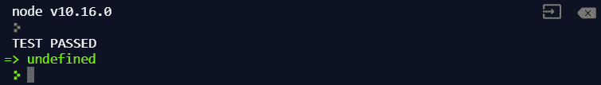

###### 图 7.63:显示 TEST PASSED 消息的屏幕截图

### Activity 10: Refactoring Functions to Use Modern JavaScript FeaturesActivity 10: Refactoring Functions to Use Modern JavaScript Features

**溶液**

1.  Open `Activity03.js`; it should contain various functions written in legacy JavaScript. When you run `Activity03.js` using Node.js, you should see the following output:

    

    ###### 图 7.64:运行 Lesson7-activity.js 后的输出

2.  您需要重构`itemExist`，使用`includes`数组:

    ```js
    function itemExist(array, item) {
    ```

    ```js
        return array.includes(item);
    ```

    ```js
    }
    ```

    ```js
    In pushUnique we will use array push to add new item to the bottom
    ```

    ```js
    function pushUnique(array, item) {
    ```

    ```js
        if (!itemExist(array, item)) {
    ```

    ```js
            array.push(item);
    ```

    ```js
        }
    ```

    ```js
    }
    ```

3.  在`createFilledArray`中，我们将使用`array.fill`来填充一个初始值:

    ```js
    function createFilledArray(size, init) {
    ```

    ```js
        const newArray = new Array(size).fill(init);
    ```

    ```js
        return newArray;
    ```

    ```js
    }
    ```

    ```js
    In removeFirst we will use array.shift to remove the first item
    ```

    ```js
    function removeFirst(array) {
    ```

    ```js
        return array.shift();
    ```

    ```js
    }
    ```

4.  在`removeLast`中，我们将用`array.pop`去掉最后一项:

    ```js
    function removeLast(array) {
    ```

    ```js
        return array.pop();
    ```

    ```js
    }
    ```

    ```js
    In cloneArray we will use spread operation to make clone for our array
    ```

    ```js
    function cloneArray(array) {
    ```

    ```js
        return […array];
    ```

    ```js
    }
    ```

5.  We will refactor our `Food` class using the `ES6` class:

    ```js
    class Food {
    ```

    ```js
        constructor(type, calories) {
    ```

    ```js
            this.type = type;
    ```

    ```js
            this.calories = calories;
    ```

    ```js
        }
    ```

    ```js
        getCalories() {
    ```

    ```js
            return this.calories;
    ```

    ```js
        }
    ```

    ```js
    }
    ```

    当你完成了重构并运行现有代码后，你应该会看到相同的输出:

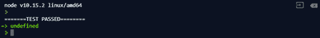

###### 图 7.65:显示 TEST PASSED 消息的输出

## 第八章:异步编程

### 活动 11:使用回调来接收结果

**方案**:

1.  创建一个以`id`和`callback`为参数的`calculate`函数:
2.  We will first call `getUsers` to get all of the users. This will give us the address we need:

    ```js
    function calculate(id, callback) {
    ```

    ```js
    clientApi.getUsers((error, result) => {
    ```

    ```js
    if (error) { return callback(error); }
    ```

    ```js
    const currentUser = result.users.find((user) => user.id === id);
    ```

    ```js
    if (!currentUser) { return callback(new Error('user not found')); }
    ```

    ```js
    });
    ```

    ```js
      }
    ```

    在这里，我们获取所有用户，然后应用`find`方法到`user`，从列表中找到我们想要的用户。 如果该用户不存在，则调用`callback`函数并返回`User not found`错误。

3.  Call `getUsage` to get the user's usage:

    ```js
    clientApi.getUsage(id, (error, usage) => {
    ```

    ```js
    if (error) { return callback(error); }
    ```

    ```js
      });
    ```

    然后，我们需要将对`getUsage`的调用放在`getUsers`的回调函数中，以便在我们完成`getUsers`调用后，它将运行。 在这里，回调函数将被一个数字列表调用，这将是用法。 如果从`getUsage`收到一个错误，我们也将用错误对象调用回调函数。

4.  Finally, call `getRate` to get the rate of the user we are doing the calculation for:

    ```js
    clientApi.getRate(id, (error, rate) => {
    ```

    ```js
    if (error) { return callback(error); }
    ```

    ```js
    let totalUsage = 0;
    ```

    ```js
    for (let i = 0; i < usage.length; i++) {
    ```

    ```js
        totalUsage += usage[i];
    ```

    ```js
    }
    ```

    ```js
    callback(null, {
    ```

    ```js
    id,
    ```

    ```js
    address: currentUser.address,
    ```

    ```js
    due: rate * totalUsage
    ```

    ```js
    });
    ```

    ```js
    });
    ```

    我们将把这个调用放到`getUsage`的回调函数中。 这将为我们需要的所有信息创建一个嵌套链请求。 最后，我们将使用正在计算的信息调用回调函数。 对于最终的到期金额，我们使用数组 reduce 来计算该用户的总使用量，然后将其乘以速率来得到最终到期金额。

5.  When the function is completed, invoke it using an existing ID, as in the following code:

    ```js
    calculate('DDW2AU', (error, result) => {
    ```

    ```js
        console.log(error, result);
    ```

    ```js
    });
    ```

    你应该看到这样的输出:

    

    ###### 图 8.43:使用现有 ID 调用函数

6.  Invoke the function using an ID that doesn't exist:

    ```js
    calculate('XXX', (error, result) => {
    ```

    ```js
        console.log(error, result);
    ```

    ```js
    });
    ```

    你应该看到下面的输出和返回的错误:

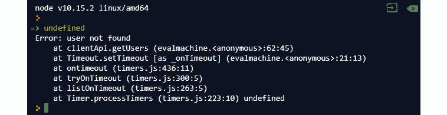

###### 图 8.44:使用不存在的 ID 调用函数

### Activity 12: Refactor the Bill Calculator Using Async and Await

**溶液**

1.  创建`calculate`功能为`async`功能:

    ```js
    async function calculate(id) {
    ```

    ```js
    }
    ```

2.  Use `await` to call `getUsers` to get the resolved result in `users`:

    ```js
    const users = await clientApi.getUsers();
    ```

    ```js
    const currentUser = users.users.find((user) => user.id === id);
    ```

    当我们使用`await`关键字时，我们必须使用`async`函数。 关键字`await`将打破我们的程序的控制，只有在它等待的承诺被解决后才返回并继续执行。

3.  使用`await`呼叫`getUsage`以获得用户的使用:

    ```js
    const usage = await clientApi.getUsage(currentUser.id);
    ```

4.  使用`await`呼叫`getRate`为用户获取费率:

    ```js
    const rate = await clientApi.getRate(currentUser.id);
    ```

5.  最后调用`return`检索`id`、`address`、`due`:

    ```js
    return {
    ```

    ```js
    id,
    ```

    ```js
    address: currentUser.address,
    ```

    ```js
    due: (rate * usage.reduce((prev, curr) => curr + prev)).toFixed(2)
    ```

    ```js
    };
    ```

6.  将`calculateAll`函数写成`async`函数:

    ```js
    async function calculateAll() {
    ```

    ```js
    }
    ```

7.  调用`getUsers`时使用`await`，并将结果存储在`result`:

    ```js
    const result = await clientApi.getUsers();
    ```

8.  Use a map array to create a list of promises and use `Promise.all` to wrap them. Then, should be use `await` on the promise returned by `Promise.all`:

    ```js
    return await Promise.all(result.users.map((user) => calculate(user.id)));
    ```

    因为`await`将在任何承诺上工作，并将等待，直到值被解析，它也将等待我们的`Promise.all`。 解析后，将返回最终的数组。

9.  Call `calculate` on one of the users:

    ```js
    calculate('DDW2AU').then(console.log)
    ```

    输出结果如下:

    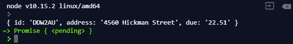

    ###### 图 8.45:呼叫计算对一个用户

10.  Call the `calculateAll` function:

    ```js
    calculateAll().then(console.log)
    ```

    输出结果如下:


###### 图 8.46:调用 calculateAll 函数

如你所见，当我们调用`async`函数时，我们可以将它们视为返回一个承诺的函数。

## 第 9 章:事件驱动编程和内置模块

### 活动 13:构建事件驱动模块

**方案**:

执行以下步骤来完成此活动:

1.  导入`events`模块:

    ```js
    const EventEmitter = require('events');
    ```

2.  Create the `SmokeDetector` class that extends `EventEmitter` and set `batteryLevel` to `10`:

    ```js
    class SmokeDetector extends EventEmitter {
    ```

    ```js
        constructor() {
    ```

    ```js
            super();
    ```

    ```js
            this.batteryLevel = 10;
    ```

    ```js
        }
    ```

    ```js
    }
    ```

    在我们的构造函数中，因为我们扩展了`EventEmitter`类并赋值了一个自定义属性`batteryLevel`，所以我们需要在构造函数中调用`super`并将`batteryLevel`设置为`10`。

3.  Create a `test` method inside the `SmokeDetector` class that will test the battery level and emit a `low battery` message in the event that the battery is low:

    ```js
    test() {
    ```

    ```js
            if (this.batteryLevel > 0) {
    ```

    ```js
                this.batteryLevel -= 0.1;
    ```

    ```js
                if (this.batteryLevel < 0.5) {
    ```

    ```js
                    this.emit('low battery');
    ```

    ```js
                }
    ```

    ```js
                return true;
    ```

    ```js
            }
    ```

    ```js
            return false;
    ```

    ```js
        }
    ```

    我们的`test()`方法将检查电池水平，并发出一个`low battery`事件，当电池少于 0.5 单位。 我们也会在每次运行`test`方法时降低电池电量。

4.  Create the `House` class, which will store the instances of our event listeners:

    ```js
    class House {
    ```

    ```js
        constructor(numBedroom, numBathroom, numKitchen) {
    ```

    ```js
            this.numBathroom = numBathroom;
    ```

    ```js
            this.numBedroom = numBedroom;
    ```

    ```js
            this.numKitchen = numKitchen;
    ```

    ```js
            this.alarmListener = () => {
    ```

    ```js
                console.log('alarm is raised');
    ```

    ```js
            }
    ```

    ```js
            this.lowBatteryListener = () => {
    ```

    ```js
                console.log('alarm battery is low');
    ```

    ```js
            }
    ```

    ```js
        }
    ```

    ```js
    }
    ```

    在课堂上，我们存储一些关于房子的信息。 我们还将这两个事件监听器函数存储为该对象的属性。 这样，当我们想要分离一个侦听器时，就可以使用函数引用来调用`removeListener`。

5.  Create an `addDetector` method in the `House` class. Here, we will attach the event listeners:

    ```js
    addDetector(detector) {
    ```

    ```js
            detector.on('alarm', this.alarmListener);
    ```

    ```js
            detector.on('low battery', this.lowBatteryListener);
    ```

    ```js
        }
    ```

    在这里，我们期望传入的检测器是一个`EventEmitter`。 我们将两个事件监听器附加到`detector`参数上。 当这些事件被触发时，它将调用对象内部的事件发射器。

6.  Create a `removeDetector` method, which will help us remove the alarm event listeners we attached previously:

    ```js
    removeDetector(detector) {
    ```

    ```js
            detector.removeListener('alarm', this.alarmListener);
    ```

    ```js
            detector.removeListener('low battery', this.lowBatteryListener);
    ```

    ```js
        }
    ```

    这里，我们使用函数引用和 alarm 参数来删除附加到侦听器上的侦听器。 一旦调用了这个，事件就不应该再调用我们的侦听器了。

7.  创建一个名为`myHouse`的`House`实例。 这将包含一些关于我们房子的样本信息。 它也将被用来监听事件从我们的烟雾探测器:
8.  创建一个名为`detector`:

    ```js
    const detector = new SmokeDetector();
    ```

    的`SmokeDetector`实例
9.  将`detector`加入`myHouse`:

    ```js
    myHouse.addDetector(detector);
    ```

10.  Create a loop to call the test function `96` times:

    ```js
    for (let i = 0; i < 96; i++) {
    ```

    ```js
        detector.test();
    ```

    ```js
    }
    ```

    由于测试功能会降低电池电量，我们预计，如果我们调用它`96`次，将发出*低电池*报警。 这将产生以下输出:

    

    ###### 图 9.50:低电量报警

11.  Emit an alarm on the `detector` object:

    ```js
    detector.emit('alarm');
    ```

    下面是上述代码的输出:

    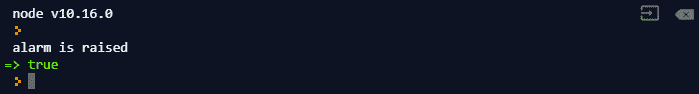

    ###### 图 9.51:探测器对象发出的警报

12.  从`myHouse`对象中移除`detector`:

    ```js
    myHouse.removeDetector(detector);
    ```

13.  Test this to emit the alarms on the `detector`:

    ```js
    detector.test();
    ```

    ```js
    detector.emit('alarm');
    ```

    因为我们刚刚从我们的房子中删除了`detector`，我们应该看不到输出:

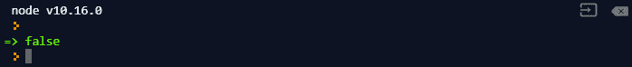

###### 图 9.52:测试探测器发出的警报

### 活动 14:Building a File Watcher

**方案**:

1.  导入`fs`、`events`:

    ```js
    const fs = require('fs').promises;
    ```

    ```js
    const EventEmitter = require('events');
    ```

2.  Create a `fileWatcher` class that extends the `EventEmitter` class. Use a `modify` timestamp to keep track of the file change.

    我们需要创建一个扩展`EventEmitter`的`FileWatcher`类。 它将把文件名和 delay 作为构造函数中的参数。 在构造函数中，我们还需要设置最后修改的时间和 timer 变量。 我们暂时将它们设置为未定义:

    ```js
    class FileWatcher extends EventEmitter {
    ```

    ```js
        constructor(file, delay) {
    ```

    ```js
            super();
    ```

    ```js
            this.timeModified = undefined;
    ```

    ```js
            this.file = file;
    ```

    ```js
            this.delay = delay;
    ```

    ```js
            this.watchTimer = undefined;
    ```

    ```js
        }
    ```

    ```js
    }
    ```

    这是查看文件是否被更改的最基本方法。

3.  Create the `startWatch` method to start watching the changes on the file:

    ```js
    startWatch() {
    ```

    ```js
            if (!this.watchTimer) {
    ```

    ```js
                this.watchTimer = setInterval(() => {
    ```

    ```js
                    fs.stat(this.file).then((stat) => {
    ```

    ```js
                        if (this.timeModified !== stat.mtime.toString()) {
    ```

    ```js
                            console.log('modified');
    ```

    ```js
                            this.timeModified = stat.mtime.toString();
    ```

    ```js
                        }
    ```

    ```js
                    }).catch((error) => {
    ```

    ```js
                        console.error(error);
    ```

    ```js
                    });
    ```

    ```js
                }, this.delay);
    ```

    ```js
            }
    ```

    ```js
        }
    ```

    这里，我们使用`fs.stat`获取文件信息，并将修改时间与上次修改时间进行比较。 如果它们不相等，我们将在控制台中输出**修改的**。

4.  Create the `stopWatch` method to stop watching the changes on the file:

    ```js
    stopWatch() {
    ```

    ```js
            if (this.watchTimer) {
    ```

    ```js
                clearInterval(this.watchTimer);
    ```

    ```js
                this.watchTimer = undefined;
    ```

    ```js
            }
    ```

    ```js
           }
    ```

    `stopWatch`方法非常简单:我们将检查这个对象中是否有一个计时器。 如果我们这样做，那么我们运行`clearInterval`定时器来清除该定时器。

5.  在与`filewatch.js`相同的目录下创建一个`test.txt`文件。
6.  创建一个`FileWatcher`实例，并开始查看每一个`1000`ms:

    ```js
    const watcher = new FileWatcher('test.txt', 1000);
    ```

    ```js
    watcher.startWatch();
    ```

7.  Modify some content in `test.txt` and save it. You should see the following output:

    

    ###### 图 9.53:修改 test.txt 文件内容后的输出

    我们修改了该文件两次，这意味着我们看到了三条修改过的消息。 之所以会发生这种情况，是因为当我们开始监视时，我们将它类为正在修改的文件。

8.  Modify `startWatch` so that it also retrieves the new content:

    ```js
    startWatch() {
    ```

    ```js
            if (!this.watchTimer) {
    ```

    ```js
                this.watchTimer = setInterval(() => {
    ```

    ```js
                    fs.stat(this.file).then((stat) => {
    ```

    ```js
                        if (this.timeModified !== stat.mtime.toString()) {
    ```

    ```js
                            fs.readFile(this.file, 'utf-8').then((content) => {
    ```

    ```js
                                console.log('new content is: ', content);
    ```

    ```js
                            }).catch((error) => {
    ```

    ```js
                                console.error(error);
    ```

    ```js
                            });
    ```

    ```js
                            this.timeModified = stat.mtime.toString();
    ```

    ```js
                        }
    ```

    ```js
                    }).catch((error) => {
    ```

    ```js
                        console.error(error);
    ```

    ```js
                    });
    ```

    ```js
                }, this.delay);
    ```

    ```js
            }
    ```

    ```js
        }
    ```

    当我们修改`test.txt`并保存它时，我们的代码应该检测它并输出新的内容:

    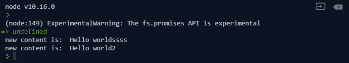

    ###### 图 9.54:使用 startWatch 函数可以看到文件中所做的修改

9.  Modify `startWatch` so that it emits events when the file is modified and an error when it encounters an error:

    ```js
    startWatch() {
    ```

    ```js
            if (!this.watchTimer) {
    ```

    ```js
                this.watchTimer = setInterval(() => {
    ```

    ```js
                    fs.stat(this.file).then((stat) => {
    ```

    ```js
                        if (this.timeModified !== stat.mtime.toString()) {
    ```

    ```js
                            fs.readFile(this.file, 'utf-8').then((content) => {
    ```

    ```js
                                this.emit('change', content);
    ```

    ```js
                            }).catch((error) => {
    ```

    ```js
                                this.emit('error', error);
    ```

    ```js
                            });
    ```

    ```js
                            this.timeModified = stat.mtime.toString();
    ```

    ```js
                        }
    ```

    ```js
                    }).catch((error) => {
    ```

    ```js
                        this.emit('error', error);
    ```

    ```js
                    });
    ```

    ```js
                }, this.delay);
    ```

    ```js
            }
    ```

    ```js
        }
    ```

    我们将使用新内容发出一个事件，而不是输出内容。 这使得我们的代码更加灵活。

10.  `watcher`:

    ```js
    watcher.on('error', console.error);
    ```

    ```js
    watcher.on('change', (change) => {
    ```

    ```js
        console.log('new change:', change);
    ```

    ```js
    });
    ```

11.  运行代码并修改`test.txt`:

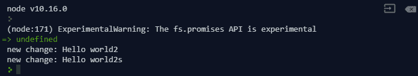

###### 图 9.55:更改文件监视器后的输出

## 第十章:JavaScript 函数式编程

### 活动 15:onCheckout 回调道具

**溶液**

1.  将当前目录更改为`Lesson10`，并运行`npm install`(如果您以前未在此目录下运行)。 `npm install`下载运行此活动所需的依赖项(React 和 Parcel)。
2.  Run `parcel serve activity-on-checkout-prop-start.html` and then execute `npm run Activity15`. You will see the application starting up, as follows:

    

    ###### 图 10.42:运行 start html 脚本后的输出

3.  Go to `http://localhost:1234` (or whichever URL the start script output). You should see the following HTML page:

    

    ###### 图 10.43:浏览器中的初始应用

4.  The `onClick` of the **Proceed to checkout** can be implemented as follows:

    ```js
      render() {
    ```

    ```js
        return (
    ```

    ```js
          <div>
    ```

    ```js
            <p>You have {this.state.items.length} items in your basket</p>
    ```

    ```js
            <button onClick={() => this.props.onCheckout(this.state.items)}>
    ```

    ```js
              Proceed to checkout
    ```

    ```js
            </button>
    ```

    ```js
          </div>
    ```

    ```js
        );
    ```

    ```js
      }
    ```

    这是根据以下调查得出的结论:

    在`Basket`组件的`render`方法中找到文本为`Proceed to checkout`的按钮。

    注意到它的`onClick`处理器目前是一个在被调用时什么也不做的函数`() => {}`。

    用正确的`this.props.onCheckout`调用替换`onClick`处理程序。

5.  点击`Proceed to checkout`按钮可以看到:


###### 图 10.44:点击“Proceed to checkout”按钮后的输出

### 活动 16:测试选择器

**溶液**

1.  Run `npm run Activity16` (or `node activity-items-selector-test-start.js`). You will see the following output:

    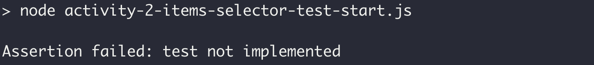

    ###### 图 10.45:运行活动的启动文件后的预期输出

2.  测试，对于空状态，选择器返回`[]`:

    ```js
    function test() {
    ```

    ```js
      assert.deepStrictEqual(
    ```

    ```js
        selectBasketItems(),
    ```

    ```js
        [],
    ```

    ```js
        'should be [] when selecting with no state'
    ```

    ```js
      );
    ```

    ```js
      assert.deepStrictEqual(
    ```

    ```js
        selectBasketItems({}),
    ```

    ```js
        [],
    ```

    ```js
        'should be [] when selecting with {} state'
    ```

    ```js
      );
    ```

    ```js
    }
    ```

3.  测试，对于空的篮子对象，选择器返回[]:

    ```js
    function test() {
    ```

    ```js
      // other assertions
    ```

    ```js
      assert.deepStrictEqual(
    ```

    ```js
        selectBasketItems({basket: {}}),
    ```

    ```js
        [],
    ```

    ```js
        'should be [] when selecting with {} state.basket'
    ```

    ```js
      );
    ```

    ```js
    }
    ```

4.  测试，如果 items 数组设置为空，则选择器返回`[]:`

    ```js
    function test() {
    ```

    ```js
      // other assertions
    ```

    ```js
      assert.deepStrictEqual(
    ```

    ```js
        selectBasketItems({basket: {items: []}}),
    ```

    ```js
        [],
    ```

    ```js
        'should be [] when items is []'
    ```

    ```js
      );
    ```

    ```js
    }
    ```

5.  测试,如果`items`数组没有空和设置,选择器返回:

    ```js
    function test() {
    ```

    ```js
      // other assertions
    ```

    ```js
      assert.deepStrictEqual(
    ```

    【4】【5】

    ```js
        }),
    ```

    ```js
        [{name: 'product-name'}],
    ```

    【显示】

    ```js
      );
    ```

    ```js
    }
    ```

    ```js
    The full test function content after following the previous solution steps:
    ```

    【病人】

    ```js
      assert.deepStrictEqual(
    ```

    ```js
        selectBasketItems(),
    ```

    ```js
        [],
    ```

    【t16.1】

    ```js
      );
    ```

    ```js
      assert.deepStrictEqual(
    ```

    ```js
        selectBasketItems({}),
    ```

    ```js
        [],
    ```

    ```js
        'should be [] when selecting with {} state'
    ```

    ```js
      );
    ```

    ```js
      assert.deepStrictEqual(
    ```

    ```js
        selectBasketItems({basket: {}}),
    ```

    ```js
        [],
    ```

    ```js
        'should be [] when selecting with {} state.basket'
    ```

    ```js
      );
    ```

    ```js
      assert.deepStrictEqual(
    ```

    ```js
        selectBasketItems({basket: {items: []}}),
    ```

    ```js
        [],
    ```

    ```js
        'should be [] when items is []'
    ```

    ```js
      );
    ```

    ```js
      assert.deepStrictEqual(
    ```

    ```js
        selectBasketItems({
    ```

    ```js
          basket: {items: [{name: 'product-name'}]}
    ```

    ```js
        }),
    ```

    ```js
        [{name: 'product-name'}],
    ```

    ```js
        'should be items when items is set'
    ```

    ```js
      );
    ```

    ```js
    }
    ```

6.  在执行的测试的输出中应该没有错误:


###### 图 10.46:没有显示错误的最终输出

### 活动 17:从最好的朋友那里拿当前的篮子

**溶液**

1.  将当前目录更改为`Lesson10`，并运行`npm install`(如果您以前未在此目录下运行)。
2.  Run the BFF for Activity 17 and `npx parcel serve activity-app-start.html`. During development, run `npm run Activity17`. You will see the application starting up, as follows:

    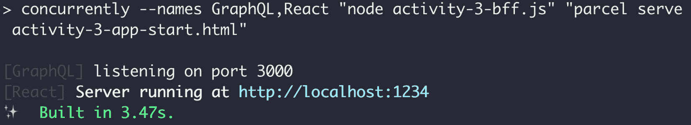

    ###### 图 10.47:运行活动的初始启动文件

3.  Go to `http://localhost:1234` (or whichever URL the starting script output). You should see the following HTML page:

    

    ###### 图 10.48:浏览器中的初始应用

4.  Run the following query in the GraphiQL UI:

    ```js
    {
    ```

    ```js
      basket {
    ```

    ```js
        items {
    ```

    ```js
          id
    ```

    ```js
          name
    ```

    ```js
          price
    ```

    ```js
          quantity
    ```

    ```js
        }
    ```

    ```js
      }
    ```

    ```js
    }
    ```

    下面是上述代码的输出:

    

    ###### 图 10.49:带有篮子查询的 graphhiql UI

5.  创建一个新的`requestBasket`动作创造者(利用 redux-thunk)。 它调用`fetchFromBff`前一步的查询和分派一个`REQUEST_BASKET_SUCCESS`动作与一篮子载荷提取 GraphQL 回应:

    ```js
    function requestBasket() {
    ```

    【4】【5】

    ```js
          basket {
    ```

    ```js
            items {
    ```

    【显示】

    ```js
              name
    ```

    ```js
              price
    ```

    ```js
              quantity
    ```

    【病人】

    ```js
          }
    ```

    ```js
        }`).then(data => {
    ```

    ```js
          dispatch({
    ```

    【t16.1】

    ```js
            basket: data.basket
    ```

    ```js
          });
    ```

    ```js
        });
    ```

    ```js
      };
    ```

    ```js
    }
    ```

6.  减少篮子数据存储和添加下面的案例`REQUEST_BASKET_SUCCESS``appReducer`来减少我们的新行动的`basket`有效载荷状态:

    ```js
    const appReducer = (state = defaultState, action) => {
    ```

    【4】【5】

    ```js
        case REQUEST_BASKET_SUCCESS:
    ```

    ```js
          return {
    ```

    【显示】

    ```js
            basket: action.basket
    ```

    ```js
          };
    ```

    ```js
        // other cases
    ```

    【病人】

    ```js
    };
    ```

7.  在`mapDispatchToProps`中加入`requestBasket`，如下:

    ```js
    const mapDispatchToProps = dispatch => {
    ```

    ```js
      return {
    ```

    ```js
        // other mapped functions
    ```

    ```js
        requestBasket() {
    ```

    ```js
          dispatch(requestBasket());
    ```

    ```js
        }
    ```

    ```js
      };
    ```

    ```js
    };
    ```

8.  Call `requestBasket` on `componentDidMount`:

    ```js
    class App extends React.Component {
    ```

    ```js
      componentDidMount() {
    ```

    ```js
        this.props.requestBasket();
    ```

    ```js
      }
    ```

    ```js
      // render method
    ```

    ```js
    }
    ```

    当前面所有步骤都完成后，加载应用时，它会闪烁“你的篮子里有 0 项”的信息，然后切换到下面的截图。 当从 BFF 获取完成时，它被减少到存储中并导致重新渲染。 这将再次显示篮子，如下所示:

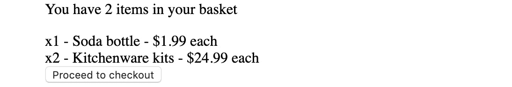

###### 图 10.50:与 BFF 集成后的最终应用