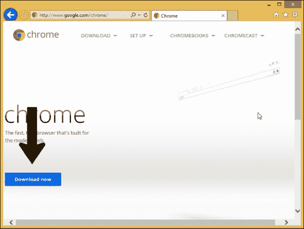
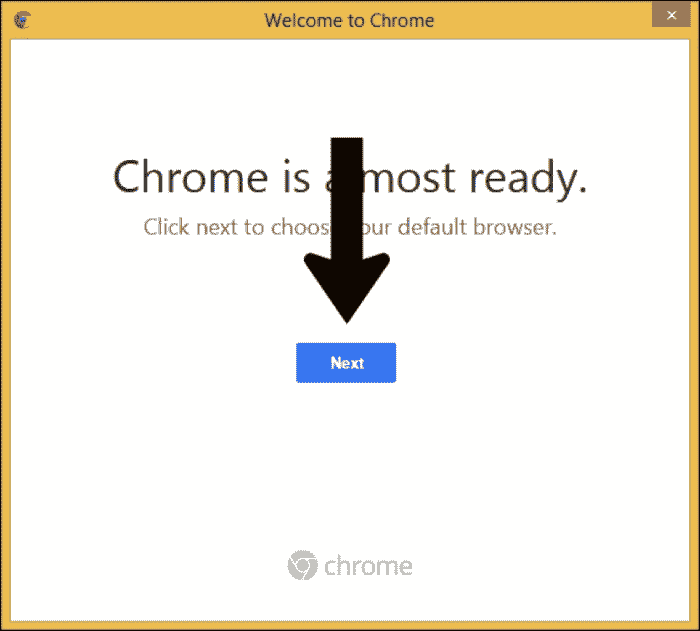
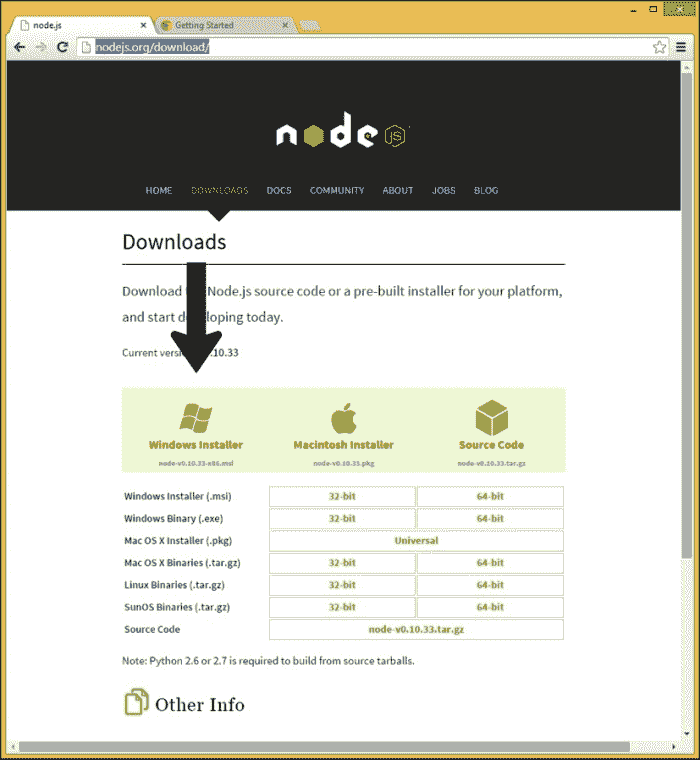
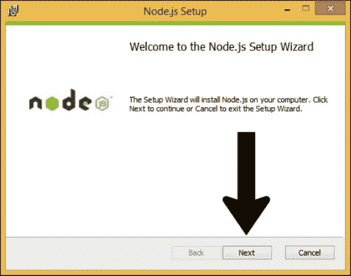
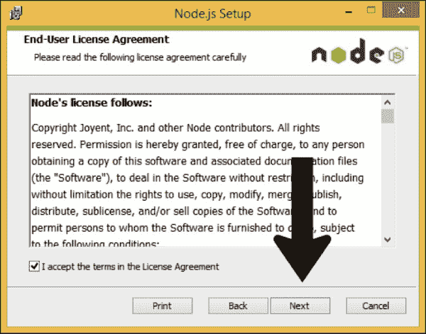
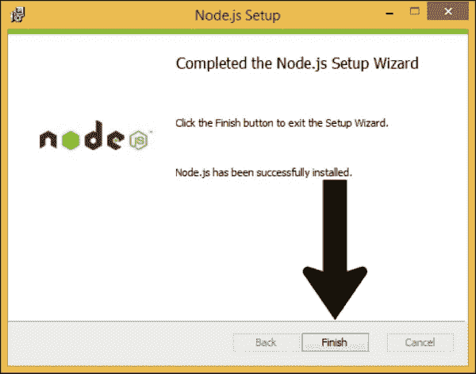
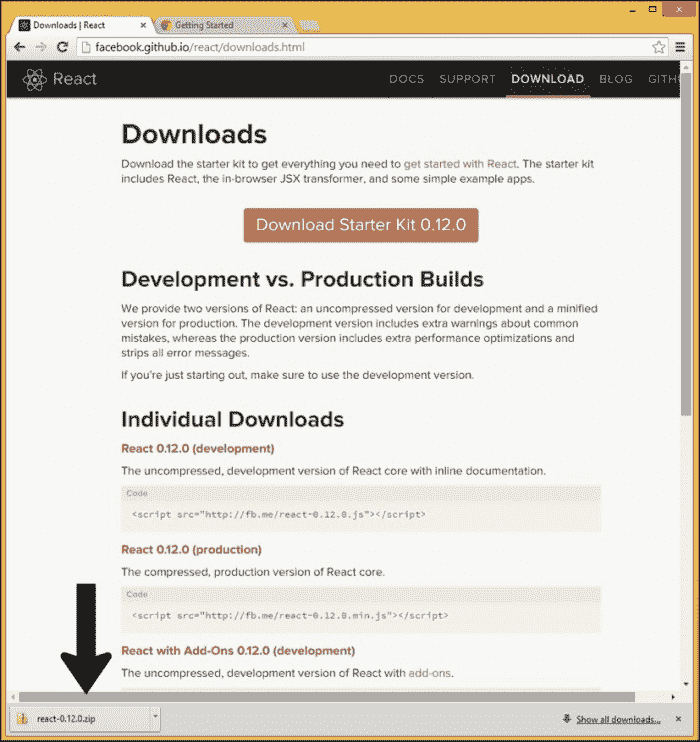

# 一、介绍和安装

欢迎来到 JavaScript 中反应式(函数式)编程的精彩世界！在这本书里，我们将讲述 JavaScript 的好的部分，尽管我们不会虔诚地遵循它。我们将涵盖函数式编程、反应式编程和 ReactJS 库，并将所有这些都集成到带有 JavaScript 的函数式反应式编程中。如果你打算学习反应式编程，我们建议你认真考虑函数式反应式编程，包括尽可能多地学习函数式编程。在这种情况下，函数式反应式编程的整体不仅仅是其各部分的总和。我们将把反应式编程应用到 JavaScript 用户界面开发中。用户界面是**函数式反应式编程** ( **FRP** )真正闪耀的一个领域。

本章将涉及的主题如下:

*   10，000 英尺长的主题概述，包括:
    *   用户界面编程的一种更简单方法的讨论
    *   编程范例的简要讨论，如函数式和反应式编程
*   本书各章的概述
*   看看如何安装本书过程中使用的一些工具

# 万英尺纵览

有很多事情可以陈述，但是(函数式)反应式编程可能比你想象的要容易。如今，许多关于函数式反应式编程的文章令人生畏，就像几年前的闭包指令一样。

## 处理用户界面编程的更简单方法

多年前，当我第一次开始研究 JavaScript 的时候，我选择了一个站点，并从其中字面上拿走了我需要理解的所有东西来执行面向对象的信息隐藏，也就是如何创建一个有私有字段的 JavaScript 对象。在放弃之前，我可能看了两三章理论计算机科学和 10-15%的介绍。然后我看到使用闭包在简单的*猴子看，猴子做*基础上创建一个具有私有字段的对象是多么容易:

```js
   var counter = (function() {
  var value = 0;
  return {
    get_value: function() {
      return value;
    },
    increment_value: function() {
      value += 1;
    }
  }
})();
```

现在，函数式反应式编程处于几年前 JavaScript 闭包的状态。在你可以开始反应式编程之前，你必须阅读的理论数量令人震惊，而且大部分文献都是博士阅读水平。那是坏消息。但好消息是，你不必费力读那么多书。

这本书的目的是提供一些类似于*猴子看，猴子做*的方式来传达如何使用闭包来制作一个带有私有字段的 JavaScript 对象。理论本身并不坏，引入理论进行讨论也不是问题，但作为做简单事情的代价，做一篇成熟的论文的理论支持是一个问题。

我们希望这本书能让你理解为什么用 JavaScript 构建游戏用户界面比用 jQuery 更容易。

### 编程范式

周围有多种编程范式，并不是所有的都是互斥的。许多编程语言都是*多参数*语言，支持多种范式的使用，不仅包括 JavaScript，还包括 OCaml、PHP、Python 和 Perl 等。

请注意，您至少可以有时使用没有明确设计支持的语言的范例。面向对象编程最初不是为专门支持面向对象编程的语言(如 Java 或 Ruby)制定的，而是作为一门工程学科，最初用于面向对象编程之前的语言。

在编程范例中，我们现在有以下几种:

*   **面向方面编程**:有人建议程序员的专业发展从过程编程走向面向对象编程，再走向面向方面编程，最后走向函数式编程。面向方面关注的一个典型例子是日志记录，这是一个在程序中以幼稚的用法传播的方面。面向方面编程处理编程的交叉方面，例如安全性、状态的诊断暴露和日志记录。
*   **声明式编程**:函数式反应式编程的一个关键概念是它是声明性的，而不是命令性的。换句话说， *c = a + b* 并不的意思是取 *a* 的现值，加上 *b* 的现值，将二者之和存入 *c* 。相反，我们在电子表格中声明一种持久的关系，有点像 *C1 = A1 + B1* 。如果 *A1* 或 *B1* 发生变化， *C1* 会立即受到变化的影响。存储在 *C1* 中的不是赋值时 *A1* 的值加上 *B1* 的值，而是更持久的值，可以通过*按需打印*的方式从中获得单个值。
*   **防御性编程**:类似于防御性驾驶，防御性编码是指当被赋予有缺陷的东西时，编写行为正确的代码。函数式反应式编程是一种方法，可以在网络问题和非理想的现实条件下正确运行或优雅地降级。
*   **函数编程**:这里*函数*这个术语有它的数学意义而不是编程意义。在命令式编程中，函数可以(而且最常见的是，它们确实)操纵状态。因此，`init()`函数可以初始化程序最初需要运行的所有数据。函数是接受零个或多个输入并返回结果的东西。比如 *f(x) = 3x+1* 、 *g(x) = sin(x)* 、 *h(x，y) = x'(y)* (在 *y* 处 *x* 的导数)都是数学函数；它们都不需要对有状态数据进行任何操作。纯函数是一个数学定义下的函数，不包括告诉如何处理状态。函数式编程还允许并且通常包括(最后一个基于导数的例子)更高阶的函数，或者作用于函数的函数(在微积分中，导数或积分代表更高阶的函数，迭代积分包括以另一个更高阶的函数作为输入的更高阶的函数)。解决方案集中在抽象函数上的问题对计算机科学类型来说比商业世界中真正使用的东西更有吸引力。这里探讨的高阶函数将相对具体。你不需要一直使用高阶函数，一旦你掌握了核心概念，它们就不难使用了。
*   **命令式编程**:命令式编程是一种常见的编程方式，对于大多数第一次学习命令式编程的程序员来说，这似乎是最自然的工作方式。函数式反应式编程的营销提案包括这种基本方法的一个实时替代方案。在函数式反应式编程的声明性编程、函数式编程中的纯函数(包括高阶函数)以及反应式编程的时间序列中，可以找到对看似自然的命令式编程倾向的替代。
*   **信息隐藏**:史蒂夫·麦康奈尔的*代码完成*描述了几种方法，并告诉我们哪种方法对于不同的设置是最佳的(例如，程序编程的最佳点是在比面向对象编程更小的项目上)。对于单独的信息隐藏，他的建议是*尽可能使用这个*。在一般的信息隐藏开发中，一个大项目是通过在更大的区域内隔离秘密来实现的，而更大的秘密是通过隔离子秘密来划分的。很大一部分过程编程、面向对象编程和函数编程都是为了便于信息隐藏。信息隐藏是德米特里定律背后的软件工程问题，例如，一个方法调用`(foo.bar())`中最多可以有一个点，但不能有两个`(foo.baz.bar())`。
*   **面向对象编程**:一个程序被分割成对象，而不是一个单片的架构。这些对象有它们自己的方法和领域，并且可能反过来被分割成更多的对象。这为比过程编程更大的项目提供了可接受的信息隐藏级别，即使面向对象编程或多或少是从过程编程开始并建立在过程编程之上的。
*   **模式**:模式不是一个好软件的配方，但是在更高层次的人类抽象中，它们提供了一种谈论最佳重复解决方案的方式，以避免从零开始重新发明已经解决的问题。此外，特定的模式引人注目，包括 MVC 和现在的**观察者**模式，虽然是一个基本要素，但在反应式编程方面经常没有被提及。
*   **过程编程**:过程编程是所提到的最古老的方法之一，它旨在为更古老的*基于后藤的*流控制所培养的意面代码提供某种秩序。也许我们可以批评过程编程在面向对象编程、面向方面编程和面向对象设计模式可用时做得不够。当你有工具可以从 goto 的老鼠窝、数据结构的 goto 指针等方面推动程序编程更进一步时，从程序编程继续前进是正确的。
*   **反应式编程**:假设函数式编程在很大程度上是函数具有一级状态，并且可以生成更高阶的函数(作用于其他函数作为输入的函数)的编程。然后，反应式编程在很大程度上是编程，其中时间序列(随着时间的推移具有不同值的函数)具有一流的状态。对于音乐、游戏、用户界面和其他一些用例，计算当前的正确值是反应式编程的亮点。
*   **函数式反应式编程**:函数式反应式编程是建立在功能积木上的反应式编程，其中功能和时间序列都是一级实体。有一些有用的、令人惊讶的简单函数，它们作用于一个时间序列，从而提供另一个时间序列(这些序列中的任何一个都可以被时间序列上的其他函数作用)。函数式反应式编程的一个主要卖点是，它提供了一种比直接进入*回调地狱*更优雅、更易维护的方法。

# 安装所需工具

如果不久前还没有安装 Chrome 和 Node.js 的话，许多读者会对简单地安装它们感到足够舒服。对于那些更喜欢逐步指导的人来说，下面是安装适当软件的细节。

谷歌 Chrome 可以从[http://google.com/chrome](http://google.com/chrome)安装。请注意，对于某些 Linux 发行版，Chrome 可能会也可能不会从您的包管理器中获得。谷歌 Chrome 是一个明显的选择，可以考虑在发行版的包中包含一些东西，但是许可问题可能会因为 Chrome 的某些部分而将其列为非免费的，这意味着就发行版维护者而言，您可能会被欢迎使用它，但是我们不愿意将其包含在仅免费的包存储库中。

Node.js 可从[http://nodejs.org/download](http://nodejs.org/download)获得。如果你运行的是 Linux，可能最好通过你的包管理器获取。注意，Node.js 自带包管理器 npm，可以用来下载 Node.js 下可以使用的包。

适用于反应堆的启动套件可从[http://facebook.github.io/react/downloads.html](http://facebook.github.io/react/downloads.html)获得。

下面的说明是针对 Windows 8.1 给出的(我比较喜欢用 Mac 或者 Linux 开发，但是是作为通用的通用语言为 Windows 8.1 写的)。

## 安装谷歌 Chrome

我们将使用谷歌浏览器作为主要参考浏览器:

1.  To download it, go to [http://google.com/chrome](http://google.com/chrome), and click on the **Download now** button to the left, towards the bottom, as shown here:

    

2.  Next, click on the **Accept and Install** button down and to the right, as shown in the following screenshot:

    

3.  After that, click on the **Run** button when asked whether you want to run or save the installer, as shown here:

    

4.  Next, authorize Chrome's installer to make changes to the system, as shown in the following screenshot:

    

5.  Then click on the **Next** button to install Chrome, as shown in the following screenshot:

    

6.  Wait a minute for it to install and then if you are willing, set Chrome as your default browser:

    

而就是这样！

## 安装 Node.js

安装 Node.js 很简单并且可以很容易地开始使用 JavaScript 作为唯一的语言来服务 HTTP。

1.  Go to [http://nodejs.org/download](http://nodejs.org/download):

    

2.  Click on the **Windows Installer** and wait for the installer to download. Then click on the bottom-left part of the window, as shown in this screenshot:

    

3.  When the installer starts, click on **Next**, as follows:

    

4.  Then click on the checkbox to accept the terms of the agreement, as shown here:

    

5.  After that, click on the **Next** button to continue, as shown in the following screenshot:

    

6.  When asked where to install the software, click on the **Next** button, as shown in this screenshot:

    

7.  Then click on **Next** to move forward, as shown in the next screenshot. Customize the features if you want to:

    

8.  After that, click on the **Install** button to go ahead with the installation, as shown here:

    

9.  Finally, click on the **Finish** button to finish installing Node.js, as shown in this screenshot:

    

10.  Authorize the installer to make changes to your computer, shown as follows:

    

## 安装反应堆的启动器套件

要安装起动机套件，请执行以下步骤:

1.  Go to [http://facebook.github.io/react/downloads.html](http://facebook.github.io/react/downloads.html) and you will see a screen similar to the following screenshot:

    

2.  点击 **下载入门套件 0.12.0** 开始下载(左下角可见)，如前面截图所示。
3.  You will see a ZIP file downloaded at the bottom:

    

4.  From here, you should be able to explore the contents of the ZIP file:

    

# 总结

在本章中，我们对编程范例进行了简要概述，以建议函数式反应式编程可能适合的地方，并安装了基本工具。

我们将在下一章继续讨论 JavaScript。Node.js 的基础在*附录*中讨论。