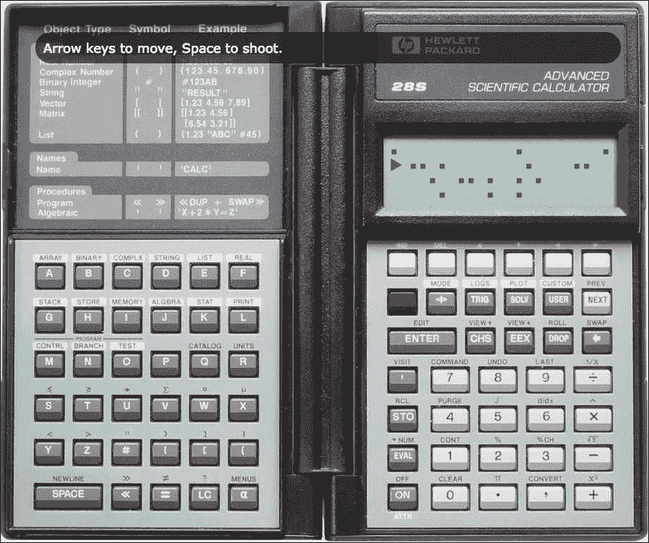
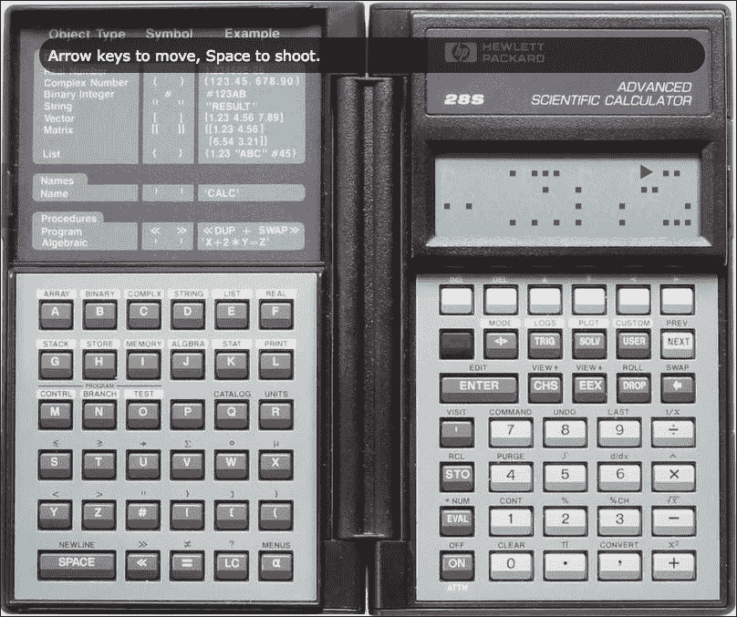
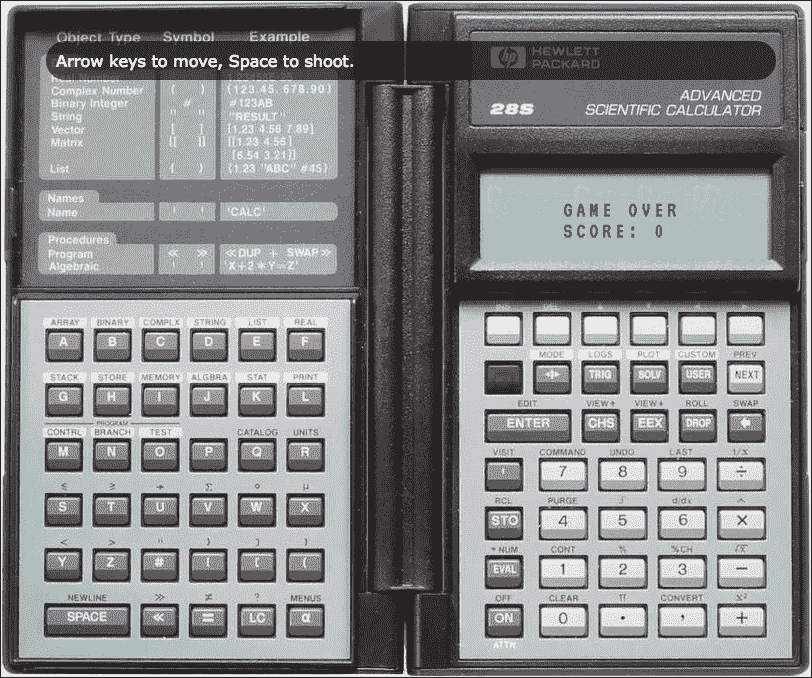

# 第四章。演示非功能性反应式编程——一个真实的例子

在这一章中，我们将看一个结合了 ReactJS 反应式编程的一些原理的实例。该程序的某些部分仍然是必不可少的，因为在惠普-28S RPN 和 Unix C 的其他端口之后，以前在 jQuery 中编写的一些东西的端口，但是 ReactJS 的力量仍然闪耀，即使是像现实世界中的许多代码一样，经历了多次迭代的代码。在用 JavaScript 浏览真正的肉之前，我们将简要地看一下网页的 HTML 需求。该网页提供了最初在惠普-28S 绘图科学计算器上开发的视频游戏的端口，并保留了计算器的大部分外观和感觉。

在本章中，我们将涵盖以下主题:

*   网页的超文本标记语言
*   激活页面的 javascript

在这里，我们看到了游戏，作为一个经典的 HP28S 计算器的背景渲染。已经努力使字符图形模仿发光二极管屏幕上存在的深色和浅色:



# 多端口游戏的历史

标题指定我们正在制作一个 HP28S RPN 游戏的端口，所以让我们看一下我们正在实现的特定游戏的历史。

这个游戏有不同的实现和不同的端口，包括在 C 语言中的重新实现，以及一些使用 HTML 或 JavaScript 的方式。最初的版本是在 HP28S 上，这是一个黑客式的科学计算器，可以有 32 KB 或高达 512 KB 的内存(我的是 512 KB)。编程和使用(两者没有太大的区别，就像在 Unix/Linux shell 编程中一样)**反向波兰符号**(**RPN**)([http://en.wikipedia.org/wiki/Reverse_Polish_notation](http://en.wikipedia.org/wiki/Reverse_Polish_notation))。就黑客攻击而言，计算器中有很多有趣的深度，我制作了两个我特别记得的程序。一个是分形屏保，带有简陋的二维 *醉醺醺的*算法(见[http://tinyurl.com/reactjs-staggering-drunk](http://tinyurl.com/reactjs-staggering-drunk))，另一个是将在这里重新实现的电子游戏。

用丁巴特角色图形实现的基本游戏，有一艘宇宙飞船从左向右移动，在一个小行星越来越密集的领域。初级游戏力学的目的是当你通过时躲避小行星。你也可以拍摄小行星。这确实是必要的，因为一些(天真的)随机抽取的级别不一定有明确的路线可用。为了阻止简单地一路射击通过每一关的游戏机制，射击小行星是被惩罚的，它更多的是作为最后的手段，而不是作为主要的游戏机制。我的一个朋友评论说，这是他所知道的第一个玩家因为射击东西而失分的电子游戏。

# 网页的 HTML

我们用一个标准 HTML5 DOCTYPE 打开:

```js
<!DOCTYPE html>
```

接下来，我们打开文档，指定 UTF-8 作为字符集。如果网页得到了正确的服务，那么应该在页面下载时指定字符集，但是这在防御编码方面仍然有潜在的帮助，这始终是需要记住的:

```js
<html lang="en">
  <head>
    <meta charset="utf-8" />
```

因此，文件标题为:

```js
    <title>A video game on an HP-28S scientific
      calculator</title>
```

这里使用的字体是复古的 VT 系列字体，与古老的 VT100 和其他系列的 Unix 终端相关联。请注意，正如稍后在代码中看到的那样，虽然 VT100 系列是等宽终端，但严格来说，字体并不是等宽字体，简单地以内嵌方式显示每行空格或小行星会有不希望的间距，因此每个字符都是绝对定位的。也许另一种字体可能没有这个问题，但 VT100 字体有一种很好的复古色调。

请注意，我们将在大部分角色图形中包含丁巴兹。它们在 JavaScript 中处理。

字体标签，就像在 HTML 端使用的其他一些标签一样，是通过 HTTP/HTTPS 两个前导斜杠的双行格式编写的，没有指定`http:`或`https:`，提供的格式与网页中的相同:

```js
  <link
    href='//fonts.googleapis.com/css?family=VT323'
     rel='stylesheet' type='text/css' />
```

## 尽可能利用内容分发网络

我们从内容分发网络 ( **CDN** )加载 ReactJS，遵循史蒂夫·苏德罗广受好评的“为什么我的网页加载速度慢？”)建议。

### 注

史蒂夫·索德斯([http://SteveSouders.com](http://SteveSouders.com))率先实现了这一点，最初只是在雅虎！，呈现工作更快的网页实际上并不是为了降低几毫秒或几微秒的服务器端性能。在影响客户端提高性能方面是一个显著的低挂果实，例如，当可以从计算机缓存中以闪电般的速度加载相同的资源时，不要一次又一次地从网络中加载。

有相当多的 JavaScript 库和框架可以从 CDN 获得，包括 ReactJS，但也有几乎任何其他你想使用的主要或次要的 JavaScript 工具。

## 一些简单的造型

我们给页面一些基本的样式。背景图像是从[http://haywardfamily.org/hp28s.png](http://haywardfamily.org/hp28s.png)加载的。如果你愿意，你可以制作一个本地副本，或者如果 HTTPS 有问题，或者如果你在本地提供文件，而 HTTP/HTTPS 的双手灵巧的黑客可悲地无法工作。

**p #显示**中文本的颜色取自 HP28S 计算器的截图:


```js
<style type="text/css">
  body
  {
  background-image:
  url(//haywardfamily.org/hp28s.png);
  background-position: top left;
  background-repeat: no-repeat;
  height: 670px;
  width: 860px;
  }
  div#main
  {
  height: 670px;
  width: 860px;
  }
  p#display
  {
  color: #4f5c65;
  font-family: VT323, courier, sans;
  font-size: 18px;
  letter-spacing: 4px;
  left: 565px;
  top: 180px;
  position: absolute;
  }
  p#legend
  {
  background-color: rgba(0, 0, 0, .6);
  border-radius: 20px;
  color: white;
  font-family: Verdana, arial, sans;
  margin-left: 40px;
  margin-right: 90px;
  margin-top: 40px;
  padding: 10px;
  }
</style>
</head>
```

这是页眉的最后部分。

## 相当小的页面主体

我们构建页面主体，有一个惠普-28S 计算器的图像作为背景。我们还为游戏在虚拟计算器屏幕上显示提供了一个简短的图例和空间:

```js
<body>
  <div id="main">
    <p id="legend">
      Arrow keys to move, Space to shoot.
    </p>
    <p id="display">
    </p>
  </div>
```

在关闭 body 标签之前，我们加载主脚本，它将使用 ReactJS 来制作游戏动画:

```js
<body>
  <script
    src="//cdnjs.cloudflare.com/ajax/libs/react/0.13.3/react.js"></script>
  <script type="text/javascript"
    src="hp28s.js"></script>
</body>
</html>
```

页面的 HTML 到此结束。就编程而言，JavaScript 包含了真正的内容，现在将紧随其后。

# 激活该页面的 JavaScript

我们可能会简要地注意到脚本是常规的 JavaScript，而不是 ReactJS 的 JSX 格式，它允许混合类似 HTML 的 XML 和 JavaScript，并且被称为在脚本中放置尖括号的工具。不是所有的人都会和 JSX 一起去，但是这个工具值得了解。

JSX 有很多优点，值得考虑。它可能被一些非脸书 ReactJS 用户使用，但不是所有用户，也有脸书用户。脸书一直小心翼翼地支持 JSX，但没有要求它使用反应堆。出于开发目的，可以在网页加载后加载 JSX 脚本，例如从加载。出于生产目的，它们需要用 JavaScript 编译，在这种情况下，您可以运行`npm install jsx`，然后从命令行运行`jsx`编译器，如[https://www.npmjs.com/package/jsx](https://www.npmjs.com/package/jsx)所述。

## 简短的语法注释–立即调用的函数表达式

在我们的脚本中，我们使用了一个**立即调用函数表达式** ( **生命**)这样我们的局部变量，在函数或其依赖项中的某个地方用`var`关键字定义，将在闭包中作为私有变量受到保护。这将避免对共享可变状态的担忧(因为它具有非共享可变状态)。共享的可变状态使得程序的稳定性取决于任何有足够权限修改该状态的人。由于 JavaScript 语法的古怪，函数被包装在圆括号中，其中以函数开头的一行被认为是函数定义，因此以下语法将不起作用:

```js
function() {
}();
```

解决方案是将函数放在一对圆括号中，然后它将正常工作:

```js
(function()
    {
    })();
```

回到我们的主脚本！

## 变量声明和初始化

我们的主`wrapper`函数通过写只在函数中使用的状态变量开始非反应性地和强制性地:

```js
function()
{
  var game_over_timeout = 2000;
  var game_over_timestamp = 0;
  var height = 4;
  var tick_started = false;
  var width = 23;
  var chance_clear;
  var game_over;
  var level;
  var rows;
  var score;
  var position;
  var row;
```

在声明了——在某些情况下，初始化了——这些变量之后，我们继续进行用于启动游戏的函数。这将初始化或重新初始化变量，但不包括初始化级别。它通过将`game_over`变量设置为`false`来开始游戏，将玩家放在 1 级，在开始处设置一个(水平)位置，在 23 个角色宽度的第一个中位于屏幕/小行星区域的左侧，在第 1 行中设置一个垂直位置(顶部下方的一行，共 4 行)，得分为 0，小行星清除大部分空间(即没有小行星，因此玩家的船可以安全进入)的机会越来越大！这 5/6 是玩家每次进入一个新的水平时，空间无小行星几率指数衰减的开始。后者是一个可以调整以影响游戏整体难度的参数，一个较低的值使得一个更难导航的领域。在其他地方，在不同的层次之间，一个空间被清理的机会呈指数级下降；指数衰减的速度，或者该特性的其他方面也是可以修改的，以影响不同等级之间的游戏难度。

在这里，我们看到了当玩家几乎清除了第一级时的显示效果:



产生的层次大多有空间，小行星随机出现的机会，但最初容纳宇宙飞船的空间和它前面的空间总是清晰的。这是为了让玩家获得一些反应空间，而不是自动死亡。

## 用于启动或重启游戏的功能

函数在声明后立即被调用:

```js
    var start_game = function()
    {
      game_over = false;
      level = 1;
      position = 0;
      row = 1;
      score = 0;
      chance_clear = 5 / 6;
    }
    start_game();
```

## 创建游戏关卡的功能

在`get_level()`功能中，建立级别。一个空间清晰的概率经历指数衰减(衰减后的第一级，是. 75，然后是. 675，然后是. 6075，以此类推)，小行星的密度相应增加，然后构建一个矩形的*字符数组*数组(字符数组用于经历近常数变化的字符集合，而不是字符串，字符串是不可变的，即使原始实现操作了字符串)。请注意，在这里的内部表示中，事物由字符代码表示:`a`代表小行星，`s`代表玩家的飞船，空格代表空白空间，等等。(现在存储引用其他字符的字符数组数组可能有点奇怪。在最初的遗留系统上，现在显而易见的方法尚不可用。这很可能现在就被重构出来，但是这一章是一个代码章节，旨在类似于在处理遗留代码时获得良好结果的样子，这种疣的存在是有意的。大多数开发人员所做的大部分工作包括与遗留功能的接口。)最初，所有的空间都可能充满小行星。之后，飞船的初始位置和正前方的空间都被清空了。这是一个例子:

```js
var get_level = function(){
  level += 1;
  rows = [];
  result = {};
  chance_clear *= (9 / 10);
  for(var outer = 0; outer < height; ++outer)
  {
    rows.push([]);
    for(var inner = 0; inner < width; ++inner)
    {
      if (Math.random() > chance_clear)
      {
        rows[outer].push('a');
      }
      else
      {
        rows[outer].push(' ');
      }
    }
  }
  rows[1][0] = 's';
  rows[1][1] = ' ';
  return rows;
}
```

虽然该函数返回一个行网格，但该行网格将被指定为对象的一个字段，该对象将与 ReactJS 一起使用。ReactJS 在对象上使用属性比在数组上更好。

前面函数调用的结果存储在 board 变量的一个字段中，并且为击键定义了一个数组。在一次移动结束时，从`keystrokes`数组中取出最后一次击键(如果有)，然后清空该数组，以便船只根据一次转弯中输入的最后一次击键(如果有)移动。所有其他击键都被忽略:

```js
    var board = {rows: get_level()};
    var keystrokes = [];
```

## 用 ReactJS 类弄脏我们的手

现在我们将直接开始与 ReactJS 交互。我们创建了一个 ReactJS 类，处理具有特定字段的函数散列，这些字段根据文档命名。例如， `componentDidMount()`函数和字段是当 ReactJS 组件挂载时调用的函数。这意味着或多或少，它会在 DOM 中显示和表示。在这种情况下，我们向文档主体添加事件侦听器，而不是直接向 ReactJS 中的组件添加一些东西。这是因为我们要听按键/下键事件，很难让`DIV`回应这些事件。因此，主体添加了事件侦听器。它们将处理 ReactJS 中的事件处理程序，这些事件处理程序仍然需要像您正常显示的那样进行定义。请注意，一些其他类型的事件，例如一些鼠标事件(至少)，将通过 ReactJS 的常用方式进行注册，如下所述:

```js
    var DisplayGrid = React.createClass({
      componentDidMount: function()
      {
        document.body.addEventListener("keypress",
        this.onKeyPress);
        document.body.addEventListener("keydown",
        this.onKeyDown);
      },
```

ReactJS 中的组件具有**属性**和**状态**。属性是定义过一次的东西，不能更改。它们可以从 ReactJS 中获得，并且应该被视为不可变的。状态是可变的信息。属性和状态在 ReactJS 中都可用。我们可以简单地评论一下，共享的可变状态被脸书和 ReactJS 正确地视为乞求海森堡。在这里，我们从闭包中处理所有可变状态。可变状态不是共享的，也不应该被共享(换句话说，它是非共享的可变状态):

```js
      getDefaultProps: function()
      {
        return null;
      },
      getInitialState: function()
      {
        return board;
      },
```

接下来，我们将按键和按键事件处理程序定义为通常使用的处理程序，或者至少定义为如果 div 响应按键事件时通常会处理的处理程序。(事实上，我们将监视主体，因为与鼠标悬停或点击不同，与键相关的事件不会传播到包含 DIV 的。这近似于您通常用 ReactJS 演示事件处理的方式。我们正在听的特定键，箭头键和空格键，提出了一个问题。本质上，箭头键触发按键事件，但不触发按键事件(大多数其他键产生按键事件)。这种行为是愚蠢的，但它在 JavaScript 中根深蒂固，现在或多或少是没有商量余地的。我们委托给一个处理这两个事件的公共事件处理程序。这里按键转换成键码:向左或向上箭头键向上(或向左，从游戏方位)，向右或向下箭头键向下(或向右，从游戏方位)，空格键射击。这些在`keystrokes`数组中分别由`u`、`d`和`s`表示:

```js
      onKeyDown: function(eventObject)
      {
        this.onKeyPress(eventObject);
      },
      onKeyPress: function(eventObject)
      {
        if (eventObject.which === 37 ||
        eventObject.which === 38)
        {
          keystrokes.push('u');
        }
        else if (eventObject.which === 39 ||
        eventObject.which === 40)
        {
          keystrokes.push('d');
        }
        else if (eventObject.which === 32)
        {
          keystrokes.push('s');
        }
      },
```

此时，我们创建`render()`函数，它是要定义的核心 ReactJS 成员。这个渲染函数所做的是创建 div 和 SPANs，它们适当地表示空间和符号的网格。叶节点是绝对定位的。

在构建了叶 SPAN 节点和中间 DIV 之后，我们构建了主 DIV 元素。

`out_symbol`变量是 UTF-8 字符，不是 ASCII 转义；这是出于一个非常具体的原因。ReactJS 虽然有清晰的逃生舱`dangerouslySetInnerHTML()`(见[http://tinyurl.com/reactjs-inner-html](http://tinyurl.com/reactjs-inner-html))，但通常是为了抵御 XSS(跨站点脚本)攻击而设置的。因此，它的正常行为是避开尖括号和许多&符号用法。这意味着`&nbsp;`将按照其在源`&nbsp;`中的样子进行渲染，而不是使用一个(不断裂和不塌陷)的空间。因此，我们使用的丁巴符号并没有像在其他地方那样给出——带有转义码(尽管这些在注释中留在这里)——而是粘贴在 JavaScript 中的符号，这些符号存储为 UTF-8。

如果你不确定如何进入丁巴兹，你可以简单地使用其他东西。或者，您可以提取注释中的转义符，将它们复制到一个**普通旧简单 HTML** ( **POSH** )文件中，然后用编辑器将渲染后的 POSH 页面中的六个符号复制并粘贴到您的 JavaScript 源代码中。您的 JavaScript 源代码应该被视为 UTF-8:

```js
  render: function()
  {
  var children = ['div', {}];
  for(var outer = 0; outer <
  this.state.rows.length; outer += 1)
  {
    var subchildren = ['div', null];
    for(var inner = 0; inner <
    this.state.rows[outer].length;
    inner += 1)
    {
      (var symbol =
      this.state.rows[outer][inner];)
      var out_symbol; 
      if (symbol === 'a')
        {
          // out_symbol = '&#9632;';
          out_symbol = '■';
        }
        else if (symbol === 's')
        {
          // out_symbol = '&#9658;';
          out_symbol = '►';
        }
        else if (symbol === ' ')
        {
          // out_symbol = '&nbsp;';
          out_symbol = ' ';
        }
        else if (symbol === '-')
        {
          out_symbol = '-';
        }
        else if (symbol === '*')
        {
        out_symbol = '*';
        }
        else
        {
          console.log('Missed character: '
          + symbol);
        }
        subchildren.push(
        React.createElement('span',
        {'style': {'position': 'absolute',
          'top': 18 * outer - 20), 'left':
          (12 * inner - 75)}}, out_symbol));
        }
        children.push(
        React.createElement.apply(this,
        subchildren));
      }
      return React.createElement.apply(this,
      children);
    }
  });
```

前面代码中定义的子代和子代填充了`React.createElement()`的参数列表。

在内部循环中构建好东西后，我们向`subchildren`数组添加一个叶节点。它被指定为一个跨度，内嵌的 CSS 样式在一个散列中传递，内容等于`out_symbol`变量。这又被加入到`children`阵中。它包含屏幕的行，这些行又被构建到完整的板中。

在反应堆中，组件在`React.createElement()`中定义，随后可供使用。`React.createElement()`通常的调用类似于`React.createElement( 'div', null, ...)`，省略号所代表的部分包含所有的孩子。我们使用`apply()`用请求的初始参数调用`React.createElement()`，然后，在数组中，参数应该是什么。

## 滴答，滴答——游戏的时钟滴答作响

这将关闭`render()`字段和`React.createElement()`类定义。在源代码中，我们转到`tick()`函数。它处理每一个回合应该发生的事情。到目前为止，代码以 300 毫秒(0.3 秒)的间隔调用`tick()`，尽管这是可以调整以影响游戏性的东西，并且可能会稍微重构，以便游戏性随着更高的级别而加速。

如果游戏结束了，那只能是由于飞船撞上了小行星，在`tick()`呼叫中什么也没发生:

```js
    var tick = function()
    {
      if (game_over)
      {
        return;
      }
```

接下来，调用`React.render()`，指定要呈现的类和要呈现的 HTML 元素。`React.render()`至少应该在每次想要渲染东西的时候调用。如果您调用它一次，它将呈现一次，这意味着如果您想要重复更新显示，它需要重复调用。这里，我们在每次调用`tick()`方法时调用它，要求基于前面代码的一大块中定义的`DisplayGrid`创建一个元素，并将呈现的 HTML 放入显示标识为:

```js
    React.render(
      React.createElement(DisplayGrid, {}),
      document.getElementById('display'));
```

这里我们看到玩家拍摄小行星时的屏幕。小行星爆炸成星号！


如果在上一轮，飞船击中了一颗小行星(在字符符号中表示为零个或多个连字符和它们右边的一个星号；连字符填充了通向已经拍摄的小行星的空间，星号表示拍摄击中小行星时的爆炸)，我们清除了显示该轮拍摄的片段:

```js
    for(var outer = 0; outer < height; outer += 1)
    {
      for(var inner = 0; inner < width; inner += 1)
      {
        if (board.rows[outer][inner] === '-' ||
        board.rows[outer][inner] === '*')
        {
          board.rows[outer][inner] = ' ';
        }
      }
    }
```

完成此操作后，我们清除了指示已拍摄的变量:

```js
    var shot_taken = false;
```

我们清理了船所在的空间:

```js
    board.rows[row][position - 1] = ' ';
```

`keystrokes`数组在每次击键结束时被清除，我们关注存储的最后一次击键。换句话说，我们正在关注上一轮以来的最后一次击键(如果有的话)。击键不会在回合之间累积。在回合结束时，最后一次击键是唯一获胜的击键。

`keystroke`数组存储键码，而不是精确的击键。箭头键已被处理，这样左或上箭头键按下将存储一个`u`用于向上，右或下箭头键按下将存储一个`d`用于向下，空格键按下将存储一个`s`用于拍摄。如果有人向上或向下进入，船会在一定范围内分别向上或向下移动:

```js
    if (keystrokes.length)
    {
      var move = keystrokes[keystrokes.length – 1];
      if (move === 'u')
      {
        row -= 1;
        if (row < 0)
        {
          row = 0;
        }
      }
      else if (move === 'd')
      {
        row += 1; 
        if (row > height - 1)
        {
          row = height - 1;
        }
      }
```

如果用户拍摄一颗小行星，在下一个转弯时，一排连字符会从飞船的前方延伸到小行星，小行星会变成一个星号，代表爆炸:

```js
    else if (move === 's')
    {
      shot_taken = true;
      score -= 1;
      var asteroid_found = false;
      for(var index = position + 1; index <
      width && !asteroid_found; index += 1)
      {
        if (board.rows[row][index] === 'a')
        {
          board.rows[row][index] = '*';
          asteroid_found = true;
        }
        else
        {
          board.rows[row][index] = '-';
        }
      }
    }
    keystrokes = [];
  }
```

### 类型

**下载示例代码**

您可以从您在[http://www.packtpub.com](http://www.packtpub.com)的账户下载您购买的所有 Packt Publishing 书籍的示例代码文件。如果您在其他地方购买了这本书，您可以访问[http://www.packtpub.com/support](http://www.packtpub.com/support)并注册，以便将文件直接通过电子邮件发送给您。

## 游戏结束

如果用户跑过去，或者与小行星相撞，游戏就结束了。然后我们显示**游戏结束**画面并停止进一步处理，如下所示:



```js
        if (position < width)
            {
            if (rows[row][position] === 'a')
                {
                game_over = true;
                game_over_timestamp = (new
                  Date()).getTime();
                (document.getElementById(
                  'display').innerHTML =
                  '<span style="font-size: larger;">' +
                  'GAME OVER' +
                  '<br />' +
                  'SCORE: ' + score + '</span>');
                return;
                }
```

只要用户没有撞上小行星，游戏还在继续，我们用代替当前排的槽位，作为飞船的标记。然后我们增加玩家的(水平)位置:

```js
            board.rows[row] = board.rows[row].slice(0,
              position).concat(['s']).concat(
              board.rows[row].slice(position + 1));
            position += 1;
            }
```

如果用户已经“从屏幕的右边缘掉下来了”，我们将游戏带入下一个层次:

```js
        else
            {
            rows = get_level();
            score += level * level;
            position = 0;
            row = 1;
            }
        }
```

定义了所有这些之后，我们开始游戏，如果我们还没有开始运动中的滴答，我们以 300 毫秒的间隔开始(这个值可以用来让游戏变得更容易或更难；它可以被做成一个可配置的时间间隔，以加快游戏速度):

```js
    start_game();
    if (!tick_started)
        {
        setInterval(tick, 300);
        tick_started = true;
        }
    })();
```

# 总结

我们在这一章中谈了很多。之前，我们已经介绍了一些理论，但正是在这里，我们开始使用一些 ReactJS 拼凑一个应用。稍后，我们将使用更深入的应用。

涵盖的主题包括网页的 HTML。这是一个简单的 HTML 框架，作为一个架子来存放反应性的 JavaScript。涉及的另一个主题是反应式 JavaScript。这包括一个混合的 JavaScript 和一个清晰的例子，展示了如何为 ReactJS 编写反应式 JavaScript。

我们将在下一章继续进一步介绍函数式编程。