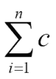

# 五、学习函数式编程——基础

JavaScript 是一种多参数语言，对于它所触及的任何范式来说都不是完美的，但是对于它的主要范式来说，它有有趣的特性。它是一种面向对象的语言，尽管面向对象的定义在面向对象语言之间有所不同。有人认为，它的原型继承对于面向对象的编程来说可能没有演示如何创建无类对象那么重要，而不是从头开始摸索正确的分类法。面向对象的定义在具有面向对象特性的多参数语言之间也有所不同。例如，Python 动态允许将成员添加到现有对象中，而 Java 则要求在类中定义成员。JavaScript 的面向对象特性是有用和有趣的，但特别是在过去的几年里，它们一直是其他面向对象语言的程序员感到沮丧的原因，他们被告知 JavaScript 是面向对象的，而没有足够的信息来说明 JavaScript 是如何通过一种与其他主要语言截然不同的方法来面向对象的。

同样，对于函数式编程，JavaScript 具有函数式编程支持，或者至少是部分支持。但是就像整体的 JavaScript 一样，函数式的 JavaScript 并不是 100%符合*好的部分*。函数式编程语言的一个常见但不通用的特性是尾部调用优化，它表示只在末尾重复出现的递归函数会在内部转换为更常见的循环样式，这种样式更快，并且可以深入到很深的地方，而不会耗尽其调用堆栈空间配额。这种优化计划在 ECMAScript 6 中进行，但是在撰写本书时，它还没有在普通浏览器中实现，普通浏览器不仅性能较慢，而且递归深度的调用限制在 10，000 到 20，000 次左右。

在这个限度内可以做很多事情，但是如果他们的`for`循环没有实现到超过 20，000 次迭代，结构化程序的编写者会不高兴。这里的重点不是指定哪种解决方案最适合不总是支持尾部调用优化的 JavaScript，而是指出这个困难目前就在这里，这是 JavaScript 不直接支持标准函数语言特性的少数几种方式之一(对 1 到 1，000，000 或更高的所有整数求和并不是特别有趣的事情，但它在教程中充当了标准示例)。

关于 JavaScript 是否应该被称为函数式语言，文献上存在分歧；它当然不像 Haskell 那样是一种纯粹的函数式语言(但是 OCaml 也不是)。JavaScript 是以一种已知的函数式语言——C 语言中的 Scheme 命名的，它的基本功能特性并不是事后添加的。也许这反映了他的偏好，但是道格拉斯·克洛克福特，他愿意对 JavaScript 语言的哪些部分是好的想法既挑剔又挑剔，我从来没有见过他挑选 JavaScript 中的功能方面作为严厉批评的目标。在他从 *JavaScript:好的部分*到*更好的部分*的移动中，他给 ECMAScript 6 的偏好之一是停止使用命令式的`for`和`while`循环，并使用利用尾部调用优化的递归，这将被包括在内。也许最强有力的关于 JavaScript 有一颗功能心脏的说法可以在语言中什么特性是核心的问题中看到。有人建议，在 Java 中，核心特性是对象。在 C 语言中，它是指针。在 JavaScript 中，它是函数。

JavaScript 的函数具有一流的状态，这意味着(更高阶的)函数可以作用于其他函数并作为参数传递，甚至可以动态构造并作为结果返回。

在本章中，我们将介绍:

*   自定义排序函数
*   映射、缩小和过滤
*   傻瓜的金子——改变别人原型的行为
*   闭包和信息隐藏

# 自定义排序函数——函数式 JavaScript 和一级函数的第一个例子

为了打破僵局，让我们来看看如何对 JavaScript 的数组进行排序。JavaScript 的数组有一个内置的`sort()`函数，至少是一个合理的默认值。例如，如果我们用π的前六位数字创建一个数组，我们可以对它进行排序:

```js
var digits = [3, 1, 4, 1, 5, 9];
digits.sort();
console.log(digits);
```

Chrome 的调试器在控制台上显示了一个数组，我们可以访问它:

```js
Array[6]
   0: 1
   1: 1
   2: 3
   3: 4
   4: 5
   5: 9
   length: 6
     __proto__: Array[0]
```

这很好。让我们进一步扩展一下，尝试混合整数和浮点小数(浮点)。请注意，在 JavaScript 中，对于介于(在 Firefox 中)-(253 - 1)，或-9007199254740991，和 253–1，或 9007199254740991 之间的整数，有一个数值类型的作用类似于整数(并保持整数干净)。此数值类型还存储浮点数。对于较小的数字，它们有更大的范围，当然也有更细粒度的值。为了更进一步，让我们有一个整数和浮点数混合在一起的数组:

```js
var mixed_numbers = [3, Math.PI, 1, Math.E, 4, Math.sqrt(2), 1,
  Math.sqrt(3), 5, Math.sqrt(5), 9];
```

其中，`Math.PI`在 3.14 左右，`Math.E`在 2.72 左右，`Math.sqrt(2)`在 1.41 左右，`Math.sqrt(3)`在 1.73 左右，`Math.sqrt(5)`在 2.24 左右。让我们像其他数组一样对此进行排序，并记录这些值:

```js
[1, 1, 1.4142135623730951, 1.7320508075688772, 2.23606797749979, 2.718281828459045, 3, 3.141592653589793, 4, 5, 9]
```

由于某些原因，Chrome 的调试器这次表现不同，将所有数组显示在一个字符串中，而不是左侧带有向下钻取三角形的数组。但是，数组是正确排序的，所有值以升序排列，整数和浮点值正确显示。

让我们用绳子试试这个。假设我们有以下数组:

```js
var fruits = ['apple', 'durian', 'banana', 'canteloupe'];
```

当我们分类的时候，我们得到这个:

```js
["apple", "banana", "canteloupe", "durian"]
```

这是妥当的，而且很好。让我们在数组的中间添加一点:

```js
var words = ['apple', 'durian', 'Alpha', 'Bravo', 'Charlie',
  'Delta', 'banana', 'canteloupe'];
```

我们对其进行排序，并返回以下内容:

```js
  ["Alpha", "Bravo", "Charlie", "Delta", "apple", "banana",
    "canteloupe", "durian"]
```

这是什么？所有的新词都在开头，所有的旧词都在结尾！也许是在他们之间分类的，但是按大写字母分开。

其原因是字符串排序是按 Unicode 值的字典顺序，这与作为 ASCII 一部分的字符的 ASCII 编码相同。在 ASCII 中，所有大写字母都在所有小写字母之前。这里，大写字母在大写字母中正确排序，小写字母在小写字母中正确排序，但这两者都是分离的。如果我们想让所有的`A`先于所有的`B`，我们需要更加明确我们想要什么。

我们可以这样做的一个方法是提供一个比较器功能——它可以比较两个元素，并告诉`Array.sort()`哪个应该先进行。让我们对这些单词进行不区分大小写的排序:

```js
var case_insensitive_comparison = function(first, second) {
  if (first.toLowerCase() < second.toLowerCase()) {
    return -1;
  } else if (first.toLowerCase() > second.toLowerCase()) {
    return 1;
  } else {
    return 0;
  }
}
```

然后我们对数组进行排序，并指定比较函数:

```js
words.sort(case_insensitive_comparison);
```

记录排序后的数组时，我们会看到不区分大小写的字母顺序:

```js
["Alpha", "apple", "banana", "Bravo", "canteloupe", "Charlie",
  "Delta", "durian"] 
```

如果我们希望大写字母作为平局决胜符，并且大写字母放在小写字母之前，会怎么样？这是对我们的比较器的简单修改:

```js
var mostly_case_insensitive_comparison = function(first, second) {
  if (first.toLowerCase() < second.toLowerCase()) {
    return -1;
  } else if (first.toLowerCase() > second.toLowerCase()) {
    return 1;
  } else {
    if (first < second) {
      return -1;
    } else if (second < first) {
      return 1;
    } else {
      return 0;
    }
  }
}
```

让我们将`'ALPHA'`和`'alpha'`添加到字符串列表的末尾，并重新排序:

```js
["ALPHA", "Alpha", "alpha", "apple", "banana", "Bravo",
  "canteloupe", "Charlie", "Delta", "durian"]
```

有效！

仅仅通过字符串比较可能不需要，但是如果服务器已经运行了一个数据库查询，并为我们将结果打包到 JSON 中呢？结果一旦在客户机上解析，很可能是具有相同结构的对象数组。电子客户联系信息可能包括以下内容:

```js
{
  "email": {
    "personal": "jsmith@gmail.com",
    "work": "john.smith@company.com"
  },
  "name": {
    "first": "John",
    "last": "Smith"
  },
  "skype": {
    "personal": "JohnASmith",
    "work": "JASCompany"
  }
}
```

这种记录结构可能不是 JavaScript 天生推断我们希望它如何排序的结构，但这并没有真正伤害到我们。如果我们构建一个比较器函数，它可以完全访问被要求比较的两个项目的字段或其他细节。这意味着我们可以比较一个领域，然后另一个领域，然后第三个领域。这也意味着，如果我们愿意，我们可以通过不同的标准进行比较；在某一点上，我们可以通过名字进行比较，在另一点上，我们可以通过地理位置进行比较。如果我们的服务器存储(或查找)地址的全球定位系统坐标，我们可以通过谁离特定位置最近来搜索。

## 这就引出了 array.filter()

在函数式语言中，诸如映射、减少和过滤等功能是日常使用的主要功能。它们对列表进行操作，在功能更强、以列表为中心的语言中，列表可能是有限的，也可能是无限的。从这个意义上说，一个列表可能更像一个 JavaScript 数组或生成器，一种函数，它不是返回一个值，而是产生零个或多个值，理论上可能产生无限多个值。与数组不同的是，任何给定的生成器都没有耗尽的有限点，即使一个生成器实际上从来不会产生无限个值。生成器是一个很棒的特性，但是在撰写本书时，浏览器中不太支持它们，这意味着我们对 map、reduce 和 filter 的使用更可能是在(有限)数组上，而不是生成器上。

但是在我们放弃生成器的话题之前，让我们给出两个生成器的例子，这两个例子都将在太长时间内溢出，但是这两个例子都可以作为一个例子，在像 Haskell 这样的语言中，它可能被认为是一个包含数学级数所有成员的无限列表，而不是一个只包含第一个 *n 个*成员的数组。我们将研究 2 的幂和斐波那契数的生成器，使用 ECMA6 提出的生成器语法，如[http://wiki.ecmascript.org/doku.php?id=harmony:generators](http://wiki.ecmascript.org/doku.php?id=harmony:generators)所讨论的:

```js
function* powers_of_two_generator() {
  var power = 1;
  while (true) {
    yield power;
    power *= 2;
  }
}

function* fibonacci_generator() {
  var first = 0;
  var second = 1;
  var sum;
  yield second;
  while (true) {
    sum = first + second;
    yield sum;
    first = second;
    second = sum;
  }
}
```

将这些例子与使用标准递归方法计算 2 的 n 次方的生成器(这并不是真正需要的，因为 JavaScript 的算术处理指数，但为了完整起见，它被包括在内)和计算 n 次方斐波那契数的天真实现进行对比。两者都是所谓的尾部递归，如果浏览器提供了这样的东西，它们将从尾部调用优化中受益:

```js
function power_of_two_recursive(n) {
  if (n === 0) {
    return 1;
  } else {
    return 2 * power_of_two_recursive(n – 1);
  }
}

function fibonacci_recursive(n) {
  if (n === 0 || n === 1) {
    return 1;
  } else {
    return (fibonacci_recursive(n – 2) +
      fibonacci_recursive(n – 1));
  }
}
```

这两个函数都假设一个非负整数作为参数。第二个函数也有可怕的性能特征，即使内存使用不是特别糟糕。然而，函数调用的数量与返回值相当，因此计算第 100 个斐波那契数，除了任何关于整数溢出的担忧之外，可能需要比宇宙年龄更长的时间。正如唐纳德·克努特(Donald Knuth)所说，“过早优化是万恶之源”，但这是优化不是过早的一种情况。

请注意，函数式编程的另一个特征，称为**记忆化**，这意味着保留中间计算的结果，而不是从头开始重复重新生成它们，完全避免了这个性能瓶颈。考虑递归斐波那契函数的以下记忆:

```js
var calculated_fibonacci_numbers = [];

function fibonacci_memoized(n) {
  if (calculated_fibonacci_numbers.length > n) {
    return calculated_fibonacci_numbers[n];
  } else {
    if (n === 0 || n === 1) {
      result = 1;
    } else {
      result = (fibonacci_memoized(n – 2) +
      fibonacci_memoized(n – 1));
    }
    calculated_fibonacci_numbers[n] = result;
    return result;
  }
}
```

## 幻术、贴图、缩小和过滤

小时候，我对幻术非常感兴趣，我仍然有一套幻术师的装置——有(或曾经有过)假拇指和魔术杯之类的东西——以及关于幻术的书。我记得的一个技巧是把一根绳子套在大腿上，绕在手上。如果一个人的腿放松，绳子看起来很紧，但是如果一个人稍微抬起一点腿，绳子就会变得更松，从而给人一种绑得很牢的印象，而松开一只手或两只手是很简单的。

我从来不太擅长业余幻术的表演，这真的是这门手艺的核心。资深幻术师在给自己的下级或野心家提建议时，往往会说这样的话:“娱乐观众，欺骗观众，但要知道哪个先来。”我记得很长一段时间，我认为我不知道(技术方面的)真正的幻术，因为我知道技术上如何做几个技巧，但我没有看到一个人会如何接近做我看到的事情。

很久以后，在我公司的聚会上有一个魔术师，我被一个不寻常的原因迷住了。他做了一些对我来说很新奇的把戏，但在大约 70%或 80%的时间里，他用我小时候学的绳子技巧跑了很多英里。而且效果非常好。他有精湛的表演技巧，我的兴趣不是想知道他是如何在技术上完成这个把戏的，而是一个如此娴熟的艺人，他能表演两个孩子能做的把戏，并挖掘它们的娱乐价值。

映射、减少和过滤(这里，“减少”包括右折叠和左折叠)对于函数式编程来说有点像这样。Map 接受它并将其应用于列表的所有成员。Reduce 接受一个操作，从右或左开始，将它应用于每个成员，得到一个中间结果。Filter 接受一个函数和一个列表，并创建一个新的列表，该列表完全由那些函数为真的项组成。这些概念将在本章中解释和进一步说明。映射、减少和过滤并不是特别困难的概念，但是有很多好处可以利用。让我们看看数组的映射、约简和过滤，包括生成器的问题和像 Haskell 这样的语言提供的潜在无限列表。我们将向您展示如何使用 JavaScript 的数组内置版本来映射、缩小和过滤。我们还将看一下使用核心 JavaScript 来实现这些功能，与其说是为了让人们能够拥有 IE8 兼容(以及更早)的方式来访问这些功能，不如说是为了让人们对这些东西的工作原理有一个了解。

我们将探索的实现在发出了关于傻瓜黄金的警告之后，具有某种非函数式的实现风格。他们使用`for`循环，在纯函数语言中，选择的解决方案可能是尾部递归实现。选择的基本原理是为了提供功能特性支持，这种功能特性支持能够针对 JavaScript 的管道进行最佳操作，并且在(非尾部调用优化的)JavaScript 递归达到极限的极少数情况下不会失败。

## 愚人金-延伸阵.原型

需要注意的是。一个有吸引力的解决方案，也是一个容易实现的解决方案，就是扩展(这里是)`Array.prototype`或者其他人使用的其他对象的原型，包括`Object.prototype`。别这么做。

其中，扩展 `Array.prototype`及其同族破坏了其他人软件的竞争环境；这就像没看过别人的代码就重写别人的代码。或许，扩展基本原型的最佳用例是聚合填充(使用可用的特性，重新实现当前环境中不可用的功能)，但即使如此，如果有竞争的聚合填充，也只有一个可以胜出。现在，您的 polyfill 不太可能像主要浏览器制造商那样进行相同的 bug 对 bug 兼容性测试。这就为细微的虫子敞开了大门。在我们的例子中，为了支持稀疏矩阵，我们忽略未定义的条目，但不是空的。我认为这在上下文中是合理的，但远不是某个聪明人(或不那么聪明的人)能想到的唯一方法。JavaScript 有两个空值，`null`和`undefined`，对于如何处理这两个不同的空值，可能会有不止一种意见。如果对我们有意义的语义不是对其他人显而易见的语义呢？我们想打开滑溜溜的海森堡的门吗？

有一个简单又好的替代方法:创建自己的函数，最好是在闭包中定义的匿名函数，并存储在变量中。如果需要，这些功能可以检查是否有浏览器的内置功能，如`Array.prototype.map()`，如果找到就退回到内置功能。它可以为我们的代码做几乎任何通过扩展`Array.prototype`完成的工作。但它显示了良好的习惯，而且不会把地毯从任何人的脚下拽走。

### 注

JavaScript 中的术语*匿名函数*不排除存储在命名变量中的函数。这仅仅意味着它们被定义时没有函数名。换句话说，它们的定义类似于`function()`、`var foo = function()`或其他选项，但不是函数关键字和左括号之间的名称，即`function bar()`。通常，我们会使用匿名函数，无论它们是否存储在变量中，但是有一个与调试相关的原因，即使我们从不使用函数，我们也可能会为它命名:如果函数被命名，调试器的堆栈跟踪可能会在提到函数的方式上提供更多信息，即使这些名称从未被使用过。出于这个目的，写`var quux = function quux()`确实有意义。

撇开我们可能正在私下开发的东西不谈，在一个角落里:惊人数量的 Unix 实用程序作为私人黑客开始了它的生命，为不同的人解决本地问题。像野火一样传播的东西通常不是被设计成像野火一样传播的东西，比如网络、JavaScript 和 5.0 之前的 PHP 版本。在他们的第一个版本中——也许这比 JavaScript 更适用于网络——他们做了一些特定的事情，让人们努力以更完整的方式运行。

HTTP 的无状态是一个精心选择的特性，但是当时，大量的 web 编程试图支持无状态 HTTP 变得相当痛苦的用例。5 MB HTML5 键值存储和 4096 字节 cookie 上限之间可能存在差异，但它们都或多或少地提供了在 web 的 HTTP 无状态时为适当的有状态行为提供钩子的便利:web 的构建不是为了启用动态内容，因为它是当今所有 web 内容的最大份额。JavaScript 有它的优点和缺点，它的缺点可能是任何一种非常成功的语言中最糟糕的，但是它获得广泛成功和名人地位的原因不是它的优点或缺点。它之所以成功，是因为它被包含在浏览器中，而当时网络正如野火般蔓延。JavaScript 和 Web 都让人们试图修复他们的局限性和弱点，以便在许多事情像野火一样蔓延开来之后做好它们，而实际上他们只做好了一件事情。

“这只是一个角落里的东西，我们不需要考虑维护或互操作性”的心态非常非常危险。也许现在你的软件不会破坏任何东西，如果它微妙地重新定义一个对象或数组的行为，但永远不会？甚至没有任何未来的决定？即使有人意识到在解决 X 的过程中，你为 Y 创造了一个伟大的引擎，可以节省大量的工作，也不行吗？客户端的 JavaScript 是一些最快速开放源代码的代码(毕竟，即使是关心保持事物专有的律师也知道，你的整个 kaboodle 可以交付给任何从网络登录到你的系统的人)，如果认为标准行为的特定重新定义只是为了未来的证明，这是很危险的。

对前面问题的简短回答是这样的:不要重新定义任何别人的代码建立在其上的东西，包括重新定义部分`Object.prototype`、`Array.prototype`、`Function.prototype`等等。尽可能选择自己的实现，但不要(强行)为所有人安装。

## 避免全球污染

尽量减少对全局命名空间的入侵也是一种好的做法。添加的全局变量越多，就越容易与其他工具发生冲突。当雅虎！YUI 宣布，作为一个基本礼仪问题，他们只使用了一个全球变量——YUI。有一个完整的库是可用的，但是你没有页面和页面的项目转储到浏览器的全局命名空间；每次打电话到 YUI()。使用()或任何完全包含在 YUI 对全局命名空间的一次入侵中的东西。jQuery 使用的全局命名空间比他们宣传的多一点，但原则上，他们只要求我们使用`jQuery`和`$`。此外，他们试图让第二个框架完全可以谈判，因为`jQuery`承认其他框架需要`$`，而`jQuery`意在与其他框架友好相处。

然而，您实际上可以更进一步，通过一个立即调用的函数表达式，包括在[第 8 章](08.html "Chapter 8. Demonstrating Functional Reactive Programming in JavaScript – A Live Example, Part I")、*中探索的 ReactJS web 应用，演示 JavaScript 中的函数式反应编程-一个真实的例子*到[第 11 章](11.html "Chapter 11. Demonstrating Functional Reactive Programming in JavaScript with a Live Example Part IV – Adding a Scratchpad and Putting It All Together")、*用一个真实的例子演示 JavaScript 中的函数式反应编程第四部分-添加一个草稿栏并把它放在一起*。不需要一个全局变量就能完成的功能非常多。也许库应该有一些全局变量作为公共面供其他人使用，但是制作一个不涉及全局变量的 web 应用是完全可能的。

## 地图、缩小和过滤工具箱-地图

地图采用一个数组和一个函数，并返回一个新数组，函数应用于数组的所有元素。作为一个的例子，让我们创建一个数字 1 到 10 的数组，并使用 map 创建一个带有正方形的新数组。(请注意，对于数组选项是就地修改数组、返回修改后的数组还是两者都修改，JavaScript 有些不一致。该数组的`map()`、`reduce()`和`filter()`功能都创建了一个新数组，而保持原数组不变，保持不变。):

```js
var one_to_ten = [1, 2, 3, 4, 5, 6, 7, 8, 9, 10];
var squares = one_to_ten.map(function(x) {return x * x});
```

`squares`变量现在成立，`[1, 4, 9, 16, 25, 36, 49, 84, 81, 100]`。

`map()`的一种实现方式可能如下:

```js
var map = function(arr, func) {
  var result = [];
  for(var index = 0; index < arr.length; ++index) {
    if (typeof arr[index] !== 'undefined') {
      result[index] = func(arr[index]);
    }
  }
  return result;
};
```

## 还原功能

reduce 函数所做的是进行一个运算，并逐步将其应用于数组中的元素。你可能在学校学过无穷(和有限)级数，可能用的符号是这样的:



在这种运算中，大写的σ(**σ**，大致相当于希腊字母表中的“S”)用于求和，不太常用的是大写的π(π，大致相当于希腊字母表中的“P”)用于乘积。两者都是对有限(或无限)数列反复应用算术运算符，它们的工作原理与`reduce()`相同。

这种记数法说的是，“对于这一系列数字，如果把它们加在一起，也就是用加法函数把它们减少，取第一个数字和第二个数字，计算它们的和，然后加到第三个数字上，如此类推，我们得到了什么？”

如果我们希望将一个数组的内容加起来，我们可以用一个加法函数来减少它(作为一个次要的实现细节，我们不使用裸露的`+`运算符，因为我们不能直接将运算符作为常规函数传递):

```js
var sum = one_to_ten.reduce(function(x, y) {return x + y});
// returns 55
```

学校教的有限级数和无穷级数通常是和；我们也可以使用其他系列。比如我们要算 10！，我们可以通过乘法而不是加法来减少我们提供的函数:

```js
var factorial = one_to_ten.reduce(function(x, y) {return x * y});
// returns 3628800
```

归约在性质上不需要数学化；这给了我们一个快速展示的方法。我们还可以使用 reduce 来连接字符串数组，其中`+`运算符的作用是字符串连接而不是数字相加:

```js
var message1 = ['H', 'e', 'l', 'l', 'o', ',', ' ',
  'w', 'o', 'r', 'l', 'd', '!'].reduce(function(x, y)
  {return x + y});
var message2 = ['Hello', ', ', 'world', '!'].reduce(
  function(x, y) {return x + y});
// Both invocations return, 'Hello, world!'
```

然而，有一个基本的困难是 JavaScript 的内置函数无法为我们解决的。我们有时需要做出选择，进一步明确我们真正想要的是什么。数字加法、乘法和字符串连接都是关联的，这本质上意味着您可以将括号放在任何想要的地方，遵循括号的标准规则，并获得相同的答案。除了数值之外，以下是等效的:

```js
1 + (2 + (3 + 4))
((1 + 2) + 3) + 4
```

这两种计算都给出`10`，如果我们相乘而不是相加，两者都给出`24`的乘积。但是如果我们对稍微不同的值使用幂运算会发生什么:

```js
Math.pow(2, Math.pow(3, 4))
Math.pow(Math.pow(2, 3), 4)
```

这和我们在前面的代码中看到的一样，尽管不可否认的是使用了一个更难看的命名空间函数，而不是中缀运算符。在非 JavaScript 符号中，使用插入符号(`^`)，我们得到以下伪 JavaScript，它重述了前面的计算:

```js
2 ^ (3 ^ 4)
(2 ^ 3) ^ 4
```

如果我们使用`console.log()`和您刚才看到的`Math.pow()`计算，我们会得到:

```js
2.4178516392292583e+24
4096
```

这里略有不同。一个结果是四位数的整数；另一种是用超过四位数的科学符号表示的。嗯，有多少东西真的像幂运算的特例？

这个问题的答案有点棘手，部分原因是我如何欺骗性地提出这个问题，以说明一个危险的误解。幂运算，重要的是如何添加括号，可以更像一般情况。确实存在无关紧要的情况，它们甚至更有可能成为`reduce()`的候选者，但是在一般情况下，我们不应该假设两者是等价的。我们将给出一个`fold_left()`和`fold_right()`函数；这不是唯一的两个选项(如果两个都不是您想要的，您可以手动完成)，但是它们分别计算数组 1 到 10 的总和，如下所示:

```js
((((((((1 + 2) + 3) + 4) + 5) + 6) + 7) + 8) + 9) + 10
1 + (2 + (3 + (4 + (5 + (6 + (7 + (8 + (9 + 10))))))))
```

一个不一定比另一个好，但差异很重要。JavaScript 内置的`reduce()`函数是一个左折叠，从左边开始向右移动，如前面两个表达式中的第一个所示(这可能是一个合理的默认值)。

如果我们定义`fold_left()`和`fold_right()`，它可能看起来像下面这样。我在这里使用缩写，拼写出来的完整单词看起来太接近保留单词；例如，array 不会与 Array 冲突，但它们非常接近(可能会与名为 function 的变量发生类似的冲突):

```js
function fold_left(arr, fun) {
  var accumulator;
  for(var index = 0; index < arr.length; ++index) {
    if (typeof arr[index] !== 'undefined') {
      if (typeof accumulator === 'undefined') {
        accumulator = arr[index];
      } else {
        accumulator = fun(accumulator, arr[index]);
      }
    }
  }
  return accumulator;
}

function fold_right(arr, fun) {
  var accumulator;
  for(var index = arr.length - 1; index >= 0; --index) {
    if (typeof arr[index] !== 'undefined') {
      if (typeof accumulator === 'undefined') {
        accumulator = arr[index];
      } else {
        accumulator = fun(arr[index], accumulator);
      }
    }
  }
  return accumulator;
}
```

## 最后一个核心工具——过滤器

过滤器在数组中筛选符合某个标准的值。例如，我们可以只过滤正值，如下所示:

```js
var positive_and_negative = [-4, -3, -2, -1, 0, 1, 2, 3, 4];
var positive_only = positive_and_negative.filter(
  function(x) {return x > 0;});
```

本次运行后，`positive_and_negative`过滤器被声明为；`positive_only`有`[1, 2, 3, 4]`的阵值。

筛选器对于缩小数组的内容非常有用。如果我们有一个数组，就像前面的数组一样，带有史密斯先生的联系信息，我们就可以访问字段来缩小到我们感兴趣的东西。我们可以声明我们只想要一个状态，或者要求一个带有特定电话区号的电话号码，或者声明某个功能可以告诉的任何其他标准。如果我们的记录包括全球定位系统坐标，我们可以过滤内容，只包括特定中心点特定半径内的结果。我们所需要的是一个函数，对于我们想要包含的记录，该函数将返回 true，对于我们不想包含的记录，该函数将返回 false。

# JavaScript 中信息隐藏概述

总的来说——意思是任何编程语言，客户端、服务器端、非 web、移动应用，以及几乎任何其他东西，甚至可能是微控制器(现在可以运行精简的 Python)——有不同的方法，它们通常有自己的优缺点。史蒂夫·麦康奈尔(Steve McConnell)的*代码完成:软件构建实用手册*([http://tinyurl.com/reactjs-code-complete](http://tinyurl.com/reactjs-code-complete))讨论了不同的方法，并涵盖了，例如，面向对象编程的最佳点是如何处理比真正的过程编程的最佳点更大的项目。对于大多数方法论来说，他的建议是它们都有自己的长处、短处和优点，在 X 和 Y 的条件下，你应该考虑方法论 z。但是有一个例外——信息隐藏。他对何时使用信息隐藏的简单建议是“尽可能多”。

程序化或结构化的编程也许很容易被忽视，而且它并没有突破极限去发挥它的优势。但是假设我们在它第一次出现的时候看到它，它的函数/过程，if-then-else，`for` / `while`循环，过程体不被窥视。现在，如果我们把它比作直接的汇编程序或机器代码，用前 Dijkstra 风格的 gotos，甚至不假装模拟结构化控制流，那么我们明白过程或结构化编程真的，真的令人震惊。此外，它是今天显而易见的闪光，因为它在很大程度上取得了成功，对每个人都有好处。在过去，流程图是任何希望理解复杂系统的人必不可少的救命稻草，现在已经成为一个新奇的项目。它们出现在一个杯子上，出现在一部展示如何提供出色技术支持的 XKCD 漫画中，或者出现在其他异想天开的用途中，因为它们不再需要给出任何类型的路线图来给一些人——一种如何通过意大利面找到路的感觉。

现在，一个大系统可能比一个旧的、流程图化的、导航程序的内存或磁盘要复杂得多，也要大得多，但是程序编程已经有效地消除了这个幽灵。此外，软件工程范例中较新的迭代，如面向对象编程，降低了理解大系统的难度。在这两种情况下，大部分好处都是推进信息隐藏的实用方法。通过结构化编程，您可以浏览源代码，而不必跟踪汇编或机器语言呈现跳转(即 goto)的每个点。结构化编程和面向对象编程在历史上都允许开发人员前所未有地将更多的程序视为一组封闭的黑盒，您只需要打开并检查其中的一小部分。他们传递信息隐藏。


前面的流程图是来自[http://xkcd.com/627/](http://xkcd.com/627/)的新奇流程图。我从来没有见过一个人和我谈论的程序的真正流程图。

在经典的 Java 中，信息隐藏的标准教科书示例可能是这样的:

```js
class ObjectWithPrivateMember {
  private int counter;
  public ObjectWithPrivateMember() {
    counter = 0;
  }
  public void increment() {
    counter += 1;
  }
  public void decrement() {
    counter -= 1;
  }
  public void get_counter() {
    return counter;
  }
}
```

这个类有一个私有成员和四个公共成员，这与生产中的实时 Java 类的典型例子不同。通常的目标是尽可能隐藏有趣的重物，并向世界其他地方呈现一个简化的外观。这就是 Java 面向对象编程传递信息隐藏的方式，尽管面向对象语言和它们处理对象的方式有很大的不同，但这是 Java 的强项之一。对象方法不仅应该按照程序编写——作为定义了输入和输出的黑盒——而且它们还被封装在对象中，多个较小的黑盒可以包含在一个较大的黑盒中。在这种情况下，我们看到了信息隐藏的另一个好处:我们在很大程度上受到了外部的保护，并且可以自由地进行任何我们想要的内部更改，而不会破坏外部的使用，只要我们保持相同的行为。假设我们决定记录计数器何时更改以及更改为什么值。这至少是另一个私有字段和代表公共接口的方法内部的改变，但是我们可以在不改变任何访问这个类的类的任何细节的情况下进行改变。现在假设我们想要更多的日志记录，我们想要我们的日志记录一个完整的堆栈跟踪。在内部，我们需要使用像`Thread.currentThread.getStackTrace()`这样的东西，但是在外部，没有人需要知道或者关心我们的重构。在一个更大的类中，我们可能会发现一个瓶颈，可以通过切换到另一个等效的算法来大大改进。由于 Java 面向对象的编程提供信息隐藏的方式，我们可以在不打扰其他人的情况下进行大量的更改，其他人可以使用我们的工作，而不用担心我们的公共接口之外的任何事情。

## 用 JavaScript 闭包隐藏信息

我们需要看得更远一点，看看信息隐藏的模式。在 Java 中，你会很快被教授用于信息隐藏的语言特性，并被诸如安全格言——“吝啬特权就是伪装的善良”之类的话所鼓励，去犯声明非公开的错误。在 JavaScript 中，可能会有`public`、`private`、`protected`等未来保留词(道格拉斯·克洛克福特建议可能会有这样的词，让 Java 程序员在使用 JavaScript 时更有家的感觉，而牺牲了对 JavaScript 更好的一面的理解)，但现在已经没有同样明显的机制了。一个对象的所有成员，不管它们是不是函数，都是开放的，以供检查。JSON——另一个像野火一样传播的东西，但没有人诅咒它的简单——没有机制来标记任何东西为非公开的。

然而，在一些函数式语言的特性中，有一种技术可以创建私有字段，称为闭包。它并不完全是一种简单地用语言来创建信息隐藏的技术，但是它允许我们创建具有非公开信息的对象。为了移植前面示例的功能，包括非公共状态，我们可以如下所示:

```js
var factory_for_objects_with_private_member = function() {
  var counter = 0;
  return {
    'increment': function() {
      counter += 1;
    },
    'decrement': function() {
      counter -= 1;
    },
    'get_count': function() {
      return counter;
    }
  }
};
```

这里给出的例子表明我们可以如何扩展它。一个更复杂的例子可能有更多的`var`函数存储字段和函数，并返回一个公开其公共接口的字典。但我们不要简单地跳过去。一路上有一些有趣的事情。

在函数式语言中，函数可以包含其他函数。事实上，考虑到 JavaScript 的语法——其中函数是一级实体，可以存储在变量中，作为参数传递等等——如果函数不能嵌套甚至两个深度，那将是令人惊讶的。因此，以下语法是合法的:

```js
var a = 1;
var inner = function() {
  var b = 2;
  return a + b;
}
```

但是同样可以合法地包装在函数中，如下所示:

```js
var outer = function() {
  var a = 1;
  var inner = function() {
    var b = 2;
    return a + b;
  }
}
```

内部函数可以从外部函数看到变量，这是函数式语言的一个基本特征，包括 JavaScript 的传统；因此`a`和`b`对于`inner`功能同样可用。

现在如果我们改变`outer`功能返回`inner`功能会怎么样？然后我们有以下内容:

```js
var outer = function() {
  var a = 1;
  var inner = function() {
    var b = 2;
    return a + b;
  }
  return inner;
}
var result = outer();
```

当函数完成执行时，它的变量已经超出了范围。JavaScript 现在有带有函数作用域的`var`变量，并且正在获取带有块作用域的`let`变量，但是在`outer`函数中以任何一种方式声明的变量都不再可用。然而，有趣的事情发生了；`inner`功能在`outer`功能结束后仍然存在，但逻辑上是一致的。`inner`函数应该并且确实可以访问其执行上下文。我们已经结束了。

这种现象可以用于信息隐藏，信息隐藏很重要。然而，可能有人会说，这里最有趣的不是它可以包括非公共变量，可能包括函数，而是只要能够访问它的东西存在，执行上下文作为一个整体就会被维护。这留下了一个有趣的探索领域。StackOverflow 的一位成员曾经评论说，“对象是穷人的闭包”，除了关于如何使用它们的功能进行信息隐藏的常见问题条目之外，对象和闭包都有有趣的可能性。即使是可能强烈支持信息隐藏的完整代码，也从未说过“尽可能多地使用信息隐藏，但不要使用其他任何东西。”

也许指责函数式语言纯粹主义者说“JavaScript 必须等到 20 年后才能实现尾调用优化，而不是惩罚标准函数式编程对递归的使用——就像在中，根据美国法律，它已经大到可以从新生婴儿变成成年人了。”然而，不管其他什么可能会让函数式程序员对 JavaScript 感到厌烦，JavaScript 从一开始就把闭包做得足够正确，以至于保留执行上下文的闭包一直都是 JavaScript 的一个重要特性。20 年后，在大多数浏览器中，它们仍然是主要的，也可能是唯一的信息隐藏资源。

# 总结

在这一章中，我们提到了一些与 JavaScript 相关的函数式编程。我们主要看了三个主题。自定义排序函数提供了简单而有用的一瞥，告诉我们如何将帮助函数传递给更高阶的函数，以获得比默认函数更有用的行为。映射、约简和过滤是关于数组的函数式编程的三个主要部分。通过闭包和信息隐藏，我们看到了一种在负责任的软件开发中提供一些核心兴趣的功能方式。

JavaScript 是一种多级语言，具有函数根源和一些函数语言优势，尽管函数语言纯粹主义者将 JavaScript 与命令式多级语言放在一起可能并不常见。JavaScript 不像某些函数式语言那样，对赋值或纯不可变的数据结构具有永久绑定。

所有语言都有更好和更差的邻域，但 JavaScript 如此鲜明地结合了优秀部分和糟糕部分，以至于 Crockford 的*JavaScript RPT:The Good Parts*和 *The Better Parts* 的基本方法在优秀的开发者中没有受到严重质疑(我想知道为什么还没有人把 Kernigan 和 Ritchie，*C 编程语言*，第二版，作为 *C++: The Good Parts* )。认为默认将东西倾倒在一个全局对象上是开发 web 应用的一个好主意，这种观点会被挑衅到令人讨厌的地步。这也扩展到了 JavaScript 的功能方面。JavaScript 是第一个允许匿名函数的主流语言，也就是 lambdas，大约从 50 多年前 LISP 出现以来，它就一直是函数式编程的主食。即使现在连 Java 也加入了这股潮流，它在主流语言中的出现也是受 JavaScript 的影响。JavaScript 从一开始也有闭包。就一些比较糟糕的邻域而言，JavaScript 应用尾调用优化似乎花了几十年的时间，有了它，使用尾递归而没有惩罚的函数式编程风格取代了 for 和`while`循环来构造迭代工作。

函数式编程是一个有趣的话题，也是你可以无限探索的东西(也就是说，一个人可以有益地探索的函数式编程的有趣方面的列表是一个无限的列表，即使在具体的情况下，一个人只能从列表的左边获取有限数量的项目)。不试图解决 JavaScript 是否应该被认为是函数式语言的问题，最好从函数式编程的根源来理解 JavaScript，学习用函数式语言/范式更好地编程应该是用 JavaScript 更好地编程的基础。JavaScript 可能会被载入史册，它不仅是 Web 的语言，也许是程序员要知道的最关键的语言，也是桥梁语言，通过它，函数式语言的优点不再被称为(像 Scheme 一样)“你永远不会使用的最好的语言。”也许，函数式语言的优势对于构建严肃的、主流的多参数语言来说是不可谈判的。

让我们继续看看函数式反应式编程。