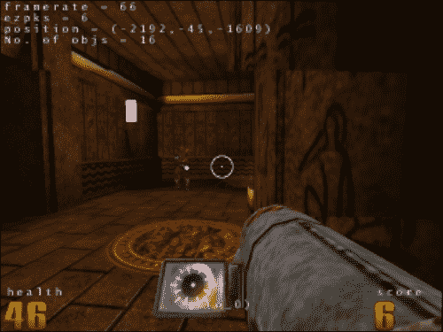

# 第六章。功能反应式编程——基础

我可能会在这里有点尴尬地提到，我有数学硕士学位和许多数学奖项，但我发现一些与基本函数式编程相关的数学概念有点滑。一个人不会阻止在相关数学和计算机科学领域有实力的人处理完整的数学严谨性，例如，在维基百科关于函数反应式编程的文章中链接的基础函数反应式编程论文。然而，这里的意图略有不同:从函数式反应式编程中学习一些对专业开发人员有用的东西，这些开发人员没有或不记得那些开创性工作的数学形成水平。

StackOverflow 评论反复问，“你能不能用一种不假设计算数学博士的方式来解释？”这里的意图不是将所有这些数学文章放在一起，而是提供一个子集，这个子集可以是实用的，并且对真正的专业软件开发人员是有用的，他们并不梦想 Scheme 或 Haskell。

在本章中，我们将介绍:

*   计算机民间传说记忆之旅
*   功能反应编程
*   如果你只学到一件事…
*   了解函数式编程
*   前端网络发展的未来

我们开始吧。充满民间传说的记忆之旅可能会相当长，但从任何意义上来说，它都不乏味。

# 沿着计算机民间传说的记忆之路的旅行

有一份措辞严厉的侮辱清单一直在流传，适用于 pet(或其他)编程语言。其中一个贬损就是，“程序员不应该非要懂范畴论才能写，*你好，世界！*“这在一定程度上反映了当初级人员提出迄今为止最好的编程语言时，他们不断犯的错误。在这一点上，它可能被比作在冒险电影中不断发生的愚蠢事情的病毒式邪恶霸主列表。从无数电影反派的错误中吸取教训，作者宣称“对我的敌人来说，射击并不太好”，“除非绝对必要，否则我不会包括自毁机制……”这种贬低来自于一次又一次看到同样的错误时的沮丧。

还有其他显示编程机智和智慧的点。例如，宠物或玩具语言比成功的语言多几个数量级，在成功的语言中，要么是学术计算机科学圈，要么是商业信息技术。在任何语言的发展中，一个被广泛认可的转折点是当它工作在一个水平时，人们可以通过使用它来编写自己的编译器来获得它。

这不是一个无关紧要的问题；Java 刚发布的时候，就宣称 Java 编译器是用 Java 本身编写的，言下之意就是一个能够运行 Java 运行时环境的系统应该能够编译用 Java 编写的软件。与此相关，侮辱某人热情洋溢的宠物语言的一个标准问题是，“除了它自己的编译器，它还被用来写什么吗？”计算机智慧和民间传说的这个特殊节点被放进了清单中:其中两个条目快速连续地写道，“用这种语言编写的最重要的程序是它自己的编译器”，然后，更侮辱人的是，“用这种语言编写的最重要的程序甚至不是它自己的编译器”。

但是哲学上的反对，“程序员不应该需要理解范畴理论才能写，*你好，世界！*“不是简单地编造一些听起来带有侮辱性的东西。有一个传统始于 1978 年第一版的 Kernigan 和 Ritchie 的经典*C 编程语言*，其中第一个程序开发之前潜入错综复杂的是一个最小的 C 程序，在思想上“让我们爬行之前，我们尝试走路”，打印出*你好，世界！*:

```js
main()
{
  printf("hello, world.\n");
}
```

引入新编程语言的人们绝大多数遵循使用`Hello, World!`作为他们的第一个样本程序的传统。这就是“程序员应该不需要懂范畴理论就可以写，*你好，世界！*“那么光谱的另一端是什么？

在学术数学的世界里，无论是纯数学还是应用数学，数学作为成功的标志已经变得非常专业化(就像几乎任何一个已经有足够工作的领域一样)。有人评论说，一个数学家能理解在数学会议上提交的 50 篇论文中的 13 篇以上，这是一种罕见的野兽。数学已经变得足够专业，以至于大多数数学博士，无论多么有能力，都无法理解大多数其他数学博士的工作。在这种情况下，这是没有意义的，能够理解所有数学的希望就像能够说所有人类语言的希望一样:有点天真。数学博士课程的目的也许不是让你发展到能够跟随整个数学学科的广度，而是足够深入地理解一些狭窄的领域，以至于当你的博士学位完成时，你比世界上任何人都更好地理解那个高度集中的领域。

有两种例外，一种是连接所有数学的学科，但方向完全相反。一方面，有逻辑和数学基础，它着眼于所有其他数学领域的基础。现在有一些关于逻辑是属于数学还是哲学的问题，人们听说有人被要求决定他们是想成为逻辑学家还是数学家。但是抛开其中的一些问题，如果说逻辑通过挖掘数学其余部分赖以生存的基石而与所有数学联系在一起，这并不会引起太大争议。

然后还有另一个选项:*范畴论*。一个芭比娃娃曾经说过:“数学很难”，但是数学界很明白，没有芭比的帮助。阿尔伯特·爱因斯坦说过:“不要担心你在数学上的困难。我可以向你保证，我的更伟大。”但是数学的一个分支，叫做范畴理论，特别难懂。

如果说逻辑可以研究建造数学大厦的基石，那么范畴理论则着眼于已经建成的城市，探索贯穿各种数学街区的建筑主题和相似之处。范畴理论是一门有点像比较的学术学科的学科，因为实践者被期望能够处理不仅仅是一种语言，而是几种语言的比较文学。可以说范畴理论是整个数学保护伞下最难的地方。你需要做一些大多数数学博士从来没有教过的事情。

此外，我的论文导师是一位范畴理论家，他能够有效地监督点集拓扑学这一晦涩分支的论文，尽管他在点集拓扑学中没有表现出任何特殊的专长，这或许是一种敬意。所以说一个使用你语言的程序员需要理解范畴理论才能写出*你好，世界！*是相当尖刻的侮辱。

那么这和函数式或函数式反应式编程有什么关系呢？很高兴你问了！

在维基百科文章中链接到的功能反应式编程的来源中，Haskell(或基于它的东西)是占主导地位的语言。还有一些其他的玩家，比如 Scheme 的方言，但是人们似乎一直回到哈斯克尔。外面有许多哈斯克尔资源；其中最受尊敬的是*学你一个哈斯克尔为伟大的好*、[http://tinyurl.com/reactjs-learn-haskell](http://tinyurl.com/reactjs-learn-haskell)。它有*你好，世界！*神秘出现在第九章而不是第一章的程序。为什么是第九个？如前所述，输入和输出建立在单子之上。但是真的需要那么多解释才能得到单子吗？有；单子是建立在应用函子的概念之上的，应用函子是建立在函子的基本概念之上的，这让我们想起了在数学研究生院遇到的一些并没有被真正理解的事物的名字。让我们访问维基百科的函子页面。维基百科以清晰易读而闻名。维基百科页面上有几个函子。其一，对于维基百科来说，这种语言非常深奥。另一点是函子实际上是从范畴理论中获得的东西:

> *在数学中，函子是范畴之间的一种映射，应用于范畴理论。函子可以认为是范畴之间的同态。在小范畴的范畴中，函子可以更一般地被认为是态射。*

函子首先在代数拓扑中被考虑，其中代数对象(如基本群)与拓扑空间相关联，代数同态与连续映射相关联。如今，函子在现代数学中被用来联系各种范畴。因此，函子一般适用于数学范畴理论可以抽象的领域。

## 你好，世界的高级先决条件！

如果你想要一个挑战，阅读维基百科关于函子的文章。但是，如果你发现自己略读是因为它大部分都超出了你的能力范围，那你就有了一个好伙伴:可能很多数学博士倾向于以和你一样的方式略读，原因也差不多。

在这一点上还可以说得更多，但在评论本章的意图后，我将仅限于进一步的评论。这就引出了本章的中心难点。这是一篇关于信息技术而不是计算机科学的文章，虽然人们可能会向计算机科学家咨询，但这篇文章是从一个程序员的角度写的，他没有把数学的所有层面都传达给另一个程序员。相当于哈斯克尔中的目标，是在一个*猴子看，猴子做*的基础上说，“这是一个纯函数的例子；这是一个输入输出单子的例子。尝试从程序的纯部分尽可能多地执行繁重的工作，并将输入和输出限制在尽可能小的隔离空间内。”

有一点我们可以对比一下哈斯克尔和 Python，再次从 XKCD 开始——注意在 Python 中一切都很简单的第一个例子。一个人第一次接触 Python 会让他觉得自己又深深爱上了编程。ReactJS 也是如此，就像第一次发现网络一样:


Python 和 Haskell 至少在一个方面是相似的:它们都允许快速的软件开发。哈斯克尔拥有一个类似于人们对 Python 的期望的特性:一名本科生花了几个月的时间，在哈斯克尔实现了大量的 Quake 3 引擎。哈斯克尔可能还有其他优势，比如其坚如磐石的类型系统，当某个东西编译时，它已经有了很好的工作机会。然而，这里要探讨的问题是，“它能让程序员高效工作吗？”这个屏幕截图来自几个月内为一个学生的本科项目实施的地震 3 级。哈斯克尔有一些 Python 没有的东西:例如，坚如磐石的类型系统。然而，哈斯克尔和 Python 至少在这一点上是相似的:在一个熟练的开发人员手中，它们允许生产力和开发速度，这需要在相信之前看到。



但是，虽然经验丰富的程序员可能会尝试 Python 并发现自己会飞，但是如果他们不能处理数学，他们就不会有使用 Haskell 的相同体验。Haskell 为能够处理大量计算数学的人提供了快速开发的超能力。Python 为更广泛的程序员群体提供了这种能力，无论他们是否有深厚的数学背景。

这一章是一种尝试，不管是对是错，都是为了解释一些事情，这样信息技术领域的工作者，而不是具体的计算机科学领域的工作者，就可以拥有经验丰富的程序员对函数式反应式编程和 ReactJS 的良好 Python 体验，而不是经验丰富的程序员糟糕的 Haskell 体验，这种体验会导致如此多的开发人员不断发表评论，这些评论在一段时间后会变得非常悲伤，令人沮丧的评论，比如“如果我知道更多的数学知识，我可能会理解这一点。”

我们写这本书的目的是让这本书对该领域的程序员有用，而不仅仅是对那些懂很多数学的计算机科学学生有用。但至少暗示了一种更简单的方法，经验丰富的程序员会说“如果我懂更多的数学，我可能会得到这个。”直接取自页面[http://tinyurl.com/reactjs-learn-monads](http://tinyurl.com/reactjs-learn-monads)。现在，这里有一些如何学习单子的步骤:

1.  获得计算机科学博士学位。
2.  扔掉它，因为这部分你不需要它！

(或许普通开发者毕竟可以从(反应式)函数式编程中获利！)

# 区分功能反应式编程的特点

函数式反应式编程的领军人物之一，可以说是函数式反应式编程的祖父，柯纳尔·埃利奥特回顾了“函数式反应式编程”这个术语，领军人物对一个名字的第二次思考可能会非常有趣。Elliott 对 *functional* 这个词表达了保留意见，认为这个词现在的意义已经很小了，却意味着很多东西，并对这个词没有包括的一个词表示遗憾:时间。他提出了外延连续时间编程的另一个名字，即使我们在这里使用更标准的术语“功能反应式编程”，这个名字也是有意义的。通过*外延*，我们的意思是，正如我们之前讨论的关于 ReactJS，你只指定需要完成什么，而不是如何完成它的每一步。连续时间不仅仅意味着它应该被这样称呼，而且连续时间足够重要，它应该被烘焙成现在所谓的函数式反应式编程的名称。

连续时间元素出现在源代码中，对一些人来说似乎很惊讶，因为计算机只是离散地测量时间，但这种区别是概念模型中的区别，而不是实现中观察到的特征。对函数式语言中存在的无限列表进行比较，在函数式语言中，人们可以从列表中获取尽可能多或尽可能少的内容，而不会用完预先计算的条目，或者可能更突出的是光栅图形(GIF、JPEG、PNG)和矢量图形(SVG、一些 PDF)之间的差异，在矢量图形中，不可否认，图像被渲染以显示在具有具体固定像素数量的东西上， 但是一个 SVG 的标志可以按照一个经典的广告高管的话来呈现，那就是一个公司的标志在信头上看起来应该有十六分之一英寸高，就像它在公司总部顶上有八英尺高一样。

连续时间意味着时间像 SVG 或其他矢量图形一样处理，而不是光栅 GIF/JPEG/PNG，后者以固定分辨率存储，而不是多一个像素。对函数式反应式编程提出的一个建议是，连续时间事件以及可能的连续值行为或事件流具有一流的实体状态，因为定义特性之一(尽管，有些人可能会指出，也许不是唯一的)是函数是一流的实体，可以作为参数传递，就像在 JavaScript 和其他具有匿名函数的语言中一样。

ReactJS 与此有何关联可能并不明显；我看了十几个 ReactJS 的视频，通常来自脸书的开发者。重点提到了*的指称符号*，这是一个正式的术语，只描述需要完成的事情，而不是如何完成的每一步。而且对虚拟 DOM 的讨论也是一致的，这相当于“如果你想学的话，你可以学得更多，但你所需要做的就是告诉如何`render()`，剩下的一切都要相信系统来做。”但事实上，连续时间语义是在一个非常基本的层面上被烘焙成 ReactJS 如何工作的。开发人员的部分责任是编写一个 `render()`方法，指定在调用页面时应该在页面上显示什么(也许，适当地调用`render()`；`render()`不自己跑)。

这并不具备连续时间的所有特征；一个教学视频暗示了一个系统，该系统不仅可以实时工作，而且允许录像机式的“倒带”和“快进”功能穿越时间，皮特·亨特的一个 reatjs 视频暗示，脸书通过 reatjs 技术，可能会拍摄一份错误报告，并能够一个细节一个细节地重放，在有人给出错误报告之前发生了什么，除了“亵渎”之外，没有书面描述发生了什么然而，前端和中心用例是一个假设连续时间的用例，开发人员有责任创建一个`render()`函数，该函数可以正确地说出要呈现它所调用的实例，并且(顺便说一句)适当地调用该函数。

# 如果你只学到一件事...

理查德·p·费曼(Richard P. Feynman)的经典“费曼讲座”(Feynman 讲座)被认为是对技术主题进行清晰解释的典范，它以一个非常简单的问题开始:如果所有其他的科学都被遗忘了，只有一句话的信息幸存下来，理想情况下会是什么？费曼给出了一个简洁的答案，实际上说了很多:

> *“如果在某次大灾变中，所有的科学知识都被毁灭了，只有一句话传给了下一代生物，用最少的话，哪种说法包含的信息最多？我相信这是原子假说**所有的东西都是由原子组成的——微小的粒子在永恒的运动中四处移动，当它们相距一点点距离时会相互吸引，但当它们被挤压到一起时会相互排斥。**在那一句话中，你会看到，如果运用一点想象力和思维，关于这个世界有着海量的信息。”*

在费曼的讲座中，这是一个跳板，可以说很多我们所知道的物理知识。

函数式反应式编程最大的学习点可以用一句话来概括，这是一堂与函数式编程本身相关的课，函数式反应式编程进一步完善了:*花尽可能多的时间写纯函数，数学风格的，尽可能少的时间写或遵循食谱*。

食谱上写着这样的话:“把你的烤箱预热到 350 华氏度。在一个大碗里把叶子、酥油和盐混合在一起。用羊皮纸把两个大烤盘排成一行。在每个托盘上将叶子均匀地分成单层……”这不是在挖苦家政学和做菜的人。(纯功能的烹饪方法永远不会产生任何可食用的东西，如果你想完成任何事情，这是一个小缺点。)食谱同样可以在许多许多 YouTube 视频中找到，这些视频详细介绍了如何更换，例如，2004 年福特护驾上的一个损坏的雨刮片，它们为传统的黑客编写的操作指南提供了动力，这些指南在今天没有以前那么突出，这不是因为黑客社区已经意识到，当跟踪你的鼻子对你毫无帮助时，使用操作指南不是解决困难的合适方法，而是因为几乎所有东西的总体可用性都有了足够的提高，如果你想刻录光盘，就不需要提到月亮阶段的操作指南；How-tos 不太可能是镇上唯一的游戏(这确实是他们最好的用例)。

我有点担心哈斯克尔经历了什么理论扭曲(阅读:*需要*经历)来包含输入和输出，同时最小化对其功能状态的损害。但尽管如此，即使纯功能性的 JavaScript 可能可行，也可能不可行，我们最好增加软件中纯功能性的部分，并通过指定如何做事来最大限度地减少工作量。这里的函数不应该像在结构化编程中那样意味着“一个返回值的子程序”。一个函数不是在做什么，而是在做的时候返回一些有趣的东西。它更像是数学意义上的“接受零个或更多的参数，并且不多也不少地返回一个基于该值得出的值。”

计算机人使用的基础数学中的纯函数的例子包括算术函数，如加法、减法、乘法、除法、幂运算、阶乘(例如，4 阶乘是 4 * 3 * 2 * 1)、斐波那契数、三角函数，如正弦和余弦、双曲函数、积分、导数、欧几里德除法来计算两个正整数之间的最大公约数，等等。无一例外，这些接受零个或多个(或者，视情况而定，一个或多个)输入，并在不做任何外部改变的情况下产生从它们计算出的东西；它们都不会更新数据库或向控制台输出信息。他们只是接受他们的输入并确定性地计算输出，不多不少。这是纯函数的本质。

一个 **倍半音**术语是“一英尺半长的单词”它们中的一些四处浮动，包括在 ReactJS 和函数式反应编程的视频中，例如幂等和**参考透明**。但是相对于纯函数而言，其含义简单明了。

幂等函数是无论你调用一次还是一百次都返回相同结果的函数。例如，在数学中，加法和阶乘总是给出相同的结果。RESTful web 服务提供了一个幂等性的数学例子:请求相同的 URL 意味着每次都获得相同的 HTML 或其他数据。获取静态内容是幂等的；从 CDN 中提取的库版本应该会导致相同的下载，无论是谁、在哪里或何时请求。

缓存，比如史蒂夫·索德的经典《遥远的未来》 *Expires* 给 Yslow 的标题，是一件非常有用的事情，可以精确地做到下载之间的幂等性。(如果下载是幂等的，则文档是相同的文档，无论是下载新副本还是从浏览器缓存中提供。)动态内容，无论是老式的 CGI 脚本还是动态的 Django 应用，都不是幂等的。如果一个页面说，即使是在一个 HTML 评论中，“这个页面是在某某时间下载的”，它也不是幂等的。网络从一开始就被设计成幂等的；后来，人们开始意识到动态内容可能非常受欢迎，并致力于如何克服 HTTP 的无状态、等幂设计。

引用透明的八个音节意味着一个函数调用可以等效地用它返回的值来替换。因为 4！是 24，应该相当于包括 4！在代码中包含 24 个字符。如果你有一个值的余弦值，它应该相当于使用调用`cos()`的结果的存储值，或者重新计算。破坏参照透明度的不纯行为是让`cos()`在每次调用时记录一个字符串，这是*副作用*的经典例子。

### 类型

副作用一词是不幸的，可能是有意加载的语言；在医学背景下，所有药物都会产生多种效应，其中一些是服用药物的关键，而另一些则被容忍为获得预期效果的必然结果。医学上的副作用是一种可以耐受的药物效应，但不是服用药物的原因。说在程序中记录信息是副作用有点像说服用止痛药，并体验到身体疼痛的减轻，是在体验副作用:这是服用药物的全部意义，而不是药物可能具有的任何其他作用，称之为副作用是一件奇怪的事情。

前面是一些来自基础数学的函数的例子，也许这很容易，因为在数学的某些领域，一切都是纯函数，也许是由纯函数构建的，并且设置排除了不纯的函数或副作用。人们也可以用多项式作为由纯函数建立的纯函数的例子，如果你有能力使用它，这确实是一个很好的方法，但是如果你习惯于在信息丰富的假设中构建一切，就会感到陌生和混乱。在函数和命令函数之间，对于基于命令的程序员来说，命令函数是短期内最容易的方法，但长期来看比较困难。对于具有基于功能的结构的程序员来说，无论从短期还是长期来看，功能编程都很容易。但是，对于实际信息技术中这些问题的一个例子，我们只需要看看 ReactJS。

脸书从长期的痛苦中吸取的教训让他意识到摆脱困境的方法是通过幂等性和参照透明性，这也是 ReactJS 的写作初衷。

# 学你能学的！

东正教精神传统中一位睿智的大师将许多事情浓缩成了 55 条格言([http://tinyurl.com/reactjs-55-maxims](http://tinyurl.com/reactjs-55-maxims)，第二条是，*尽你所能祈祷，而不是你认为你必须祈祷*，这些也是很多编程的睿智之词。这里有一个建议，但非数学家不会被吓倒。尽你所能遵循这个建议，而不是你认为你必须遵循的。尽可能多地学习函数式编程。尽可能以纯函数的方式编写 JavaScript。

我现在已经把头缠在函子上了，因为我作为一名数学研究生没能做到这一点。我还没有从理论的角度从概念上研究应用函子和单子，但是尽可能编写纯函数并最大限度地利用输入和输出单子的想法在猴子看来是可行的，这比追踪单子的概念谱系要简单得多。这属于尽可能使用函数式编程的范畴，而不是你认为必须使用的范畴。

维基百科上关于函数反应式编程的文章链接到该领域的九个主要作品，如果你想与一个好的数学挑战搏斗，所有这些都值得好好搏斗。数学符号可以像维基百科上关于函子的文章一样密集，相当密集。

但是如果我们看看语言，这里有一个线索。文献中提到了几个有趣的可能性，都是函数式的:Scheme 方言、DDD 语和 Elm 语(这是它自己的语言编译，相当于 DDD 语，相当于它自己的 JavaScript / HTML / CSS)。但是函数式反应式编程作者最大的吸引力似乎是哈斯克尔。这为我们提供了一个免费的线索，至少在其起源，哈斯克尔是几乎所有关于函数式反应式编程的开创性论文的重心。任何语言，包括 Haskell，都有缺陷，但是简单地忽略函数式反应式编程中的开创性工作被 Haskell 所吸引的事实是愚蠢的。

功能反应式编程是建立在功能编程基础上的反应式编程。在用 ReactJS 开发 JavaScript 时，我们会注意到这方面的一些问题。我们只需要声明性地指定用户界面在呈现时应该是什么样子，而 ReactJS 将处理所有必要的编译，因此声明性的`render()`方法将被转换为 DOM 上的优化命令性操作。但是在至少乍一看，如果你想理解函数式反应式编程，从一开始就学习一种与哈斯克尔密切相关的技术是有意义的，只有在你穿着哈斯克尔的鞋子走了一英里后，然后知道他们是否会捏你，在哈斯克尔的带领下写下你的“独立宣言”。

有批评*为了伟大的善学你一个哈斯克尔*，但这本书被故意选为一个优秀的文本来教授一个顶级的功能语言。在让读者看到传统的*你好，世界之前，指出哈斯克尔文本涵盖了八章理论和一些范畴理论概念！*程序，通过选择一个强有力的文本，比选择一个平庸的介绍，并邀请一个明显的反应，但有更好的例子没有这个问题更强的观点。更侧重于现实世界信息技术需求的实际应用的配套文本是现实世界哈斯克尔([http://book.realworldhaskell.org/read/](http://book.realworldhaskell.org/read/))。这些不是唯一的书籍，但它们至少提供了一个很好的配对和起点，并且经常被一起推荐。

更重要的是，不要试图抓住这两本书，并期望经过一天的学习，甚至一个月，用哈斯克尔比你多年来使用的任何最喜欢的语言更容易完成事情。而是四处玩耍，摆弄这些东西。将格拉斯哥哈斯克尔编译器视为一套精美的虚拟乐高玩具，是爱人在圣诞节送给你的。*学习你是一个优秀的哈斯克尔*没有深入研究如何编写网络服务器，这是这本书的优势之一。它建立了只对你有利的核心优势，应该能让你更好地欣赏和利用 JavaScript 函数式编程的机会。切斯特顿说:

> *“……要理解一切都是一种应变。诗人只渴望提升和扩展，一个伸展自己的世界。诗人只要求把头伸进天堂。逻辑学家试图把天堂带入他的头脑。分裂的是他的头。”试着让你的头进入天堂，而不是天堂立即进入你的头。如果你现在是一个熟练的程序员，也许在一个命令式的范例中，很有可能当你在学校探索事物的时候，你试图通过编程进入天堂。你写游戏；你四处玩耍，并获得了一个基础，你以后会用于专业工作。如果你想学哈斯克尔，不要死记硬背。变得像个小孩子一样玩耍。在阅读《真实世界哈斯克尔》之前，请不要把《真实世界哈斯克尔》当成“开门见山”的理由，试着在截止日期前发布商业风格的功能。*

道格拉斯·克洛克福特在南美关于“更好的部分”的演讲中，在描述好的 JavaScript 时，越来越强调函数式编程。我看过的所有早期克罗克福德的视频，从只有*好的部分*和没有*更好的部分*的时候开始，似乎都把 JavaScript 更好的部分和它的功能性联系在一起。但是 *The Better Parts* 更明确的说，JavaScript harmony 的一个改进就是可以应用尾部递归，并且使用流控制的功能样式，使得一些类型的流控制，比如循环几乎或者完全没有必要。

甚至除了功能性的反应式编程，更好的 JavaScript 似乎越来越意味着功能性的 JavaScript。这是一件非常好的事情。如前所述，Scheme 被称为“你永远不会使用的最好的语言”，计算机科学家根据其在计算机科学应用中的优点不断选择的一套通用函数式语言是一个人进入专业编程必须离开的小天堂。

JavaScript 改变了这一点，不仅仅是让匿名函数成为主流。JavaScript，尤其是与 ReactJS 一起使用时，提供了一个最大的机会来享受主流软件开发中函数式编程的好处。而且只要你明白自己在做什么，你就越能在函数范式中编写 JavaScript。

函数式编程，不管是反应式的还是其他形式的，如果你在学校里接触到它，并涉及到函数式编程更多的数学方面，可能会更容易。但是有可能教一个程序员怎么写*你好，世界！*在哈斯克尔一边把范畴论最不可理解的数学抛在了视线之外和引擎盖之下。

函数式编程的计算数学基础应该像机器或更高级语言的汇编程序一样:在引擎盖下呈现，并使语言能力成为可能，但在最少泄漏的抽象下看不见*只是工作*，而不管一个人是否是有能力在引擎盖下进行调整的机械师。

从某种意义上说，对于离开学校一段时间的经验丰富的程序员来说，需要的是*学习函数式编程的好的部分*。现在，在这种情况下，好的部分可能因程序员而异，这取决于他们对功能编程的舒适程度。标准是“做你能做的，而不是你认为你必须做的。”弄清楚声明式/外延式编程和命令式编程之间的区别可能很难，但也不算太难。尽可能合理地编写纯函数和隔离即使试图避免也会有副作用的代码，这种紧密联系的概念是思维上的转变，但不会太滑。

例如，学习函子实际上在哈斯克尔比在范畴理论中更容易，即使维基百科页面没有反映这一点。大多数程序员应该不会花太长时间来编写第一个 Haskell 程序，该程序大部分是纯函数，输入和输出由最小隔离的单子处理。但是使用像单子这样的特性要比理解一个人使用纯函数构建单子的扭曲步骤容易得多。

而且值得重复的是:如果函数式(反应式)编程适合主流使用，那么用于从函数到单子的大量数学理论不应该像 C 程序员一样被强迫使用其软件生成的汇编程序或机器指令。一个人说“C 是一种结合了汇编程序的能力和汇编程序的易用性的语言”，但是 C 从来不强迫大多数程序员去微观管理编译器如何呈现 C 源代码。

现在许多主流语言，特别是多范例语言，已经结合了一些函数式编程优势的元素。尽管如此，人们可能会认为，在所有主流语言中，JavaScript 直接提供了最好的函数式编程优势。不一定是计算机科学家喜欢的语言中最好的函数式编程，如 Haskell 或 Lisp/Scheme；很难找到一个主流的编程工作，在那里管理层将允许在 Haskell 或 Scheme 中找到解决方案。但是在主流语言中，JavaScript 仍然是最有趣的。计算机科学家很早就喜欢函数式编程，至少有一位在学校学过数学的程序员评论说:“函数式编程是我见过的第一个有意义的编程范式。”对于计算机科学家们几年或几十年来几乎普遍青睐的卓越，JavaScript 不仅仅是浏览器将执行的语言，尽管这可能很重要。它也为想要雇佣你的雇主提供了最好的机会，用一种在工作描述中经常遇到的语言进行函数式编程。

# JavaScript 作为新的裸机

道格拉斯·克洛克福特在前面提到的《更好的部分》中，试图说明程序员和其他人一样都是“T2”。他以一种对库恩学者来说并不意外的方式支持了这一点:软件工程的根本改进是由持有早期方法的程序员的流失赢得的。他举了六个左右“花了一代人的时间”言论的例子:“花了一代人的时间”让软件工程师认识到高级语言是一个好主意，或者所有编程语言语句中的 F-bomb、G-bomb 或 goto 语句都不是一个好主意。尽管克罗克福德举了几个例子，但他的努力似乎并没有包含所有重要例子的自命不凡:尽管我不完全确定日期，但它似乎发生在 20 世纪 60 年代和 20 世纪 90 年代之间，在 20 世纪 60 年代，Smalltalk 认识到引用比指针更好(指针被称为“数据结构的后藤”)，在 20 世纪 90 年代，一种“前端和中心”的主流语言，如 Java，用引用取代了指针。

Crockford 就程序员调用自我表达自由在裸机上进行所有编程或常规使用 goto 语句处理流控制发表了一些评论。但是当所有的事情都说了又做了，包括匿名函数在主流语言中使用了两代人，JavaScript 是第一代，软件开发的改进并没有扎根，因为现有的程序员接受了更好的方法。

他们扎根是因为新的程序员接受更好的方法，而大多数老的、不服气的程序员死了。(即使他们可以学习。但从某种意义上说，有一种选择，通过接受新的变化，选择退出过时。只是很多人说:“如果对 20 岁的我来说足够好，那对 40 岁的我来说也足够好了。”没有铁的决定论抓住每一个人:只有一个“默认设置”开/程序员/作为默认设置老化不良。)

JavaScript 是网站上的*通用语*，即使你因为它不是你最喜欢的语言而反对它(的确，为什么它应该像 Perl、Python、Java 或 C++？)，它会留在这里，也许是最重要的语言的最佳选择，而且会持续很长一段时间。但在这种情况下，可能需要“一代人”的时间，因为他们意识到用非 JavaScript 语言进行 web 编程是一个好主意。

Alan Perlis 说，“一种编程语言，当它的程序需要关注无关紧要的东西时，它就是低级的”，如果用 JavaScript 编程好，需要避开语言的大雷区，原因远非显而易见或随便考察，那么 JavaScript 就需要关注无关紧要的东西:JavaScript 是低级的。

在 ReactJS 视频中，较新的网络开发中一个令人鼓舞的迹象是，不仅使用了另一种非 JavaScript 语言或语法糖——咖啡脚本(CoffeeScript)，而且它的介绍流畅而随意，完全没有道歉、辩护或解释。他们使用咖啡脚本的事实非常重要，而且他们这样做没有任何防御的痕迹，这一事实更加重要。现在，在能够或者应该能够被编译成 JavaScript 的语言中，CoffeeScript 可能不是任何一种万能的、终极的语言。但是看到 JavaScript 之外的东西“裸机”是令人鼓舞的

这并不意味着没有“裸机”编程的空间。业余游戏开发人员或来自大型公司的程序员试图从独立应用和游戏的裸机中挤出最后一盎司的性能，他们会合理地希望从用户的计算机中挤出最后一盎司的性能，无论是处理应用编程的“裸机”还是网络上的 JavaScript。但是，正如一个人通常不会用 C 语言或汇编语言编写网络应用一样(即使当 CGI 脚本是传递动态内容的主要手段时，他也不会这样做)，对于网络编程的大多数用途来说，一部好的智能手机(从网络诞生之初，稍微旧一点的 iPhone 5 的速度大约是顶级计算机的 100 倍)确实足够快，可以运行通过将其他语言编译成 JavaScript 而生成的代码。毕竟，当一个人理解了 JavaScript 是如何开发的，就会对它印象深刻得多。这是一种在 10 天内设计出来的计算机语言，人们通常不会用“这是一个令人印象深刻的壮举”来迎接它但是，“伙计，放松一点！你再这样滥用兴奋剂，会害死自己的！”

为什么使用高级语言是可取的本质原因是一个令人痛苦的显而易见的事情，程序员学会将其拒之门外，这样他们就可以用 JavaScript 完成任何工作。道格拉斯·克洛克福特的《好的部分》，以及随之而来的 JavaScript 既有宝藏又有地雷的想法，以及很好地导航 JavaScript 完全避免雷区的想法，已经深深扎根，以至于这个标题的简短总结对于阅读这本书的大多数程序员来说可能是完全多余的。

即使是本身，如果有选择的话，这也是考虑在 JavaScript“裸机”上编程的替代方案的重要原因。而事实上，对于前端 web 开发来说，除了 JavaScript“裸机”，还有很多替代方案。[http://tinyurl.com/reactjs-compiled-javascript](http://tinyurl.com/reactjs-compiled-javascript)有一长串其他语言，包括家人和朋友打算在某些方面提供增强的 JavaScript，以及 JavaScript 的其他语言编译器，包括(通常)Basic、C/C++、C#/F#/的多个选项。NET、Erlang、Go、Haskell、Java/JVM、Lisp、OCAML、Pascal、PHP、Python、Ruby、Scheme、Smalltalk 和 SQL。大概不是每一个编译器和实现都特别好，但是像其他所有严肃的计算机语言一样，JavaScript 是图灵完整的，不仅理论上可以将其他完整的语言编译成 JavaScript 以及“裸机”，而且实际上也是可能的，并且很有意义。JavaScript 可能会成为最重要的编译目标，甚至会让 x86_64 机器代码黯然失色。或者可能不是，但是 JavaScript 的可取性和能力意味着用编译成 JavaScript 的语言写作的现象——意味着大多数其他语言——可能只会在可预见的未来增长。

# 总结

这一章可能是这种早期尝试的早期尝试，早期尝试通常不会成功。在网上很容易找到一些开创性的文档，但是他们认为你不仅可以编程，还可以处理一种大多数专业开发人员都无法处理的数学问题，而且可能从未熟练掌握过。这里的目标不是提供另一个高度数学化的解释，而是产生一个对大多数前端开发人员有用的文档，也许是在一个不那么崇高的层面上，这些开发人员自然会想到命令式解决方案。这里的目标是朝着功能性更强、命令性更低的编程方向发展，但也要写出适合专业程序员实际拥有的数学技能水平的文本，而不是某些权威人士希望他们拥有的数学技能水平。因此，先决条件意味着在允许程序员写下“*你好，世界”之前，不要假设对范畴理论本身有所了解！*

在这一章中，我们沿着计算机民间传说的记忆通道走了一趟。这次旅行看了一份严厉的电脑清单，简单*你好，世界！*程序和范畴理论——以及函数式反应式编程的首选语言哈斯克尔可能希望你在被允许的情况下使用范畴理论，你好，世界！这是一个大问题。

我们还研究了函数式反应式编程的显著特征，包括如何对待时间。也是对“如果你只从函数式反应式编程中学到一件事，那么学习什么是最好的？”本章将介绍。

学习关于纯功能开发的知识，而不是你认为必须学习的知识，也在这里讨论。试图学习太多的函数式编程很容易麻痹自己，老实说，函数式编程(这要求你改变看待世界的方式)对经验丰富的命令式程序员来说并不是最容易学会的事情。这是一种尝试，试图提供一种明智的方法，既能从函数式编程中获益，又不会完全迷失在与函数式编程斗争的几乎无限的无轨浪费中。

我们还讨论了 web 开发的未来，其中 JavaScript 被视为新的“裸机”

在下一章中，我们将探索支持函数式反应式编程的工具。开始吧！