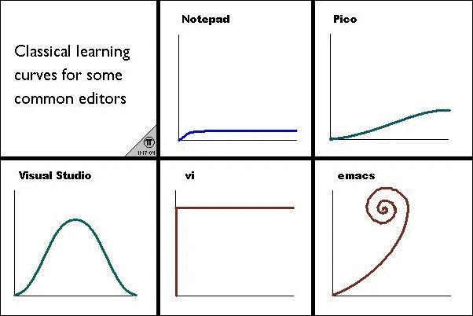

# 第七章。不要重新发明轮子——功能反应式编程的工具

在这一章中，我们将看看在“裸机”JavaScript 之上构建的许多好工具中的几个，正如上一章简要讨论的那样。JavaScript 不仅仅因为它作为核心语言的属性而有趣；浏览器 JavaScript 是一个生态系统的家，或者可能是多个生态系统的家。关于函数式反应式编程的工具，所有的产品代表了一个良好的、健康的和广阔的市场，在这个市场旁边，只直接使用 JavaScript 进行所有的网络开发看起来更像是一座大教堂。我们将采取这个集市的一个小样本，理解这一章不打算涵盖所有的好的，有趣的，或值得的。在集市上很难做到！

我们将介绍的工具包括:

*   ClojureScript 和 Om
*   培根. js
*   布立吞人（从前居住在不列颠的凯尔特人）
*   不可变的. js
*   玩笑
*   磁通量子

在这类章节中，我们将包括或不包括的工具集包括绘制向上的线条，并做出判断。对更全面的处理感兴趣的读者可以查看[http://tinyurl.com/reactjs-complementary-tools](http://tinyurl.com/reactjs-complementary-tools)的链接概要，并深入到他们具体关注的工具。那里有很多，可能有很多宝石，几乎可以用于任何目的。

# ClojureScript

ClojureScript，或许还有 Clojure，代表了软件和 web 开发的一个重要分水岭。ClojureScript 通过实例证明，用 JavaScript 以外的语言开发是有可能有坚实的基础和环境的，而这种开创性的语言是 Lisp 方言。(对于两种最古老的常用编程语言之一来说，这也许是合适的。Lisp 问世时很好，现在仍然是一门好语言。)此外，与 JavaScript 相比，Lisp 可能享有很好的优势，并且由于一些相同的原因而仍然存在。JavaScript 是网络浏览器的语言，Lisp 是 Emacs 的语言。另外，Lisp 提供了一种原型 JavaScript 在有可以用 JavaScript 编程的网络浏览器之前，有可以用 Lisp 编程的 Emacsen，有人说 Lisp 是比 JavaScript 更好的语言，这几乎不会引起争议。

有充分的理由认为，Lisp，而不是 Emacs 的默认键绑定，是这个一直在互联网上流传的“经典学习曲线”漫画中的经典 Emacs 学习曲线的原因:



正如前一章所建议的，每个人直接用 JavaScript 编程的一致性可能会让位于一种美丽的多样性，或者说是拼凑的被子。在这张漂亮的拼布被子中，JavaScript 可能仍然是卓越的，但是 JavaScript 的卓越可能会成为新的“裸机”我们可能有一套用于前端开发的高级语言和工具。同样，正如艾伦·佩里斯所说，“当一门语言需要关注不相关的东西时，它就是低级的。”基于这些理由，JavaScript 是低级的。

相对于坏的部分，这些工具中的一些可能有更好的好的部分组合。他们可能会进行前端工作，这些工作可能最终仍会在 JavaScript 中执行。但它们也可能会开启前端 web 开发，新开发人员不再被告知，“这是我们将使用的语言，这里有一些语言的很大一部分你应该尽量避免，因为它们从根本上是有毒的。”较新版本的 ECMAScript(JavaScript 的正式名称，它与 Emacs 没有特别的联系)可能会提供更好的功能集合，但仍然希望使用高级语言工作，为生产性工作和结果提供更好的环境。

ClojureScript 表示，随着钟声的敲响，有可能有一种好的高级语言可以在浏览器上运行，这不仅是 Lisp 黑客的好消息。这对每个人来说都是好消息。它展示了用其他高级语言进行 web 开发的可能性，以及更好的 web 开发环境和更少的焦油坑。

ClojureScript 既可以用于客户端工作，也可以在服务器端使用 Node.js. *Hello，World！*如下:

```js
(ns nodehello
  (:require [cljs.nodejs :as nodejs]))

(defn -main [& args]
  (println (apply str (map [\space "world" "hello"] [2 0 1]))))

(nodejs/enable-util-print!)
(set! *main-cli-fn* -main)

(comment
; Compile this using a command line like:

CLOJURESCRIPT_HOME=".../clojurescript/" \
  bin/cljsc samples/nodehello.cljs {:target :nodejs} \
  > out/nodehello.js

; Then run using:
nodejs out/nodehello.js

)
```

# 关于

Om 是一个包装器，使 ReactJS 可用于 ClojureScript。除了 ClojureScript 通常很快之外，om 的某个部分实际上比 JavaScript 快大约两倍。区别在于识别变更，以便在 ReactJS 进行更新时以最佳方式适当更新 DOM。原因是 ReactJS 在其不同的算法中(通过处理可变的 JavaScript 数据结构)，必须执行深度比较，以查看(纯 JavaScript)合成虚拟 DOM 中发生了什么变化。

与直接的 DOM 操作相比，这仍然是闪电般的速度，如此之快，以至于它真的不是大多数 ReactJS 用户的瓶颈。但是在 Om 里面更快。原因是 ClojureScript 像一种好的函数式编程语言一样，拥有不可变的数据。你可以很容易地得到某个东西的变异副本，但你不能篡改原件或绊倒任何能接触到原件的人。这意味着 Om 只需要比较顶层引用，而不需要深入数据结构。这足以让 Om 比 ReactJS 的原始 JavaScript 使用更快。*你好，世界！*在 Om 中是这样写的:

```js
(ns example
  (:require [om.core :as om]
            [om.dom :as dom]))

(defn widget [data owner]
  (reify
    om/IRender
    (render [this]
      (dom/h1 nil (:text data)))))

(om/root widget {:text "Hello world!"}
  {:target (. js/document (getElementById "my-app"))})
```

# 培根

请注意，仅讨论 ReactJS 和 Bacon.js 并不构成详尽的列表。举一个可供选择的套件，微软已经尝试为各种 JavaScript 框架和库创建 RxJS、RxCpp[c++的 Rx]、Rx.NET 和 Rx*，他们至少已经尝试为多种语言制作一个多语言友好的产品组合，并为多种 JavaScript 框架和库制作优化版本。确实有很多提供某种形式的功能反应式编程的工具。虽然网络上为数不多的(在撰写本书时)函数式反应式编程和 ReactJS 资源大多是黄金，但也有一些不是。

安德烈·斯塔尔兹写道:

> *“所以你对学习这个叫做反应式编程的新东西很好奇，尤其是它的变体，包括 Rx、Bacon.js、RAC 和其他。*
> 
> *学习它很难，更难的是缺乏好的材料。刚开始的时候，我试着找教程。我只找到了少数实用指南，但它们只是触及了表面，从未解决围绕它构建整个架构的挑战。当你试图理解一些功能时，图书馆的文献通常没有帮助。我的意思是，老实说，看看这个:*
> 
> *Rx。observatory . prototype . flat maplast(选择器，[thisArg])*
> 
> *通过结合元素的索引，将可观测序列的每个元素投影到新的可观测序列中，然后将可观测序列的可观测序列转换成仅从最近的可观测序列产生值的可观测序列。”*

我现在明白了这句话的意思，但那是因为我从其他交流得更好的资源中学到了东西。你正在阅读的这本书背后的部分意图是让好的文档不那么难理解。

开源社区有一个著名的问题:你会买一辆发动机罩焊接关闭的车吗？ReactJS 可以被描述为大多数人不用打开引擎盖就能驾驶的汽车。这并不是说 ReactJS 是闭源的，也不是说脸书有任何迹象表明，想要阅读尽可能多的源代码会变得更加困难。但是举一个突出的例子，**外延连续时间语义**是 Conal Elliott 关于现在所谓的函数式反应式编程的更好的名字的第二个想法的一部分。无论一个人同意还是不同意他关于一个更好、更具描述性的名字的建议，这种从主导角度出发的第二种想法都是非常有洞察力和启发性的。有了 ReactJS，如果它工作正常，一个新手程序员可以得到卡尔文的父亲(专利律师！)在《卡尔文与霍布斯》中，当卡尔文问灯或吸尘器是如何工作的时侯，他给出了答案——*这是魔法！*看着一个新人的问题“连续时间是怎么处理的？”回复是*太神奇了！*“你怎么能每次都抛弃和重新创建 DOM 呢？”——*太神奇了！*；"但是 ReactJS 是如何在非 JIT 的 iPhone 上达到惊人的 60 fps 的呢？"——*太神奇了！*

功能反应式编程描述了某些需要完成的任务，例如事件流的适当处理，但是 ReactJS 文档似乎没有解释如何处理这种处理，因为责任被卸给了 ReactJS；*真神奇！*

不仅培根没有把引擎盖焊接起来，你还需要在引擎盖下修补。Bacon.js 似乎更接近基本函数式反应式编程的根源。一些打算在 ReactJS 工作的程序员可能会发现，用 Bacon.js“举重”一点并增强自己是有利可图的。函数式反应式编程的一个重要领域是处理发出的事件流，就 ReactJS 而言，*这是神奇的！*

在培根看来，事实上，不动一根手指就能完成一切并不神奇；这是程序员需要解决的问题，他们得到了很好的工具来解决这个问题。基于这些理由，它可以帮助开发人员为使用 ReactJS 打下坚实的反应式编程基础。如果说 ReactJS 的卖点在于，它是一个经过优化的工具，可以在利用函数式反应式编程的优势的同时实现良好的用户界面工作，那么 Bacon.js 的卖点在于，它是 JavaScript 中的一个工具，经过优化，可以在理论和实践上整体上执行可靠的函数式反应式编程。

ReactJS 和 Bacon.js 的区别似乎不在于发现一个框架比另一个好。这是一个评估你想做什么和完成什么的问题，认识到 ReactJS 和 Bacon.js(除了是有价值的竞争对手之外)有不同的领域，他们真正闪耀，并决定你的工作听起来更像 ReactJS 的甜蜜点还是 Bacon.js 的甜蜜点。而且，关于甜蜜点这个话题，Bacon.js(不像 ReactJS)有一个名字意在让你流口水，`~`函数运算符在参考文献中被称为“Bacon”。

# Brython–Python 浏览器实现

浏览器和 Python 实现的 Brython([http://Brython . info](http://brython.info))是另一个替代用 JavaScript 编程浏览器的例子，虽然称它仅仅是实验性的有点不公平，但称它成熟也不一定合适——当然不是指 ClojureScript 有一些显著的成熟。ClojureScript 开发得足够好，对于一个真正喜欢使用 Lisp 而不是 JavaScript 的前端开发人员来说，它基本上可以取代“裸机”JavaScript。换句话说，除非我们谈论的是对性能至关重要的事情或者可能是特殊的情况，否则没有太多的情况下 ClojureScript 专家会回答“我如何在 ClojureScript 中做到这一点？”用“直接用 JavaScript 来解决这种问题。”Brython 之所以被包括在内，并不是因为太阳在 Python 上升起或落下，而是为了说明 ClojureScript 中的 Lisp 并不是一个基本的例外，因为它是唯一一种适用于前端 web 开发的非 JavaScript 语言，但可能是许多语言中的第一种。

布莱顿意味着统治世界。它的主页大胆宣布，“Brython 旨在取代 JavaScript 成为网络的脚本语言”，它可能永远不会达到这个相当天真的目标。Brython 加载时间长得惊人，加载后运行速度也很慢。使用一个 Python 到 JavaScript 的编译器可能会更好(这将更接近 ClojureScript)，但是 Brython 确实提供了相当多 Python 的优点，并且有一天可能会被认为是重要的。然而，我认为试图成为下一个 JavaScript 并取代其他所有呈现 JavaScript 的 transpiler 是愚蠢的。

在 Brython 中，统治世界的目标也让自己陷入了一个盲点:没有看到能够与用其他语言编写的工具进行互操作有多重要。但好消息是，Brython 或其他 Python 到 JavaScript 的方法可能意义重大，而不需要成为“统治一切的一种语言”Python 不是唯一可用的后端语言，但它是一个很好的播放器，有充分的理由让 Python 的良好实现成为由多种语言组成的拼凑被子中有价值的播放器，这些语言都可以有益地用于前端网络开发。

此外，至少一个*你好，世界！*带有 ReactJS 的程序在 Brython 中实现起来很简单。你好，世界！程序在页面上收集了 Brython 和 ReactJS 后运行，首先包含注释掉的 JavaScript(不是 JSX)，然后是通过 Brython 在浏览器中调用 React 的 Python 代码:

```js
<!DOCTYPE html>
<html>
  <head>
    <title>Hello, Brython!</title>
    <script src="brython.js"></script>
    <script src="react.js"></script>
  </head>
  <body onload="brython()">
    <p>Hello, static world!</p>
    <div id="dynamic"></div>
    <!--
      <script type="text/javascript">
        React.render(
          React.createElement('p', null,
          'Hello, JavaScript world!'),
          document.getElementById('dynamic')
        );
      </script>
      -->
    <script type="text/python3">
      from browser import document, window

      window.React.render(window.React.createElement(
        'p', None, 'Hello, Python world!'),
        document['dynamic']);

    </script>
  </body>
</html>
```

这将显示这里显示的内容:


注意整个第一个脚本标签和内容，而不仅仅是其中的 JavaScript，都在一个 HTML 注释中。这意味着第一个(JavaScript)脚本(为了清楚起见，此处显示)不是活动的，第二个(Python)脚本是运行并显示其消息的脚本。

第二个剧本很有趣；包含的 Python 代码相当于(除了消息之外)注释掉的 JavaScript 文本，并且做了同样的事情。这是一个相当大的壮举，尤其是结合 Brython 如何成功实现 Python 分支中的大多数功能。即使布莱森被调查了一个项目，并认为不是正确的解决方案，它仍然是一个成就。

从某种意义上来说，布莱森在这里是作为一种可能性的例子出现的，而不是，从任何意义上来说，其类中唯一值得关注的成员。重点不是具体说 Python 可以用于前端开发；这是因为 ClojureScript Lisp 可能不是除了 JavaScript 之外唯一可用于前端开发的附加语言。

# 不可改变的. js–对变化的永久保护

不可变. js 的主页位于 http://facebook.github.io/immutable-js T2，JavaScript 的不可变集合位于 T4，最初是以持久性命名的。然后它经历了一个名字的改变，通过引用不可变的来更快地注册。不可变的. js 填补了 JavaScript 作为一种函数式语言的空白，并为集合提供了功能更加友好的数据结构(这是创建它的目的)。

它为不可变的集合提供数据结构。他们非常优雅地支持创建修改过的副本，但总是副本被更改，而不是原件。虽然这是一个小问题，但它大大减少了在有多个程序员的情况下不使用不可变数据的“防御性复制”和相关变通方法的需要。原始代码可能会随着您想要的数据结构的不同和修改的副本一起突突前进，但是您作为引用保存的副本保证是完全不动的。该库旨在支持其他细节，例如轻松转换成和转换成主要的 JavaScript 数据结构。

然而，不可变. js 的数据结构不仅是不可变的；他们在某些方面也很懒惰，文档清楚地标记了应用程序的哪些方面是迫切需要的。(提醒一下，当需要时，会以按需打印的方式处理惰性数据结构，而急切的操作会立即提前完成)。此外，某些函数式习惯用法被烘焙成不可变的. js 工具。例如，提供了一种.`take(n)`方法。它以经典的功能方式返回列表中的第一个 *n* 项。其他功能性订书钉，如`map()`、`filter()`和`reduce()`也有。总的来说，运行时的复杂性是计算机科学家合理要求的。

不可变的. js 提供了几种数据类型；这些包括以下内容(本表和下一表中的描述部分基于官方文件):

<colgroup><col style="text-align: left"> <col style="text-align: left"></colgroup> 
| 

不可变的. js 类

 | 

描述

 |
| --- | --- |
| `Collection` | 这是不可变. js 数据结构的抽象基类。它不能直接实例化。 |
| `IndexedCollection` | 以特定顺序表示索引值的集合。 |
| `IndexedIterable` | 这是一个带有索引数字键的可迭代，它支持一些类似数组的接口特性，比如`indexOf()`(可迭代是你可以像列表一样迭代的东西，但它可能是也可能不是内部的列表)。 |
| `IndexedSeq` | 一个支持有序索引值列表的`Seq`。 |
| `Iterable` | 可以迭代的一组(键和索引)值。这个类是所有集合的基类。 |
| `KeyedCollection` | 表示键值对的集合。 |
| `KeyedIterable` | 一个可重复的表，每个可重复的表上都有离散的键。 |
| `KeyedSeq` | 代表键值对的序列。 |
| `List` | 有序的集合，有点像(密集的)JavaScript 数组。 |
| `Map` | 键值对的键控可迭代。 |
| `OrderedMap` | 地图完成地图所做的一切，此外，保证迭代将按照设定的顺序产生关键点。 |
| `OrderedSet` | 一个集合，它完成集合所做的一切，此外，还保证迭代将按照它们被设置的顺序产生值。 |
| `Record` | 产生具体记录的类。从概念上讲，这与这里的其他记录不同。从概念上讲，其他元素是“whatnots”的集合，可能是具有类似结构的对象。`Record`类更接近一个人在学校遇到的记录，其中一条记录类似于数据库表中的一行，而结果集或表更像容器对象。 |
| `Seq` | 值的序列，它可能有也可能没有具体的数据结构支持。 |
| `Set` | 独特价值的集合。 |
| `SetCollection` | 没有键或索引的值的集合。 |
| `SetIterable` | 没有键或索引的表示值的表。 |
| `SetSeq` | 代表一组值的序列。 |
| `Stack` | 带有`push()` 和`pop()`的标准堆栈。语义总是指向第一个元素，不像 JavaScript 数组。 |

### 注

`Record`与其他稍有不同；它类似于符合特定标准的 JavaScript 对象。其他元素是相关的容器类，它们提供对一些对象集合的功能性访问，并且倾向于支持类似的方法列表。

举例来说，列表方法包括以下内容:

<colgroup><col style="text-align: left"> <col style="text-align: left"></colgroup> 
| 

不变的。列表方法

 | 

描述

 |
| --- | --- |
| `asImmutable` | 一个函数获取一个(可变的)JavaScript 集合，并呈现一个不可变的. js 集合。 |
| `asMutable` | 这是对“不是最好的”节目的让步。基于不可变的. js 集合处理突变的正确方法是与突变一起使用。即使`asMutable`可用，也应该只在函数内部使用，永远不要使其可用或返回。 |
| `butLast` | 这会产生一个类似的新列表，但是缺少最后一个条目。 |
| `concat` | 连接(即附加)两个相同类型的数据项。 |
| `contains` | 如果该值存在于该列表中，则为真。 |
| `count` | 返回这个列表的大小。 |
| `countBy` | 使用群功能对列表的内容进行分组，然后为由群划分的关键字发出计数。 |
| `delete` | 创建一个没有这个键的新列表。 |
| `deleteIn` | 从密钥路径中移除密钥，这允许从外部集合遍历到内部集合，非常类似于文件系统路径允许文件系统从外部目录遍历到内部目录的方式。 |
| `entries` | 列表的迭代为`key`、`value tuples`。 |
| `entrySeq` | 创建新的键、值元组。 |
| `equals` | 这是一个完全相等的比较。 |
| `every` | 如果此列表中所有条目的谓词为真，则为真。 |
| `filter` | 返回列表中所提供的谓词为真的元素。 |
| `filterNot` | 返回列表中的元素，所提供的谓词返回 false。 |
| `find` | 返回所提供谓词为真的值。 |
| `findIndex` | 返回所提供谓词为真的第一个索引。 |
| `findLast` | 返回所提供谓词为真的最后一个元素。 |
| `findLastIndex` | 返回所提供谓词为真的最后一个索引。 |
| `first` | 列表中的第一个值。 |
| `flatMap` | 这个平面图，或者说将一个潜在的列表折叠成一个深度的列表。 |
| `flatten` | 这使嵌套的 iterables 变平。 |
| `forEach` | 对列表中的每个条目执行功能。 |
| `fromEntrySeq` | 返回键、值元组中任何可迭代的的`KeyedSeq`。 |
| `get` | 返回一个键的值。 |
| `getIn` | 遍历密钥路径(如文件系统路径)以获取密钥(如果可用)。 |
| `groupBy` | 将一个列表转换为一个列表列表，该列表由所提供的分组函数进行分组。 |
| `has` | 如果该列表中存在密钥，则为真。 |
| `hashCode` | 这个为这个集合计算一个散列码。它适用于哈希表。 |
| `hasIn` | 如果相当于文件系统遍历的集合在问题中找到值，这是正确的。 |
| `indexOf` | 列表中第一个出现的的索引，例如`Array.prototype.indexOf`。 |
| `interpose` | 在单个列表条目之间插入一个分隔符。 |
| `interleave` | 将提供的列表交错成一个相同类型的列表。 |
| `isEmpty` | 这告诉这个可迭代是否有值。 |
| `isList` | 如果值为列表，则为真。 |
| `isSubset` | 如果比较表中的每个值都在该列表中，则为真。 |
| `isSuperset` | 如果该列表中的每个值都在比较项中，则为真。 |
| `join` | 这将用分隔符连接成一个字符串(默认)。 |
| `keys` | 这个列表的键的迭代器。 |
| `keySeq` | 为此可迭代返回 `KeySeq`，丢弃所有值。 |
| `last` | 列表中的最后一个值。 |
| `lastIndexOf` | 返回在该列表中可以找到值的最后一个索引。 |
| `List` | 列表的构造函数。 |
| `map` | 返回一个带有通过映射函数传递的值的新列表。 |
| `max` | 返回该集合中的最大值。 |
| `maxBy` | 这和 max 一样是，但是控制更加细粒度。 |
| `merge` | 将可列表或 JavaScript 对象合并到一个列表中。 |
| `mergeDeep` | 一次递归模拟合并。 |
| `mergeDeepIn` | 执行深度合并，从给定的关键路径开始。 |
| `mergeDeepWith` | 这类似于 `mergeDeep`，但是在节点冲突时使用提供的合并功能。 |
| `mergeIn` | 这是更新和合并的组合。它在指定的关键路径上执行合并。 |
| `mergeWith` | 这类似于合并，但是在节点冲突时使用提供的合并函数。 |
| `min` | 返回列表中的最小值。 |
| `minBy` | 返回列表中的最小值，该值由您提供的辅助函数确定。 |
| `of` | 创建一个包含参数值的新列表。 |
| `pop` | 这个返回这个列表中除最后一个以外的所有内容。请注意，这不同于标准的推送语义，但是可以通过在`push()`之前调用`last()`来模拟常规的`push()`。 |
| `push` | 返回一个新列表，并在末尾附加一个或多个指定值。 |
| `reduce` | 对每个值调用还原函数，并返回累加值。 |
| `reduceRight` | 这是类似于减少，但从右边开始，逐渐向左移动，与基本减少相反。 |
| `rest` | 返回列表的尾部，即除第一个条目之外的所有条目。 |
| `reverse` | 以相反的顺序提供列表。 |
| `set` | 用索引处的值返回一个新列表。 |
| `setIn` | 在关键路径上返回一个带有该值的新的列表。 |
| `setSize` | 使用您指定的大小创建一个新列表，根据需要截断或添加未定义的值。 |
| `shift` | 创建一个新的列表，减去第一个值，所有其他值下移。 |
| `skip` | 当不包括第一个 *n* 条目时，返回列表中剩余的所有条目。 |
| `skipLast` | 当不包括最后 n 个条目时，返回列表中剩余的所有内容。 |
| `skipUntil` | 返回一个新的可迭代的，包含第一个之后的所有条目，其中提供的谓词为真。 |
| `skipWhile` | 这将返回一个新的可迭代表，该表包含所提供谓词为假之前的所有条目。 |
| `slice` | 返回一个新的列表，该列表包含从起始值到最后一个值之前的一个值的内容。 |
| `some` | 如果谓词对列表中的任何元素都返回真，则为真。 |
| `sort` | 返回一个由可选比较器排序的新列表。 |
| `sortBy` | 返回一个新的列表，该列表由可选的比较器值映射器进行排序，其中包含比较器可用的更详细的信息，因此结果更精确。 |
| `splice` | 用第二个列表替换第一个列表的段，如果没有提供第二个列表，则将其删除。 |
| `take` | 创建一个新列表，其中包含列表中的前 n 个条目。 |
| `takeLast` | 创建一个新的列表，其中包含列表中最后的 *n 个*条目。 |
| `takeUntil` | 只要谓词返回 false，就会返回包含所有条目的新列表；然后就停止了。 |
| `takeWhile` | 只要谓词返回真，就会返回包含所有条目的新列表；然后就停止了。 |
| `toArray` | 浅将该列表转换为数组，丢弃键。 |
| `toIndexedSeq` | 返回该列表的 `IndexedSeq`，丢弃密钥。 |
| `toJS` | 将此列表深度转换为数组。这个方法有`toJSON()`作为别名，虽然文档没有明确说明是否返回 JavaScript 对象，而`toJSON()`返回一个 JSON 编码的字符串。 |
| `toKeyedSeq` | 从该列表中返回 a `KeyedSeq`，其中索引被视为关键字。 |
| `toList` | 返回本身。 |
| `toMap` | 将此列表转换为地图。 |
| `toObject` | 浅将此列表转换为对象。 |
| `toOrderedMap` | 将此列表转换为地图，保留迭代顺序。 |
| `toSeq` | 返回 `IndexedSeq`。 |
| `toSet` | 将列表转换为集合，丢弃按键。 |
| `toSetSeq` | 将此列表转换为`SetSeq`，丢弃按键。 |
| `toStack` | 将此列表转换为堆栈，丢弃密钥。 |
| `unshift` | 将提供的值添加到列表中。 |
| `update` | 通过提供的更新功能更新列表中的条目。 |
| `updateIn` | 更新条目，如在 Update()中，但在给定的关键路径。 |
| `values` | 该列表值的迭代器。 |
| `valueSeq` | 该列表值的 `IndexedSeq`。 |
| `withMutations` | 这是一个优化(回想一下唐纳德·克努特说的“过早优化是万恶之源”)挂钩，旨在当执行多个突变时允许更高性能的工作。当存在已知的和持续的性能问题，而其他工具显然没有解决这个问题时，可以使用它。 |
| `zip` | 返回一个可迭代的压缩列表(也就是两两连接组成一个二元组列表)。 |
| `zipWith` | 返回一个带有自定义拉链功能的可重复拉链。 |

主页上**文档**链接下的应用编程接口文档非常清晰。但是作为一个规则，不可变的. js 集合尽可能地做一个函数式程序员期望他们做的事情，并且确实有一个假定的压倒一切的设计考虑“尽我们所能做一个函数式程序员想要的事情。”

### 注

有一件事可能会让函数式程序员感到不愉快，那就是文档没有解释如何创建无限列表。尚不清楚如何为列表创建生成器(如果他们真的这样做的话)，或者生成数学序列的列表，例如所有计数、正偶数、平方、素数、斐波那契数、2 的幂、阶乘等等。这种功能显然不受支持(在撰写本书时)。惰性序列不能用不可变的. js 构建无限列表，因为构建集合包括列表中所有元素的急切包含，因此列表必须是有限的。以不可变的. js 风格创建懒惰的、潜在的无限的数据结构应该不是非常困难，这些数据结构内部有一个记忆化的生成器，并允许您使用 XYZ.take(5)。但是不可变. js 似乎还没有扩展到这个领域。

# Jest–来自脸书的 BDD 单元测试

Jest 是一个 JavaScript 单元测试框架，旨在支持行为驱动的开发。它是建立在茉莉之上的，未来或许可以和其他基金会互动。它已经使用了几年，并在脸书使用，虽然似乎没有决定性的认可，ReactJS 的开发最好使用 Jest。(脸书在内部使用 JSX 和 reatjs，但倾向于发表一个相对没有偏见的声明，即大约一半的 reatjs 用户选择使用 JSX。它实际上被设计成完全可选的。)

### 注

JSX——在 XML 已经失宠的时候，这个“T1”X(“T2 ”)大胆地表示了 XML——是一个很好的语法糖，它“在你的代码中加入了尖括号。”这大概意味着你可以在`.jsx`文件中把 HTML 放入你的 JavaScript 中，只要工作就可以了。此外，您几乎可以使用任何可以在已构建到 ReactJS 组件中的页面上构建的内容。您可以包括像从一开始就是 HTML 一部分的图像这样的东西，也可以像本标题中定义的那样轻松地包括日历、线程化的网络讨论或可拖动和可缩放的分形。像子程序一样，一旦定义了一个组件，它就可以在你的 web 应用程序中的任何地方使用零次、一次或多次。JSX 语法糖允许你和其他人定义的组件像旧的 HTML 标签一样容易。在第 8 章到第 11 章的项目中，外壳的 JSX 是“非常简单”的，它允许我们结合我们已经开发的其他组件:

```js
var Pragmatometer = React.createClass({
  render: function() {
    return (
      <div className="Pragmatometer">
      <Calendar />
      <Todo />
      <Scratch />
      <YouPick />
      </div>
    );
  }
});
```

一名脸书员工表示，他让 Jest 开源是出于“自私的原因”，即他想在个人项目中使用它。这可能会很好地暗示为什么 Jest 至少值得考虑。至少有一个用户真的想使用 Jest，这已经足够好了，以至于他愿意让专有知识产权开源，甚至在没有人告诉他的情况下也这样做了。

有争议的是，单元测试在开始的时候，服务于最容易的单元测试，这意味着单元测试已经洗手不干集成和用户界面测试了。因此，您可能会看到一篇关于单元测试的博客文章，该文章测试并确认了一种“红色、绿色、重构”的方法，用于将语言的整数转换为罗马数字，这是一个很好的例子，说明了一个满足原始单元测试需求的问题。如果您想测试您的代码是否与其数据库进行了适当的交互，这是一个稍微高一点的顺序。像其他框架一样，Jest 并没有像 Jakob Nielsen 和其他人提倡的那样，声称不需要好的、老式的预算可用性测试。问“我们构建的产品是正确的吗？”以及“我们正在构建正确的产品吗？”

这两个问题都是有价值的，都有它们的位置，但是单元测试对第一个问题的帮助比第二个问题更大，让一个好的测试套件很好地解决第一个问题来哄你入睡是很危险的，这是关于很好地解决第二个问题。尽管如此，Jest 提供了一些比仅仅测试一个代码单元是否会成功地接受原始数据类型(如整数、浮点或字符串)的输入，并返回原始数据类型的正确和预期输出(如输入整数的右罗马数字)更有用的东西。虽然这不仅仅适用于 Jest，但 Jest 模拟了用户界面，以便支持(例如)用户界面事件，如单击元素，并支持测试用户界面更改，如标签上的文本(比较 Jasmine 主页，其中前几个示例仅涉及使用原始数据类型的断言)。

Jest 的目的是在 Jasmine(以及未来潜在的其他后端)之上提供层，但具有显著的附加价值。除了某些特性之外，例如并行运行测试以使测试变得更具响应性，Jest 是一种解决方案，旨在需要最少的时间和精力来获得良好的测试覆盖率，这是基于这样一种思想，即开发人员最好将大部分时间花在主要开发上，而不是写单元测试上。

玩笑旨在嘲笑一切，或几乎一切，与`require()`扯上关系。您可以通过调用`jest.dontMock()`来选择不使用单个元素，测试通常会为他们正在测试的组件调用`jest.dontMock()`，这是一个样板实践。它自动在`__tests__`目录中查找并运行测试。如果 ReactJS 的预处理器包含在例如`preprocessor.js`中，Jest 可以处理 JSX:

```js
var ReactTools = require('react-tools');
module.exports = {
  process: function(source) {
    return ReactTools.transform(source);
  }
};
```

`package.json`文件需要被告知加载什么:

```js
'dependencies': {
  'react': '*',
  'react-tools': '*'
},
}, 'jest': {
  'scriptPreprocessor': '<root directory>/preprocessor.js',
  'unmockedModulePathPatterns':['<root directory>/node_modules/react']
},
```

现在我们将简单地引用脸书的例子。脸书提供了一个例子`CheckboxWithLabel`类。当复选框未被选中时，该类显示一个标签，当复选框被选中时，该类显示另一个标签。这里的 Jest 单元测试模拟了一次点击，并确认标签发生了适当的变化。

`CheckboxWithLabel.js`文件内容如下:

```js
/** @jsx React.DOM */

var React = require('react/addons');
var CheckboxWithLabel = React.createClass({
  getInitialState: function() {
    return {
      isChecked: false
    };
  },
  onChange: function() {
    this.setState({isChecked: !this.state.isChecked});
  },
  render: function() {
    return (
      <label>
        <input
          type="checkbox"
          checked={this.state.isChecked}
          onChange={this.onChange}
        />
        {(this.state.isChecked ?
        this.props.labelOn :
        this.props.labelOff)}
      </label>
    );
  }
});

module.exports = CheckboxWithLabel;
```

`__tests__/CheckboxWithLabel-test.js`测试文件中写道:

```js
/** @jsx React.DOM */

jest.dontMock('../CheckboxWithLabel.js');

describe('CheckboxWithLabel', function() {
  it('changes the text after click', function() {
    var React = require('react/addons');
    var CheckboxWithLabel = require('../CheckboxWithLabel.js');
    var TestUtils = React.addons.TestUtils;

    // Verify that it's Off by default.
    var label = TestUtils.findRenderedDOMComponentWithTag(
      checkbox, 'label');
    expect(label.getDOMNode().textContent).toEqual('Off');

    // Simulate a click and verify that it is now On.
    var input = TestUtils.findRenderedDOMComponentWithTag(
      checkbox, 'input');
    TestUtils.Simulate.change(input);
    expect(label.getDOMNode().textContent).toEqual('On');
  });
});
```

# 使用 Fluxxor 实现流量架构

如前几章所述，通量是一种由脸书开发的体系结构，被他们用作某种很大程度上是对 ReactJS 的补充。它帮助解开了一个真正的交叉线的老鼠窝，并让脸书根除了一个反复出现的消息计数错误，这个错误一直在返回——通量架构永久地杀死了它。**Flux or**，由Brandon Tilley([http://fluxxor.com](http://fluxxor.com))开发，是一款旨在帮助人们在应用中实现 Flux 架构的工具。没有必要为了使用 ReactJS 而使用 Flux 架构，或者使用 Fluxxor 工具来实现 Flux 架构。但 Flux，或许还有 Fluxxor，至少值得考虑，让事情变得更容易。

Fluxxor 总体上有 Flux 架构的类，包括一个`Fluxxor.Flux`容器(包括一个调度器)和`Action`和`Store`类。示例代码简洁易读，似乎没有什么样板。为了便于使用，提供了两个 ReactJS 友好的混合类。示例代码是使用 JSX 编写的。

我也可以参考 Fluxxor 的作者评论说[http://fluxxor.com](http://fluxxor.com)在页面底部有一个链接，要求人们在 GitHub 上报告一个问题，如果有不清楚的地方或者如果有问题。我注意到一个常见的可用性缺陷——被访问和未被访问的链接是相同的颜色——并在 GitHub 上报告了这个问题。作者立即道歉，我打开的问题是*关闭修复*不超过 15 分钟。我认为他是那种喜欢共事的人。

# 总结

现在让我们看看这一章我们讨论了什么。我们解释了 Om 和 ClojureScript，它们允许基于 Lisp 的开发利用 ReactJS 的能力。据说，ClojureScript 可能是解决方案的主导，它允许不同语言的美丽拼凑，可用于前端开发、编译或将 JavaScript 解释为新的“裸机”

Bacon.js 是一项非常值得尊敬的技术，它与 ReactJS 竞争，后者允许在浏览器中进行良好的功能反应式编程。这不是作为“唯一的”好例子，而是作为超出本书范围的好东西的例子。

我们还介绍了基于浏览器的 Python 环境 Brython。它不完美，但很有趣。它是一个突出的例子，说明除了用于网络开发的 JavaScript 之外，还可以用作 Lisp 之外的语言。提醒一下，[http://tinyurl.com/reactjs-compiled-javascript](http://tinyurl.com/reactjs-compiled-javascript)提供了一个其他语言的目录，这些语言可以编译成 JavaScript 或者可以在网络浏览器中进行解释，从语法糖如 CoffeeScript 到 JavaScript 扩展，再到独立的语言如 Ruby、Python(包括 Brython)、Erlang、Perl 等等。

不可变的. js 主要通过提供允许在不破坏不可变数据的功能优势的情况下变异时复制的集合，填补了函数式 JavaScript 的一个漏洞。

Jest 是一个行为驱动的开发 JavaScript 单元测试框架，由脸书用于 ReactJS。Fluxxor 是控制器、动作和存储的实现，旨在使 Flux 架构更容易应用于 JavaScript 开发，包括 ReactJS。

在下一章中加入我们，我们将探索一个更深入的使用 ReactJS 的例子。