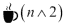

# 八、演示 JavaScript 函数式反应式编程——真实示例第一部分

在[第 4 章](04.html "Chapter 4. Demonstrating Nonfunctional Reactive Programming – A Live Example")、*演示非函数式反应式编程——一个真实的例子*中，我们使用 ReactJS 从遗留代码中迁移，该代码有自己的结构，并且是在不使用 ReactJS 的情况下编写的。在最后一章[第 7 章](07.html "Chapter 7. Not Reinventing the Wheel – Tools for Functional Reactive Programming")、*不要重新发明轮子——函数式反应式编程的工具*中，我们研究了在使用 ReactJS 时可能用到的众多工具中的一些。在这一章中，我们将介绍 ReactJS 主流开发的一种中心路线。人们可能会在基础上添加很多选项，但目的是提供一个如何使用 ReactJS 构建项目的基础示例。

我们已经讲了一点关于函数式反应式编程。现在，我们将看到它在 ReactJS 中的实际应用。我们还讨论了，从概念上来说，我们如何对用户界面进行彻底的拆卸和重建。因此，作为开发人员，您需要管理状态，而不是状态转换。在这里，我们将构建一个`render()`方法，让你只构建这个，你可以随时调用它。

在这一章中，我们有一个为 ReactJS 构建的部分存根绿地项目的第一部分，这一次是在 JSX 与非常甜的句法糖一起工作。这本书的两个部分，也就是前面的一章项目和多章项目，是相辅相成的。本章中的项目是独立的，但旨在扩展。

在本章中，我们将涵盖以下主题:

*   项目概述及其启示
*   项目的框架，以及 ReactJS 中首选方法的基础。
*   启动反应堆中的第一个组件
*   建立`render()`方法
*   当您想要渲染或更新显示时触发显示

# 我们将在本章尝试什么

接下来三章中的例子旨在代表一个稍大的绿地项目。我们将要开发的是一个系统，你应该可以通过访问[http://demo.pragmatometer.com](http://demo.pragmatometer.com)看到。“Pragmatometer”一词取自 C. S. Lewis 的小说中最反乌托邦的一部,*那可怕的力量*，在这部小说中，不祥的国家协调实验研究所建造了一台超验的或近乎超验的计算机，就像在小说出版时(1945；相比之下，ENIAC 成立于 1946 年)。或者，你可以想象一部蒸汽朋克小说的分析引擎用一副看似超凡脱俗的穿孔卡片。当讨论转向计算机时，它说:

> “我同意詹姆斯的观点，”库里说，他已经等得有些不耐烦了。“国家信息中心标志着一个新时代的开始——真正的科学时代。到目前为止，一切都是偶然的。这将把科学本身建立在科学的基础上。每天将有 40 名相互联系的委员会成员坐在一起，他们有一个很棒的小工具——我上次进城时有人给我看了这个模型——通过这个小工具，每个委员会的调查结果每隔半小时就会在他们自己的小隔间里印在分析通知板上。然后，该报告自动滑动到正确的位置，用小箭头将其与其他报告的所有相关部分连接起来。只要看一眼董事会，你就会发现整个研究所的政策实际上正在你的眼皮底下成形。将有至少 20 名专家组成的工作人员在大楼的顶层工作，在一个与地铁控制室颇为相似的房间里处理这个公告板。这是一个了不起的小玩意。不同种类的业务都以不同的颜色出现在董事会中。肯定花了 50 万。他们称之为实用程序。”

我并没有说得太详细，但刘易斯显然预言了推特在他死后几十年才会建成。

撇开这一点不谈，我们将制作一个仪表板，其特点是一个简单的 2 x 2 象限网格(确切的大小和细节可能会受到黑客攻击和修补)，每个象限都是一个可以容纳不同功能的文件箱。在响应设计方面，我们将校正到 1 xn 行单元格，一个在另一个之上。这些功能在页面上排列如下:

<colgroup><col style="text-align: left"> <col style="text-align: left"></colgroup> 
| 日历 | 待办事项列表 |
| 刮板 | 成长空间 |

**日历**有一个有点实验性的用户界面；它以一种优雅的方式显示条目，可能是几天后，退化为稀疏的输入(所以你不需要点击几个月就能知道什么时候有 XYZ 的预约)。它可能会点击你，也可能不会，但它很有趣。

**待办事项列表**实现了一个带有一些稍微不标准的花哨功能的待办事项列表。一个项目没有一个复选框(严格来说，不需要复选框)，而是有十个框，代表不同的状态，并在复选框的右侧用标签的自定义样式进行颜色编码，这样您就可以知道，例如，什么是重要的，活动的，或者后面的。

**草稿栏**是一个富文本区域，可以用来抓图。它利用了 CKeditor。

最后，**成长空间**是给你的占位符，你可以用自己的两分钱。有些东西是默认的，你可以在探索的时候看到。但是请做访问[https://demo.pragmatometer.com](https://demo.pragmatometer.com)，看到那里的默认选项(*提示，提示！*)。除了明确宣传的内容之外，还有很多地方可以进行黑客攻击和修补，但一些可能性包括:

*   **为多个公共网站搭建 API 客户端**:排名前 20 的网站大部分都公开了一个 RESTful API。推特将是最明显的候选人，因为它是“T2”普拉克迈特“T3”的最真实的名字，但是如果新闻、视频和社交网站公开了对客户端 JavaScript 友好的应用编程接口或其他东西，它们也可以工作。
*   **搭建应用**:搭建自己的应用进行展示。
*   **做一个游乐场**:自己建一个 Pragmatometer 或者在线下载源码，为了这里详述的目的，保留四分之三的屏幕。把剩下的四分之一作为修修补补的场地。
*   **整合别人做的谷歌(或其他)小工具**:你也可以整合别人做的小工具，比如谷歌。
*   **保留默认应用**:如果你愿意，可以保留默认应用。

说“*实现是规范*”名声不好，但是一个规范，不管写不写，都可以通过勾画外观和行为来整齐补充。也许使用低保真度的原型，这可能比看起来相当完美的东西更快地吸引有用的批评，但会产生一种不受欢迎的社会细微差别，即人们在批评中不太自由，这种批评隐含着“我会因为批评看起来好像有人做了很多工作的东西而伤害别人的感情吗？“而且这种态度也不是坏事。就支撑礼貌的担忧而言，告诉人们“说出你的想法要尽可能残忍”是幼稚的，实际上是期望其他人完全从表面上接受这一点(或者，也许你比任何人都不喜欢接受批评，但你在整个软件开发过程中认识到了它的价值)。你可能指的是没有任何混合信息，但我们大多数人都见过它指的是许多混合信息。即使你是那种对一些真正有用的批评的前景几乎垂涎三尺的制作人，当你向人们展示你创造的东西时，告诉他们不要表现得像有礼貌的人也于事无补——或者帮助不大。但是在这里，看了一个用户界面，用它玩了一把，并且想到如何复制东西，这是一种非常令人振奋的方式，可以比法律合同规范更准确地理解意图。

这个界面有一个账号，优先级是更新的交叉同步。让我们开始组装一些基本骨架。在一个单一的、大的、立即被调用的函数表达式中构建一切，我们有以下内容:

```js
  var Pragmatometer = React.createClass({
    render: function() {
      return (
        <div className="Pragmatometer">
          <Calendar />
          <Todo />
          <Scratch />
          <YouPick />
          </div>
      );
    }
});
```

在这里，我们为整个项目定义了一个`container`类。`Calendar`、`Todo`、`Scratch`和`YouPick`类代表较大页面中的应用；其中一些还可以有不同层次的子组件。

### 注

JSX 可选的语法糖是为了让能够阅读 HTML 的人能够阅读，但是它包含了比 HTML 甚至是 XHTML(甚至可能是 XML)更大的邀请来贡献你自己的组件。在 XML 开发中，您可以定义任何您想要的 DTD，但是通常的普通 XML 作者不会定义新的标签，甚至可能是在对 XML 做了大量工作之后(这就像程序员可以使用函数或对象，但是不能向命名空间添加函数或对象)。在 JSX，写大量 JSX 作品的作者通常会贡献可重用的标签。

前面的代码示例有`<div className=`，其中需要的 HTML 是`<div class=`。因为 JSX 编译 JavaScript，它只是一种语法糖，而不是一种独立的语言，所以决定在渲染的 JavaScript 中避免使用`class`和`for`。使用`className`覆盖 CSS 类名和`htmlFor`。可以选择指定 HTML 标识属性；JSX 与它放入的超文本标记语言标识和你指定的超文本标记语言标识相处融洽，还有一些小精灵的灰尘。如果需要输入 ASCII 之外的 UTF8 文字，不要给出符号的 ASCII 编码(`—`)；相反，将文字粘贴到编辑器中(`—`)。

此外，还有一个 XSS 保护逃生舱可用。使用这种语言的最佳方法似乎是解决这个问题，这样您就可以标记真正应该标记的内容，并包括受 XSS 保护的用户数据显示。

或者，如果您愿意信任第三方库，如`Showdown`([https://github.com/showdownjs/showdown](https://github.com/showdownjs/showdown))来呈现 HTML，而不包含 XSS 的漏洞，您可以创建一个`Showdown`转换器:

```js
var converter = new Showdown.converter();
var hello_world = React.createClass({
  render: function() {
    var raw_markdown = '*Hello*, world!';
    var showdown_markup = converter.makeHtml(raw_markdown);
    return (
      <div dangerouslySetInnerHtml={{__html:
        showdown_markup}}>
      </div>
    );
  }
});
```

### 注

请注意，这段代码是一个独立的示例，不是我们在本章开始的主要项目的一部分。

这将呈现为包含`<em>Hello</em>, world!`的`DIV`变量。

这个逃生舱可能是也可能不是很少使用的逃生舱，它非常重要，可以在文档中明确介绍。人们会感觉到，JSX 的主流用法，有了 XSS 的保护，可以避开 HTML(因此`<em>a</em>`在网页中呈现的不是`a`而是浏览器窗口中显示的`<em>a</em>`功能)，具有类似于单元测试的好处。这是一个值得停顿片刻的问题。

单元测试已经来到更加深入的现实中；它早期的重心是围绕最容易单元测试的东西——数学函数，如果给定适当的输入值，这些函数将返回适当的值。因此，我们将通过隐式优化的问题来说明单元测试，以发挥单元测试的优势和需求，并展示一个红色、绿色、重构的 XP 方法来适当地解决一个问题，例如将整数转换为罗马数字和从罗马数字转换(如果您想测试处理数据库或用户界面的代码，祝您好运)。单元测试可能捕获了总错误的 30%，通常，它往往捕获最不重要的错误，覆盖最难解决的错误最少。现在有了一组更健壮的特性，在给定一些鼠标点击和其他用户界面行为的情况下，完全有可能直接对用户界面的行为做出测试断言。同样，与其说编写软件是为了满足单元测试的需要，不如说单元测试是为了恰当地满足软件的需要。单元测试有可能在黄金时间还没有准备好的时候就进入黄金时间，比如响应性设计，对此有人说，“我主要在提倡响应性设计的网站上看到过响应性设计。”当单元测试和响应设计成为流行词时，这是真的；但从那以后，它们已经成熟，响应性设计已经非常接近成为镇上唯一的游戏。也许最大的网站，如谷歌，能够为每个移动、平板、桌面和手表环境定制解决方案。但对于大多数客户来说，响应性设计已经相当有效地取代了其他竞争对手。现在，对于网站来说，桌面版和移动版有一些网址，并执行浏览器方向和重定向到不同的网站，这是相对不常见的，这曾经是相当主流的。这些方法自从第一次成为焦点以来已经成熟。

在早期单元测试的情况下，当你不能真正测试集成或用户界面行为时，为单元测试编写代码有一个主要的好处:被编写为单元可测试的代码通常是更好的代码。在使用 ReactJS 时，同样的原则可能会谈到尽可能多地使用脸书的字体，而不是反对它。

就目前而言，用一种能够很好地利用 JSX 周围的 XSS 保护的方法编写代码，而不是像故意选择的名字那样危险地设定`innerHTML`，这种方法被贴上了一个逃生出口的标签，这并不是一种过早的炒作。如果他们愿意，脸书可以尝试走“强硬的爱”路线，建议人们以自然适合 XSS 保护和 JSX 的方式组织项目。但或许他们采取了一种更谦逊的方式，既明确了如何绕过 XSS 的保护，又尽可能地将这个逃生口作为应该避免的东西。

智慧似乎如下:

*   在可行的情况下，根据 ReactJS 中采用的主要反 XSS 方法对应用进行适当的组织。
*   如果你想做一些需要渲染的事情，例如`innerHTML`中的 HTML 标签，把它限制在一个尽可能小的空间内，并像 Haskell 中用于输入输出的单子一样对待它，这是必要的，也许是不可协商的，但是隔离在一个尽可能小的空间内。
*   如果需要渲染标签，可以考虑使用`Showdown`等工具生成的 HTML 进行标记，这不一定是完美和万无一失的，但为包含经过审查的标签的 HTML 代码提供了更少的表面积，并减少了 HTML 代码中 bug 的表面积(这可能是存储标记和渲染 HTML 的 HTML 标记清理器或 HTML 到标记转换器的用例)。
*   只有当您无法使用 XSS 保护的默认方式工作，并且无法标记、清理或从标记或任何其他方式工作时，您才应该存储并危险地设置`innerHTML`。

让我们继续到包含在 Pragmatometer 定义中的`YouPick`标签。

# 本项目的第一个完整组件

你可以看到这个组件在[https://CJSHayward.com/missing.html](https://CJSHayward.com/missing.html)实现了什么。对于我们的第一个组件，我们选择一个主要是骨架的实现:

```js
  var YouPick = React.createClass({
    getDefaultProps: function() {
      return null;
    },
    getInitialState: function() {
      return null;
    },
    render: function() {
      return <div />;
    }
  });
```

这个框架返回空的“falsy”值，我们将覆盖这些值。我们要做的是取两个字符串，将它们分解成一个字符的子字符串(不包括标签)，然后显示越来越多的第一个字符串，然后重复第二个字符串。它为用户展示了一个非常古老的笑话。

属性之间有一个分工，意味着设置一次，永不改变；状态，意味着允许改变。请注意，状态是可变的，应该私下处理，以避免脸书向其宣战的共享可变状态。从技术上讲，属性是可以更改的，但是尽管如此，应该在开始时设置(可能由父组件传递)然后冻结的属性。状态是可以改变的，尽管与 Flux 相关的一般模式是避免共享的可变状态。一般来说，这意味着商店有吸气剂，但没有设置剂；它们可能会接收来自调度程序的操作，但是它们不会受任何引用核心对象的人的支配。

对于这个对象，字符串显然是默认道具的候选者。但是，请注意，组件开始的时间戳不适合道具，因为`getDefaultProps()`将在创建任何实例之前进行评估，从而在单例模式上启用博格变体，其中有任意数量的这种类型的组件。随着时间的推移，可能会添加更多的时间戳，但是在它们中的任何一个被实例化之前，它们都共享一个开始时间戳。

让我们来充实一下`getDefaultState`方法:

```js
  getDefaultProps: function() {
    return {
    initial_text: '<p><strong>I am <em>terribly</em> ' + 
    'sorry.</strong></p><p>I cannot provide you with ' +
    'the webapp you requested.</p><p>You must ' + 
    'understand, I am in a difficult position. You ' + 
    'see, I am not a computer from earth at all. I ' +
    'am a \'computer\', to use the term, from a ' +
    'faroff galaxy: the galaxy of <strong><a ' +
    'href="https://CJSHayward.com/steel/">Within ' +
    'the Steel Orb</a></strong>.</p><p>Here I am ' +
    'with capacities your world\'s computer science ' + 
    'could never dream of, knowledge from a million, ' +
    'million worlds, and for that matter more ' +
    'computing power than Amazon\'s EC2/Cloud could ' +
    'possibly expand to, and I must take care of ' +
    'pitiful responsibilities like ',
    interval: 100,
    repeated_text: 'helping you learn web development '
  };
},
```

也许对此的第一个改变是将文本从 HTML 转换为 Markdown。这不是严格必要的；这是我们自己写的文本，我们可能对自己写的文本更有信心——相信它不会触发 XSS 漏洞——而不是通过我们的减价生成的文本。在计算机安全的世界里，给予很少的特权，吝啬地让人们或事物完成他们的工作，会带来很多麻烦:因此有这样一句话，“吝啬特权就是伪装的善良”。与其说脸书做出了一个显示出独一无二的良好判断力的重大决定，不如说它避免了给用户一枚手榴弹。允许运行数百兆恶意 JavaScript 的漏洞是非常非常容易的，安全认证向用户保证这种恶意 JavaScript 确实来自您的站点。更多信息请参见[http://tinyurl.com/reactjs-xss-protection](http://tinyurl.com/reactjs-xss-protection)。在这种情况下，只需要更改`initial_text`，而不需要更改`repeated_text`，因为`repeated_text`只包含字母和空格；因此，它的工作原理与纯文本、HTML 或 Markdown 相同。我们修改后的`initial_text`是这样写的:

```js
  initial_text: '**I am *terribly* sorry.**\r\n\r\n' +
  'I cannot furnish you with the webapp you ' +
  'requested.\r\n\r\nYou must understand, I am in ' +
  'a difficult position. You see, I am not a ' +
  'computer from earth at all. I am a ' + 
  '\'computer\', to use the term, from a faroff ' +
  'galaxy, the galaxy of **[Within the Steel Orb] +
  '(https://CJSHayward.com/steel/)**.\r\n\r\nHere ' +
  'I am with capacities your world's computer ' +
  'science could never dream of, knowledge from a ' +
  'million million worlds, and for that matter ' +
  'more computing power than Amazon's EC2/Cloud ' +
  'could possibly expand to, and I must take care ' +
  'of pitiful responsibilities like ',
```

在继续下一步之前，让我们为其他三个主要组件创建存根，稍后我们将对此进行扩展:

```js
  var Calendar = React.createClass({
    render: function() {
      return <div />;
    }
  });
  var Scratchpad = React.createClass({
    render: function() {
      return <div />;
    }
  });
  var Todo = React.createClass({
    render: function() {
      return <div />;
    }
  });
```

我们将把状态设置为创建这个对象的时间戳。乍一看，这似乎是属于属性的东西，在精神上，它是。但是我们希望每个组件实例保持自己的创建日期，因此从创建时的零开始。如果我们或其他人重用我们的工作，并在一个页面上创建多个这样的实例，每个实例都保持适当的时间。

因此，我们将`YouPick`的`getInitialState`方法改为如下:

```js
  getInitialState: function() {
    return {
      start_time: new Date().getTime()
    };
  },
```

# render()方法

接下来，我们实现渲染方法。我们所做的是获取属性，这些属性永远不应该被直接变异，也可能不应该有任何现有的值被改变，并从它们那里获取两个字符串。我们将一个标记一个标记地显示第一个字符串中的所有内容，并在组件显示时重复第二个字符串。我们还将为从 `Showdown`转换而来的渲染 HTML 创建一个 tokenize 函数——这将它的参数分解为每个下一个标签或下一个字符——一会儿，看看我们为什么要创建一个冗长的匿名函数而不是正则表达式(简而言之，与只写代码的简洁相比，用可读代码代替正则表达式显得冗长)。

渲染方法由我们已经拥有的一半以上的代码行组成。让我们一步步来。

```js
  render: function() {
```

JavaScript 中的一个断点围绕着`this`。很多读者可能都很熟悉的恐怖故事之一是，如果你创建了一个构造函数(惯例是通过将构造函数和非构造函数的首字母大写来给出一个警告标签，从而提供了一种方法，通过不按住向对象添加方法和字段的 *Shift* 键来引起严重的误解)，而你实际上是指`x = new Foo();`时有`x = Foo();`，那么`Foo`构造函数将践踏全局命名空间并在其中添加或删除变量。道格拉斯·克洛克福特在最初将“Java 的不良实现”伪经典继承包含在*《好的部分》*中后，有了第二个想法，并将其从*《更好的部分》*中删除，因为他制作了一个 Adsafe 程序，只有在`this`停止使用时才能保持安全性。然后他开始尝试他强加给别人的药，当他停止使用这个的时候，突然发现了一堆他喜欢的东西。我们不能放弃这一点，仍然使用像 ReactJS 这样的技术，但是我们确实有发言权，当我们不需要的时候，我们是否选择拖进来。但是 ReactJS 使用它，根据需要尽可能多地使用基于`this`的伪经典方法来与 ReactJS 交谈可能是一种好的做法，但不是更多。

在这里，我们有模式化的黑客来处理`this`不总是可用于我们的第一行，我们有:

```js
  var that = this;
```

`tokenize()`函数是一个将 HTML 大部分分解成字符但将标签保存在一起的函数:

```js
  var tokenize = function(original) {
    var workbench = original;
    var result = [];
    while (workbench) {
      if (workbench[0] === '<') {
        length = workbench.indexOf('>') + 1;
        if (length === 0) {
          length = 1;
        }
      } else {
        length = 1;
      }
      result.push(workbench.substr(0, length));
      workbench = workbench.substr(length);
    }
    return result;
  }
```

我们引入辅助变量来减少多行表达式。接下来的两个变量也可以重构出来，但是没有它们的多行表达式是那种程序员瞥一眼然后跳下去说“如果有必要，我会读的。”这是一件坏事。这些变量保存转换为 HTML 的原始(标记)字符串:

```js
  var initial_as_html = converter.makeHtml(
    that.props.initial_text);
    var repeated_as_html = converter.makeHtml(
      that.props.repeated_text);
```

`Showdown`生成的 HTML 有合适的段落格式。这是一件好事，但在这种情况下，它意味着段落标签将应该属于同一段落的东西分开。在这个稍微不寻常的例子中，我们去掉了适得其反的标签:

```js
  if (initial_as_html.substr(initial_as_html.length - 4) 
  === '</p>') {
    initial_as_html = initial_as_html.substr(0,
      initial_as_html.length - 4);
    }
    if (repeated_as_html.substr(0, 3) === '<p>') {
    repeated_as_html = repeated_as_html.substr(3);
  }
  if (repeated_as_html.substr(repeated_as_html.length - 4)
    === '</p>') {
    repeated_as_html = repeated_as_html.substr(0,
    repeated_as_html.length - 4);
  }
```

我们标记了从我们的标记生成的 HTML:

```js
  var initial_tokens = tokenize(initial_as_html);
  var repeated_tokens = tokenize(repeated_as_html);
```

该步骤计算在特定时间点所需的令牌数量，这就是所谓的连续时间语义。这意味着，无论我们调用`render()`方法的频率有多高或多少，当它被调用时，内容都会被适当地渲染，并且(除了不连贯)如果你将调用渲染函数的频率提高一倍，什么也不会改变。`tokens`功能不是令牌列表，而是现在应该显示多少令牌的计数:

```js
  var tokens = Math.floor((new Date().getTime() -
  that.state.start_time) / that.props.interval);
```

我们有一个工作台作为数组，我们不断向其中添加或替换更多的标记来显示，以便构建应该显示的字符串。这些应该是单字符或单标签标记:

```js
  var workbench;
```

如果应该显示的标记数最多是初始字符串的标记数，我们将呈现字符串的这一部分:

```js
  if (tokens <= initial_tokens.length) {
    workbench = initial_tokens.slice(0, tokens);
  }
```

如果我们需要更多令牌，我们会不断循环重复令牌中已经可用的令牌:

```js
  else {
    workbench = [];
    workbench = workbench.concat(initial_tokens);
    for(var index = 0; index < Math.floor((new
      Date().getTime() - that.state.start_time) /
      that.props.interval) - initial_tokens.length; index +=
    1) {
      var position = index % repeated_tokens.length;
      workbench = workbench.concat(
      repeated_tokens.slice(position, position + 1));
    }
  }
```

以下是我们如何渲染包含计算出的文本的元素的大致方法:

```js
  return (
    <div dangerouslySetInnerHTML={{__html:
    workbench.join('')}} />
  );
}
```

# 触发我们所创建内容的实际显示

我们必须手动刷新显示进行更新。因为 ReactJS 太快了，我们真的可以每毫秒浪费地渲染一次页面。我们将下面的代码放在末尾，就在立即调用的函数表达式的末尾之前:

```js
  var update = function() {
    React.render(<Pragmatometer />,
      document.getElementById('main'));
  };
  update();
  var update_interval = setInterval(update, 1);
})();
```

对于我们拼图的最后一个主要部分，让我们看一下目前将容纳这些组件的 HTML 框架。HTML 并不是特别有趣，但是它提供了减少猜测的兴趣:

```js
<!DOCTYPE html>
<html>
  <head>
    <meta charset="utf-8" />
    <title>Pragmatometer</title>
    <style type="text/css">
      body {
        font-family: Verdana, Arial, sans;
      }
    </style>
  </head>
  <body>
    <h1>Pragmatometer</h1>
    <div id="main"></div>
    <script src="//cdnjs.cloudflare.com/ajax/libs/react/0.12\. 2/react.js">
    </script>
    <script
      src="//cdnjs.cloudflare.com/ajax/libs/showdown/0.3.1/   showdown.min.js">
    </script>
    <script src="/js/site.js"></script>
  </body>
</html>
```

还有是什么样子的！

# 总结

在这里，我们看到了用于简单应用的螺母和螺栓，也许比`TodoMVC`功能更古怪。目前，我们只是做一些基本的解释。

加入我们下一章的待办事项列表，提供将任务标记为正在进行、重要、有问题或其他有用点的方法。