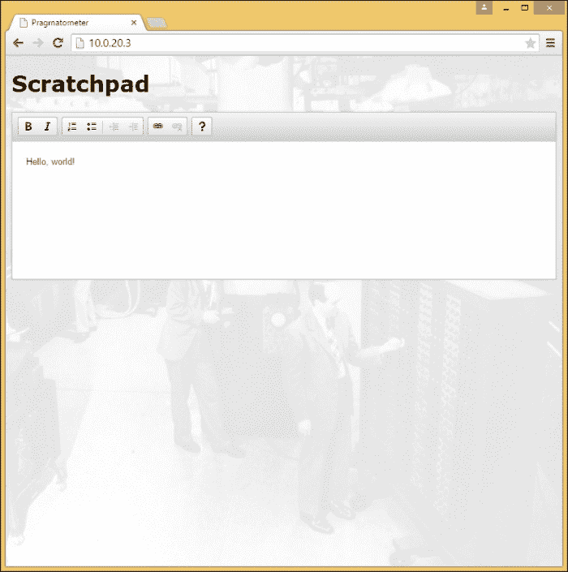

# 第十一章。用一个真实的例子演示 JavaScript 中的功能反应式编程第四部分——添加一个草稿栏并把它放在一起

在这一章中，我们将介绍最后三项努力，旨在将所有这些结合起来，完成我们的示例 ReactJS 应用程序。前面几章讨论了用 ReactJS 制作的基本定制组件。本章不同于制作有效的组件，有效的组件与 ReactJS 一起工作，同时借鉴了一个重要的非基于 ReactJS 的工具。

制作完最后一个组件后，我们将把它们集成到一个页面中，四个组件中的每一个都放在页面的四分之一处。这不同于开发，我们给了开发中的工具整个页面。这将是本章的第二个主要部分。

到目前为止，该页面没有办法跟踪状态。假设您在日历中做了一个条目，一个待办事项，或者在便笺簿中做了一些笔记。然后，如果您离开并返回或重新加载页面，您所做的所有更改都将丢失。记住这些变化会很好，这正是我们下一步要做的。在本章的第三部分，也是最后一部分，我们将介绍一个廉价的、自主开发的基于 HTML5 localStorage 的持久性解决方案，该解决方案的效果出奇的好。它不允许您从多台计算机访问您的数据，但是让我们暂时不要管它，只在同一台计算机上进行持久性工作。

整个应用程序旨在处理个人信息管理/物流:任何信息的便笺簿、待办事项列表、日历和一个抱怨的人工智能存根，这些东西将被你自己设计的有趣的东西所取代。

# 添加一个所见即所得的草稿栏，由 CKeditor 提供

这里有多个**所见即所得** ( **所见即所得**)的编辑，选择 CKeditor 与其说是判断 CKeditor 是免费和付费编辑作为共同选择的无争议之王。我们将看到如何要求 ReactJS 单独留下 DOM 的一部分(在这种情况下，不要破坏我们的 CKeditor 实例)。我们将讨论这些话题:

*   为什么要使用类似 CKeditor 的东西，当它不能像 ReactJS 一样工作的时候？
*   在 CKeditor 上安装一个“小就是美”，看看哪个版本最好
*   在我们的页面中包括 CKeditor，重点是 JSX

## 将所有的东西整合到一个网页中

我们几乎一起做了所有的事情。我们将涵盖以下主题:

*   调整 JSX，使我们所有的功能现在都取消注释。这是一个非常简单的步骤。
*   让一切都适合的 CSS 样式。我们将组件排列在一个 2×2 的网格中，但是这可以被任何适合页面组件的样式化方法所取代。
*   引入基本数据持久性，将组件显示在一起。这将包括一些基本的，非详尽的 CSS 工作。
*   为了提供一个完整的示例应用程序，我们一直在开发的以用户界面为中心的应用程序将包括您计算机上的基本持久性，在这种情况下，使用 HTML5 localStorage 实现。这意味着一台计算机，没有登录或其他烦恼，将能够持续使用数据。
*   几个简单的`JSON.stringify()`调用就能工作，并为更常见的远程、基于服务器的持久性奠定了基础。数据通过`JSON.stringify()`进行字符串化，这对于本地存储来说并不是特别需要的，但是这使得代码更容易单独交换本地存储引用，并用可能选择的远程服务器来替换它们。
*   导致 CKeditor 状态持续。一些有经验的程序员，在被要求为组件状态创建一个本地存储持久化解决方案时，可能会合理地猜测我们对除草稿栏之外的所有内容的解决方案。草稿栏有一些 Web 2.0 工作的陷阱，因为 CKeditor 有一些 Web 2.0 工作的陷阱。

整个系统协同工作可以在[http://demo.pragmatometer.com/](http://demo.pragmatometer.com/)看到。

## 这本书讲的是 ReactJS，那为什么要用 CKeditor 呢？

总的来说，可能是建议最好有一些与 ReactJS 的声明精神和单向数据绑定一起工作的东西。如果您可以选择一个很好的实现，比如不是以类似于 ReactJS 的方式工作的 CKeditor，或者其他一些非常适合 ReactJS 并能很好地处理所见即所得的组件，那么您应该选择适合 ReactJS 的组件。

这本书旨在帮助你解决岔路口的任何一边。它包括有和没有 JSX 的开发、遗留和绿色领域开发、单向和双向数据绑定，以及(这里)纯 ReactJS 组件与集成非 ReactJS JavaScript 工具。好消息是，ReactJS 擅长和其他孩子玩得很好。来自 JavaScript 世界各地的工具至少有可能为您所用，而不仅仅是为使用 ReactJS 而明确开发的小工具。也许您可以享受使用纯 ReactJS 组件的乐趣。也许你想要、需要或者不得不使用一些没有考虑到 ReactJS 集成的 JavaScript 工具。好消息是:在这两种情况下，ReactJS 可能已经覆盖了。在这一章中，我们将使用一个标准的非 ReactJS 工具——著名且成熟的 CKeditor，ReactJS 可以让我们很好地集成到我们的网页中。

# CKeditor——小的免费供品，小的就是美的

有几个免费的商业编辑可用；其中一个这样的编辑器是 CKeditor(它的主页在[http://ckeditor.com/](http://ckeditor.com/))。CKeditor 有四个基本选项:*基本*、*标准*、*全*，以及一个*自定义*选项，可以完全自由选择和取消选择可选功能。对于本项目，我们将使用*基本*选项。这不是一项让用户呈现大量按钮行的服务，关于要包括哪些功能的正确问题是，“对我们来说最有效的最低要求是什么？”

## 在我们的页面中包含 CKeditor

**基本**选项(以及标准、完整和自定义选项阵列)可从 CDN 下载或获得。在撰写本书时，可以通过以下方式从 CDN 获得基本选项:

```js
<script src="//cdn.ckeditor.com/4.4.7/basic/ckeditor.js"></script>
```

这应该是我们的 HTML。我们还需要在 JSX 问题上努力。用于放置草稿栏的代码是我们四个子组件中最简单和最短的:

```js
  var Scratchpad = React.createClass({
    render: function() {
      return (
        <div id="Scratchpad">
          <h1>Scratchpad</h1>
          <textarea name="scratchpad"
            id="scratchpad"></textarea>
        </div>
      );
    },
    shouldComponentUpdate: function() {
      return false;
    }
  });
```

`render()`方法和看起来一样简单。注意，它定义了一个`TEXTAREA`而不是一个 CKeditor 小部件。不同版本的 CKeditor 由 Hijaxing 特定的`TEXTAREAs`工作，而不是在代码中编写它们的小部件。`shouldComponentUpdate()`法也是看起来那么简单，但值得一评。这种方法旨在为 ReactJS 的虚拟 DOM 差异不如您所能做到的那样快的罕见情况提供优化。例如，在 ClojureScript 下，Om 具有不可变的数据结构，因此可以仅通过引用比较来测试相等性，而不需要深度相等性检查，这就是为什么 Om 加 ClojureScript 的速度大约是 ReactJS 加 JavaScript 的两倍。而且，如前几章所述，在 99%的情况下，对 ReactJS 的虚拟 DOM 进行微观管理是完全不需要的，即使你想要非常高的性能。

然而，这里我们有一个单独的`shouldComponentUpdate()`机制的用例。在这里的使用与优化无关，用较少的比较获得相同的结果。相反，它被用来否认 DOM 的一部分的管辖权。对于您可能想要包括的一些其他工具，例如 CKeditor，最好要求 ReactJS 创建 DOM 的一部分，然后不要去管它，而不要在以后破坏另一个工具的更改；这正是我们在这里所做的。因此，`shouldComponentUpdate()`——除了构成一个在闪电般的虚拟 DOM 差异中删除不必要的比较的机制——还可以用来附加一个标签，上面写着，“除了 ReactJS 之外的一些东西负责维护 DOM 的这一部分。请不要打它。”

在 web 应用程序的第一次呈现之后，我们要求 CKeditor 替换 ID 为 scratchpad 的`TEXTAREA`，这应该会给我们一个活动的小部件:

```js
  React.render(<Pragmatometer />,
    document.getElementById('main'));
  CKEDITOR.replace('scratchpad');
We temporarily comment out the other subcomponents:
  var Pragmatometer = React.createClass({
    render: function() {
      return (
        <div className="Pragmatometer">
          {/* <Calendar /> */}
          {/* <Todo /> */}
          <Scratchpad />
          {/* <YouPick /> */}
        </div>
      );
    }
  });
```

现在我们有了一个交互式便笺簿。这是我们的 web 应用程序的截图，只显示了草稿栏:



# 将所有四个子组件集成到一个页面中

在创建了四个子组件——一个日历、一个便笺簿、一个待办事项列表和一个带有占位符的**你选择**槽之后，我们现在将它们集成起来。

我们从取消注释 Pragmatometer 的`render()`方法中所有被注释的子组件开始:

```js
        <div className="Pragmatometer">
          <Calendar />
          <Todo />
          <Scratchpad />
          <YouPick />
        </div>
```

我们的下一步是添加造型，只需一点响应设计。响应设计中至少有一个主要的竞争者，就是不要试图去了解和解决每一个屏幕分辨率，而是根据屏幕宽度来决定响应的几个步骤。例如，如果你有一个宽大的桌面显示器，加载[http://therussianshop.com/](http://therussianshop.com/)，并逐渐缩小浏览器窗口，你就可以看到这一点。不同的适应性开始发挥作用，当从桌面宽度、平板电脑的任何一个方向或智能手机来看时，页面作为一个整体会形成一个整体。我们不会在这里尝试一个严肃的解决方案，但有一些响应，事实上，我们使我们的造型有条件的最小宽度为 513 像素。没有任何样式，四个元素将一个在另一个之上显示；通过造型，它们将被圈成一个 2 x 2 的网格。

对子组件进行样式化的 CSS 本质上是将一个足够大的窗口分成几个部分，添加一些填充，并确保每个应用程序上的任何溢出都会滚动:

```js
      @media only screen and (min-width: 513px) {
        #Calendar {
          height: 46%;
          left: 2%;
          overflow-y: auto;
          position: absolute;
          top: 2%;
          width: 46%;
        }
        #Scratchpad {
          height: 46%;
          left: 2%;
          overflow-y: auto;
          position: absolute;
          top: 52%;
          width: 46%;
        }
        #Todo {
          height: 46%;
          left: 52%;
          overflow-y: auto;
          position: absolute;
          top: 0;
          width: 46%;
        }
        #YouPick {
          height: 50%;
          left: 52%;
          overflow-y: auto;
          position: absolute;
          top: 52%;
          width: 46%;
        }
      }
```

这允许我们显示，下面是我们的网络应用程序所有部分的截图:


# 坚持

有些框架是万能的框架，意在做一切事情；ReactJS 不是。它甚至没有提供任何方法来进行 AJAX 调用，尽管(实际上)任何使用 ReactJS 的重要项目都有 AJAX 需求。这完全是设计出来的。原因是 ReactJS 被专门用作处理用户界面或制作视图的框架，它旨在与其他技术相结合，以制作任何适合您站点的完整包。

这个 Pragmatometer 应用程序中需要的一个特性是它会记住您输入的数据。如果你在下午 2:00 输入明天的约会，然后离开页面并回来，如果页面记住了约会，而不是每次加载时都呈现一张完全空白的石板，那就太好了。持久性是一个完整的 web 应用程序的一部分，但它不是视图或用户界面的责任，ReactJS 显然没有提供持久性的解决方案。或许也不应该。最近几章讲述了如何使用 ReactJS 做“X”；这一章是关于如何做一些补充 ReactJS 的事情。

对于主流使用，持久性通常通过与后端的通信来处理；有几种好的技术可用。但是，试图将正确实现后端的处理方法塞进一本关于使用 ReactJS 进行前端开发的书的一章的一节中，可能并不是非常有用。

作为一个直接留在前端领域的练习，我们将通过一个众所周知的前端路线来处理持久性——html 5 的本地存储(如果 Modernizr 未能检测到本地存储，持久性代码什么也不做)。使用的功能`save()`和`restore()`保存在本地存储器中，如果找到的话。他们直接调用`JSON.stringify()`和`JSON.parse()`，尽管这一步并不是导致 JSON 可序列化对象在本地存储中持久化所严格需要的。这旨在提供一个直接挂钩来更改代码，以便与远程后端对话。像这里的实现一样，最简单的调整是整体保存和恢复应用程序的整个状态，但是请记住，过早的优化仍然是万恶之源。以这种方式大量使用应用程序可能会导致相当于单个大型 PNG 文件的状态量。当然，该代码进一步适用于更简单的保存或恢复 diff 的手术方法，但这里的重点是打下坚实的基础，而不是尽可能地推动优化。

我们将使用来自[的](https://github.com/douglascrockford/JSON-js/blob/master/json2.js) Crockford 的 JSON 和来自[http://modernizr.com/](http://modernizr.com/)的 Modernizr。我们将只在此应用程序中使用 Modernizr 来测试 localStorage 的可用性，因此如果您正在寻找一个“足以用于此项目的最小重量”Modernizr 构建，请选择测试 localStorage，并选择不做其他任何事情。让我们将这些文件包含在`index.html`中:

```js
<script src="js/json2.js"></script>
<script src="js/modernizr.js"></script>
```

在我们的`site.jsx`文件中，我们定义了`save()`和`restore()`函数。这些将用于为不同的应用程序保持整个状态。一种不同的方法可能是做出更多更小的扑救，而不是一些整体扑救，但是一些整体扑救很容易在心理上被跟踪。因此，对于数据的次要方面，它们比不同保存的网格更容易维护和调试(如果我们以后需要优化，我们可以，但是过早的优化仍然是万恶之源)。save()函数的内容如下:

```js
  var save = function(key, data) {
    if (Modernizr.localstorage) {
      localStorage[key] = JSON.stringify(data);
    }
  }
```

将这个连接到远程后端的最明显的方法，除了处理诸如帐户管理(在这个例子中没有处理)之类的细节之外，将是用一个调用来替换`localStorage[key]`赋值，以通知服务器与该键相关联的新字符串数据。这将使得 Modernizr 检查变得没有必要。不过要提醒一下:即使是 IE8 也支持 localStorage，不支持的客户端会有点过时，可能 ReactJS 也不支持，ReactJS 不做早于 8 的 IE 版本的支持广告(还有，IE8 支持现在是基于一个垫片，而不是原生的；参见[http://tinyurl.com/reactjs-ie8-shim](http://tinyurl.com/reactjs-ie8-shim)。

`restore()`功能除了键— `default_value`外，还有一个可选参数。这用于支持初始化，如果保存的状态存在，则将其拉回到正常值，否则该值将用于初始化。初始化代码可以被重用来处理这个`restore()`函数，如果该键存在的话，它将提取非空的和已定义的保存数据，如果没有发现任何有趣的东西，则提取默认值。带有`JSON.parse()`的线路和探测本地存储的`if`语句是您最直接替换为与远程后端通话的线路。或者，为了更进一步，`restore()`函数可能会被删除，并被具有相同签名和语义的函数替换，但会与一个远程服务器进行对话，该服务器拥有更多检查是否保存了任何预先存在的数据的工作。如果服务器没有什么可返回的，这可能会让客户端返回默认值:

```js
  var restore = function(key, default_value) {
    if (Modernizr.localstorage) {
      if (localStorage[key] === null || localStorage[key]
        === undefined) {
        return default_value;
      } else {
        return JSON.parse(localStorage[key]);
      }
    } else {
      return default_value;
    }
  }
```

现在，所有`getInitialState()`功能都被修改为通过恢复()功能。看看接下来会发生什么。考虑一下这段代码的`Todo`初始值设定项:

```js
      getInitialState: function() {
        return {
          'items': [],
          'text': ''
        };
      },
```

它简单地包装在对`restore()`的调用中:

```js
      getInitialState: function() {
        return restore('Todo', {
          'items': [],
          'text': ''
        });
      },
```

有几个函数可以改变一个或另一个组件的状态，我们让任何改变我们组件的部分状态的函数保存整个状态。因此，在适当命名的`Calendar#handle_submit`中，`this.state.entry_being_added`的许多细节被填充以匹配(Hijaxed)表单上的内容。然后，已填写的条目被添加到实时已填写条目的列表中，并且一个新条目被放在它的位置:

```js
      this.state.entries.push(this.state.entry_being_added);
      this.state.entry_being_added = this.new_entry();
```

这两条线改变了`this.state`，所以我们保存了它们之后的状态:

```js
      this.state.entries.push(this.state.entry_being_added);
      this.state.entry_being_added = this.new_entry();
      save('Calendar', this.state);
```

## 一个细节——保持时钟状态

这个部分大部分是相对可预测的。一些程序员被告知我们正在通过 HTML5 localStorage 添加持久性，他们可能已经猜到了一些与之前所写的很接近的东西，并且很可能他们已经非常接近了。然而，关于 CKeditor 有一个细节不太明显，也不太理想。

CKeditor 做了你在“不花哨”的 Web 1.0 表单使用下可能天真地期待的事情。如果有表单，包含一个`TEXTAREA`，名称和 ID 为`foo`，调用 CKeditor 进行转换，提交表单。该表单将被提交，就像当时在 CKeditor 实例上的 HTML 是`TEXTAREA`的内容一样。这一切都是理所应当的。

但是，如果您几乎以任何“AJAXian”方式使用 CKeditor，在没有整页表单提交的情况下查询文本区域的值，您将会遇到问题。CKeditor 实例的报告值既不大于也不小于它被初始化为的文本。原因是`TEXTAREA`的值会在整页表单提交时为您同步，但这不会在中间步骤自动完成。这意味着，除非您采取额外的步骤，否则无法有效地查询 CKeditor 实例。

幸运的是，多出来的一步并不是特别难或者滑；CKeditor 提供了一个 API 来同步`TEXTAREA`，所以你可以查询`TEXTAREA`来获取 CKeditor 实例的值。在连接 CKeditor 便笺簿之前，我们初始化了整个显示器，并设置了一个间隔，以便显示器每 100 毫秒更新一次(对于一个间隔来说，这个长度没有什么必要或不可思议的；它可以或多或少地更新，更长的时间间隔更短，但基本相同):

```js
  var update = function() {
    React.render(<Pragmatometer />,
      document.getElementById('main'));
  };
  update();
  var update_interval = setInterval(update,
    100);
```

为了适应 CKeditor，我们稍微打乱和解开一些东西。我们的代码会稍微混乱一点，以便以特定的顺序调用。为了让我们的`TEXTAREA`首先存在，我们需要渲染一次 Pragmatometer 主组件(或者不止一次，如果我们愿意的话)。然后，在那次通话之后，我们要求 CKeditor 转换`TEXTAREA`。

接下来，我们启动一个更新功能。这既更新了显示，又将 CKeditor 的`TEXTAREAs`同步到可以查询的位置。同步`TEXTAREA`的循环并不是绝对必要的。如果我们只有一个编辑器实例，我们只需要一行代码，但是我们拥有的代码对于任何数量的具有任何 ID 的 CKeditor 实例都是通用的。最后，在循环中，我们在编辑器内容上调用`save()`。一个优化，如果`save()`和`restore()`被掏空并被替换以与后端服务器对话，将是在变量中保存当前编辑器状态，并且仅当编辑器的内容不同于先前保存的值时`save()`。这将减少频繁的网络聊天:

```js
  React.render(<Pragmatometer />,
    document.getElementById('main'));
  CKEDITOR.replace('scratchpad');
  var update = function() {
    React.render(<Pragmatometer />,
      document.getElementById('main'));
    for(var instance in CKEDITOR.instances) {
      CKEDITOR.instances[instance].updateElement();
    }
    save('Scratchpad', 
      document.getElementById('scratchpad').value);
  };
  var update_interval = setInterval(update,
    100);
```

还有一些的变化，这样所有的初始化都在对`restore()`的调用中包装了我们早期的代码。同样，每次我们改变一个组件的状态，我们称之为`save()`。我们结束了！

# 总结

在本章中，我们添加了第四个组件。它与其他不同之处在于，它不是在 ReactJS 中从头开始构建的，而是集成了第三方工具。这可以很好地工作；只是要小心有一个`shouldComponentUpdate()`方法返回`false`作为一种说法，“不要痛击这个；让其他软件在这里完成它的工作。”

尽管我们讨论了三个基本主题——组件、集成和持久性，但这一章比其他章节更容易。我们有一个实时的工作系统，你可以在[http://demo.pragmatometer.com/](http://demo.pragmatometer.com/)看到。

现在让我们退一步来看结论，讨论你在这本书的过程中学到了什么。