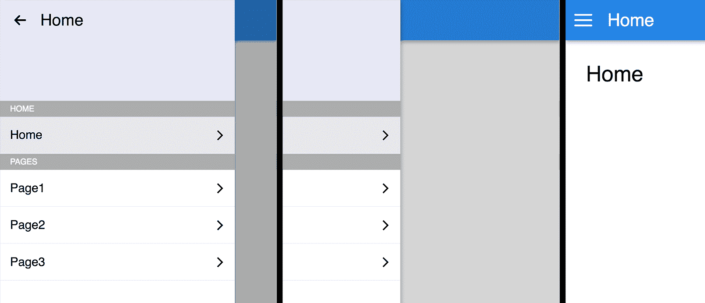

# 一、创建 ReasonReact 组件

现在我们已经建立了我们的开发环境，我们已经准备好开始 ReactJS 的未来。推理 1 和推理 2 都是由建造反应堆的同一个人建造的。原因推理只是原因，很像 ReactJS 只是 JavaScript。在本书的剩余部分，我们将使用一个我们将在本章中开始构建的应用。以下是本章结束时我们将构建的内容的截图:



接下来，克隆这本书的 GitHub 库，从`Chapter03/start`开始。在本书的其余部分，每个目录与我们在[第 2 章](2.html)、*建立开发环境* *ent* 末尾建立的目录共享相同的开发环境。

```js
git clone https://github.com/PacktPublishing/ReasonML-Quick-Start-Guide.git
cd ReasonML-Quick-Start-Guide
cd Chapter03/start
npm install
```

我们将首先探索 ReasonReact，在本章的中途，我们将转向`Chapter03/app-start`目录，在那里我们将开始使用 ReasonReact 的内置路由器构建应用。

在本章中，我们将执行以下操作:

*   探索创建无状态和有状态的原因恢复组件
*   创建包含导航和路由的应用
*   看看这么多你已经熟悉的 ReactJS 概念是如何很好地映射到 ReactJS 的
*   了解 ReasonReact 如何借助 ReasonReact 的类型系统帮助我们创建更健壮的组件

# 组件创建基础

让我们从分析一个简单的无状态组件开始。在`App.re`中，让我们用一些文本渲染一个`<div />`元素:

```js
let component = ReasonReact.statelessComponent("App");

let make = _children => {
  ...component,
  render: _self => <div> {ReasonReact.string("hello world")} </div>,
};
```

在`Index.re`中，将组件渲染到一个标识为`"root"`的 DOM 元素中:

```js
ReactDOMRe.renderToElementWithId(<App />, "root");
```

由于 Reason 的模块系统，我们不需要`Index.re`中的`import`语句，也不需要`App.re`中的导出语句。每个原因文件都是一个模块，每个原因模块都是全局可用的。在本书的后面，我们将看到如何隐藏模块的实现细节，以便组件的用户只访问他们应该访问的东西。

# 组件模板

在 ReasonReact 中，所有组件都是使用以下四种功能之一创建的:

*   `ReasonReact.statelessComponent`
*   `ReasonReact.statelessComponentWithRetainedProps`
*   `ReasonReact.reducerComponent`
*   `ReasonReact.reducerComponentWithRetainedProps`

四个函数中的每一个都接受一个`string`，并返回一个对应于不同组件模板的`record`。`string`的论点只是为了调试的目的。该组件从其文件名(`App.re`)获得其名称(`<App />`)。返回记录包含的字段取决于使用了哪个函数。在前面的例子中，我们可以覆盖以下字段:

*   `render`
*   `didMount`
*   `willReceiveProps`
*   `shouldUpdate`
*   `willUpdate`
*   `didUpdate`
*   `willUnmount`

除了`render`字段，其余都是熟悉的 ReactJS 生命周期事件。要覆盖一个字段，在`make`函数返回的`record`中添加该字段。在前面的示例中，组件模板的`render`字段被替换为自定义的`render`功能。

`make`函数接受`props`作为参数，并返回一个与最初由四个组件创建函数之一创建的形状相同的`record`。`make`功能的最后一个参数必须是`children`道具。你可能已经注意到在前面的例子中`children`的前缀是`_`。如果您的组件不需要引用子对象，那么在参数前面加上`_`可以防止编译器警告未使用的绑定。

它可能不会立即出现，但是`make`函数的花括号属于返回的`record`文字。`...component`表达式在这个新的`record`中扩展了原始`record`的内容，这样就可以覆盖单个字段，而不必显式设置每个字段。

# 自己

`render`字段保存一个回调函数，该函数接受一个名为`self`的参数，并返回一个类型为`ReasonReact.reactElement`的值。`self`记录的三个字段如下:

*   `state`
*   `handle`
*   `send`

根据选择，React 没有 JavaScript 的`this`概念。相反，`self`保存必要的信息，并提供给需要它的回调。当使用有状态组件时，我们将看到更多的`self`。

# 事件处理程序

在我们的渲染函数中，我们可以像在 ReactJS 中一样将事件侦听器附加到 DOM 元素。例如，为了监听点击事件，我们添加一个`onClick`属性，并将其值设置为一个事件处理程序:

```js
let component = ReasonReact.statelessComponent("App");

let make = _children => {
  ...component,
  render: _self =>
    <div onClick={_event => Js.log("clicked")}>
      {ReasonReact.string("hello world")}
    </div>,
};
```

然而，这个回调函数必须只接受一个参数(对应于一个 JavaScript DOM 事件)，并且必须返回一个名为`unit`的类型。

# 单位

在理性中，`unit`是一个表示“无”的类型返回类型为`unit`的函数不能返回除`unit`以外的任何内容。类型`unit`正好有一个值:`()`(即一对空括号，也叫`unit`)。

相比之下，`bool`类型正好有两个值:`true`和`false`。类型`int`的值有无限多种。

如[第 1 章](1.html)、*推理简介*所述，在推理中表示可空值的惯用方式是使用`option`类型。`option`类型和`unit`类型的主要区别在于`option`类型的值可能什么都不是，也可能是某个值，其中作为`unit`类型的值总是`()`。

接受和/或返回`unit`的函数可能会导致副作用。例如，`Js.log`是返回`unit`的函数。`onClick`事件处理程序也是返回`unit`的函数。

`Random.bool`是接受`unit`作为参数并返回`bool`的函数示例。用`unit`调用函数的语法很熟悉:

```js
Random.bool()
```

由于`onClick`需要一个返回`unit`的函数，以下将导致类型错误:

```js
let component = ReasonReact.statelessComponent("App");

let make = _children => {
  ...component,
  render: _self =>
    <div onClick={_event => 42}> {ReasonReact.string("hello world")} </div>,
};
```

这里显示了类型错误:

```js
Error: This expression has type int but an expression was expected of type
  unit
```

在错误信息中，`This expression`指的是`42`。

# JSX

原因来自 JSX 语法。React 版 JSX 的一个不同之处在于，我们不能在 React 中执行以下操作:

```js
<div>"hello world"</div>
```

相反，我们需要使用`ReasonReact.string`功能将`string`转换为`ReasonReact.reactElement`:

```js
<div>ReasonReact.string("hello world")</div>
```

然而，这仍然不起作用。我们还需要用`{ }`包装表达式，以帮助解析器区分多个可能的子级:

```js
<div> {ReasonReact.string("hello world")} </div>
```

您可以自由地创建一个不太冗长的别名，并使用它:

```js
let str = ReasonReact.string;
<div> {str("hello world")} </div>;
```

在 JSX 调用自定义组件时，会调用其`make`函数。`<App />`语法去糖如下:

```js
ReasonReact.element(App.make([||]))
```

当一个组件将接收到新的道具时，它的`make`函数将再次以新的道具作为参数被调用。`make`功能类似于 ReactJS 的`constructor`和 ReactJS 的`componentWillReceiveProps`的组合。

# 小道具

让我们为我们的`<App />`组件添加几个道具:

```js
let make = (~greeting, ~name, _children) => {
  ...component,
  render: _self => <div> {ReasonReact.string(greeting ++ " " ++ name)} </div>,
};
```

编译后，我们得到一个编译器错误，因为在`Index.re`中我们没有提供所需的`greeting`和`name`道具:

```js
We've found a bug for you!

1 │ ReactDOMRe.renderToElementWithId(<App />, "root");

This call is missing arguments of type:
(~greeting: string),
(~name: string)
```

`greeting`和`name`是`make`函数的**标记参数**，这意味着它们可以以任何顺序提供。要将参数转换为带标签的参数，请在它前面加上一个波浪符号(`~`)。Reason 还支持可选参数以及带有默认值的参数。让我们给`greeting`一个默认值，并使`name`可选:

```js
let make = (~greeting="hello", ~name=?, _children) => {
  ...component,
  render: _self => {
    let name =
      switch (name) {
      | None => ""
      | Some(name) => name
      };
    <div> {ReasonReact.string(greeting ++ " " ++ name)} </div>;
  },
};
```

由于`name`是一个可选参数，它被包装在一个`option`类型中，然后我们可以根据它的值进行模式匹配。当然，这只是为`name`提供`""`默认参数的冗长方式。

现在，我们的例子编译即使`<App />`没有提供任何道具:

```js
ReactDOMRe.renderToElementWithId(<App />, "root");
/* hello */

ReactDOMRe.renderToElementWithId(
  <App greeting="welcome," name="reason" />,
  "root",
);
/* welcome, reason */

```

如果我们决定删除名称道具，编译器会告诉我们需要在哪里更新`<App />`的用法。这给了我们重构组件的自由，而不用担心忘记更新代码库的一个区域。编译器支持我们！

# 儿童

`make`函数的最后一个参数总是`children`道具——这是强制的。就像其他道具一样，孩子可以是任何数据结构。只要组件允许，我们就可以使用 ReactJS 中流行的渲染道具模式。重要的是，React 总是在一个数组中包装子级，所以如果我们不想这样包装，我们需要用`...`语法打开这个数组。

在`App.re`中，我们将移除除所需`children`道具外的所有道具。在 render 函数中，我们用我们的硬编码问候语调用孩子:

```js
/* App.re */
let component = ReasonReact.statelessComponent("App");

let make = children => {
  ...component,
  render: _self => children("hello"),
};
```

在`Index.re`中，我们添加一个函数作为`<App />`的子函数，接受提供的问候并返回 JSX(类型为`ReasonReact.reactElement`)。请注意`...`语法，该语法用于展开所有 ReasonReact 子级包装的数组:

```js
/* Index.re */
ReactDOMRe.renderToElementWithId(
  <App> ...{greeting => <div> {ReasonReact.string(greeting)} </div>} </App>,
  "root",
);
```

如果我们忘记了`...`，编译器会善意地告诉我们:

```js
We've found a bug for you!

1 │ ReactDOMRe.renderToElementWithId(
2 │ <App> {greeting => <div> {ReasonReact.string(greeting)} </div>} </App>,
3 │ "root",
4 │ );

This has type:
  array('a)
But somewhere wanted:
  string => ReasonReact.reactElement
```

如果我们不包含任何子级(也就是说，只是`<App />`)，我们甚至会得到类似的编译器消息，因为这将转化为一个空数组。这意味着我们保证，如果要进行类型检查，我们组件的用户必须提供类型为`<App />`的子级`string => ReasonReact.reactElement`的功能。

我们还可以要求我们的组件接受其他子类型，例如，两个字符串的元组:

```js
/* App.re */
let component = ReasonReact.statelessComponent("App");

let make = children => {
  ...component,
  render: _self => {
    let (greeting, name) = children;
    <div> {ReasonReact.string(greeting ++ " " ++ name)} </div>;
  },
};
/* Index.re */
ReactDOMRe.renderToElementWithId(<App> ...("hello", "tuple") </App>, "root");
```

因为在`App.re`中使用了`(string, string)`类型的元组，所以 Reason 能够推断出子项一定是该类型的元组。例如，考虑以下用法:

```js
ReactDOMRe.renderToElementWithId(<App> ("hello") </App>, "root");
```

这将导致友好的编译器错误，因为`App`组件要求其子组件是元组，但`App`组件的子组件不是元组。

```js
We've found a bug for you!

1 │ ReactDOMRe.renderToElementWithId(<App> ("hello") </App>, "root");

This has type:
  array('a)
But somewhere wanted:
  (string, string)
```

这是难以置信的强大。因为我们在编译时得到了这些保证，所以我们不必担心对组件的子组件的形状进行运行时检查。同样，我们保证在编译时检查道具类型。重构组件的压力要小得多，因为编译器会引导我们前进。更重要的是，由于 Reason 强大的类型推断，到目前为止，我们还不需要显式注释任何类型。

# 生命周期

原因 React 支持熟悉的 ReactJS 生命周期事件。我们将在构建应用时更仔细地了解一些生命周期事件，但是，现在，让我们看看如何为`<App />`实现 ReactJS 的`componentDidMount`生命周期挂钩:

```js
let make = _children => {
  ...component,
  didMount: _self => Js.log("mounted"),
  render: _self => <div> {ReasonReact.string("hello")} </div>,
};
```

我们用`didMount`代替`componentDidMount`。同样，`didMount`只是组件的`make`函数返回的记录中的一个字段。`didMount`类型为`self => unit`，是接受`self`返回`unit`的功能。由于它返回`unit`，很可能`didMount`会引起副作用，在我们的例子中确实如此。在浏览器中运行此程序会导致`mounted`登录到控制台。

# 订阅助手

为了让编写清理代码更方便、更容易记忆，ReasonReact 提供了`self.onUnmount`，可以在组件的`didMount`生命周期内(或者任何可以访问`self`的地方)直接使用。这允许您在`willUnmount`内，将清理代码与其补充代码一起编写，而不是单独编写:

```js
didMount: self => {
  let intervalId = Js.Global.setInterval(() => Js.log("hello!"), 1000);
  self.onUnmount(() => Js.Global.clearInterval(intervalId));
},
```

# 有状态组件

到目前为止，我们只使用了`ReasonReact.statelessComponent`模板。为了创建一个有状态组件，我们将组件模板切换到`ReasonReact.reducerComponent`，并覆盖其`make`函数返回的记录中的一些附加字段。我们很快就会看到，我们还需要声明自定义类型定义，以便在这些附加字段中使用。之所以叫`reducerComponent`，是因为它内置了状态、动作和减速器的概念——就像 Redux 一样，只是状态、动作和减速器是组件本地的。

此处显示了一个简单的计数器组件，带有递增和递减当前计数的按钮:

```js
type state = int;

type action =
  | Increment
  | Decrement;

let component = ReasonReact.reducerComponent("App");

let make = _children => {
  ...component,
  initialState: () => 0,
  reducer: (action, state) =>
    switch (action) {
    | Increment => ReasonReact.Update(state + 1)
    | Decrement => ReasonReact.Update(state - 1)
    },
  render: self =>
    <>
      <button onClick={_event => self.send(Decrement)}>
        {ReasonReact.string("-")}
      </button>
      <span> {ReasonReact.string(string_of_int(self.state))} </span>
      <button onClick={_event => self.send(Increment)}>
        {ReasonReact.string("+")}
      </button>
    </>,
};
```

这里使用 ReactJS 片段语法(`<>`和`</>`)来包装`<button>`和`<span>`元素，而不添加不必要的 DOM 节点。

# 状态、动作和减速器

让我们把它分解一下。在文件的顶部，我们看到两个类型声明，一个用于状态，一个用于动作。`state`和`action`这两个名字是约定，但是你可以用任何你喜欢的名字:

```js
type state = int;

type action =
  | Increment
  | Decrement;
```

就像在 Redux 中一样，事件触发动作，这些动作被发送到一个减速器，然后减速器更新状态。接下来，按钮的点击事件触发`Decrement`动作，该动作通过`self.send`发送到部件的减速器。请记住，渲染函数的参数是`self`:

```js
<button onClick={_event => self.send(Increment)}>
  {ReasonReact.string("+")}
</button>
```

`state`类型声明定义了我们状态的形状。在这种情况下，我们的状态只是一个保存组件当前计数的整数。组件的初始状态为`0`:

```js
initialState: () => 0,
```

`initialState`需要类型为`unit => state`的功能。

当由动作触发时，reducer 函数接受该动作以及当前状态，并返回新状态。当前动作使用模式匹配，`ReasonReact.Update`返回新状态:

```js
reducer: (action, state) =>
  switch (action) {
  | Increment => ReasonReact.Update(state + 1)
  | Decrement => ReasonReact.Update(state - 1)
  },
```

为了让 ReactJS Fiber 发布的 ReactJS 应用保持理性，请确保`reducer`中的一切都是纯净的。保持`reducer`纯净的同时间接触发副作用的一种方法是使用`ReasonReact.UpdateWithSideEffects`:

```js
reducer: (action, state) =>
  switch (action) {
  | Increment =>
    ReasonReact.UpdateWithSideEffects(
      state + 1,
      (_self => Js.log("incremented")),
    )
  | Decrement => ReasonReact.Update(state - 1)
  },
```

`reducer`的返回值必须是以下变量构造函数之一:

*   `ReasonReact.NoUpdate`
*   `ReasonReact.Update(state)`
*   `ReasonReact.SideEffects(self => unit)`
*   `ReasonReact.UpdateWithSideEffects(state, self => unit)`

我们可以从副作用中触发新的动作，因为我们再次获得了`self`:

```js
reducer: (action, state) =>
  switch (action) {
  | Increment =>
    ReasonReact.UpdateWithSideEffects(
      state + 1,
      (
        self =>
          Js.Global.setTimeout(() => self.send(Decrement), 1000) |> ignore
      ),
    )
  | Decrement => ReasonReact.Update(state - 1)
  },
```

递增后，`reducer`触发副作用，一秒后触发`Decrement`动作。

# 重构

假设我们现在需要我们的状态组件来显示一条消息，当用户数到 10 时，它会向用户表示祝贺，一旦消息显示出来，用户就可以通过单击关闭按钮来关闭消息。多亏了我们有用的编译器，我们可以遵循以下步骤:

1.  更新`state`的形状
2.  更新可用`actions`
3.  逐步检查编译器错误
4.  更新`render`功能

编译器消息会提醒我们更新组件的初始状态和缩减器。既然我们现在还需要跟踪是否显示消息，让我们将`state`的形状改为:

```js
type state = {
  count: int,
  showMessage: bool
};
```

对于我们的操作，让我们将`Increment`和`Decrement`组合成一个接受`int`的构造函数，我们将有一个新的构造函数来切换消息:

```js
type action =
  | UpdateCount(int)
  | ToggleMessage;
```

现在，代替`Increment`和`Decrement`，我们有了`UpdateCount`，它保存了一个整数，表示改变当前计数的数量。

编译后，我们看到一个友好的错误，让我们知道我们之前的动作`Decrement`找不到了:

```js
We've found a bug for you!
24 | render: self =>
25 | <>
26 | <button onClick={_event => self.send(Decrement)}>
27 | {ReasonReact.string("-")}
28 | </button>
The variant constructor Decrement can't be found.
- If it's defined in another module or file, bring it into scope by:
- Annotating it with said module name: let food = MyModule.Apple
- Or specifying its type: let food: MyModule.fruit = Apple
- Constructors and modules are both capitalized. Did you want the latter?
Then instead of let foo = Bar, try module Foo = Bar.
```

在`render`功能中，将`Increment`替换为`UpdateCount(+1)`，将`Decrement`替换为`UpdateCount(-1)`:

```js
render: self =>
  <>
    <button onClick={_event => self.send(UpdateCount(-1))}>
      {ReasonReact.string("-")}
    </button>
    <span> {ReasonReact.string(string_of_int(self.state))} </span>
    <button onClick={_event => self.send(UpdateCount(1))}>
      {ReasonReact.string("+")}
    </button>
  </>,
```

再次编译，我们被告知在我们的减速器中，`Increment`不属于类型`action`。让我们更新减速器来处理`UpdateCount`和`ToggleMessage`。如果我们忘记了一个构造函数，编译器会让我们知道 reducer 中的 switch 表达式并不是穷尽的:

```js
reducer: (action, state) =>
  switch (action) {
  | UpdateCount(delta) =>
    let count = state.count + delta;
    ReasonReact.UpdateWithSideEffects(
      {...state, count},
      (
        self =>
          if (count == 10) {
            self.send(ToggleMessage);
          }
      ),
    );
  | ToggleMessage =>
    ReasonReact.Update({...state, showMessage: !state.showMessage})
  },
```

关于前面的代码片段，没有什么值得一提的:

*   在`UpdateCount`中，我们声明了一个反映新计数的绑定`count`。
*   我们使用`...`来覆盖状态记录的一部分。
*   感谢记录双关支持，我们可以写`{...state, count}`而不是`{...state, count: count}`。
*   `UpdateCount`当计数达到 10 时，使用`UpdateWithSideEffects`触发`ToggleMessage`动作；我们可以这样做:

```js
| UpdateCount(delta) =>
  let count = state.count + delta;
  ReasonReact.Update(
    if (count == 10) {
      {count, showMessage: true};
    } else {
      {...state, count};
    },
  );
```

我更喜欢使用`UpdateWithSideEffects`，这样`UpdateCount`只需要担心它的计数字段，如果其他字段需要更新，`UpdateCount`可以触发正确的动作来实现，而不需要知道它需要如何发生。

在这里编译后，我们得到一个有趣的编译器错误:

```js
We've found a bug for you!

16 | switch (action) {
17 | | UpdateCount(delta) =>
18 | let count = state.count + delta;
19 | ReasonReact.UpdateWithSideEffects(
20 | {...state, count},

This has type:
  int
But somewhere wanted:
  state
```

编译器在第 18 行的`state.count`中看到`state`(如前所示)具有类型`int`而不是类型`state`。这是因为我们的渲染功能使用的是`string_of_int(self.state)`而不是`string_of_int(self.state.count)`。在更新我们的渲染函数以反映这一点后，我们得到另一条类似的消息，抱怨类型`int`和类型`state`不兼容。那是因为我们的初始状态还在返回`0`而不是`state`类型的记录。

更新初始状态后，代码最终编译成功:

```js
initialState: () => {count: 0, showMessage: false},
```

现在，我们准备好更新渲染函数，以便在计数达到 10 时显示一条消息:

```js
render: self =>
  <>
    <button onClick={_event => self.send(UpdateCount(-1))}>
      {ReasonReact.string("-")}
    </button>
    <span> {ReasonReact.string(string_of_int(self.state.count))} </span>
    <button onClick={_event => self.send(UpdateCount(1))}>
      {ReasonReact.string("+")}
    </button>
    {
      if (self.state.showMessage) {
        <>
          <p>
            {ReasonReact.string("Congratulations! You've reached ten!")}
          </p>
          <button onClick={_event => self.send(ToggleMessage)}>
            {ReasonReact.string("close")}
          </button>
        </>;
      } else {
        ReasonReact.null;
      }
    }
  </>,
```

由于`if/else`是“原因”中的一个表达式，我们可以在 JSX 内使用它来渲染标记或`ReasonReact.null`(其类型为`ReasonReact.reactElement`)。

# 实例变量

虽然我们的例子正确地显示了计数第一次达到 10 时的信息，但是在减速器的`UpdateCount`情况下，没有什么可以阻止我们的`ToggleMessage`动作再次被触发。如果用户达到 10，然后递减，然后递增，消息会再次切换。为了确保`UpdateCount`只触发`ToggleMessage`动作一次，我们可以在状态中使用一个**实例变量**。

在 ReactJS 中，每当状态发生变化时，组件都会被重新呈现。在 ReasonReact 中，实例变量从不触发重新渲染，并且可以正确地放置在组件的状态中。

让我们添加一个实例变量来跟踪用户是否已经看到了消息:

```js
type state = {
  count: int,
  showMessage: bool,
  userHasSeenMessage: ref(bool)
};
```

# 引用和可变记录

ReasonReact 实例变量和正常状态变量的区别在于`ref`的使用。之前我们看到`state.userHasSeenMessage`是`ref(bool)`型，而不是`bool`型。这使得`state.userHasSeenMessage`成为一个实例变量。

由于`ref`只是带有可变字段的记录类型的语法糖，让我们首先讨论可变记录字段。

要允许记录字段可变，请在字段名称前加上`mutable`。然后，可以使用`=`运算符就地更新这些字段:

```js
type ref('a) = {
  mutable contents: 'a
};

let foo = {contents: 5};
Js.log(foo.contents); /* 5 */
foo.contents = 6;
Js.log(foo.contents); /* 6 */
```

但是，类型声明已经包含在 Reason 的标准库中，所以我们可以省略它，前面代码的其余部分仍然可以工作，声明它隐藏了原始的类型声明。我们可以通过用不可变的记录隐藏`ref`类型来证明这一点:

```js
type ref('a) = {contents: 'a};

let foo = {contents: 5};
Js.log(foo.contents); /* 5 */
foo.contents = 6;
Js.log(foo.contents); /* 6 */
```

编译器因以下错误而失败:

```js
We've found a bug for you!

The record field contents is not mutable
```

`ref`除了有内置的类型定义外，还有一些内置的功能。即`ref`用于创建`ref`类型的记录，`^`用于获取`ref`的内容，`:=`用于设置参考的内容:

```js
type foo = ref(int);

let foo = ref(5);
Js.log(foo^); /* 5 */
foo := 6;
Js.log(foo^); /* 6 */
```

让我们回到我们的推理实例，让我们使用我们新的`userHasSeenMessage`实例变量。更新状态的形状后，我们还需要更新组件的初始状态:

```js
initialState: () => {
  count: 0,
  showMessage: false,
  userHasSeenMessage: ref(false),
},
```

现在，我们的代码再次编译，我们可以更新`reducer`来使用这个实例变量:

```js
reducer: (action, state) =>
  switch (action) {
  | UpdateCount(delta) =>
    let count = state.count + delta;
    if (! state.userHasSeenMessage^ && count == 10) {
      state.userHasSeenMessage := true;
      ReasonReact.UpdateWithSideEffects(
        {...state, count},
        (self => self.send(ToggleMessage)),
      );
    } else {
      ReasonReact.Update({...state, count});
    };
  | ToggleMessage =>
    ReasonReact.Update({...state, showMessage: !state.showMessage})
  },
```

现在，该消息被正确显示一次，而且只显示一次。

# 导航菜单

让我们利用目前所学的知识作为基础，创建一个带有导航菜单和客户端路由的应用。在触摸设备上，用户将能够滑动以关闭菜单，并且菜单将实时响应用户的触摸。如果用户在菜单关闭超过 50%时刷一下，然后松开，菜单就会关闭；否则，它将保持开放。一个例外是如果用户以足够高的速度滑动关闭的菜单；它将永远关闭。

在本书的剩余部分，我们将使用这个应用。接下来，克隆 GitHub repo 并导航到代表本章开头的目录:

```js
git clone https://github.com/PacktPublishing/ReasonML-Quick-Start-Guide.git
cd ReasonML-Quick-Start-Guide
cd Chapter03/app-start
npm install
```

让我们花点时间看看我们要做什么。您将看到以下目录结构:

```js
├── bsconfig.json
├── package-lock.json
├── package.json
├── src
│   ├── App.re
│   ├── App.scss
│   ├── Index.re
│   ├── Index.scss
│   ├── img
│   │   └── icon
│   │   ├── arrow.svg
│   │   ├── chevron.svg
│   │   └── hamburger.svg
│   └── index.html
└── webpack.config.js
```

我们的`bsconfig.json`被设置为将编译后的`.bs.js`文件放置在`lib/es6/src`中，并且我们已经配置了网络包来寻找`lib/es6/src/Index.bs.js`作为入口点。

运行`npm install`然后运行`npm start`在`http://localhost:3000`为我们的应用提供服务，bsb 和 webpack 都处于观看模式。

目前，我们的应用显示一个带有汉堡图标的蓝色导航栏。单击图标会打开一个菜单，单击菜单外部会将其关闭。

在`App.re`中，我们的状态目前是记录菜单状态的单字段记录:

```js
type state = {isOpen: bool};
```

我们有一个行动:

```js
type action =
  | ToggleMenu(bool);
```

我们的减速器负责更新菜单的状态:

```js
reducer: (action, _state) =>
  switch (action) {
  | ToggleMenu(isOpen) => ReasonReact.Update({isOpen: isOpen})
  },
```

Although Reason supports record punning, it does not work for single field records, since Reason treats `{isOpen}` as a block instead of a record.

我们的渲染函数根据当前状态渲染一个带有条件类名的`<div />`元素:

```js
<div
  className={"App" ++ (self.state.isOpen ? " overlay" : "")}
  onClick={
    _event =>
      if (self.state.isOpen) {
        self.send(ToggleMenu(false));
      }
  }>
```

`App.scss`仅当导航菜单打开时，使用`overlay`类在导航菜单后面显示深色覆盖:

```js
.App {
  min-height: 100vh;

  &:after {
    content: "";
    transition: opacity 450ms cubic-bezier(0.23, 1, 0.32, 1),
      transform 0ms cubic-bezier(0.23, 1, 0.32, 1) 450ms;
    position: fixed;
    top: 0;
    right: 0;
    bottom: 0;
    left: 0;
    background-color: rgba(0, 0, 0, 0.33);
    transform: translateX(-100%);
    opacity: 0;
    z-index: 1;
  }

  &.overlay {
    &:after {
      transition: opacity 450ms cubic-bezier(0.23, 1, 0.32, 1);
      transform: translateX(0%);
      opacity: 1;
    }
  }
  ...
}
```

请注意`.App:after`和`.App.overly:after`的`transition`属性是如何定义的，前者在`transform`属性上包含一个带有`450ms`延迟的转换，而后者移除该转换。这具有即使在菜单关闭时也允许平滑过渡的效果。

# 粘合剂

让我们在`App.re`的顶部检查到 JavaScript 的`require`函数的绑定。由于我们将在[第 4 章](4.html)、*BuckleScript、Belt 和互操作性*中更深入地探讨 BuckleScript，让我们推迟讨论细节，只是简单地看看这个绑定在做什么:

```js
[@bs.val] external require: string => string = "";

require("../../../src/App.scss");
```

`external`关键字创建一个新的绑定，类似于`let`关键字。在绑定到 JavaScript 的`require`函数之后，我们可以在 Reason 中使用它，只要我们使用的是 BuckleScript 编译器。我们用它来要求`App.scss`以及一些图像。在`lib/es6/src/App.bs.js`检查编译后的输出显示，前面的原因代码编译为:

```js
require("../../../src/App.scss");
```

Webpack 从那里处理剩下的。

# 事件

由于顶级`<div />`元素有一个总是关闭菜单的点击事件处理程序，任何对其子元素的点击也会触发该顶级点击事件处理程序。为了允许菜单打开(或保持打开)，我们需要为它的一些子元素调用`event.stopPropagation()`点击事件。

在 ReasonReact 中，我们可以通过`ReactEvent`模块做到这一点:

```js
onClick=(event => ReactEvent.Mouse.stopPropagation(event))
```

`ReactEvent`模块有对应于每个 ReactJS 合成事件的子模块:

*   剪贴板事件
*   合成事件
*   键盘事件
*   焦点事件
*   表单事件
*   鼠标事件
*   指针事件
*   选择事件
*   触摸事件
*   用户界面事件
*   车轮事件
*   媒体活动
*   图像事件
*   动画事件
*   过渡事件

有关 ReactJS 合成赛事的更多信息，请访问[https://reactjs.org/docs/events.html](https://reactjs.org/docs/events.html)。

为了从触摸事件中获取像`event.changedTouches.item(0).clientX`这样的值，我们使用了 ReasonReact 和 BuckleScript 的组合。

# Js.t 对象

BuckleScript 允许我们使用`##`语法访问任意的 JavaScript 对象字段。我们可以在任何`Js.t`类型上使用语法，这是任意 JavaScript 对象的原因类型。我们将在[第 4 章](4.html)、*BuckleScript、Belt 和互操作性*中了解更多关于这个和其他互操作性特性的信息。

由于`ReactEvent.Touch.changedTouches(event)`返回一个普通的旧 JavaScript 对象，我们可以使用以下方式访问它的字段:

```js
/* App.re */
ReactEvent.Touch.changedTouches(event)##item(0)##clientX
```

在编译后的输出中，我们看到这正是我们想要的:

```js
/* App.bs.js */
event.changedTouches.item(0).clientX
```

我们将使用此功能在菜单中添加触摸功能，这样用户就可以滑动关闭的菜单，并在滑动时看到菜单移动。

# 添加操作

首先为`TouchStart`、`TouchMove`和`TouchEnd`添加动作:

```js
type action =
  | ToggleMenu(bool)
  | TouchStart(float)
  | TouchMove(float)
  | TouchEnd;
```

我们只需要`TouchStart`和`TouchMove`的触摸事件的`clientX`属性。

让我们在顶级`<div />`组件上添加事件监听器:

```js
render: self =>
  <div
    className={"App" ++ (self.state.isOpen ? " overlay" : "")}
    onClick={
      _event =>
        if (self.state.isOpen) {
          self.send(ToggleMenu(false));
        }
    }
    onTouchStart={
      event =>
        self.send(
          TouchStart(
            ReactEvent.Touch.changedTouches(event)##item(0)##clientX,
          ),
        )
    }
    onTouchMove={
      event =>
        self.send(
          TouchMove(
            ReactEvent.Touch.changedTouches(event)##item(0)##clientX,
          ),
        )
    }
    onTouchEnd={_event => self.send(TouchEnd)}>
```

在我们的减速器中，我们现在只记录那些`clientX`值:

```js
reducer: (action, state) =>
  switch (action) {
  | ToggleMenu(isOpen) => ReasonReact.Update({isOpen: isOpen})
  | TouchStart(clientX) =>
    Js.log2("Start", clientX);
    ReasonReact.NoUpdate;
  | TouchMove(clientX) =>
    Js.log2("Move", clientX);
    ReasonReact.NoUpdate;
  | TouchEnd =>
    Js.log("End");
    ReasonReact.NoUpdate;
  },
```

为了计算出用户滑动的整体方向，我们需要该滑动的第一个和最后一个`clientX`值。菜单应根据第一个和最后一个`clientX`值的差异按比例移动，但前提是用户向关闭菜单的方向滑动。

我们的状态现在包括一个保存第一个和最后一个`clientX`值的`touches`记录:

```js
type touches = {
  first: option(float),
  last: option(float),
};

type state = {
  isOpen: bool,
  touches,
};
```

由于不能嵌套记录类型定义，我们单独定义`touches`类型，并将其包含在`state`中。您会注意到`state.touches.first`属于`option(float)`类型，因为用户可能没有使用触摸设备，或者用户尚未进行交互。

改变我们状态的形状要求我们也改变初始状态:

```js
initialState: () => {
  isOpen: false,
  touches: {
    first: None,
    last: None,
  },
},
```

在减速器中，如果菜单打开，我们在`TouchStart`的情况下用新的记录更新`state.touches`，但是在`TouchMove`的情况下，我们只更新`state.touches.last`。如果菜单当前未打开，则返回`ReasonReact.NoUpdate`:

```js
reducer: (action, state) =>
  switch (action) {
  | ToggleMenu(isOpen) => ReasonReact.Update({...state, isOpen})
  | TouchStart(clientX) =>
    if (state.isOpen) {
      ReasonReact.Update({
        ...state,
        touches: {
          first: Some(clientX),
          last: None,
        },
      });
    } else {
      ReasonReact.NoUpdate;
    }
  | TouchMove(clientX) =>
    if (state.isOpen) {
      ReasonReact.Update({
        ...state,
        touches: {
          ...state.touches,
          last: Some(clientX),
        },
      });
    } else {
      ReasonReact.NoUpdate;
    }
  | TouchEnd => ReasonReact.NoUpdate
  },
```

我们将很快使用这个状态在`<nav />`元素上有条件地设置内联样式。

# 内嵌样式

在 ReasonReact 中，我们可以通过`ReactDOMRe.Style.make`添加内联样式，它接受 CSS 属性作为可选的标签参数。因为它们都是可选的，所以调用函数需要传递`unit`:

```js
style={ReactDOMRe.Style.make(~backgroundColor="yellow", ())}
```

将此应用于我们的`<nav />`元素，如果我们在状态中有第一次和最后一次接触，我们可以有条件地添加样式:

```js
style={
  switch (self.state.touches) {
  | {first: Some(x), last: Some(x')} =>
    ReactDOMRe.Style.make(
      ~transform=
        "translateX("
        ++ string_of_float(x' -. x > 0.0 ? 0.0 : x' -. x)
        ++ "0px)",
      ~transition="none",
      (),
    )
  | _ => ReactDOMRe.Style.make()
  }
}
```

在`transform`属性中，我们用`"0px"`而不仅仅是`"px"`来连接，因为`float`类型总是包含一个小数点，但是有可能用户刷了正好一百个像素的距离，`transform: translateX(100.px)`不是有效的 CSS，但是`transform: translateX(100.0px)`是。

在触摸设备上运行显示，我们能够根据用户的滑动改变菜单的位置。现在，让我们关注减速器内的`TouchEnd`情况。现在，让我们将菜单设置为如果用户在关闭不到一半的情况下滑动菜单，则保持打开，否则关闭它。如果`state.touches.last`是`None`，那么用户没有刷卡，我们不更新`state`:

```js
| TouchEnd =>
  if (state.isOpen) {
    let x = Belt.Option.getWithDefault(state.touches.last, 0.0);
    if (x < 300.0 /. 2.0) {
      ReasonReact.UpdateWithSideEffects(
        {
          ...state,
          touches: {
            first: None,
            last: None,
          },
        },
        (self => self.send(ToggleMenu(false))),
      );
    } else {
      ReasonReact.Update({
        ...state,
        touches: {
          first: None,
          last: None,
        },
      });
    };
  } else {
    ReasonReact.NoUpdate;
  }
```

请注意，我们使用`{first: None, last: None}`将`state.touches`重置为新的记录，这将导致在`<nav />`元素上出现一个空的样式道具。

该当前实现假设导航的宽度为`300px`。而不是假设，我们可以使用一个 React 引用来获取对 DOM 节点的引用，然后获取它的`clientWidth`。

# 反应参考

反应参考只是`state`的一个实例变量:

```js
type state = {
  isOpen: bool,
  touches,
  width: ref(float),
};
```

通过将`ref`属性设置为`self.handle((ref, self) => ...)`的结果，我们将反作用参考附加到`<nav />`元素上:

```js
ref={
  self.handle((ref, self) =>
    self.state.width :=
      (
        switch (Js.Nullable.toOption(ref)) {
        | None => 0.0
        | Some(r) => ReactDOMRe.domElementToObj(r)##clientWidth
        }
      )
  )
}
```

由于一个反应引用在 JavaScript 中可能是`null`，我们将其转换为一个选项，并根据其值进行模式匹配。

反应引用的类型取决于它是一个 DOM 元素还是一个反应组件。前者的类型是`Dom.element`，后者的类型是`ReasonReact.reactRef`。要将`ReasonReact.reactRef`转换为 JavaScript 对象，请使用`ReasonReact.refToJsObj`代替`ReactDOMRe.domElementToObj`。

然后，在减速器中，我们可以用`state.width`代替`300.0`作为菜单的宽度。由于`TouchStart`和`TouchMove`动作总是在菜单打开时更新状态，`<App />`组件总是被重新渲染，这导致我们的 React ref 函数重新运行，我们可以合理地确定菜单的宽度总是正确的。

# 速度

为了获得用户滑动的速度，我们还需要存储当前时间以及触摸事件的`clientX`。让我们绑定到浏览器的`performance.now()`方法:

```js
[@bs.val] [@bs.scope "performance"] external now: unit => float = "";
```

我们将在`touches`类型中为触摸的当前时间留出一些空间:

```js
type touches = {
  first: option((float, float)),
  last: option((float, float)),
};
```

在减速器中，我们将`Some(clientX)`改为`Some((clientX, now()))`。

现在，我们可以计算用户在`TouchEnd`情况下的滑动速度:

```js
| TouchEnd =>
  if (state.isOpen) {
    let (x, t) =
      Belt.Option.getWithDefault(state.touches.first, (0.0, 0.0));
    let (x', t') =
      Belt.Option.getWithDefault(state.touches.last, (0.0, 0.0));
    let velocity = (x' -. x) /. (t' -. t);
    let state = {
      ...state,
      touches: {
        first: None,
        last: None,
      },
    };
    if (velocity < (-0.3) || x' < state.width^ /. 2.0) {
      ReasonReact.UpdateWithSideEffects(
        state,
        (self => self.send(ToggleMenu(false))),
      );
    } else {
      ReasonReact.Update(state);
    };
  } else {
    ReasonReact.NoUpdate;
  }
```

每毫秒`-0.3`像素的速度对我来说是合适的，但请随意使用对您来说合适的东西。

请注意我们如何使用模式匹配来破坏`(x, t)`，这将在范围内创建两个绑定。此外，`x'`是理性中绑定的有效名称，通常发音为 *x 质数*。最后，请注意我们的状态是如何隐藏的，以防止编写重复的代码。

为了完成速度特征，我们更新渲染函数中的`style`属性，将`state.touches.first`和`state.touches.last`都视为元组:

```js
style=(
  switch (self.state.touches) {
  | {first: Some((x, _)), last: Some((x', _))} =>
    ReactDOMRe.Style.make(
      ~transform=
        "translateX("
        ++ string_of_float(x' -. x > 0.0 ? 0.0 : x' -. x)
        ++ "0px)",
      ~transition="none",
      (),
    )
  | _ => ReactDOMRe.Style.make()
  }
)
```

现在，当打开时，菜单很好地响应了触摸——超级酷！

# 客户端路由

原因 React 自带内置路由器，可在`ReasonReact.Router`模块中找到。它相当不受限制，因此很灵活。公共应用编程接口只有四个功能:

*   `ReasonReact.Router.watchUrl: (url => unit) => watcherID`
*   `ReasonReact.Router.unwatchUrl: watcherID => unit`
*   `ReasonReact.Router.push: string => unit`
*   `ReasonReact.Router.dangerouslyGetInitialUrl: unit => url`

`watchUrl`功能开始观察网址的变化。更改后，调用`url => unit`回调。`unwatchUrl`功能停止观看网址。

`push`功能设置网址，`dangerouslyGetInitialUrl`功能获取类型为`url`的记录。`dangerouslyGetInitialUrl`功能旨在仅在`didMount`生命周期挂钩内与`watchUrl`一起使用，以防止过时信息的问题。

`url`类型定义如下:

```js
type url = {
  path: list(string),
  hash: string,
  search: string,
};
```

我们将在[第 4 章](4.html)、 *BuckleScript、Belt 和互用性*中了解更多关于`list`类型构造器的信息。`url`记录中的`path`字段属于`list(string)`类型。如果`window.location.pathname`的值是`"/book/title/edit"`，那么`url.path`的值将是`["book", "title", "edit"]`，这是一个字符串列表。语法使它看起来像一个 JavaScript 数组，但是有一些不同。简而言之，原因列表是不可变且同质的单链表，这意味着所有元素必须属于同一类型。

`watcherID`型是**抽象型**。我们将在[第 6 章](6.html)、*JS-in-CSS(in Reason)*中了解更多抽象类型。获得类型为`watcherID`的值的唯一方法是作为`ReasonReact.Router.watchUrl`的返回值。

让我们创建一个路由器组件来包装我们的`<App />`组件，并为它提供一个`currentRoute`道具。接下来的内容受到了来自霍·阮(`@thangngoc89`)的一个例子的启发。

首先，让我们为`<Home />`、`<Page1 />`、`<Page2 />`和`<Page3 />`创建占位符组件。然后，在`Router.re`中，让我们创建一个代表路线的类型以及路线列表:

```js
type route = {
  href: string,
  title: string,
  component: ReasonReact.reactElement,
};

let routes = [
  {href: "/", title: "Home", component: <Home />},
  {href: "/page1", title: "Page1", component: <Page1 />},
  {href: "/page2", title: "Page2", component: <Page2 />},
  {href: "/page3", title: "Page3", component: <Page3 />},
];
```

每条路线都有一个`href`、`title`和一个关联的`component`，如果该路线是当前路线，则将在`<App />`内呈现。

# 当前路线

在`Index.re`中，让我们将`<App />`包装在提供`currentRoute`道具的路由器组件中:

```js
ReactDOMRe.renderToElementWithId(
  <Router.WithRouter>
    ...((~currentRoute) => <App currentRoute />)
  </Router.WithRouter>,
  "root",
);
```

在`Router.re`中，我们使用`module`语法定义了三个组件— `<WithRouter />`、`<Link />`和`<NavLink />`。由于每个文件也是一个模块，这三个组件嵌套在`Router`模块下，在`Index.re`中，我们需要告诉编译器在`Router`模块中寻找`<WithRouter />`:

```js
module WithRouter = {
  type state = route;
  type action =
    | ChangeRoute(route);
  let component = ReasonReact.reducerComponent("WithRouter");
  let make = children => {
    ...component,
    didMount: self => {
      let watcherID =
        ReasonReact.Router.watchUrl(url =>
          self.send(ChangeRoute(urlToRoute(url)))
        );
      ();
      self.onUnmount(() => ReasonReact.Router.unwatchUrl(watcherID));
    },
    initialState: () =>
      urlToRoute(ReasonReact.Router.dangerouslyGetInitialUrl()),
    reducer: (action, _state) =>
      switch (action) {
      | ChangeRoute(route) => ReasonReact.Update(route)
      },
    render: self => children(~currentRoute=self.state),
  };
};
```

我们以前见过所有这些概念。`<WithRouter />`只是一个减速器组件。组件的状态与前面定义的路线类型相同，只有一个操作可以更改路线。一旦`<WithRouter />`被挂载，`ReasonReact.Router`开始观察网址，每当它改变时，`ChangeRoute`动作被触发，调用减速器，减速器更新状态，然后用更新的`currentRoute`道具重新渲染`<App />`。

为了确保我们的菜单在`<App />`收到新的`currentRoute`道具时关闭，我们为`<App />`添加了一个`willReceiveProps`生命周期挂钩:

```js
willReceiveProps: self => {...self.state, isOpen: false},
```

# 助手函数

由于`ReasonReact.Router`的`url.path`是字符串列表，而我们的`Router.route.href`是字符串，所以我们需要一种从字符串到字符串列表的转换方式:

```js
let hrefToPath = href =>
  Js.String.replaceByRe([%bs.re "/(^\\/)|(\\/$)/"], "", href)
  |> Js.String.split("/")
  |> Belt.List.fromArray;
```

We'll discuss Reason's pipe operator (`|>`) and JavaScript interoperability in [Chapter 4](4.html), *BuckleScript, Belt, and Interoperability*.

我们还需要一种方法来将`url`转换为`route`，以便在初始状态下以及在`watchUrl`的回调函数中使用:

```js
let urlToRoute = (url: ReasonReact.Router.url) =>
  switch (
    Belt.List.getBy(routes, route => url.path == hrefToPath(route.href))
  ) {
  | None => Belt.List.headExn(routes)
  | Some(route) => route
  };
```

在[第 4 章](4.html)、 *BuckleScript、Belt 和互用性*中，我们将深入探讨 BuckleScript、Belt 和 JavaScript 互用性。`urlToRoute`函数试图在`routes`列表中找到一个`url.path`在结构上等于`route.href`的`route`转换成字符串列表后。

如果不存在这样的`route`，它将返回`routes`列表中的第一个`route`，即与`<Home />`组件相关联的列表。否则，返回匹配的`route`。

`<Link />`组件是一个简单的无状态组件，它呈现一个锚点链接。请注意点击处理程序如何防止默认浏览器行为并更新网址:

```js
module Link = {
  let component = ReasonReact.statelessComponent("Link");
  let make = (~href, ~className="", children) => {
    ...component,
    render: self =>
      <a
        href
        className
        onClick=(
          self.handle((event, _self) => {
            ReactEvent.Mouse.preventDefault(event);
            ReasonReact.Router.push(href);
          })
        )>
        ...children
      </a>,
  };
};
```

`<NavLink />`组件包装`<Link />`组件，并提供当前路线作为道具，用于有条件地设置`active`等级:

```js
module NavLink = {
  let component = ReasonReact.statelessComponent("NavLink");
  let make = (~href, children) => {
   ...component,
   render: _self =>
    <WithRouter>
      ...(
          (~currentRoute) =>
            <Link
              href className=(currentRoute.href == href ? "active" : "")>
              ...children
            </Link>
          )
    </WithRouter>,
  };
};
```

# 使用

现在我们已经定义了路由器，我们可以重写导航菜单链接，直接使用`<NavLink />`组件来代替原始锚点链接:

```js
<li>
  <Router.NavLink href="/">
    (ReasonReact.string("Home"))
  </Router.NavLink>
</li>
```

无论我们想在哪里显示当前页面的标题，我们都可以简单地访问当前路线上的`title`字段:

```js
<h1> (ReasonReact.string(currentRoute.title)) </h1>
```

此外，我们可以用类似的方式呈现路线的相关组件:

```js
<main> currentRoute.component </main>
```

需要强调的是，React 的路由器并没有规定`watchUrl`的回调应该做什么。在我们的例子中，我们触发一个更新当前路由的操作，这只是一个任意记录。路线类型完全不同是完全合理的。此外，没有法律规定路由器应该是顶级组件。这里有很大的创造力空间，我个人很高兴看到社区提出了什么。

# 摘要

在这一章中，我们看到了 ReasonReact 是一种更简单、更安全的构建 React 组件的方法。让 Reason 的类型系统在编译时执行正确的组件使用是一个巨大的胜利。此外，它使重构更安全、更便宜，也是一种更愉快的体验。原因 React 只是*原因，很像 ReactJS 只是*JavaScript。到目前为止，我们所做的只是推理和推理，没有任何第三方库，如 Redux 或 React Router。**

正如我们将在[第 4 章](4.html)、 *BuckleScript、Belt 和互用性*中看到的，我们还可以选择在 ReactJS 中使用现有的 JavaScript(和 ReactJS)解决方案。在对 BuckleScript、Belt 标准库和 JavaScript 互操作性更加熟悉之后，我们将添加路由转换。