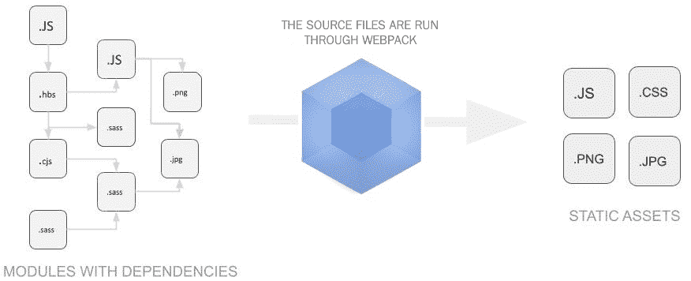

# Webpack 5 简介

这本书面向有经验的 JavaScript 开发人员，旨在通过一步一步的过程带您完成特定示例项目的开发和生产。到本指南结束时，您应该能够完全设置和部署一个工作正常的捆绑应用程序。

本章将向您介绍网络包，特别是网络包第 5 版。它将包括关于网络包的核心概念及其使用方式的概述。

本章针对的是刚接触网络包和网络包 5 的程序员。本章将介绍初始设置以及过程概述，并向您展示如何部署第一个捆绑应用程序。

本章将涵盖以下主题:

*   网络包 5 的基础
*   设置网络包
*   创建示例项目

# 技术要求

你可以在[https://github.com/PacktPublishing/Webpack-5-Up-and-Running](https://github.com/PacktPublishing/Webpack-5-Up-and-Running):找到本书所有章节使用的代码

*   要使用本指南，您将需要 JavaScript 的基础知识。
*   确保您安装了最新版本的 Webpack 5。
*   您将需要使用命令行，如命令提示符或您选择的其他命令行实用程序。
*   您将需要 Node.js，即 JavaScript 运行时环境。
*   确保您已经安装了最新版本的 Node.js 否则，你可能会遇到很多问题。
*   您需要将`npm`以管理员级别的权限安装在您的本地机器上。Webpack 和 Webpack 5 在 Node.js 环境中运行，这就是为什么我们需要它的包管理器——NPM。
*   截至本文撰写之时，最新版本是 Webpack 第 5 版。访问[https://webpack.js.org](https://webpack.js.org)为您查找最新版本。

# 网络包 5 的基础

本质上，Webpack 是 JavaScript 应用程序的模块捆绑器。Webpack 采用一系列 JavaScript 文件，以及图像文件等依赖项，组成了一个应用程序，并构建了一个称为依赖图的东西。依赖关系图表示这些文件和依赖关系在应用程序中是如何排序和链接的，并显示文件如何相互作用。

这个依赖图形成了一个模板，当 bundler 把所有的依赖和文件压缩成一个更小的集合时，它会遵循这个模板。Webpack 随后能够将这些文件打包成一个更大但通常数量较少的文件集。这消除了诸如未使用的代码、重复代码和重写需求等问题。在某种程度上，代码可以更简洁地格式化。

Webpack 递归地构建应用程序中的每个模块，然后将所有这些模块打包成少量的包。在大多数情况下，捆绑的应用程序将包含一个脚本，该脚本非常适合由程序读取，例如网络浏览器，但是对于程序员来说太复杂而无法使用。因此，开发人员将获取一组源文件，并对程序的这个区域进行更改，然后将这个源文件捆绑成一个输出——一个捆绑的应用程序。

捆绑最初旨在提高浏览器阅读性能，但它也有许多其他优势。一旦一组源文件被网络包捆绑，它通常会遵循一个系统和常规的归档结构。代码中的错误会导致绑定操作暂停；这本书将指导你如何克服这些问题。

现在，让我们探索一下关于 Webpack 5 的一般概念。

# Webpack 5 背后的一般概念

在这里，我们将开始理解网络包的关键概念和目的，而不是期望你对它有任何预先的理解。捆绑是使用 Node.js 或`npm`和**命令行界面** ( **CLI** )在桌面本地进行的，通常是命令提示符。

Webpack 是一个构建工具，它将您所有的资产放入一个依赖图中。这包括 JavaScript 文件、图像、字体和**层叠样式表** ( **CSS** )。会取 **Sassy CSS** ( **SCSS** )和 TypeScript 文件，分别放入 CSS 和 JavaScript 文件中。只有当代码与后一种格式兼容时，Webpack 才能做到这一点。

在用 JavaScript 等语言编程时，源代码往往会使用`require()`这样的语句，将一个文件指向另一个文件。Webpack 将检测此语句，并确定作为依赖项需要的文件。这将决定文件在最终的 JavaScript 包中的处理方式。这还将包括用本地文件替换**内容传送网络** ( **CDN** )的网址路径，该网络本质上是一个代理服务器网络。

下图显示了 Webpack 的一般用途，即获取一组文件或依赖项，并以优化的形式输出内容:



现在，让我们仔细看看一些术语，您可能不熟悉这些术语，但在使用 Webpack 时，它们可以被认为是常见的说法。

# 术语

本节将涵盖网络包 5 中使用的术语。这将包括本地术语以及一些更不寻常的首字母缩略词:

*   **资产**:这是网络包中经常使用的一个术语，用来防止概念的混淆。它指的是图像文件，甚至是数据或脚本文件，由软件在生成捆绑应用程序时进行整理。
*   **Bundle:** 这是指 Webpack 编译完应用程序后输出的应用程序。这是原始或源应用程序的优化版本，其原因将在后面的章节中详细讨论。bundler 会将这些文件合并成一个文件，这使得拆封和黑客攻击变得非常困难。它还提高了浏览器的性能。它通过确保处理器保持在最佳水平并删除任何不符合标准的编码结构来做到这一点。这也鼓励开发人员更加努力地采用约定。如果有任何不安全的编程，这些位置更容易识别、隔离和纠正。
*   **SASS:** 有增强功能的 CSS 版本。Webpack 像处理 CSS 一样处理这些代码；然而，这是一个可能会出现并让你不知所措的短语，所以它值得了解。
*   **SCSS:** 这只是用来赋予 SASS 额外功能的语法版本的名称。知道 Webpack 能够转换两种语法是很有用的。
*   **Transpiling** :这是 Webpack 5 取一组输入源代码，将其变成更优化的输出分发代码的过程。这是通过删除未使用或重复的代码来实现的。Transpiling 用于将一组文件转换成一组更简单的文件。例如，SCSS 经常包含可以轻松存储在 CSS 文件中的脚本。您也可以将 SCSS 转换成 CSS，或者将脚本转换成 JavaScript。
*   **TypeScript** :对于外行人来说，TypeScript 是一种在很多方面都类似于 JavaScript 的代码类型。例如，浏览器最常运行 JavaScript，因此在可能的情况下使用 JavaScript 可能更合适。只要前者允许，Webpack 5 就会将 TypeScript 文件转换成 JavaScript 文件。
*   **CDN:**CDN 是提供高可用性和高性能的代理服务器网络。一些例子是谷歌应用编程接口，如谷歌字体，以及所有 JavaScript 开发人员无疑都熟悉的其他类似工具。
*   **依赖图**:在 Webpack 5 中，依赖图是一个有向图，表示几个资产之间的依赖关系。Webpack 5 映射了资产和依赖项本身的列表，并记录了它们在应用程序中是如何相互依赖的。它使用这个来导出一个合适的输出文件结构。

虽然 JavaScript 是入口点，但是 Webpack 意识到您的其他资产类型——如 HTML、CSS 和 SVG——都有自己的依赖项，这应该被视为构建过程的一部分。

网络包由**输入**和**输出**组成。输出可以由一个或多个文件组成。除了捆绑模块，Webpack 还可以对您的文件执行许多功能。当原始文件处于原始结构时，在绑定之前，输入是指原始文件。输出指的是新的优化归档结构中的捆绑文件。因此，输入由源文件组成，输出可以由开发文件或生产文件组成。

术语输入和输出与源代码和开发代码之间经常会有混淆。

**Source code** refers to the original application before it is bundled. **Development code** refers to the application after it is placed in the Node.js environment and bundled in developmental mode. A more "tightly packed" version of the bundle is produced in production mode, but this version is difficult to work on. Therefore, the development code can be altered to some degree after it is bundled, which is very useful, for example, in a case where you are altering a database's connection configurations.

使用 Webpack 5 时，这些短语可能会出现，重要的是您不要被它们弄得太混乱。

Most other terminology will be explained as we encounter it, or it is so common that we assume you understand these terms if you are familiar with JavaScript.

这概括了您在使用 Webpack 时会遇到的大部分术语。现在，我们将探索软件是如何工作的。

# 网络包是如何工作的

Webpack 的工作原理是在一组源文件中生成资产的依赖图，并从中传输一组优化的分发文件。这些源文件和分发文件分别包含源代码和分发代码。这个分布式代码形成了输出。分发只是输出或捆绑包的另一个名称。

Webpack 首先在源文件中找到一个入口点，然后从那里构建一个依赖图。在 Webpack 5 中，入口点的选择是可选的，选择将改变构建过程的性质，无论是速度还是输出优化。

Webpack 5 能够转换、捆绑或打包任何资源或资产。

我们已经很好地概述了软件是如何工作的；以前的 Webpack 版本的有经验的用户可能会认为这个概述很初级，所以让我们来看看这个当前版本有什么新的东西。

# Webpack 5 有什么新功能？

流行的 Webpack 模块 bundler 已经经历了版本 5 的大规模更新。Webpack 5 提供了巨大的性能改进、更动态的可伸缩性和基本的向后兼容性。

Webpack 5 取代了版本 4，在版本 4 中，向后兼容并不总是可能的，因为许多可用的加载器通常与版本 2 更兼容，这意味着如果不使用版本 2，开发人员经常会在命令行中遇到不赞成的警告。Webpack 5 现在已经解决了这个问题。

版本 5 的另一大卖点是联合模块。我们将在后面的[第 6 章](6.html)、*生产、集成和联合模块*中对此进行更详细的讨论。然而，总而言之，联合模块本质上是捆绑应用程序利用远程存储的独立捆绑包中的模块和资产并与之交互的一种方式。

Webpack 5 的优势总结如下:

*   Webpack 5 提供了对 HTTP 请求的控制，这提高了速度和性能，也缓解了安全问题。
*   Webpack 5 比 Browserify 和 systemjs 等竞争对手有一些优势，即速度。构建时间直接取决于配置，但它比最近的竞争对手更快。
*   使用 Webpack 5 只需要很少或不需要配置，但是您总是可以选择它。
*   它的使用可能比替代品更复杂，但这主要是因为它的多功能性和范围，非常值得克服。
*   Webpack 5 有优化插件，可以非常好地删除未使用的代码。它也有许多相关的特性，比如树摇动，我们将在本书后面更详细地讨论。
*   它比浏览器更灵活，允许用户选择更多的入口点和使用不同类型的资产。在速度和灵活性方面，捆绑大型网络应用程序和单页网络应用程序也更好。

Webpack 现在被认为是应用程序开发和 web 开发的一个非常重要的工具，它为您的所有 web 资产(如 HTML、JS、CSS 和图像)转换了结构并优化了加载时间。现在让我们开始实际使用 Webpack。要做到这一点，我们首先要看的是模式，这可能对您来说是新的——如果您到目前为止可能只使用过普通的 JavaScript。

# 模式

一旦理解了一般概念，运行构建时需要了解的第一件事就是模式。模式是 Webpack 如何工作和编译项目的核心，所以在我们继续之前，最好先讨论这个简短但重要的主题。

模式使用命令行界面，我们将在后面更详细地介绍这个过程。如果你习惯使用香草 JavaScript，这可能对你来说是新的。然而，请放心，这不是一个复杂的话题。

Webpack 附带两个配置文件，如下所示:

*   **开发配置**:这个使用`webpack-dev-server`(热重装)，启用调试，等等。
*   **生产配置**:这将推出一个优化的、最小化的(丑陋的 JS)，在生产环境中使用的源映射包。

自版本 5 发布以来，默认情况下，Webpack 通过简单地向命令添加一个`mode`参数来处理模式特性。Webpack 不能单独使用`package.json`找到模式来确定正确的构建路径。

既然我们已经掌握了基本原理，是时候进行实际设置了。

# 设置网络包

这本书一步一步地跟踪了一个示例项目的开发，我相信你会发现这是一个学习如何使用 Webpack 5 的简单方法。

Webpack 5 将它的所有依赖项打包到您希望捆绑在本地机器上的应用程序中。理论上，这可以远程完成，但是为了避免第一次使用的用户感到困惑，我将强调使用本地机器。

对于大多数项目，建议在本地安装软件包。当引入升级或中断更改时，事情会变得更容易。

我们将从`npm`安装开始。npm 是您将与 Webpack 5 一起使用的包管理器。一旦在您的本地机器上安装了该软件，您将能够使用命令行界面(如命令提示符)使用`npm`命令。

一旦你安装好`npm`，你就可以进入下一步，打开你的命令行界面。有很多可供选择，但为了本教程，我们将使用命令提示符。

让我们一步一步地把它分解，这样你就能理解了:

1.  安装`npm`包管理器，将与 Wepback 5 一起使用。
2.  打开命令行界面(在本教程中，我们将使用命令提示符)并键入以下内容:

```js
mkdir webpack4 && cd webpack5
npm init -y
npm install webpack webpack-cli --save-dev
```

让我们分解代码块。前面的命令将首先在您的本地机器上创建一个新的目录，称为`webpack5`。然后它将当前目录(`cd`)识别为`webpack5`。这意味着通过 CLI 发出的任何进一步命令都将针对该目录。下一个命令是初始化`npm`。这些基本命令及其含义的完整列表可以在本章末尾的*进一步阅读*部分中找到。这一部分会有一些有趣的阅读，我相信你会学到一些新的东西。然后，我们在本地安装 Webpack 并安装`webpack-cli`——这是用来在命令行运行 Webpack 的工具。

3.  接下来，安装最新版本或特定版本的 Webpack，并运行以下命令。但是在第二行，用自己选择的版本替换`<version>`，比如`5.00`:

```js
npm install --save-dev webpack
npm install --save-dev webpack@<version>
```

4.  下一个命令是`npm install`，它将在目录中安装 Webpack 5，并将项目保存在开发环境中。需要注意的是，开发环境和生产环境(或模式)之间存在差异:

```js
npm install --save-dev webpack-cli
```

以下几行是来自`package.json`文件的代码片段。我们需要这些输入文件来生成一个`webpack.config.js`文件，该文件保存了您的网络包包的配置信息。

5.  我们必须注意确保`package.json`文件编码如下:

```js
"scripts": {
"build": "webpack --config webpack.config.js"
}
```

使用 Webpack 5 时，可以通过在 CLI 中运行`npx webpack`来访问其二进制版本。

我们还应该决定我们需要哪种类型的安装；任何重新安装都会覆盖之前的安装，所以如果您已经遵循了前面的步骤，请不要担心。

6.  如果适用，我们现在就进行安装。

安装有两种类型:

```js
npm install --global webpack
```

```js
npm install webpack --save-dev
```

每次在新的本地计算机上开始一个新项目时，您都需要执行前面的所有步骤。一旦您完成了安装，是时候将注意力转移到构建项目上了。

# 创建示例项目

现在，我们将使用以下目录结构、文件及其内容创建一个实验项目。

以下代码块引用了本地计算机上的一个文件夹。它说明了 Webpack 中通常使用的格式和命名约定。您应该遵循这种格式，以确保您的项目与本教程保持一致，如下所示:

1.  首先设置**项目树**:

```js
webpack5-demo
 |- package.json
  |- index.html
  |- /src
  |- index.js
```

项目树向我们展示了我们将要处理的文件。

2.  现在让我们仔细看看索引文件，因为它们将是我们前端的关键，从`src/index.js`开始:

```js
function component() {
 let element = document.createElement('div');
// Lodash, currently included via a script, is required for this 
// line to work
 element.innerHTML = _.join(['Testing', 'webpack'], ' ');
 return element;
}
document.body.appendChild(component());
```

`index.js`包含我们的 JS。接下来的`index.html`文件是我们用户的前端。

3.  它还需要设置，所以让我们打开并编辑`index.html`:

```js
<!doctype html>
<html>
 <head>
 <title>Webpack - Test</title>
 <script src="https://unpkg.com/lodash@4.16.6"></script>
 </head>
 <body>
 <script src="./src/index.js"></script>
 </body>
</html>
```

注意前面的`<script src="https://unpkg.com/lodash@4.16.6">`标记。这是指使用`lodash`库。`index.js`文件(不是`index.html`文件)需要调用这个库。Webpack 将从库中获取它需要的任何模块，并使用它们来构建包的依赖图。

Lodash is a JavaScript library that provides functional programming tasks. It was released under the MIT license and essentially makes things easier when working with numbers, arrays, strings, and objects.

需要注意的是，如果没有明确说明您的代码依赖于外部库，应用程序将无法正常运行。例如，依赖项可能丢失或包含在错误的顺序中。相反，如果包含依赖项但未使用，浏览器将下载不必要的代码。

我们可以通过使用 Webpack 5 来管理这些脚本。

4.  您还需要调整您的`package.json`文件，将您的包标记为私有，并删除主要入口点。这是为了防止意外发布您的代码:

```js
{
 "name": "webpack5",
 "version": "1.0.0",
 "description": "",
 "private": true,
 "main": "index.js",
 "scripts": {
 "test": "echo \"Error: no test specified\" && exit 1"
 },
 "keywords": [],
 "author": "",
 "license": "ISC",
 "devDependencies": {
 "webpack": "^5.0.0",
 "webpack-cli": "^3.1.2"
 },
 "dependencies": {}
 }
```

您可以从前面代码中的粗体文本中看到如何进行这些更改。请注意，我们的进入点将被设置为`index.js`。这是 Webpack 在开始包编译时将读取的第一个文件(参见依赖图的先前定义)。

如果你想了解更多关于`package.json`文件的信息，可以去[https://docs.npmjs.com/getting-](https://docs.npmjs.com/getting-started/)T4【started】/，这里会给你提供关于`npm`的信息。

我们现在已经完成了第一个演示应用程序包的源代码。这构成了我们现在将通过 Webpack 运行的输入或源文件，以生成我们的第一个捆绑应用程序。

# 打造你的第一个项目

Web 打包只是意味着捆绑项目。这是 Webpack 的精髓，从这个非常简单的介绍开始，是开始学习应用程序的绝佳方式。

首先，我们需要通过稍微改变我们的目录结构来分离源代码和发行版代码。该源代码用于编写和编辑，分发代码是我们构建过程的结果，是最小化和优化的包。

我们现在将详细介绍构建第一个项目的每个步骤:

1.  我们将从构建项目和目录开始。首先，注意`/src`和`/dist`术语；它们分别指源代码和分发代码:

```js
webpack5-demo
|- package.json
  |- /dist
  |- index.html
  |- index.js
|- /src
|- index.js
```

2.  要将`lodash`依赖项与`index.js`捆绑在一起，我们需要在本地安装库:

```js
npm install --save lodash
```

安装将捆绑到生产捆绑包的包时，您应该使用以下命令:

```js
npm install --save 
```

如果您是为了开发目的安装软件包(例如，linter、测试库等)，您应该使用以下命令:

```js
npm install --save-dev
```

3.  现在，让我们使用 **`src/main.js`** 将`lodash`导入到我们的脚本中:

```js
import_ from 'lodash';

function component() {
let element = document.createElement('div');
 // Lodash, currently included via a script, is required for this 
// line to work
element.innerHTML = _.join(['Hello', 'Webpack'], ' ');
return element;
}
document.body.appendChild(component());
```

4.  接下来，更新你的`dist/index.html`文件。我们将删除`lodash`库的包含内容。

这样做是因为我们将在本地安装库进行捆绑，不再需要对库进行远程调用:

```js
<!doctype html>
<html>
<head>
<title>Getting Started</title>
  <script src="https://unpkg.com/lodash@4.16.6"></script>
  //If you see the above line, please remove it.
</head>
<body>
  <script src="main.js"></script>
</body>
</html>
```

5.  接下来，我们将使用命令行运行`npx webpack`。`npx`命令附带节点 8.2/npm 5.0.0 或更高版本，并运行 Webpack 二进制文件(`./node_modules/.bin/webpack`)。这将把我们在`src/index.js`的脚本作为入口点，并将生成`dist/main.js`作为输出:

```js
npx webpack
...
Built at: 14/03/2019 11:50:07
Asset Size Chunks Chunk Names
main.js 70.4 KiB 0 [emitted] main
...
WARNING in configuration
The 'mode' option has not been set, webpack will fallback to 'production' for this value. Set 'mode' option to 'development' or 'production' to enable defaults for each environment.
You can also set it to 'none' to disable any default behavior. Learn more: https://webpack.js.org/concepts/mode/
```

如果没有错误，则可以认为构建成功。

Note that a warning is not considered an error. The warning is simply shown because no mode has yet been set.

我不会担心这个，因为 Webpack 将默认为生产模式。我们将在本指南后面处理模式设置。

6.  当您在浏览器中打开`index.html`时，应该会看到以下文本:

```js
Testing Webpack5
```

huzzah—我们已经完成了第一个应用程序捆绑包，我敢打赌，您一定为自己感到非常自豪！这是最基本的一步。我们将在后面的章节中继续讨论 Webpack 中更复杂的元素，并开始将它们应用到需要捆绑的现有项目中。

# 摘要

总而言之，Webpack 5 是一个令人难以置信的多功能捆绑器，它使用几乎所有可以想到的方法来优化应用程序的大小并提高整体性能。掌握它是非常值得的，本指南将向您展示这样做所需要知道的一切。

现在，您应该了解 Webpack 背后的基本概念，以及基本术语。现在，您还应该知道如何安装先决条件，如 Node.js，并使用命令行设置和部署(以及制作)您的第一个包。

在下一章中，我们将详细介绍模块和代码拆分，以及对理解 Webpack 至关重要的 Webpack 5 的一些更突出和有趣的方面。

# 问题

以下是与本章相关的一系列问题，你应该试着回答这些问题来帮助你学习。答案可以在本书后面的*评估*部分找到:

1.  什么是 Webpack？
2.  什么是网络包中的捆绑包？
3.  根据本指南，Webpack 的最新版本是什么？
4.  Webpack 在哪个环境下工作？
5.  什么是依赖图？
6.  捆绑时，以下命令缺少什么条目:
    `npm --save lodash`
7.  我们在 Webpack 5 中使用的包管理器的名称是什么？
8.  如何使用命令行删除`lodash`库？
9.  使用 Webpack 5 时，源代码和发行版代码有什么区别？
10.  设置项目时，为什么要调整`package.json`文件？