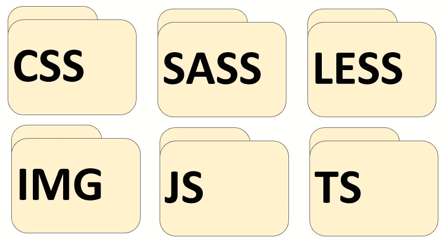

# 使用模块和代码拆分

本章将探讨 Webpack 5 中的模块和代码拆分。模块是一种组织内容的方式，这样代码就可以按功能按部分排序。代码拆分是 Webpack 用来自动构建这些模块的方法；它将把项目中的代码打包成最适合已完成项目的功能和结构的模块。

本章涵盖的主题如下:

*   解释模块
*   理解代码拆分
*   预取和预加载模块
*   最佳实践

# 解释模块

Webpack 使用称为模块的元素。它使用这些模块来构建依赖图。

模块是处理相关功能的代码段；根据模块化构建来构建项目将会改进功能。例如，当项目不是用模块构建时，需要运行不相关的代码的整个部分，相比之下，只需要运行与相关操作相关的代码。

话虽如此，接下来要了解的是模块的具体功能，这将在下一节中讨论。

# 模块的功能

模块是一组代码:例如，相似语言的代码有一个共同的功能——也就是说，它是应用中相同功能或操作的一部分。

通常，Webpack 5 中的模块根据所使用的脚本语言进行分组，如下所示:



上图应该有助于说明大多数人在探索 Webpack 构建的内容时会看到什么。

然后，应用被分为模块和资产。正如我们在[第 1 章](1.html)*对网络包 5* 的介绍中所解释的，一个资产本质上是图像和视频，它们不被认为是开发者编写的脚本。目录结构然后被细分成这些模块，通常在它们自己的目录中。

将应用分成模块自然会使调试过程更加容易。这也将在总体上帮助我们进行验证和测试。

以这种方式构建应用可以确保在写得好的代码和写得更可疑的代码之间建立一个界限。自然，这有助于目录导航，因为每个模块都有明确的目的。

许多平台都使用模块，如果你从事网络开发工作，毫无疑问你会习惯这个术语。但是，每个平台略有不同。

Webpack 5 根据它如何表达模块的依赖关系来形成这些模块。以下是 Webpack 5 如何表达它们的几个例子:

*   通过一个 **2015 ECMAScript** `import`声明
*   通过一个**CommonJS**T0】语句
*   通过**异步模块定义** ( **ASM** ) `define`和`require`语句
*   通过样式表中的图像URL
*   通过样式表中的`@import`语句

总之，模块化代码使事情变得容易得多，理解 Webpack 如何表达依赖关系将有助于您理解应该如何编译代码。从这里，自然的下一步是查看支持的模块类型以及加载器如何使用它们。

# 支持的模块语言和加载程序

为了确保 Webpack 5 支持这些模块，它们必须用可以理解和处理的编程语言编写。Webpack 5 通过使用所谓的加载器来实现这一点。

加载程序使 Webpack 真正比竞争对手 bundlers 突出。简单来说，一个加载器告诉 Webpack 如何处理不是 JavaScript 或其他 Webpack 自动理解的预定义代码的代码，例如 JSON 或 HTML。Webpack 5 然后将把这个处理过的代码作为依赖项包含在您的包中。

Webpack 5 有一个开发人员社区，称为 Webpack 社区，他们构建了这些加载程序。这些加载器目前支持大量的语言和处理器；一些例子如下:

*   **打字稿**
*   **SASS**
*   **减**
*   **C++**
*   **巴别塔**
*   **自举**

有关可用装载机的完整列表，请参阅本章末尾的*进一步阅读*部分。

Being part of the Webpack community means you can write your loaders! This is something worth considering as it may be the best way to meet the requirements of your project.

Webpack 社区中有更多可用的加载器。加载器的使用意味着 Webpack 5 可以被描述为一个动态平台，它允许定制几乎任何技术堆栈。在本章中，我们将开始主动使用加载器，作为您可以自己练习编码的一些示例用例的一部分。

在您的开发过程中，您可能会遇到术语**封装**，尤其是在使用模块和加载器时。

要理解封装，您首先需要理解软件有时可以独立开发，直到相互作用的需求出现。为了让软件在一个项目中协同工作，必须在两个技术栈之间创建依赖关系。这就是术语封装的含义。

封装是一个简单的概述主题；然而，模块化编码的下一个领域涉及分辨率。这是一个更广泛的主题，因此，已作为其自身小节的一部分进行了详细说明。

启用新的资产模块类型是 v5 附带的一个实验特性。资产模块类型类似于`file-loader`、`url-loader`或`raw-loader` ( `experiments.asset`)从 alpha.19 开始，与此相关的数据 URL 和选项从 beta.8 开始就得到支持

# 模块分辨率

模块解析通过使用解析器进行。解析器通过模块的绝对路径来帮助您定位模块，绝对路径指的是在整个项目中通用的模块路径。

请注意，一个模块可以充当另一个模块的依赖项，如下所示:

```js
import example from 'path/to/module';
```

不管依赖模块是来自另一个库(而不是解析器本身)还是应用本身，解析器都有助于找到包中需要包含的模块代码。Webpack 5 也可以在捆绑时使用`enhance-resolve`解析路径。

Webpack 5 的解析规则意味着，使用`enhanced-resolve`方法，Webpack 5 可以解析三种文件路径:

*   绝对路径
*   相对路径
*   模块路径

以下各节将详细说明每个文件路径的含义，并且每个路径都有一个示例。当我们开始构建项目包时，这将变得很重要。

# 绝对路径

对于不熟悉的人来说，绝对路径指的是文件路径和文件的位置，对于您的项目使用的所有文件和资产来说，这是通用的。这个公共位置有时被称为`home`或`root`目录。下面是一个命令行位置示例:

```js
import 'C:\\Users\\project\\file';
```

前一行是绝对路径的示例。术语**绝对**是每个 JavaScript 开发人员都应该熟悉的。它涉及目标文件或目录在整个系统通用路径中的位置。

如果我们已经有了绝对路径，如前一行所示，就不需要进一步的解析。

# 相对路径

相对路径是指对象文件或目录到另一个位置的位置。在这种情况下，它是`context`目录的位置——进行开发的当前和工作位置:

```js
import '../src/file';
```

在前面的例子中，资源文件的目录被认为是`context`目录。资源文件是指发生`import()`语句、`require()`语句或外部文件调用的文件。

在这种情况下，相对路径被连接到上下文目录路径，然后产生绝对路径。

# 模块路径

模块路径并不是所有的 JavaScript 开发人员都可以使用的。对于 Webpack，它指的是相对于模块的位置。在下面的代码片段中，`module`将被指定为您希望使用的任何特定模块名称的名称，例如项目中现有模块的名称:

```js
import 'module/sub-directory/file';
```

Webpack 5 在所有目录中搜索`resolve.module`指令中指定的模块。可以使用`resolve.alias`配置为每个原始模块文件路径创建一个别名。使用这种方法，Webpack 5 检查文件路径以及它是否指向文件或目录。

Webpack 5 有一个名为`resolve.extension`的选项。如果路径没有文件扩展名，该解析器将向 Webpack 指示哪些扩展名可用于解析。这些可能包括`.js`、`.jsx`或类似的扩展。

在文件路径不指向文件而仅指向目录的情况下，网络包 5 在目录中搜索`package.json`文件。Webpack 5 然后使用`resove.main`字段配置中指定的字段来搜索包含在`package.json`中的字段，并由此确定要使用的正确上下文文件路径。

如果目录中没有`package.json`文件，或者如果主字段没有返回有效路径，Webpack 5 只需搜索`resolve.main`配置中指定的文件名。

文件扩展名的解析类似，但使用`resolve.extension`选项。

到目前为止，我们已经介绍了模块、路径解析、支持的语言和加载器。下一个需要理解的关键是代码拆分——它是什么，以及 Webpack 如何利用它来形成它的模块和一般输出。

# 理解代码拆分

代码拆分允许用户**将代码**拆分成各种包，然后可以按需或并行加载。网络包的开发者认为这个“*是网络包*”([Webpack.js.org](http://webpack.js.org))最引人注目的特性之一。

代码拆分有两个关键的优势——这个过程可以用来实现更小的包和控制资源加载的优先级。这可以缩短装载时间。

Webpack 5 中有三种通用的代码拆分方法:

*   **入口点**:使用入口点配置手动拆分代码。
*   **防止重复**:这种方法使用`SplitChunksPlugin`运行一个名为**重复数据删除**的进程，该进程将代码分成名为**组块**的模块组。
*   **动态导入**:这种方法使用内联函数进行**调用**在模块内拆分代码。

A chunk refers to a group of modules. This is a term used by Webpack and is not frequently encountered on other platforms. 

dedupe is a Python library that uses machine learning to perform matching, **deduplication**, and entity resolution quickly. It helps remove duplicate entries from a spreadsheet of names and addresses.

概述了这三种方法后，我们现在可以在下面的小节中详细讨论每一种方法。让我们从切入点开始。

# 入口点

使用入口点可能是执行代码拆分最简单的方法。这是一个手动操作，因此不像其他方法那样是自动的。

我们现在来看看从主捆绑包中分离一个模块的发展。为此，我们将从一些实际工作开始。接下来，我们将讨论复制和动态导入的概念。

我们现在将返回到我们在[第 1 章](1.html)*中正在进行的项目，介绍网络包 5* 。这一次，我们将利用本章到目前为止所学的知识。

首先，创建一个工作目录。在本例中，我们使用的是上一章中使用的目录名。遵循同样的惯例可能是一个好主意，这样，当你继续阅读这本书时，你将能够遵循项目开发的过程。

在以下示例中，我们将执行以下操作:

1.  组织项目文件夹结构，以启动显示入口点如何工作的项目。您应该在实践项目目录中构建这组目录。这与在桌面上创建文件夹的方式相同。为了这个例子，我们将这个文件夹称为`webpack5-demo`(但是你可以选择任何你想要的名字):

```js
package.json
webpack.config.js
/dist
/src
 index.js
/node_modules
/node_modules/another-module.js
```

2.  如果您正在使用的代码中缺少最后一行文本(粗体)，请务必添加它。这可以在命令行上完成；如果您决定使用，请参考[第 1 章](1.html)、*网络包 5* 介绍，获取指导。你可能已经注意到包含`another-module.js`。您可能不会发现这是一个典型的构建，但是您需要在我们的示例中包含这一点。

Ultimately, you can name the project anything you like but, for the sake of following this practice project, you should use the same naming convention used up to now to prevent confusion.

为了遵循这个项目开发，使用您的**集成开发环境** ( **IDE** )或记事本，您应该创建前面的每个文件和文件夹。`**/**`字符表示文件夹。注意`another-module.js`文件；这在`/node_modules`目录中。

我们现在将编辑和编译一个构建，从`another-module.js`文件开始。

3.  在您选择的 IDE 或记事本中打开`another-module.js`:

```js
import _ from 'lodash';
console.log(
  _.join(['Another', 'module', 'loaded!'], ' ')
 );

// webpack.config.js 
 const path = require('path');
 module.exports = {
   mode: 'development',
   entry: {
     index: './src/index.js',
     another: './src/another-module.js'
 },
 output: {
   filename: '[name].bundle.js',
   path: path.resolve(__dirname, 'dist')
  }
 };
```

该文件本质上是导入`lodash`，确保加载的模块记录在控制台日志中，将 Webpack 构建模式设置为开发，并设置 Webpack 开始映射应用中的资产进行绑定的入口点，并设置输出绑定名称和位置。

4.  现在，通过在命令行中输入上下文目录(您正在开发的目录)的位置来运行带有`npm`的构建，并键入以下内容:

```js
npm run build
```

这是生成捆绑输出或开发应用所需的全部内容。

5.  然后，检查编译是否成功。当在命令行中运行构建时，您应该会看到以下消息:

```js
...
 Asset Size Chunks Chunk Names
 another.bundle.js 550 KiB another [emitted] another
 index.bundle.js 550 KiB index [emitted] index
 Entrypoint index = index.bundle.js
 Entrypoint another = another.bundle.js
 ...
```

成功！但是，在使用开发人员应该注意的入口点时，可能会出现一些潜在的问题:

*   如果条目块之间有重复的模块，它们将包含在两个包中。

For our example, as `lodash` is also imported as part of the `./src/index.js` file in the project directory, it will be duplicated in both bundles. This duplication can be removed by using `SplitChunksPlugin`.

*   它们不能用于使用应用的编程逻辑动态拆分代码。

现在，我们将讨论防止重复。

# 使用 SplitChunksPlugin 防止复制

`SplitChunksPlugin`允许将公共依赖项提取到条目块中，无论是现有的还是新的。在下面的演练中，该方法将用于消除前面示例中的`lodash`相关性。

下面是来自`webpack.config.js`文件的代码片段，在前面例子的项目目录中找到。此示例显示了使用插件所需的配置选项:

1.  我们将首先确保我们的配置被编码为与前面示例中相同的配置:

```js
const path = require('path');
module.exports = {
  mode: 'development',
  entry: {
    index: './src/index.js',
    another: './src/another-module.js'
 },
 output: {
   filename: '[name].bundle.js',
   path: path.resolve(__dirname, 'dist')
 },
 optimization: {
   splitChunks: {
 chunks: 'all'
   }
  }
 };
```

使用`optimization.splitChunks`配置，现在应该从`index.bundle.js`和`another.bundle.js`中删除重复的依赖关系。`lodash`已经分离成单独的组块和主束。

2.  接下来，执行`npm run build`:

```js
...
Asset Size Chunks Chunk Names
another.bundle.js 5.95 KiB another [emitted] another
index.bundle.js 5.89 KiB index [emitted] index
vendors~another~index.bundle.js 547 KiB vendors~another~index [emitted]    vendors~another~index
Entrypoint index = vendors~another~index.bundle.js index.bundle.js
Entrypoint another = vendors~another~index.bundle.js another.bundle.js
...
```

还有其他社区开发的加载器和插件可以用来拆分代码。下面是一些比较显著的例子:

*   `bundle-loader`:用于拆分代码和延迟加载结果包
*   `promise-loader`:类似`bundle-loader`但使用承诺
*   `mini-css-extract-plugin`:用于从主应用中拆分 CSS

现在，随着对如何防止重复的坚定理解，我们将转向一个更困难的话题——动态进口。

# 动态导入

动态导入本质上是网络包上的按需导入。如果您已经捆绑了许多代码，但需要对其进行更多修补，动态导入方法将会有所帮助。这也包括动态代码拆分，听起来，这意味着在构建了一个包之后拆分代码并优化它。

Webpack 5 支持两种方法:

*   第一种方法使用`import()`语法，符合 ECMAScript 的动态导入建议。
*   第二种是`webpack-specific`方法，使用`require.ensure`方法(这是遗留方法)。

以下是第一种方法的示例；目标是演示使用动态导入的现代方法，这在最近的项目中会更常见。

`import()`呼叫是对承诺的内部呼叫。一**承诺**指的是从装载机返回的信息。

在旧浏览器中使用`import()`时，使用`polyfill`功能，如`es6-promise`或`promise-polyfill`来填补**承诺**。`shim-loader`是一个加载器，它转换代码以便在 Webpack 5 环境中工作；这与使用`imports-loader`和`exports-loader`手动进行类似。

下一步是删除配置文件中任何多余的条目，包括`optmization.splitChunks`引用，因为在下面的演示中将不需要它:

1.  现在，打开`webpack.config.js`文件，输入以下内容:

```js
const path = require('path');
module.exports = {
 mode: 'development',
 entry: {
   index: './src/index.js'
   index: './src/index.js',
 },
 output: {
   filename: '[name].bundle.js',
   chunkFilename: '[name].bundle.js',
   path: path.resolve(__dirname, 'dist')
 },
 };
```

Note the use of `chunkFilename`, which determines the name of non-entry chunk files.

需要前面的配置来准备您的项目以使用动态导入。确保删除粗体文本，因为在使用相同的代码时，您可能会看到这一点，就像以前一样。

跳回项目，我们需要用指令更新它来删除未使用的文件。

您可能已经设置了练习目录；但是，建议您从一组不包含任何实验代码的新目录开始。

下面的演示将使用动态导入来分隔一个区块，而不是`lodash`的静态导入。

2.  打开`index.js`文件，确保输入以下内容:

```js
function getComponent() {
  return import(/* webpackChunkName: "lodash" */ 'lodash').then((
      { default: _ }) => {
 var element = document.createElement('div');

 element.innerHTML = _.join(['Hello', 'Webpack'], ' ');

 return element;

 }).catch(error => 'An error occurred while loading 
     the component');
 }

  getComponent().then(component => {
    document.body.appendChild(component);
  })
```

导入`CommonJS`模块时，本次导入不会解析`module.exports`的值；相反，将创建一个人工命名空间对象。因此，我们在导入时需要一个默认值。

The use of `webpackChunkName` in the comment will cause our separate bundle to be named `lodash.bundle.js`, instead of just `[your id here].bundle.js`. For more information on `webpackChunkName` and the other available options, see the `import()` documentation.

如果现在运行网络包，`lodash`将分离成一个新的包。

3.  `npm run build`可以使用你的**命令行界面** ( **命令行界面**)运行。在命令行界面实用程序中，键入以下内容:

```js
npm run build
```

运行构建时，您应该会看到以下消息:

```js
...
 Asset Size Chunks Chunk Names
 index.bundle.js 7.88 KiB index [emitted] index
 vendors~lodash.bundle.js 547 KiB vendors~lodash [emitted] vendors~lodash
 Entrypoint index = index.bundle.js
 ...
```

`import()`可以与异步函数一起使用，因为它返回一个承诺。这需要使用预处理器，例如`syntax-dynamic-import`巴贝尔插件。

4.  使用`src/index.js`，进行以下修改，说明如何简化代码:

```js
async function getComponent() {
 'lodash').then(({ default: _ }) => {
const element = document.createElement('div');
const { default: _ } = await import(/* webpackChunkName: "lodash" */ 'lodash');

element.innerHTML = _.join(['Hello', 'webpack'], ' ');

return element;
}

  getComponent().then(component => {
    document.body.appendChild(component);
  });
```

前面的示例使用了我们在*动态导入*部分中使用的相同文件。我们将多行代码变成了单行代码，用异步代码替换了返回函数，加快了我们的编码实践。您将会看到，它现在比早期的代码简单得多——它使用相同的文件`src/index.js`，并且实现了相同的事情。

我们经常简化代码来帮助缩短加载时间。提高浏览速度的另一个关键方法是缓存。

# 贮藏

在我们完成关于代码拆分的这一部分之前，我们将回顾一下缓存。缓存与前面的过程有关，毫无疑问是编程过程中会出现的问题。对于不熟悉的人来说，缓存是一种存储以前计算的数据的方法，以便更快地提供服务。它还与以下关于预取和预加载的部分相关，预加载是控制内存使用的方法。

了解缓存将确保您知道如何更有效地拆分代码。在下面的例子中，我们将看到它是如何完成的。在网络包中，缓存是通过名为**文件名散列**的东西来完成的(当计算机递归跟踪文件的位置时)，特别是输出包的散列:

```js
 module.exports = {
   entry: './src/index.js',
   plugins: [
    // new CleanWebpackPlugin(['dist/*']) for < v2 versions 
       of CleanWebpackPlugin
    new CleanWebpackPlugin(),
    new HtmlWebpackPlugin({
      title: 'Output Management',
      title: 'Caching',
   }),
 ],
 output: {
  filename: 'bundle.js',
  filename: '[name].[contenthash].js',
  path: path.resolve(__dirname, 'dist'),
  },
};
```

注意前面代码块中的`output`键处理程序；在括号内，您将看到输出`bundle.js`文件名，下面是我们称之为散列的内联元素。你应该用你的喜好代替括号里的术语。此方法生成一个替代输出，该输出仅在内容更新时更新，并用作我们的缓存资源。

每个文件系统访问都被缓存，以便对同一文件的多个并行或串行请求发生得更快。在`watch`模式下，只有修改过的文件才会被逐出缓存。如果关闭`watch`模式，则在每次编译前清除缓存。

这就引出了我们的下一部分，它也与导入相关——预取和预加载。

# 预取和预加载模块

当使用内联指令和声明导入时，Webpack 5 可以输出一个**资源提示**。它将为浏览器提供以下命令:

*   `preload`(当前导航时可能需要)
*   `prefetch`(未来导航可能需要)

术语“当前”和“未来”可能会令人困惑，但它们本质上是指这样一个事实，即`prefetch`在用户需要内容之前加载内容，这在某种程度上提前加载和排队内容。这是一个简单的定义——接下来会有一个完整的解释——但是总的来说，你可以看到在内存使用和用户体验效率方面的优势和劣势。

One thing to be aware of is that prefetching doesn't work for **Web Assembly** (**WASM**) yet in Webpack 5.

这个简单的`prefetch`示例可以有一个渲染`LoginButton`组件的`HomePage`组件，单击该组件后，会加载一个`LoginModal`组件。

需要创建`LoginButton`文件；按照`LoginButton.js`中的说明进行操作:

```js
import(/* webpackPrefetch: true */ 'LoginModal');
```

前面的代码将导致以下代码片段被追加到页面的页眉:

```js
 <linkrel="prefetch" href="login-modal-chunk.js"> 
```

这将指示浏览器在空闲时预取`**login-modal-chunk.js**`文件。

与`prefetch`相比，`preload`指令有许多不同之处:

*   使用`preload`指令的块与其父块并行加载，而预取块在父块完成加载后开始。
*   预加载时，父区块必须立即请求区块，而预取的区块可以随时使用。
*   使用`preload`指令的组块在被调用时会被立即下载。浏览器空闲时下载预取的块。
*   简单的`preload`指令可以有总是依赖于应该在一个单独块中的库的组件。

选择使用`preload`还是`prefetch`很大程度上取决于语境；随着教程的进展，您将发现更多关于这可能如何适用于您的信息。

您应该使用`prefetch`或`preload`，这取决于前面的要点如何最适合您的开发需求。这在很大程度上取决于项目的复杂性，最终是由开发人员做出的判断。

以下示例在`ChartComponent.js`、**、**中提出了一个想象的组件`ChartComponent`，它需要一个我们称之为`ChartingLibrary`的库。它会立即按需导入库，并在渲染时显示`LoadingIndicator`:

```js
import(/* webpackPreload: true */ 'ChartingLibrary');
```

当请求`ChartComponent`时，也通过`<link rel="preload">`请求`charting-library-chunk`。

假设`page-chunk`更快完成加载，页面将与`LoadingIndicator`一起显示，直到`charting-library-chunk`完成加载。这将提高加载时间，因为它只需要一轮而不是两轮。在高延迟环境中尤其如此(数据处理网络中经常出现延迟)。

不正确使用`webpackPreload`会损害性能，所以使用时要注意。

One feature added with version 5 that is useful and related to fetching is the top-level await, a feature that enables modules to act as big async functions. That means they will be processed as code asynchronously. With top-level await, **ECMAScript Modules** (**ESMs**) can await resources, causing other modules that import them to wait before they start evaluating the body.

现在，您应该了解`prefetch`和`preload`的用途，以及如果使用不当，它们会如何影响性能。使用它们的决定将主要取决于您希望应用如何运行。最好的方法是在进行正式的捆绑包分析后决定它们的使用，我们将在下一节中讨论。

# 最佳实践

与所有编程一样，有一些最佳实践可以确保最佳的交付。这也是结束本章的绝佳方式。如果遵循最佳实践，开发人员可以保护他们的应用免受安全漏洞和黑客攻击、糟糕的性能以及团队协作时的困难，或者当新开发人员需要未来开发时，对构建进行未来验证。后一个原因对产品所有者或项目经理来说比开发团队更重要。

说到网络包，这里最突出的领域是包分析和代码林挺。

# 束分析

一旦开始拆分代码，分析输出并检查模块的结束位置可能会很有用。最大限度地利用捆绑包是很重要的，因此捆绑包分析的正式程序以及浏览器和安全测试可以被视为基础。推荐使用官方分析工具。还有其他一些选择:

*   `webpack-bundle-analyzer`:这是一个插件和命令行界面实用程序，将捆绑内容表示为一个方便的交互式**树状图**，其中有缩放选项。
*   `webpack-bundle-optimize-helper`:这个工具会对你的捆绑包进行分析，给出缩小你的捆绑包大小的建议。
*   `webpack-visualizer`:这是用来可视化分析捆绑包，看哪些模块占用空间太大，哪些可能重复。
*   `webpack-chart`:这提供了一个用于网络包统计的交互式饼图。

Treemapping is a method used to display hierarchical data using nested figures, usually rectangles.

前面提到的所有工具都将有助于优化，这是 Webpack 的主要目的。

# 代码林挺

另一种改进应用的方法是删除不需要的代码。当自动化时，这通常被称为树摇动，我们将在后面的章节中讨论。当这是手动完成时，它被称为代码林挺。一个定义可能是合适的，因为它是一个在编程中不常遇到的短语。

Code linting is the process of removing unwanted or surplus code, just like removing lint from a blazer. This could include unused coding artifacts, erroneous code, or anything else that's unwanted. Webpack uses an automated process to do this when integrating with task runners such as **Gulp**. This is discussed in the following chapter, [Chapter 6](6.html), *Production, Integrations, and Federated Modules*.

如果您遵循这些步骤，那么毫无疑问，您的应用将会以最佳状态运行。代码拆分和模块化编程是 Webpack 的核心，随着捆绑项目的复杂性通过本指南的提高，需要有一个坚定的理解来防止您迷失方向。

# 摘要

本章介绍了各种代码拆分实践，包括代码块和动态导入。现在，您将有一个良好的知识库来执行代码拆分和使用模块。这些都是网络包的基本特性，所以坚实的基础是必要的。

对于 Webpack 应用来说，代码拆分和模块是一个结构性的问题。代码块和动态导入在需要重载编程的专业任务中更为重要。

您已经了解了预取模块和捆绑包分析，这是清楚理解下一章所需的重要步骤，在这一章中，我们将了解配置世界，了解其局限性和功能，以及选项在其中的作用。

这些概念很重要，因为配置是 Webpack 开发的核心，也是日常编程的核心。当涉及到生产时，选项变得更加重要，您需要您的项目正确运行。

要测试您的技能，请尝试以下测验，看看您对本章所涵盖主题的理解是否达到标准。

# 问题

我们将用一组问题来测试你的知识来结束这一章。这些问题的答案可以在本书后面的*评估*部分找到:

1.  代码拆分和模块化编程有什么区别？
2.  什么是代码块？
3.  动态导入与入口点有何不同？
4.  `preload`指令如何优于`prefetch`指令？
5.  代码林挺是什么意思？

6.  承诺一词是什么意思？
7.  `SplitChunksPlugin`如何防止重复？
8.  `webpack-bundle-optimize-helper`工具提供了什么？
9.  `webpack-chart`插件是做什么的？
10.  什么是树映射？

# 进一步阅读

如需装载机的完整列表，请前往[https://github.com/webpack-contrib/awesome-webpack](https://github.com/webpack-contrib/awesome-webpack)。